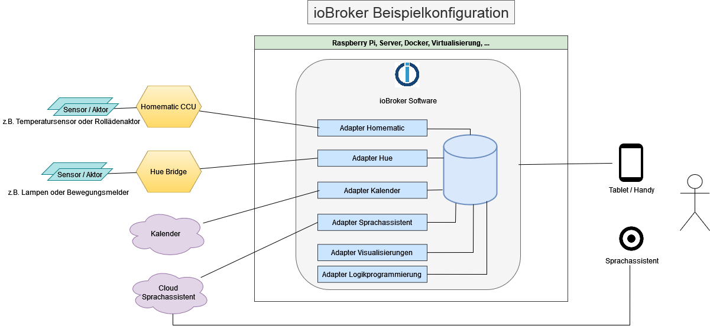

## Make your life easier: Smart Home
Wouldn't it be practical to be able to read temperatures, consumption values or switching states of devices from different manufacturers centrally in one place? Wouldn't it be necessary to remember to switch devices on or off when certain conditions or states are reached?

This convenience can be provided by a smart home - an intelligent house.
And it offers even more if desired: automation and the ability to access all these things remotely.

### The solution: ioBroker - Automate your life
**ioBroker** is a software solution for automating your home.
It enables the integration of a wide variety of smart home systems that would remain isolated without ioBroker, thus enabling comprehensive control.

**ioBroker** is therefore **the** integration platform for the Internet of Things (IoT) and enables the integration of free and commercial products from almost all areas of life as well as the integration of self-created solutions.

The **ioBroker system** has a modular structure and can be expanded according to individual requirements by installing individual plugins, which we call adapters.

With well over 600 adapters, ioBroker enables the integration of various platforms, systems and devices from A like Alexa to Z like Zigbee and offers many other possibilities for automation.

#### What are adapters?
**Adapters** are **PlugIns** (software modules, small programs) written in JavaScript for Node.js that are specifically designed for certain devices, device types, devices from certain manufacturers, or other services, such as querying web pages.

These adapters enable the connection between physical devices (for example controllable sockets, relays, remote thermometers and the like) and the central ioBroker system. They are able to read the values measured by the devices and control the devices, which often happens via WLAN in the home network.

Other adapters are designed to graphically display measured values such as temperature, power, consumption values or switching states in diagrams.
Visualization adapters also offer other options, such as integrating images (e.g. from surveillance cameras), weather data and much more.

In addition, there are adapters that offer functions for mathematical calculations or logical operations (such as comparisons).
They can also be used to create small programs and define the rules necessary for automation.

Since JavaScript is one of the most widely used programming languages, there are already many ready-made modules, and new ones can often be developed with relatively little effort.
If an adapter is missing, a suitable one can usually be developed quickly.
The active **ioBroker developer community** is always happy to support new developers.

**Tip:** [Overview of available adapters](https://www.iobroker.net/#de/adapters/adapters.md)

### IoBroker connects a wide variety of smart home systems

This graphic illustrates how ioBroker, as a central system, coordinates and connects various smart home systems and other services, such as calendars.
The adapters available in ioBroker enable communication with centrally managed calendars or manufacturer-specific smart home systems that are connected via LAN or WLAN.
In this way, the ioBroker software can retrieve status information or carry out control actions.

### Application example presence simulation
This application example shows how the two independent smart home systems Philipps Hue and Homematic IP are combined using ioBroker to realize a presence simulation.

By connecting the two smart home systems to the ioBroker software, ioBroker is able to change the status of the Hue lamps (on/off) and the shutters (up/down). The vacation time is recognized by connecting the calendar in ioBroker.

By using the logic blocks (adapter logic programming) in ioBroker, the user can now implement the following process in just a few steps:

- If the calendar is set to "holiday", all HUE lamps will be switched on at 6 p.m.
- At 10 p.m. all shutters are closed and all Hue lamps are switched off.
- At 8:00 a.m. all shutters will be raised again.

Using the available visualization adapters, users can create individual status and control pages for their Hue lamps and roller shutters, which can be accessed using mobile devices from home or on vacation (e.g. using ioBroker Cloud Services or VPN).

## Strengths of ioBroker
### Platform independent
ioBroker can be installed on almost all hardware platforms that run Linux, OSX, Windows or Docker as the operating system. This includes single-board computers (such as the Raspberry Pi), servers, NAS or servers with virtualization environments (such as Proxmox, desktop computers, etc.).

A simple one-line installer enables user-friendly installation under Linux and OSX and thus a quick start to ioBroker.

### Scalable
If additional smart home systems are to be connected over time, the user can implement them at any time using additional adapters during operation.
ioBroker itself is also scalable: Several ioBroker servers can be connected to form a multihost system. It is even possible to mix operating system platforms and connect single-board computers with large multicore servers.

### Individual programming of processes
With the logic adapters, ioBroker offers the possibility to create individual processes and scripts.
In a script, for example, a value can be monitored by an adapter (vacation is entered in the calendar on today) and an action can be triggered (switch on all Hue lights at 6 p.m.).

In ioBroker, these individual processes can be realized by dragging and dropping building blocks (graphical programming) in "Rules" or "Blockly" or implemented in the classic form with "Javascript" or "Typescript" in the form of written source code.

Further explanations of the logic blocks as well as a further introduction to other logic blocks such as Node-Red or the scene adapter are explained in this documentation in the "Logic and Automation" section.

## Visualization
Several visualization adapters offer the user the possibility to implement control options and status information graphically.
These individual visualizations can then be displayed and operated on a tablet, smartphone or computer.

Below we briefly introduce some visualization adapters and their main features.

### VIS
[Adapter side vis](https://www.iobroker.net/#de/adapters/adapterref/iobroker.vis/README.md)

With the VIS (visualization) adapter, ioBroker provides a powerful tool for creating individual visualizations. Current values from sensors can be displayed graphically, just like historical trends. Live images from surveillance cameras, the implementation of an alarm system, heating systems and air conditioning technology - almost everything that is imaginable can be implemented.

By using VIS, the user has maximum design freedom during implementation. Prefabricated modules for easy use help the user to put together the UI. But it is not just possible to display information. Devices can also be controlled quickly using the visualization interface. The operation of the interface can be adapted to a wide range of end devices - from smartphones to wall tablets with touch functions to PCs - everything can be implemented using simple drag and drop.

 

### MaterialUI
React and Material UI interface.

[Adapter side material](https://www.iobroker.net/#de/adapters/adapterref/iobroker.material/README.md)

### Jarvis
[Adapter page Jarvis](https://www.iobroker.net/#de/adapters/adapterref/iobroker.jarvis/README.md)

Jarvis is a material design visualization based on Material UI. Jarvis provides a structure and modules that are used for visualization, but can be configured very flexibly.

Jarvis is responsive and adapts to the size of the screen and offers a standardized design so that a visualization can be put together in a short time.

The layout is flexibly configurable. The layout can be divided into any number of tabs. Each tab can then either be displayed in full-screen mode or divided into individual columns.

 

### IQontrol
Reach your destination quickly - but still flexible, that's what sets iQontrol apart:

- Create the Vis once and use it everywhere: From PC to tablet to mobile phone, iQontrol runs on all devices - either in the browser or as a web app (can be saved on the home screen and then feels like an app)
- iQontrol adapts dynamically to all resolutions (responsive design)
- Super fast loading time
- With the standard settings you can quickly reach your goal
- With the advanced settings and widgets, however, you have a high level of flexibility and customization options (in some installations you can't even tell that it's actually iQontrol)

Video [iQontrol Demo Video][]

    

###Lovelace
[Adapter page lovelace](https://www.iobroker.net/#de/adapters/adapterref/iobroker.lovelace/README.md)

With the Lovelace adapter, the HomeAssistant UI Lovelace can be used for ioBroker. Lovelace has a responsive design and therefore automatically adapts to the layout of the PC, tablet or smartphone screen.

In Lovelace, the devices and their properties, which are stored in ioBroker (e.g. for a lamp, on/off, brightness, color temperature), are directly available for viewing/controlling.

The Lovelace Editor (WYSIWYG principle - what you see is what you get principle) enables the easy creation of modern UIs in just a few steps. Custom cards and the YAML Editor are available for the implementation of more complex requirements and wishes. Inspiration for a Lovelace UI can be collected in the HomeAssistant world and then implemented in ioBroker.

## Who is behind ioBroker?
ioBroker is an open source project developed by the ioBroker community and administered by [Bluefox](https://github.com/GermanBluefox) as project owner.

Many developers and many other helpers volunteer their free time to develop the central ioBroker system components, the many adapters, the social media support, the documentation and much more.
With the large and helpful community, a solution has been found for every problem so far.

ioBroker follows a decentralized approach in which each adapter is maintained in its own GitHub repository.
The respective adapter developer makes decisions about his adapter largely independently.
Requests for functionality extensions or external feature extensions as a "pull request" are of course taken into account.

Some developers have also joined forces in the ioBroker adapter community to ensure that even if individual developers no longer have time for their adapters, they can continue to be maintained.

There is no contractual support from the open source community, but together we have solved every problem so far!

Directional decisions regarding the central components and the overall project are discussed within the core team and then implemented.

The ioBroker Core development team consists of:

* [Bluefox](https://github.com/GermanBluefox)
* [Apollon77](https://github.com/Apollon77)
* [foxriver76](https://github.com/foxriver76)
* [AlCalzone](https://github.com/AlCalzone)

A list of [ioBroker Developer](https://forum.iobroker.net/groups/developer) can be found in the ioBroker forum.

### Licenses and costs
Many ioBroker projects are available with the source code on [GitHub](https://github.com/ioBroker).
In most cases, the source code is under the MIT license.
Sometimes, however, licenses such as GPL, CC BY-NC or others are used, which must be taken into account, but do not make much difference for end users! The developer of an adapter sets the license for the respective adapter himself.

In very rare cases (<5 adapters currently) a license (sometimes for a fee) is required to use an adapter.
For the "VIS" adapter, for example, ioBroker GmbH provides a free license for private use - however, a paid license is required for commercial use.
An overview and ordering of the license for these adapters can be found on this page [iobrokerPrices](https://iobroker.net/www/pricing).
The costs for commercial use of these adapters are also listed there.

### How does ioBroker finance itself?
All central components and almost all other adapters are available free of charge and the source code of the vast majority of adapters is openly available on GitHub.

Since an open source project cannot generate income to buy servers, for example, an official legal form is required for these things, the ioBroker GmbH.
The ioBroker GmbH also offers, among other things, commercial support for the ioBroker software or sells, for example, an ioBroker server.

ioBroker GmbH provides the infrastructure (e.g. the forum server) for the community project free of charge and has also purchased development services in the past, which have been used to develop the open source projects (e.g. admin).

The ioBroker Free Cloud is also a free service provided to the community by ioBroker GmbH. The Pro Cloud and the iot service are commercial offers from ioBroker GmbH, with the costs barely covering the operating costs.

## Remote access to your ioBroker installation via the ioBroker Cloud
Optional cloud-based access allows users or system integrators to remotely manage a locally installed ioBroker system 24/7. Access control can be freely configured by the user using users and groups.
The following graphic provides an overview of the ioBroker Cloud Service products.

## Community
Since 2014, ioBroker has secured broad support from thousands of users and developers due to its many advantages. Users and developers meet in the specially set up [Forum](https://forum.iobroker.net) and exchange their experiences and suggestions. On the ioBroker [Discord](https://discord.gg/sGWE65zF) server, experiences can be exchanged in live chat and live debug sessions can be carried out at short notice in order to get to the bottom of current problems.

Link collection of the official ioBroker communities:

- ioBroker Forum: [Forum](https://forum.iobroker.net)
- Discord ioBroker Server: [Discord](https://discord.gg/sGWE65zF)
- Facebook group "ioBroker SmartHome and IoT": [FacebookioBrokerSmartHomeIoT](https://www.facebook.com/groups/440499112958264)
- Facebook group "ioBroker and smart home international": [FacebookioBrokerSmartHomeIoTInternational](https://www.facebook.com/groups/iobrokerinternational)

## IoBroker statistics
On [ioBrokerStatistics](https://www.iobroker.net/#de/statistics) you will find an overview page with some interesting ioBroker statistics.

[Grundlagen]: https://www.iobroker.net/#de/documentation/basics/README.md

[Adaptern]: https://www.iobroker.net/#de/adapters/adapters.md

[hier zu finden]: https://www.iobroker.net/docu/

[im Forum]: https://forum.iobroker.net/category/186/dokumentations-support

[GitHub]: https://github.com/ioBroker

[Forum]: https://forum.iobroker.net

[Telegram]: https://t.me/iobrokergermany

[Discord]: https://discord.gg/sGWE65zF

[FacebookIoBrokerSmartHomeIoT]: https://www.facebook.com/groups/440499112958264

[FacebookIoBrokerSmartHomeIoTInternational]: https://www.facebook.com/groups/iobrokerinternational

[iobrokerPreise]: https://iobroker.net/www/pricing

[Bluefox]: https://github.com/GermanBluefox

[Apollon77]: https://github.com/Apollon77

[foxriver76]: https://github.com/foxriver76

[AlCalzone]: https://github.com/AlCalzone

[ioBrokerStatistics]: https://www.iobroker.net/#de/statistics

[Adapterseite Material]: https://www.iobroker.net/#de/adapters/adapterref/iobroker.material/README.md

[Adapterseite Jarvis]: https://www.iobroker.net/#de/adapters/adapterref/iobroker.jarvis/README.md

[Adapterseite vis]: https://www.iobroker.net/#de/adapters/adapterref/iobroker.vis/README.md

[Adapterseite lovelace]:https://www.iobroker.net/#de/adapters/adapterref/iobroker.lovelace/README.md

[iQontrol Demo Video]: https://www.youtube.com/watch?v=QHgmrzMmcX4&list=PL8epyNz8pGEv6-R8dnfXm-m5aBlZFKOBG&index=1

[ioBroker Developer]: https://forum.iobroker.net/groups/developer