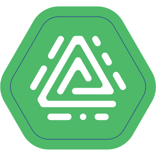

# ioBroker.acme

**Tests:** 

## ACME adapter for ioBroker

This adapter generates certificates using ACME challenges.

## Usage

The adapter starts periodically (default at midnight) and after configuration updates to generate any required certificates (new or soon to expire).

Currently, orders are processed with the Let's Encrypt certificate authority and thus are free of charge.

Certificate details are stored in a 'certificate collection' object which includes other relevant details such as expiry date, domains to be secured and private key.
These objects are referenced by their collection ID.

Adapters which need certificates to secure their communications (e.g. [web adapter](https://www.npmjs.com/package/iobroker.web)) are able to load and utilise certificate collections.

Storage and use is handled by an interface contained with the [core ioBroker controller](https://www.npmjs.com/package/iobroker.js-controller).

### ACME Challenges

Two methods of challenge verification are implemented and at least one should be enabled in the configuration page.

Note that wildcard certificate orders can only be validated using the DNS-01 challenge.

#### HTTP-01

The adapter starts its own HTTP-01 challenge server on the configured port and address.

For a HTTP-01 challenge to be successful the challenge server's port/address **must** be publicly reachable as port 80 of the FQDN given in a collection common/alt names from the open internet.

Configure your firewall, reverse proxy, etc. accordingly.

Example scenarios:

1. The IoB host on which ACME is running is behind a router and that router has a publicly reachable IP address:

    Solution:
    - Configure ACME to run on any free port: Eg: 8092.
    - Configure the router to forward connections to port 80 of it's public address to port 8092 of the IoB host.
    - Configure the DNS name of the desired certificate common name to resolve to the public address of the router.

2. The IoB host on which ACME is running has a direct internet connection with a publicly reachable IP address:

    Solution:
     - Configure ACME adapter to liston on port 80.
     - Configure the DNS name of the desired certificate common name to resolve to the public address of the IoB host.

3. Scenario 1 & 2 are impossible because another service is running on port 80 of the publicly reachable IP address.

    Possible solutions:

    1. If the other service is an IoB adapter following port configuration naming standards ACME will stop it before attempting to order a certificate, use port 80 for the HTTP-01 challenge server, and restart any stopped adapter when done.
    
       Obviously this causes a short outage for the other adapter which may not be desirable.

    2. Use a DNS-01 challenge.
   
    3. Setup a named virtual host HTTP proxy on port 80 of the router or publicly reachable IoB host.

       - Give the existing service a different hostname to the one a certificate is required for and configure that hostname to resolve to the same address.
       - Configure the proxy to forward requests to either the existing service or ACME adapter based on the name used.

    4. Run ACME manually only when required port access is available. **Not recommended**, but should work:

        - Disable (stop) the ACME adapter after installation.
        - Shortly before certificate order or renewal is required (renewal will occur up to 7 days before expiry) manually perform the following steps:
          - Setup any firewall/port forwarding/other maintenance required to allow ACME to run on the configured port, and for that port to be accessible from the public internet.
          - Start ACME manually from the IoB Admin Instances page.
          - Wait for ACME to complete any certificate orders.
          - Stop ACME manually from the IoB Admin Instances page.
        - These steps will be required every time a certificate order/renewal is required and as such this method is **not recommended**. ACME is designed to facilitate a fully automated process.

#### DNS-01

Various DNS-01 challenge plugins are implemented for popular domain hosting platforms.

#### References
See [AMCS.js](https://www.npmjs.com/package/acme) for more details.

## Changelog
<!--
    Placeholder for the next version (at the beginning of the line):
    ### **WORK IN PROGRESS**
-->

### **WORK IN PROGRESS**
* (raintonr) Use @iobroker/webserver (#10).
* (bluefox) Corrected detection of instances on the same port
* (bluefox) Implemented the monitoring of the collection's status

### 0.0.2 (2023-03-01)
* (bluefox) Now all running on the same port adapters will be stopped before update.

### 0.0.1 (2023-01-29)
* (Robin Rainton) Initial release.

## License
MIT License

Copyright (c) 2023 Robin Rainton <robin@rainton.com>

Permission is hereby granted, free of charge, to any person obtaining a copy
of this software and associated documentation files (the "Software"), to deal
in the Software without restriction, including without limitation the rights
to use, copy, modify, merge, publish, distribute, sublicense, and/or sell
copies of the Software, and to permit persons to whom the Software is
furnished to do so, subject to the following conditions:

The above copyright notice and this permission notice shall be included in all
copies or substantial portions of the Software.

THE SOFTWARE IS PROVIDED "AS IS", WITHOUT WARRANTY OF ANY KIND, EXPRESS OR
IMPLIED, INCLUDING BUT NOT LIMITED TO THE WARRANTIES OF MERCHANTABILITY,
FITNESS FOR A PARTICULAR PURPOSE AND NONINFRINGEMENT. IN NO EVENT SHALL THE
AUTHORS OR COPYRIGHT HOLDERS BE LIABLE FOR ANY CLAIM, DAMAGES OR OTHER
LIABILITY, WHETHER IN AN ACTION OF CONTRACT, TORT OR OTHERWISE, ARISING FROM,
OUT OF OR IN CONNECTION WITH THE SOFTWARE OR THE USE OR OTHER DEALINGS IN THE
SOFTWARE.
