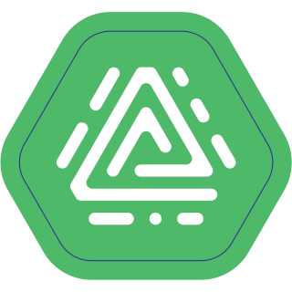

# ioBroker.acme

[](https://www.npmjs.com/package/iobroker.acme)
[](https://www.npmjs.com/package/iobroker.acme)


[](https://nodei.co/npm/iobroker.acme/)

**Tests:** 

## ACME adapter for ioBroker

This adapter generates certificates using ACME challenges.

## Usage

The adapter starts periodically (default at midnight) and after configuration updates to generate any required certificates (new or soon to expire).

Currently, orders are processed with the Let's Encrypt certificate authority and thus are free of charge.

Certificate details are stored in a 'certificate collection' object which includes other relevant details such as expiry date, domains to be secured and private key.
These objects are referenced by their collection ID.

Adapters which need certificates to secure their communications (e.g. [web adapter](https://www.npmjs.com/package/iobroker.web)) are able to load and utilise certificate collections.

Storage and use are handled by an interface contained with the [core ioBroker controller](https://www.npmjs.com/package/iobroker.js-controller).

### ACME Challenges

Two methods of challenge verification are implemented, and at least one should be enabled on the configuration page.

Note that wildcard certificate orders can only be validated using the DNS-01 challenge.

#### HTTP-01

The CA fetches `http://<FQDN>/.well-known/acme-challenge/<token>` on port 80. That path and port are fixed by the ACME protocol, so something has to answer them.

**HTTP-01 challenge delivery** on the configuration page decides what:

- **Automatic (recommended)** — the adapter publishes the challenge tokens in the state `acme.<instance>.info.httpChallenges`. `web` and `admin` serve them straight from there when they run a recent enough `@iobroker/webserver`, so nothing has to be stopped and no port has to be free. If the configured port does not answer with a published token, the adapter falls back to its own challenge server and to stopping adapters on that port, exactly as older versions did.
- **Own challenge server, stop conflicting adapters** — always run an own server on the configured port, stopping any adapter on it for the duration of the order. This was the only behaviour up to version 5.0.0.
- **Served by another adapter or reverse proxy** — publish the tokens and never touch the port. Use this when an nginx, Traefik or the `proxy` adapter forwards `/.well-known/acme-challenge/` to a webserver that reads the state.

For an HTTP-01 challenge to be successful, whatever serves the challenge **must** be publicly reachable as port 80 of the FQDN given in a collection common/alt name from the open internet. Let's Encrypt follows redirects, so the request may end up on another port or on HTTPS — but it always starts at port 80.

Configure your firewall, reverse proxy, etc. accordingly.

Example scenarios:

1. The IoB host on which ACME is running is behind a router, and that router has a publicly reachable IP address:

    Solution:

    - Configure ACME to run on any free port: E.g.: 8092.
    - Configure the router to forward connections to port 80 of its public address to port 8092 of the IoB host.
    - Configure the DNS name of the desired certificate common name to resolve to the public address of the router.

2. The IoB host on which ACME is running has a direct internet connection with a publicly reachable IP address:

    Solution:

    - Configure ACME adapter to liston on port 80.
    - Configure the DNS name of the desired certificate common name to resolve to the public address of the IoB host.

3. Scenario 1 & 2 are impossible because another service is running on port 80 of the publicly reachable IP address.

    Possible solutions:

    1. If the other service is `web` or `admin` on a version using `@iobroker/webserver` with ACME support, nothing needs to be done: it serves the published challenges itself and keeps running. Leave the delivery on **Automatic**.

    2. If the other service is an IoB adapter following port configuration naming standards but cannot serve the challenges itself, ACME will stop it before attempting to order a certificate, use port 80 for its own HTTP-01 challenge server, and restart any stopped adapter when done.

        Obviously, this causes a short outage for the other adapter which may not be desirable.

    3. Use a DNS-01 challenge.
    4. Set up a named virtual host HTTP proxy on port 80 of the router or publicly reachable IoB host.

        - Give the existing service a different hostname to the one a certificate is required for and configure that hostname to resolve to the same address.
        - Configure the proxy to forward requests to either the existing service or ACME adapter based on the name used.

    5. Run ACME manually only when required port access is available. **Not recommended**, but should work:

        - Disable (stop) the ACME adapter after installation.
        - Shortly before certificate order or renewal is required (renewal will occur up to 7 days before expiry) manually perform the following steps:
            - Set up any firewall/port forwarding/other maintenance required to allow ACME to run on the configured port and for that port to be accessible from the public internet.
            - Start ACME manually from the IoB Admin Instances page.
            - Wait for ACME to complete any certificate orders.
            - Stop ACME manually from the IoB Admin Instances page.
        - These steps will be required every time a certificate order/renewal is required, and as such this method is **not recommended**. ACME is designed to facilitate a fully automated process.

##### Serving published challenges yourself

The state `acme.<instance>.info.httpChallenges` is the contract between this adapter and whatever serves port 80. It holds a JSON object keyed by challenge token:

```json
{
    "<token>": {
        "keyAuthorization": "<token>.<account key thumbprint>",
        "expires": 1756200000000
    }
}
```

A reader answering `GET /.well-known/acme-challenge/<token>` should:

- read every instance, i.e. the foreign state pattern `acme.*.info.httpChallenges` - the instance number is not fixed and two instances may order at the same time;
- reject a token that is not `[A-Za-z0-9_-]{16,128}` before looking it up;
- ignore an entry whose `expires` is in the past;
- answer `200` with `keyAuthorization` as the whole body, or `404`;
- do all of this **before** any authentication, since the CA is anonymous.

The values are public by design - they are served over plain HTTP to anyone who asks - and are removed again as soon as the order completes.

#### DNS-01

Various DNS-01 challenge plugins are implemented for popular domain hosting platforms.

#### References

See [AMCS.js](https://www.npmjs.com/package/acme) for more details.

<!--
    Placeholder for the next version (at the beginning of the line):
    ### **WORK IN PROGRESS**
-->

## Changelog
### 5.0.1 (2026-08-26)
- (@GermanBluefox) HTTP-01 challenges are now published in `acme.<instance>.info.httpChallenges` so `web`/`admin` can serve them; adapters on port 80 are only stopped when nothing answers there (#85)
- (@GermanBluefox) Added the "HTTP-01 challenge delivery" setting to choose between automatic, an own challenge server, and an external responder

### 5.0.0 (2026-08-25)
- (@GermanBluefox) Added support for deSEC and PowerDNS DNS-01 challenges
- (@GermanBluefox) Fixed DigitalOcean, DNSimple, Gandi, name.com and Route53 DNS-01 challenges failing with "request is not a function" after the acme-client migration
- (@GermanBluefox) Added support for Hetzner and Dynu DNS-01 challenges
- (@GermanBluefox) Added support for IONOS DNS-01 challenge
- (@GermanBluefox) BREAKING: Migrated from the abandoned ACME.js to acme-client. The saved ACME account is registered once anew on first run after the update.
- (chris299) Added support for eDNS.de DNS-01 challenge
- (chris299) Fixed certificate issuance failing against current Let's Encrypt with 409 / "Unhandled status '403'"
- (chris299) Fixed certificate renewal failing with "Cannot read properties of undefined (reading '0')"

### 4.0.3 (2026-08-03)
- (@GermanBluefox) Migrated to admin 8
- (@GermanBluefox) Adapter requires admin >= 8.0.0 now

### 3.1.0 (2026-05-04)
- (copilot) Adapter requires node.js >= 22 now
- (mcm1957) Dependencies have been updated

### 3.0.2 (2026-03-10)
- (@GermanBluefox) Correcting configuration dialog
- (@GermanBluefox) Added tests for the GUI component

[Older changelogs can be found there](CHANGELOG_OLD.md)

## License

MIT License


Copyright (c) 2023-2026 iobroker-community-adapters <iobroker-community-adapters@gmx.de>  
Copyright (c) 2023 Robin Rainton <robin@rainton.com>

Permission is hereby granted, free of charge, to any person obtaining a copy
of this software and associated documentation files (the "Software"), to deal
in the Software without restriction, including without limitation the rights
to use, copy, modify, merge, publish, distribute, sublicense, and/or sell
copies of the Software, and to permit persons to whom the Software is
furnished to do so, subject to the following conditions:

The above copyright notice and this permission notice shall be included in all
copies or substantial portions of the Software.

THE SOFTWARE IS PROVIDED "AS IS", WITHOUT WARRANTY OF ANY KIND, EXPRESS OR
IMPLIED, INCLUDING BUT NOT LIMITED TO THE WARRANTIES OF MERCHANTABILITY,
FITNESS FOR A PARTICULAR PURPOSE AND NONINFRINGEMENT. IN NO EVENT SHALL THE
AUTHORS OR COPYRIGHT HOLDERS BE LIABLE FOR ANY CLAIM, DAMAGES OR OTHER
LIABILITY, WHETHER IN AN ACTION OF CONTRACT, TORT OR OTHERWISE, ARISING FROM,
OUT OF OR IN CONNECTION WITH THE SOFTWARE OR THE USE OR OTHER DEALINGS IN THE
SOFTWARE.
