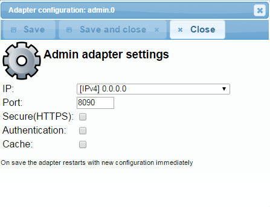
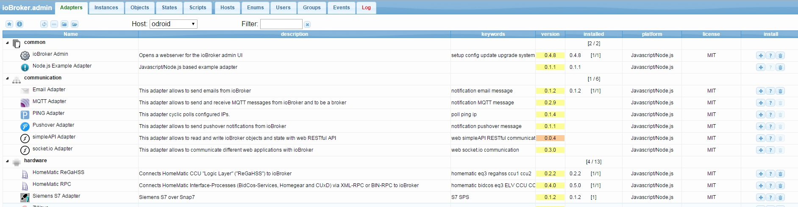
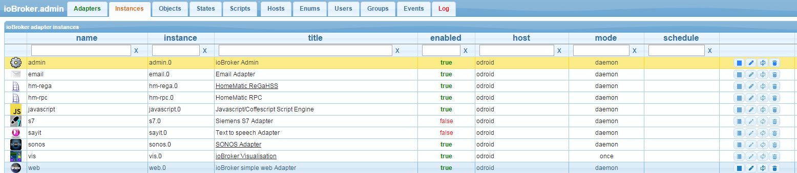
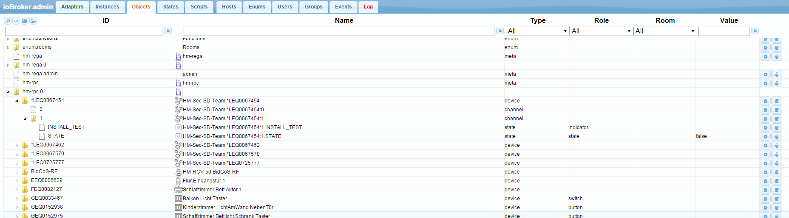

# Admin

The admin adapter is used to configure the whole ioBroker-Installation and all its adapters. 
It provides a web-interface, which can be opened by "http://<IP-Address of the server>:8081" 
in the web browser. This adapter is automatically installed together with ioBroker.

## Configuration
The configuration dialog of the adapter "admin" provides the following settings: 

**IP:** the IP-address of the "admin" web-server can be chosen here. 
Different IPv4 and IPv6 addresses can be selected. The default value is 0.0.0.0. 
If you think, that 0.0.0.0 is invalid setting, please let it stay there, because it 
is absolutely valid. If you change the address, you will be able to reach the web-server 
only through this address. **Port:** You can specify the port of the "admin" web-server. 
If there are more web servers on the PC or device the port must be customized to avoid problems 
of a double port allocation. **Coding:** enable this option if secure https protocol should be used. 

**Authentication:** If you want the authentication with login/password you should enable this check-box. 
Default password for user "admin" is "iobroker" **Buffer:** to speed up the load of the pages enable this option. 
Normally only the developer wants to have this option unchecked.

## Handling
The main page of the admin consist of several tabs. **Adapter:** Here the instances of 
a adapters can be installed or deleted. With the update button 

on the top left we can get if the new versions of adapters are available. 

The available and installed versions of the adapter is shown. For overall view the state of the 
adapter is coloured (red=in planning; orange=alpha; yellow=beta). The updates to a newer version of 
the adapter are made here also. If there is a newer version the lettering of the tab will be green. 
If the question mark icon in the last column is active you can get from there to web site with information of the adapter. 
The available adapter are sorted in alphabetical order. Already installed instance are in the upper part of the list. 

**Instance:** The already installed instance are listed here and can be accordingly configured. If the title of the 
instance are underlined you can click on it and the corresponding web site will be opened. 

**Objects:** the managed objects (for example setup / variables / programs of the connected hardware) 

**States:** the current states (values of the objects)   
If the adapter history is installed, you can log chosen data points. 
The logged data points are selected on the right and appear with a green logo. 

**Scripts:** this tab is only active if the "javascript" adapter is installed.

**Node-red:** this tab is only visible if the "node-red" adapter installed and enabled.

**Hosts:** the computer which ioBroker is installed on. Here the latest version of js-controller can be installed on. 
If there is a new version the letters of the tab are green. To search for a new version you have to click on the update 
icon on the bottom left corner. 

**Enumeration:** here the favourites, trades and spaces from the CCU are listed. 

**Users:** here the users can be added. To do this click on the (+). By default there is an admin. 

**Groups:** if you click on the (+) on the bottom left you can create user groups. From the pull-down menu the users get assigned to the groups. 

**Event:** A list of the running updates of the conditions. **Log:** here the log is displayed In the tab instance the the logged log level 
of the single instance can be set. In the selection Menu the the displayed minimum log level is selected. If an error occurs the 
lettering of the log appears in red.

## Changelog
### **WORK IN PROGRESS**
* (foxriver76) fixed problem with discovery dialog
* (foxriver76) object browser now validates setting state of type number
* (foxriver76) allow to specify unique columns for tables
* (foxriver76) fix crash on invalid states, which are missing the property `common.role`

### 6.9.2 (2023-09-01)
* (foxriver76) show info, if server time differs from client time
* (foxriver76) remove confusion with different names for state (datapoint and state)
* (jogibear9988) fixed link on 404-page being opened inside child view
* (foxriver76) fixed issue if non-text default values are provided to a text jsonConfig component
* (foxriver76) implemented del key shortcut to delete a selected object

### 6.9.1 (2023-08-22)
* (foxriver76) allow resizing of all columns in objects tab
* (foxriver76) without expert mode users are only allowed to edit objects in `0_userdata.0` and `alias.0` namespace
* (foxriver76) fixed keyboard navigation
* (foxriver76) fixed problem with showing controller upgrade instructions if no UI upgrade is supported

### 6.9.0 (2023-08-21)
* (bluefox) Added possibility to change log direction
* (bluefox) JSON config: Added possibility to filter out internal IP addresses
* (bluefox) JSON config: Added _changed flag for formula in JSON config
* (bluefox) JSON config: Added option `reloadBrowser` to sendto in JSON config
* (bluefox) JSON config: Allowed positioning of add button on the very top of the table
* (bluefox) JSON config: Trim strings by saving and not by typing
* (bluefox) Added alias creation from object browser
* (bluefox) Allowed to change chart type
* (foxriver76) show a date picker when setting state (role: date/type: number)
* (foxriver76) fixed problem, that creation of folders was not possible
* (foxriver76) adapted text to clarify, that only tarball can be installed from path
* (foxriver76) type string/role date will now also be previewed as a date in objects tab
* (foxriver76) fixed problem with table formatting on history data point viewer
* (foxriver76) fixed problem that could render update dialog with invalid property
* (foxriver76) fixed sentry icon being in wrong position if no compact flag provided

### 6.8.3 (2023-08-16)
* (foxriver76) added description to adapter rating dialog
* (bluefox) Extended the select component with grouping
* (bluefox) Allowed the sorting of adapters by name and not only by title
* (bluefox) Allowed the set state JSON config component

### 6.8.0 (2023-08-14)
* (foxriver76) try to find the correct IP for the controller UI multihost slave upgrade
* (foxriver76) admin is now showing update information, while it is stopped during upgrade
* (foxriver76) required Node.js version is 16 as 14 is End-Of-Life
* (foxriver76) fixed downloading folders recursive

## License
The MIT License (MIT)

Copyright (c) 2014-2023 bluefox <dogafox@gmail.com>