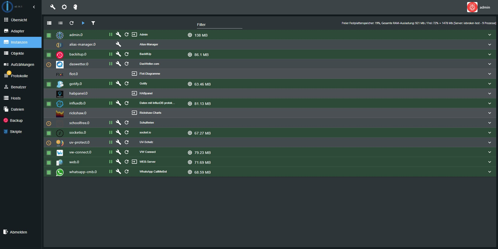
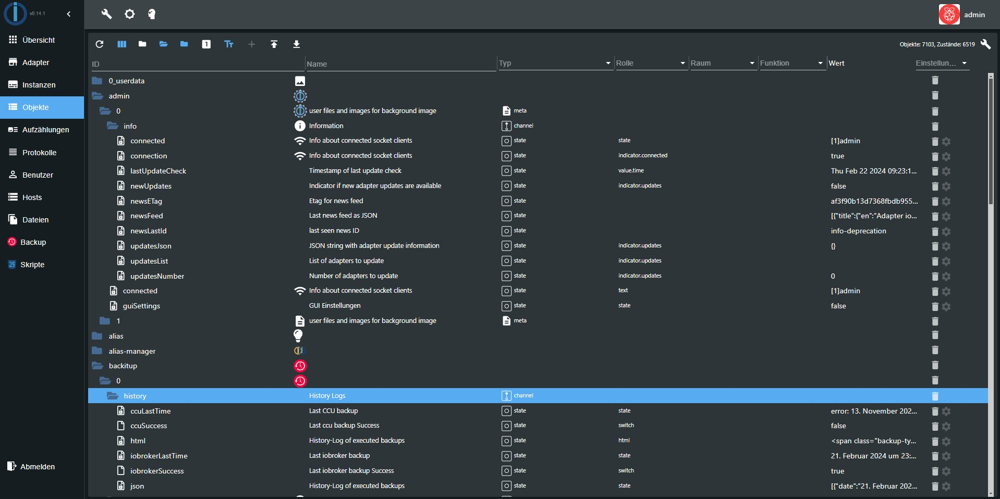
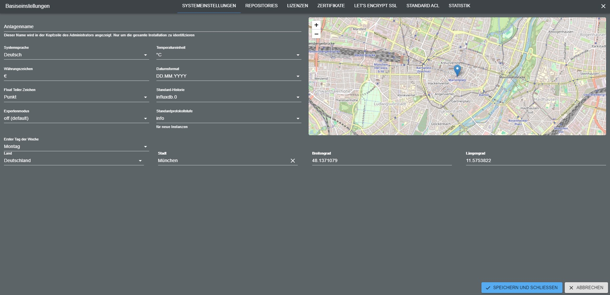

# Admin

The admin adapter is used to configure the whole ioBroker-Installation and all its adapters. 
It provides a web-interface, which can be opened by "http://<IP-Address of the server>:8081" 
in the web browser. This adapter is automatically installed together with ioBroker.

## Configuration
The configuration dialog of the adapter "admin" provides the following settings: 

**IP:** the IP-address of the "admin" web-server can be chosen here. 
Different IPv4 and IPv6 addresses can be selected. The default value is 0.0.0.0. 
If you think, that 0.0.0.0 is invalid setting, please let it stay there, because it 
is absolutely valid. If you change the address, you will be able to reach the web-server 
only through this address. **Port:** You can specify the port of the "admin" web-server. 
If there are more web servers on the PC or device the port must be customized to avoid problems 
of a double port allocation. **Coding:** enable this option if secure https protocol should be used. 

**Authentication:** If you want the authentication with login/password you should enable this check-box. 
Default password for user "admin" is "iobroker" **Buffer:** to speed up the load of the pages enable this option. 
Normally only the developer wants to have this option unchecked.

## Handling
The main page of the admin consist of several tabs. **Adapter:** Here the instances of 
a adapters can be installed or deleted. With the update button 

on the top left we can get if the new versions of adapters are available. 

The available and installed versions of the adapter is shown. For overall view the state of the 
adapter is coloured (red=in planning; orange=alpha; yellow=beta). The updates to a newer version of 
the adapter are made here also. If there is a newer version the lettering of the tab will be green. 
If the question mark icon in the last column is active you can get from there to web site with information of the adapter. 
The available adapter are sorted in alphabetical order. Already installed instance are in the upper part of the list. 

**Instance:** The already installed instance are listed here and can be accordingly configured. If the title of the 
instance are underlined you can click on it and the corresponding web site will be opened. 

**Objects:** the managed objects (for example setup / variables / programs of the connected hardware) 

**States:** the current states (values of the objects)   
If the adapter history is installed, you can log chosen data points. 
The logged data points are selected on the right and appear with a green logo. 

**Scripts:** this tab is only active if the "javascript" adapter is installed.

**Node-red:** this tab is only visible if the "node-red" adapter installed and enabled.

**Hosts:** the computer which ioBroker is installed on. Here the latest version of js-controller can be installed on. 
If there is a new version the letters of the tab are green. To search for a new version you have to click on the update 
icon on the bottom left corner. 

**Enumeration:** here the favourites, trades and spaces from the CCU are listed. 

**Users:** here the users can be added. To do this click on the (+). By default there is an admin. 

**Groups:** if you click on the (+) on the bottom left you can create user groups. From the pull-down menu the users get assigned to the groups. 

**Event:** A list of the running updates of the conditions. 

**Hosts:**
Information about the computer on which ioBroker is installed. The current version of the js controller can be updated here. If a new version is available, the label of the tab appears in green.

**Log:** here the log is displayed In the tab instance the the logged log level 
of the single instance can be set. In the selection Menu the the displayed minimum log level is selected. If an error occurs the 
lettering of the log appears in red.

**System settings:**
Settings such as language, time and date format and other system-wide settings are made in the menu that opens here.

The repositories and security settings can also be set here.

## Changelog
<!--
    Placeholder for the next version (at the beginning of the line):
    ### **WORK IN PROGRESS**
-->
### 8.1.1 (2026-10-08)
- (@krobipd) Fixed: with the GUI settings stored on the server, a window of the admin threw away what others had saved in the meantime
- (@GermanBluefox) Fixed: compressed log files (`.gz`) are shown unpacked again
- (@GermanBluefox) Fixed: the link of a web extension to its own service (e.g. `http://%native_friurl%` of frigate) was sent to the web instance

### 8.1.0 (2026-10-07)
- (@GermanBluefox) Fixed: "Save & Close" of the base settings was active while the settings were still loading
- (@GermanBluefox) Changed: the news in the update dialogs are rendered as Markdown
- (@GermanBluefox) Fixed: links with `localhost`, `127.0.0.1` or `0.0.0.0` (e.g. `http://%native_friurl%`) now use the address of the instance's host
- (@GermanBluefox) Fixed: the log search and the MCP info dialog require the `execute` right
- (@GermanBluefox) Fixed: the AI assistant no longer trusts endpoint, permissions and confirmations from the request; tools run with the rights of the user who asked. Reported by two external security researchers
- (@GermanBluefox) Fixed: AI assistant answers and log searches longer than 30 seconds ended in an empty answer or "timeout"; the result is pushed to the browser now
- (@GermanBluefox) Added: "Maximum answer length" in the settings of the AI assistant (Anthropic)
- (@GermanBluefox) Fixed: the news of the notification dialog were always shown in English (#3534)
- (@GermanBluefox) Fixed: the notification dialog showed "undefined" when a translation was missing
- (@GermanBluefox) Fixed: Chrome offered to generate and store a password in the API key fields of the credentials

### 8.0.23 (2026-10-03)
- (@GermanBluefox) Changed: the info dialog of a host on the quick access page shows what it knows instead of what the host sends. Every line has an icon in front of it - the penguin, the window, the apple or the daemon for the platform, a chip for the CPU, a clock for the time - the names start with a capital letter, and a `true` is now a "Yes". The disk is no longer two lines with two numbers but one bar that fills with the free space, `11.8 GB / 26.2 GB`, red as soon as less than a tenth is left. The time of the host was a bare timestamp like `1790980340380` because the entry was looked up under `Time` while the host calls it `time`; it is now the wall clock of the host, shifted by the time zone the host reports, so neither UTC nor the time zone of the browser is shown
- (@GermanBluefox) Changed: "adapters count" is called "Adapters in repository" now. It counts the adapters that the active repository offers - 812 of them - and was read as the number of the installed ones
- (@GermanBluefox) Fixed: ENTER in the "Write value" dialog reloaded the whole GUI now and then. Its inputs sit in a `<form>` whose `onSubmit` returned `false` - which prevents nothing in react - so the browser submitted the form, and as it has no `action`, it requested the current address anew. Chrome submits on ENTER in a one line input and on CTRL+ENTER in a text area, which is exactly when it happened. The same form is used by the value editor of the history table and by the multihost settings
- (@GermanBluefox) Added: CTRL+ENTER confirms the dialogs of the object browser, the expert mode included: "Write value" whatever the type of the state is, "Edit object", the role, the alias, the new object, the custom settings ("Save & close"), rename/copy and the import of objects. Only a few text fields reacted to the combination, the JSON editors and all other inputs did not, and nothing told about the shortcut - the confirming button of every one of these dialogs carries the hint as a tooltip now
- (@GermanBluefox) Changed: a global dependency has to be fulfilled on every host of a multihost system, but the update dialog showed a single version and crossed it out - `admin (>=8.0.0): 8.0.14` with a red cross in front of it, which reads as if 8.0.14 were older than 8.0.0. The hosts that still run a version that is too old are listed under the line now, each with the version it has, and the tooltip of the adapter row says the same instead of "Invalid version of admin. Required >=8.0.0. Current 8.0.14" (#3666)
- (@GermanBluefox) Added: an instance whose adapter is not installed on its host is marked as such. It can never start, and nothing said why - it stayed red among the ones that are merely stopped. A restored backup leaves such instances behind: the objects of the adapter come back with the backup, while the code of an adapter that has left the repository, `flot` for example, cannot be installed any more. The status indicator of the row carries an error sign now, the tile one next to the name, and both say "The adapter is not installed on host ..." on hover. Only the host itself knows what it really has, so every host that runs is asked - without the list of the instances waiting for the answer (#3626)
- (@GermanBluefox) Added: the context menu of the object browser has an entry "Edit name" (Alt+9), without the expert mode and next to "Edit function" and "Edit room". Changing the name of an object is an everyday operation, but it was only reachable through "Edit object" - which the expert mode hides. A name that is translated keeps its other languages, only the language of the GUI is written (#3640). Lives in `@iobroker/gui-components` and needs its next version
- (@GermanBluefox) Fixed: the settings page of admin showed the whole "Single sign-on" tab in English, whatever the language: none of its labels and hints had ever reached `admin/i18n`, so every one of them fell back to its English key. The five texts of the AI assistant about leaving a tab were missing in nine languages, and the hint about the filtered adapters was left in English in Chinese

### 8.0.22 (2026-10-02)
- (@GermanBluefox) Fixed: the link of an adapter that runs as a web extension lost everything behind the host. `energiefluss-erweitert` points at `.../energiefluss-erweitert/?instance=%instance%`, and the quick access offered `.../energiefluss-erweitert/` - without the page and without the instance. Such an adapter has no own port, so the origin of its link has to come from the web instance that serves it, but the whole address was built anew instead of only its origin being exchanged. The same happened to `habpanel`, whose `index.html` disappeared, and to a second link of an adapter that pointed at its documentation on a foreign host: it ended up on the own web server (#3661)
- (@GermanBluefox) Fixed: a card of the quick access belonged to whichever adapter was processed first. Every vis-2 widget adapter registers a link to the vis-2 runtime, and because the instance IDs decide the order, `vis-2` itself lost its own card to one of them, together with its name, its icon and its color. The card now belongs to the adapter that serves the page
- (@GermanBluefox) Added: the admin recognizes that it was opened through the remote access of ioBroker Cloud/Pro and moves the links onto the service. The quick access, the instance list and the tabs of the left menu pointed into the local network, which is of no use to somebody who is not in it. Which instances the service publishes is read from the configuration of the `cloud` or `iot` adapter, so nothing is guessed: the web instance is reachable at `/`, the admin at `/admin/` and lovelace at `/lovelace/`. A page the service does not publish - Node-RED or a second admin, for example - is no longer offered as a dead link but shown dimmed with a note that it only works in the local network
- (@GermanBluefox) Added: the identity provider for the single sign-on can be configured. The issuer, the client ID, an optional client secret and the scopes are set in the new "Single sign-on" tab of the admin settings, and the endpoints are read from the discovery document of the issuer, so every provider that follows the standard works. Without a complete configuration the SSO stays off and the login page does not offer it (needs `@iobroker/webserver` 3.3.0)
- (@GermanBluefox) Fixed: with authentication enabled, the GUI took seconds to come up and sometimes did not come up at all. If the access token had expired while the tab was closed, the websocket was opened with it, the server asked for a new one and then stopped listening on that connection: the token the browser fetched within milliseconds could not be announced, the browser waited for an answer that could not come until its own three second timeout, and the single-use refresh token was burnt for nothing before the whole start began again (needs `@iobroker/socket-classes` 2.6.2)
- (@GermanBluefox) Changed: `mime` was replaced by `mime-types`. `mime` 4 is ESM only, and version 3 is no longer maintained; `mime-types` uses the same database, is already part of the dependency tree through express, and three duplicated copies of it disappear from the lockfile. A JavaScript file is now served as `text/javascript` instead of the deprecated `application/javascript`

### 8.0.21 (2026-09-29)
- (@GermanBluefox) Fixed: on a grown installation, the start of the GUI ran into "Detected slow connection!" and the dialog offering a longer read timeout, on a fast local network as well. The start page read the whole object database only to count the objects and the states for its tile - 32 MB on a system with 10,000 objects - which blocked the admin process for seconds, so every other request of the start waited for it and ran into its own timeout. The counting is now done by the server, which answers with two numbers instead (needs `@iobroker/socket-classes` 2.6.0 and `@iobroker/socket-client` 5.4.0; an older backend still reads all objects, but delayed until the start is through). The whole start now transfers 2.4 MB, and the object database is no longer part of it (#3656)
- (@GermanBluefox) Fixed: the news check read all objects a second time, right after the start page had read them
- (@GermanBluefox) Fixed: the admin stayed on its logo and only came up after the page was reloaded. The start reads its own settings, the easy mode and the GUI settings one after the other, and each of them with a timeout of five seconds - which is less than a busy host needs for the first requests. Those reads no longer end the start, and whatever else goes wrong, the app is shown instead of the loader: the menu, the error message and the reconnect are more use than a logo that never goes away (#3641)
- (@GermanBluefox) Changed: the read timeout starts at 30 seconds instead of 15 (60 instead of 40 in the cloud), and it now applies to every request of the start instead of only to the repository and the installed versions
- (@GermanBluefox) Changed: the dialog about a slow connection only appears for a read the user asked for - switching the host or retrying from the dialog itself. Nothing waits for the read of the start any more, so a dialog there interrupted a start that was going perfectly well otherwise
- (@GermanBluefox) Added: the "Resource usage" card has a button that first stops the recording of CPU and RAM by the history instance, then collapses the card, which gives the system log room for 16 lines instead of 6. A collapsed card reads nothing at all until it is opened again, and it stays collapsed after a reload (needs `@iobroker/gui-components` 10.3.7)
- (@GermanBluefox) Fixed: a timeout while reading `guiSettings` at the start overwrote the stored GUI settings of the user with the defaults
- (@GermanBluefox) Fixed: the system log of the start page was left empty by "Cannot get logs: TypeError: e.pop is not a function" when the host answered with anything but its log lines

## License

The MIT License (MIT)

Copyright (c) 2014-2026 bluefox <dogafox@gmail.com>

[Full license text](LICENSE)