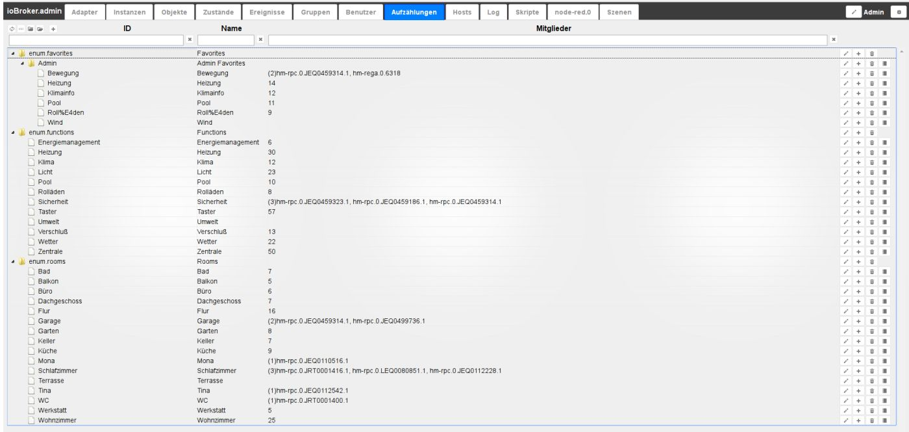

# The Enumerations tab
The favorites, trades and rooms from the Homematic CCU are listed here.
You can also create your own enumerations, which can then be used in scripts, for example.

## The title line
The title bar contains icons for the most important processes.
There is context help for each icon. Simply hold the mouse on the icon for a while.

### **The icons in detail:**
### **1.) Refresh view**
If listings that have just been created are not visible, clicking on this icon will help update the status of the page.

### **2.) Change sorting**
This button changes the sorting of the objects on this page.

When the button is active, all objects are sorted alphabetically.
If this button is not active, the objects are displayed hierarchically according to listings in a tree structure.

Then the next two icons are also visible.

### **3.) Collapse all subfolders**
### **4.) Expand all subfolders**
### **5.) add**
After selecting this icon, further listings can be added to the basic structure.
Elements within the folder structure are created using the (+) icon on the right (#10).
A configuration window opens:

The name for the new enumeration must now be selected here, the generated ID will be adjusted automatically.

### The page content

The existing enumerations and their members are displayed in tabular form on the page.

The table consists of the following columns (The fields under the column headers 6, 7 and 8 serve as filter criteria). The table in the picture is arranged according to hierarchy and all sub-items (nodes) have been expanded:

### **6.) ID**
All members of the enumeration are listed here with their IDs. This designation can be changed by double-clicking or clicking on the associated pencil icon (#9).
The full ID of subordinate structures also includes the superordinate levels in front.

### **7.) Name**
The name of the member is given in this column. This designation can be changed by double-clicking or clicking on the associated pencil icon (#9).

### **8.) Members**
In this column, the members of an enumeration are displayed, if there are too many, only the number is displayed.
If you move the mouse over the field, all members are displayed in a bubble info.
Further information can be obtained via the info icon on the far right (#12)

### **9.) Edit designations**
After clicking on this icon, you can edit the designations in the ID and Name columns.
An ok button in the form of a tick and a cancel icon in the form of an (x) appear at this point.

### **10.) Add structure element**
After clicking on this icon, a dialog window opens in which a new member can be created within the respective structure.

Here, too, the name can be chosen individually. The associated ID is generated automatically according to the structure and the selected name.

### **11.) Delete item**
The element in this line is deleted with the trash can icon

### **12.) Information**
After clicking on this icon, another window with extended information on the selected element is displayed.

