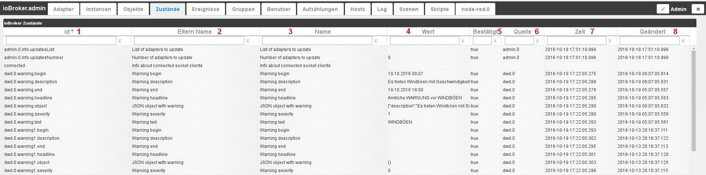

# The Events tab
This tab displays the current status of all data points. The values can also be changed.

## The page content
The existing objects are displayed in tabular form on the page. The columns can be sorted alphabetically in ascending or descending order according to the contents of the corresponding columns by clicking on the column headers (toggle function). The fields below are used to filter the data points according to your own criteria.

The table consists of the following columns:

### **1.) ID**
This is the unique name of the corresponding data point, according to the structure consisting of e.g. adapter name.instance number.device name.channel name.data point name.

### **2.) Parents Name**
The same content as in column 3 Name.

### **3.) Name**
The name of the data point. This can be an automatically generated name or a manually entered name that is easier to understand. This name does not have to be unique.

### **4.) Value**
The current value of the data point is specified here.

This value is editable

### **5.) Confirmed**
If this value has been changed and adopted by the system, the value is _true_, otherwise _false._

### **6.) Source**
This indicates which instance made the last change to the data point.

### **7.) Time**
This is the timestamp at which the data point was last updated.

### **8.) changed**
This is the timestamp at which the value of the data point last changed.

## The page footer
There is some more information in the footer

### **1.) reload**
This icon can be clicked to update the table.

### **2.) Page information**
The info block in the middle of the page footer provides the option of setting the number of lines per page using the pull-down menu. 20, 100, 200, 500 and 1000 lines per page are available. It also provides information on how many pages there are in total, as well as the option of scrolling forwards or backwards using the arrow icons.

### **3.) Data point information**
This information indicates the total number of existing data points and the range of them displayed on the current page.