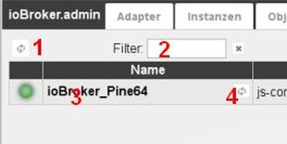
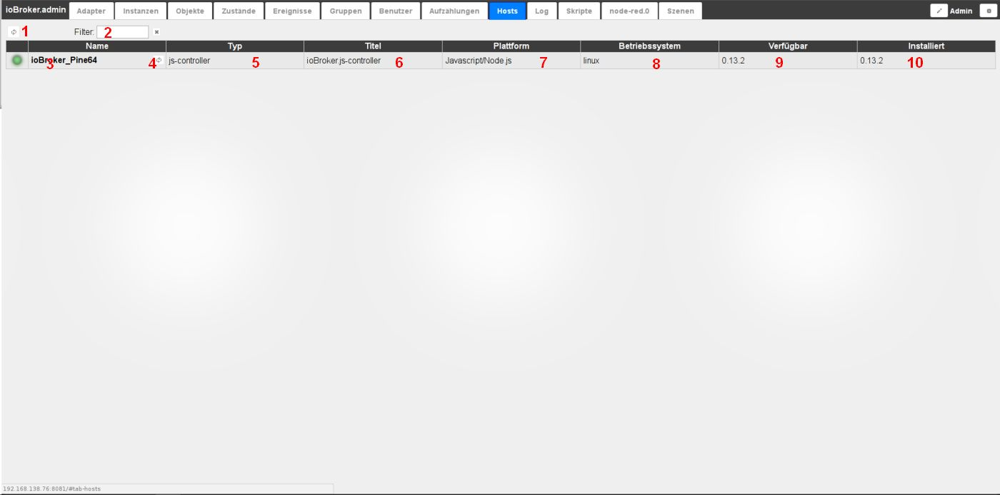

# The Hosts tab
The available hosts are displayed here.

In a standard system there is only one host. With a [multihost system](http://www.iobroker.net/?page_id=3068&lang=de), several accordingly.

## The title line
The title bar contains icons for the most important processes. There is context help for each icon. Simply hold the mouse on the icon for a while.

### **The icons in detail:**
### **1.) Get updates**
To check whether there is an update for the js-controller, you can click on this button. If there is an update, the label on the tab appears in green and the new version is displayed in the _**available**_ column.

### **2.) Filters**
With this field you can filter the list of hosts according to your own needs

## The page content
The existing hosts are displayed in tabular form on the page.

The table consists of the following columns:

### **3.) Name**
This is the unique name of each host, as set in the host's operating system. This name must be unique.

### **4.) Restart Host**
The corresponding host can be restarted with this button. Clicking on it corresponds to the **_reboot_** command.

### **5.) Type**
Specification on which engine the host is running.

### **6.) Title**
full engine name, typically ioBroker.js-controller

### **7.) Platform**
Specification of the software basis on which the engine is based.

### **8.) Operating system**
Specification of the operating system running on the host.

### **9 available**
Indication of the latest available version of the engine

If a newer version of the engine is available, it can be updated via the console.
If available, this should always be done first, before you start updating the adapter.

### **9.) Installed**
Specification of the installed version of the engine