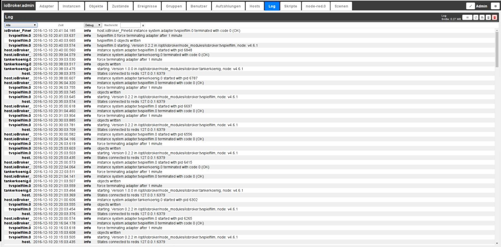
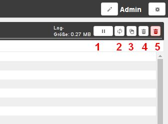
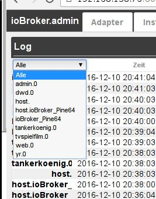
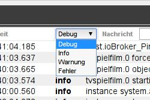

# The Log tab
The system messages are output continuously here.
The latest message is at the top.

## The title line
The title bar contains icons for the most important processes.
There is context help for each icon. Simply hold the mouse on the icon for a while.

### **The icons in detail:**
### **1.) Stop updating**
If you click on this button, the continuous update of the list is stopped.
Instead of the pause icon, the number of new, undisplayed messages now appears.

### **2.) Update log**
This button updates the list.

### **3.) Copy log**
After clicking this icon, the list appears as text. With CTRL-A the entire text is selected and with CTRL-C it is pasted into the clipboard for further editing.

### **4.) Delete list**
Clicking on this icon only deletes the list on the screen

### **5.) Delete log**
Clicking on this icon permanently deletes the entire log on the host.

### The pull-down menus
### **Instance Filter**

The messages can be filtered according to the logging instance with this pull-down menu.
Only those instances for which there are entries on the page are displayed in the menu.

### **displayed log level**

This menu can be used to set the severity of the message to be displayed.
However, this is only a filter of the existing list. In order to define logging at a specific level for an instance, this must be set in the _**Instances**_ tab.