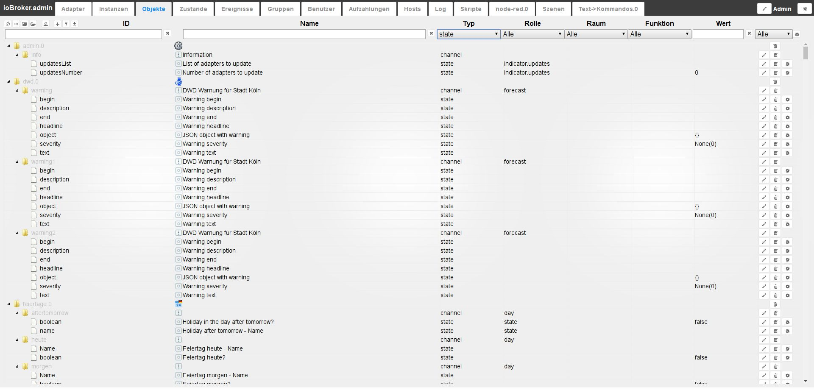
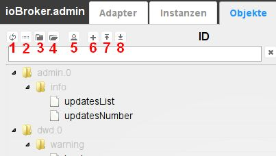
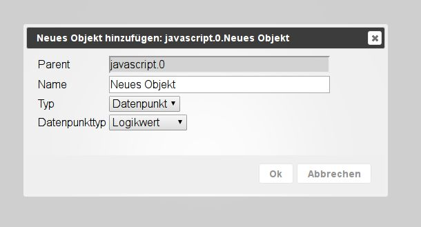
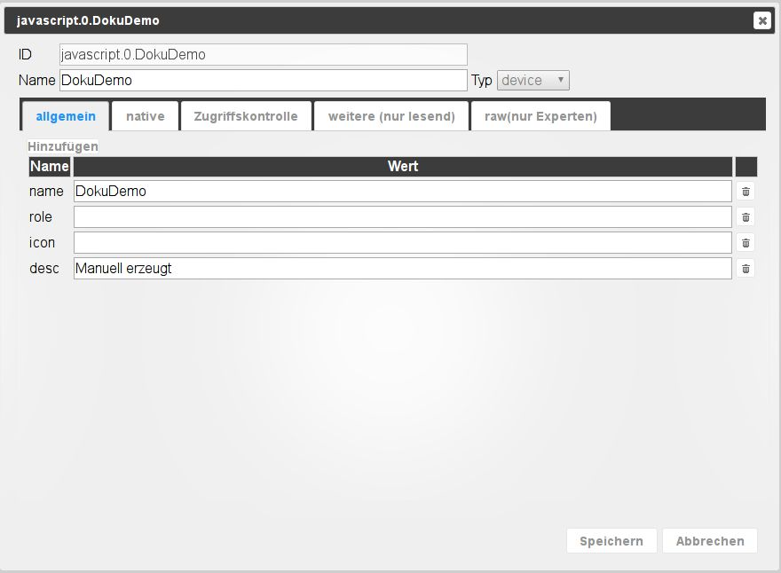
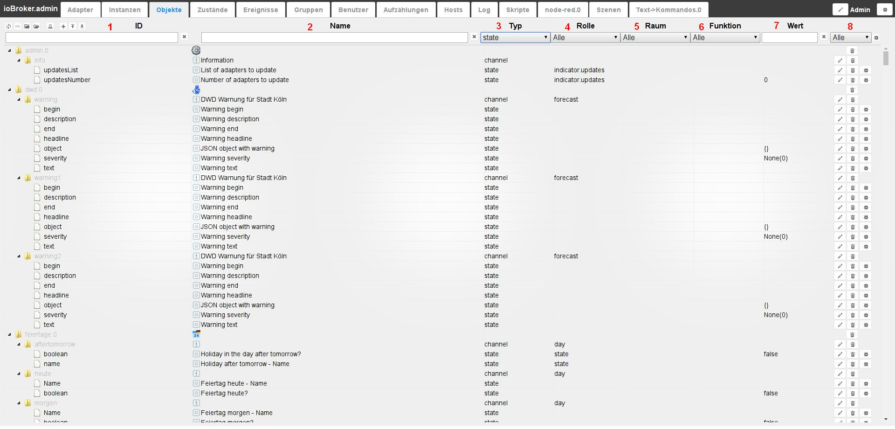
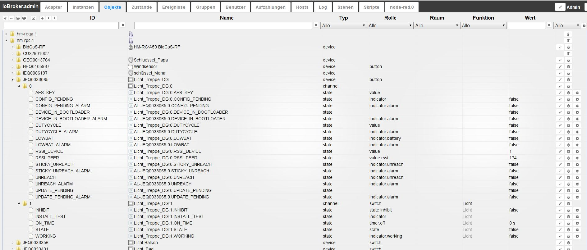
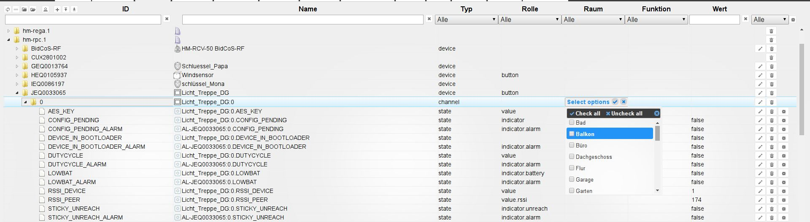
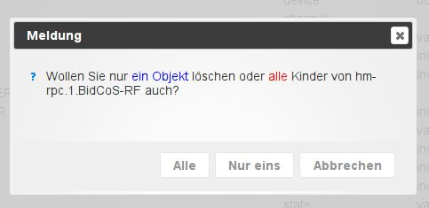

# The Objects tab
All managed objects are located under this tab. A folder is created for each instance in which the data points created by it are located in a hierarchical structure. Objects can also be created and deleted manually here. Entire object structures can be uploaded or downloaded. Another button enables the expert view to be displayed.

## The title line
The title bar contains icons for the most important processes. There is context help for each icon. Simply hold the mouse on the icon for a while.

### **The icons in detail:**
### **1.) Refresh view**
If objects that have just been created are not visible, clicking on this icon will help update the status of the page.

### **2.) Change sorting**
This button changes the sorting of the objects on this page.

When the button is active, all objects are sorted alphabetically. If this button is not active, the objects are sorted hierarchically according to instances.

Then the next two icons are also visible.

### **3.) Close all topics**
### **4.) Expand all topics**
### **5.) Admin Mode**
When you select this icon, further objects are displayed (toggle function). These are the data points of the system.

### **6.) add**
After selecting this icon, further objects can be added.
If a folder is selected, it is adopted as _Parent_ in the object structure.
A configuration window opens:

The name for the new object must now be selected here, whereby a device, a channel or a data point is available as a type according to the hierarchical structure.
Logic value, switch, character string, number, value list, field, object and mixed are available as data point types.

As soon as you confirm the input window with ok, another window opens:

Some data can still be entered here. A role and an icon can be added to the object.

The other tabs contain further properties of the object.
There is such information for every object.

### **7.) Upload**
With this button, a complete object structure is uploaded to the ioBroker server as a json file

### **8.) Download**
With this button, the selected object structure is downloaded as a json file from the ioBroker server and can be saved.

## The page content

The existing objects are displayed in tabular form on the page.

The table consists of the following columns (the fields under column headers 1 and 2 and the pull-down menus of the other columns serve as filter criteria).
The table in the picture is arranged according to hierarchy and all sub-items (nodes) have been expanded:

### **1.) ID**
These are the top levels of the object hierarchy. Here, e.g.
the name of the instance, including the respective structure of the data.

### **2.) Name**
The designation of the object is specified in this column. In addition, a preceding icon shows which hierarchy level is involved (device, channel or data point)

The values of this column can be edited.

### **3.) Type**
The type in the hierarchy level, which was already visible in the _Name_ column by the preceding icon, is explicitly named here again. You can use the pull-down menu in the column header to filter by these types and thus only display all data points, for example.

### 4.) Role
The role specifies how user interfaces such as .vis and mobile should handle this data point.
In principle, this is the function of this object briefly described using a term.
You can then filter again. The values of this column can be edited.

### **5.) Room**
If this object has already been assigned to a room, this is displayed here.
This is also used, among other things, for filtering when searching for objects.
The values of this column can be edited. In this way, the objects can be assigned to rooms at a later date.
If you click on the field, a popup opens with the previously created rooms.

### **6.) Function**
This column contains the trade to which the corresponding object is assigned.

The values of this column can be edited. In this way, the objects can be assigned to trades at a later date. If you click on the field, a popup opens with the trades created so far.

### **7.) Value**
If the object is a data point, the current value of this data point is displayed here.

### **8.) Other**
If you click on the pencil icon, a window with the properties of this object opens.
It is the same window that appeared above when creating a new object.
Properties of the object can be changed here. This function should be used with extreme caution and only if you know exactly what you are doing with it.

Clicking on the trash can icon deletes this object and **all** objects below it in the hierarchy. To be on the safe side, a window appears in which the deletion must be confirmed again.

The gear icon only appears if at least one history instance is installed (History, InfluxDB or SQL).
The data point for logging historical data can be configured here. More information can be found in the description of [history adapters](http://www.iobroker.net/?page_id=144&lang=de).

This action can be carried out simultaneously for all data points that match the current filter criteria using the gear wheel in the title bar. It is therefore important to check carefully whether the filter criteria on this page have been selected in such a way that only the desired data points are included.

The pull-down menu for filtering this column relates to data points with logged data.
_with_, _without_ and _all_ as well as the installed history instances are available here.