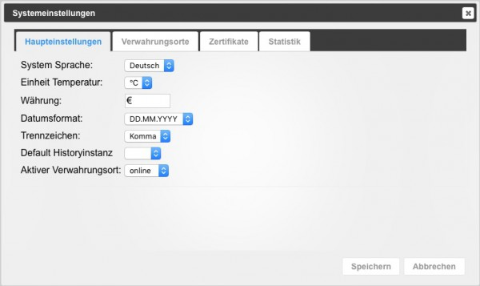
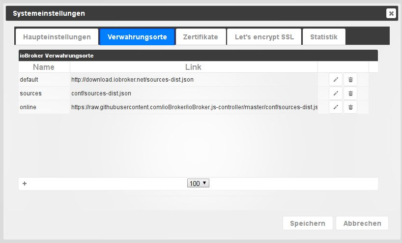
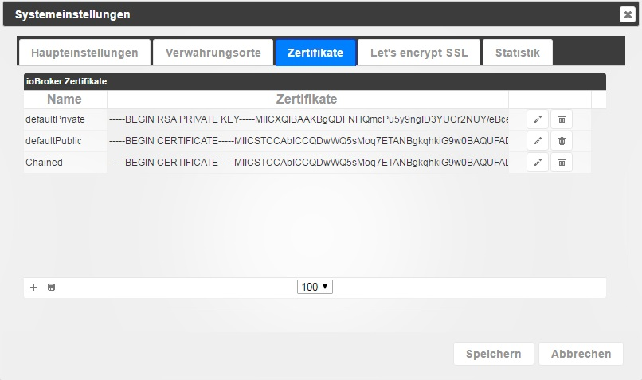
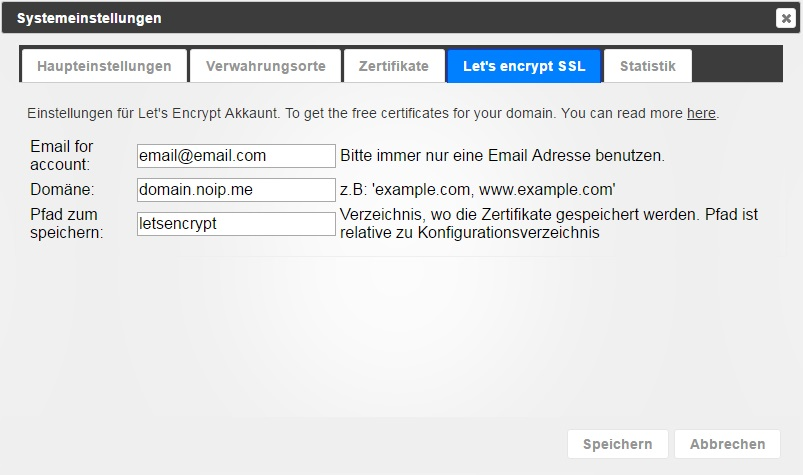
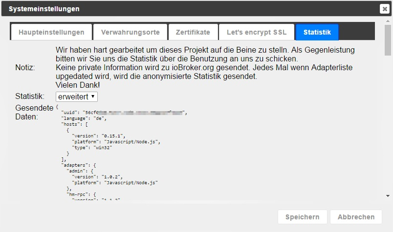

# The system settings
Basic parameters for ioBroker are set here.

## Main settings
### System language
you can choose between system languages: German, English, Russian

### Unit temperature
this value is used by some adapters. Possible is °C or °F.

### Currency
At the moment it doesn't use an adapter

### Date format
select how the date should be displayed in admin and vis.

### Delimiter
Comma or period for float values

### Default history instance
This SQL/History/InfluxDB adapter instance is used by default for flot and rickshaw (charts).

## Repositories or repositories

ioBroker can get the adapter list from different sources. The following sources are entered during installation:

* **default** - http://download.iobroker.net/sources-dist.json - Generated daily at 01:00 on the server.

Access is very fast, but the version information can be up to 24 hours old.

* **online** - https://raw.githubusercontent.com/ioBroker/ioBroker.js-controller/master/conf/sources-dist.json - Repository

is generated from an online source. Access may take a long time, this is the most current source

* **sources - conf/sources-dist.json** - Also generated automatically and also takes a long time but the links may be out of date (some adapters may be missing)

## Certificates

This is the central location for the certificates used for SSL/HTTPS communication. The certificates are used by admin, web, simple-api, socketio. Standard certificates are installed by default. You can't verify anything with that. They are only used for SSL communication. Because the certificates are open, you should use your own (self-signed) certificates, buy real certificates, or switch to Let's Encrypt. Communication with default certificates is not secure and if someone wants to read the traffic, this could be done. Be sure to install your own certificates. E.g. under [linux](http://guides.intertech.de/ssl_certificate_self.html).

## Let's Encrypt

Let's Encrypt is a free, automated, and open source _certificate authority_ from the independent Internet Security Research Group (ISRG).

More information about Let's Encrypt is available [here](https://letsencrypt.org/).

Some installations use Dynamic DNS or similar to reach their own domain via an address assigned from there. ioBroker supports the automatic request and renewal of certificates from the Let's Encrypt organization.

The option to use Let's Encrypt's free certificates exists in almost every adapter that can start a web server and supports HTTPS.

If you activate the option to use certificates, but not the automatic update, the corresponding instance tries to work with saved certificates.

If automatic updates are enabled, the instance tries to request certificates from Let's Encrypt and updates them automatically.

The certificates are requested for the first time when the corresponding address is called up for the first time. This means that if, for example, you configure "sub.domain.com" as an address and then call [https://sub.domain.com](https://sub.domain.com/), the certificates will be requested for the first time, which may take a while before the answer comes.

Issuing the certificates is a complex procedure, but if you follow the explanation below, it should be easy to get the free certificates.

**Method:**

1. A new account with the entered email address must be created (setup for this in the system settings)
2. A random key is generated as a password for the account.
3. When the account is created, the system will open a small website on port 80 to verify the address.
4. Let's encrypt **always** uses port **80** to check the address.
5. If port 80 is already being used by another service, point 4 applies - i.e. assign a different port to the other service!
6. When the small web server is started, the request for the certificates for the addresses specified in the system settings is sent to the Let's encrypt server.
7. The Let's Encrypt server sends back a challenge phrase in response to the request and after a while tries to read this challenge phrase at the address "http://yourdomain:80/.well-known/acme-challenge/".
8. When the server gets this challenge phrase back from our side, the Let's Encrypt server sends the certificates. These are saved in the directory that is entered in the system settings.

This sounds complex, but all you have to do is check a few checkboxes and enter the email address and web address in the system settings.

The certificates received are valid for approximately 90 days. After these certificates have been issued for the first time, another task is started that automatically extends the validity.

This topic is quite complex and thousands of things can go wrong. If that doesn't work, we recommend using the cloud adapter for access when you're on the go.

**Let's Encrypt only works with a node.js version >=4.5**

## Statistics

ioBroker admin sends the following information to download.iobroker.net:

<pre>{ &quot;uuid&quot;: &quot;56cf0d20-XXXX-YYYY-BBBB-66eec47ZZZZZ&quot;, &quot;language&quot;: &quot;de&quot;, &quot;hosts&quot;: [ { &quot;version&quot;: &quot;0.15.1&quot;, &quot;platform&quot;: &quot;Javascript/Node. js&quot;, &quot;type&quot;: &quot;win32&quot; } ], &quot;adapters&quot;: { &quot;admin&quot;: { &quot;version&quot;: &quot;1.0.2&quot;, &quot;platform&quot;: &quot;Javascript/Node.js&quot; }, &quot;hm-rpc &quot;: { &quot;version&quot;: &quot;1.1.2&quot;, &quot;platform&quot;: &quot;Javascript/Node.js&quot; } } }</pre>

This can be disabled by setting Statistics to "**none**".

However, the developers ask for this information:

<pre>We worked hard to get this project off the ground.
In return, we ask you to send us the usage statistics.
No private information is sent to ioBroker.org.
Each time the adapter list is updated, the anonymized statistics are also sent.
Thanks very much!</pre>