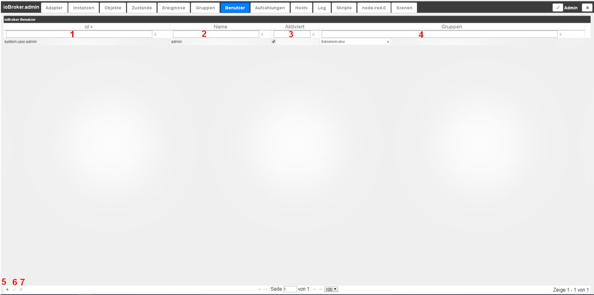

# The Users tab
Users can be created here. To do so, click on the (+) in the bottom left. The administrator is already created by default.

## The page content
The existing users are displayed in a table on the page. The fields in the column headers are used to filter the table according to your own criteria.

The table consists of the following columns:

### **1.) ID**
This is the unique name of each user, according to the structure system.user.username.

### **2.) Name**
The name of the user. This name can be freely chosen. This name must be unique.

### **3.) Activated**
This checkbox can be used to activate or deactivate the availability of a user.

### **4.) Groups**
The groups created in the **_Groups_** tab are displayed here. Users can be assigned to the corresponding groups using a checkbox.

### **5.) Create new user**
This icon can be used to create a new user, who must then be assigned to an existing group.

### **6.) Edit existing user**
After selecting an existing user in the list, you can use this icon to edit this user's data.

### **7.) Delete existing user**
An existing user can be deleted using the trash can icon; the existing groups will remain intact.