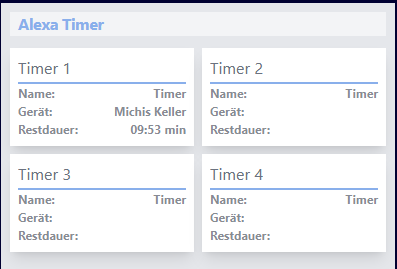

# ioBroker.alexa-timer-vis

**This adapter uses Sentry libraries to automatically report exceptions and code errors to the developers.** For more
details and instructions on disabling error reporting, please refer to
the [Sentry-Plugin Documentation](https://github.com/ioBroker/plugin-sentry#plugin-sentry)! Use of Sentry reporting
starts with js-controller 3.0.

## alexa-timer-vis adapter for ioBroker

This adapter uses Sentry libraries to automatically report exceptions and code errors to the developers. For more
details and for information how to disable the error reporting see Sentry-Plugin Documentation! Sentry reporting is used
starting with js-controller 3.0.

Output Alexa timer to display in the vis

**If you like it, please consider a donation:**

### This is an example of my vis

## Functionality

A timer or several by voice input, is created via Alexa, this is evaluated by the adapter and written in states in order
to make them visible in the Vis. So you have a better overview if you have several timers active at the same time.

- ---- Alexa2 Adapter is needed ----
- The Vis Widget isn´t yet integrated
- Every Timer has a button, to stop it. Stops the Timer in Alexa and in the Adapter
- Unlimited timers can be created with Alexa by voice command.
- On adapter start, 4 folders will be created with all states.
- Additional folders will be created as soon as a 5th and more timers are created via Alexa's voice input.

### Timer add ( Examples )

- Alexa, Timer 5 minutes
- Alexa, fries Timer 9 minutes
- Alexa, set a timer for 1 hour and 30 minutes
- Alexa, set a Timer for 2 hours
- Alexa, Timer for 120 minutes
- Alexa, Timer 9 minutes Spaghetti

### Timer delete ( Examples )

- Alexa, delete all Timers
- Alexa, delete fries Timer
- Alexa, delete 5 minutes Timer

### If you have any suggestions for improving something or adding other functions, feel free to contact us

## Changelog

<!--
	Placeholder for the next version (at the beginning of the line):
	### **WORK IN PROGRESS**
-->
### 3.0.3 (2026-06-12)

- FIX: #295 Extend timer
- CHORE: Update dependencies

### 3.0.2 (2026-05-30)

- CHORE: Repository checker
- FIX: #288 Stop timer

### 3.0.1 (2026-05-23)

- FIX: Update connection state to true when initializing AlexaTimer

### 3.0.0 (2026-05-23)

- (copilot) Adapter requires node.js >= 22 now
- CHORE: Update dependencies
- FIX: #270 Errors has no existing object 
- FEAT: Complete refactored with new logic, it should work with all languages which are supported by Alexa2 adapter
- Chore: Alexa2 adapter version >= 3.28.1

### 2.2.2 (2025-12-12)

- FIX: Errors reported by sentry

[Older changelogs can be found there](CHANGELOG_OLD.md)

## License

Copyright (c) 2021-2026 Michael Roling <michael.roling@gmx.de>

MIT License

Permission is hereby granted, free of charge, to any person obtaining a copy
of this software and associated documentation files (the "Software"), to deal
in the Software without restriction, including without limitation the rights
to use, copy, modify, merge, publish, distribute, sublicense, and/or sell
copies of the Software, and to permit persons to whom the Software is
furnished to do so, subject to the following conditions:

The above copyright notice and this permission notice shall be included in all
copies or substantial portions of the Software.

THE SOFTWARE IS PROVIDED "AS IS", WITHOUT WARRANTY OF ANY KIND, EXPRESS OR
IMPLIED, INCLUDING BUT NOT LIMITED TO THE WARRANTIES OF MERCHANTABILITY,
FITNESS FOR A PARTICULAR PURPOSE AND NONINFRINGEMENT. IN NO EVENT SHALL THE
AUTHORS OR COPYRIGHT HOLDERS BE LIABLE FOR ANY CLAIM, DAMAGES OR OTHER
LIABILITY, WHETHER IN AN ACTION OF CONTRACT, TORT OR OTHERWISE, ARISING FROM,
OUT OF OR IN CONNECTION WITH THE SOFTWARE OR THE USE OR OTHER DEALINGS IN THE
SOFTWARE.
