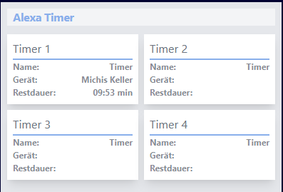

# ioBroker.alexa-timer-vis

**This adapter uses Sentry libraries to automatically report exceptions and code errors to the developers.** For more
details and instructions on disabling error reporting, please refer to
the [Sentry-Plugin Documentation](https://github.com/ioBroker/plugin-sentry#plugin-sentry)! Use of Sentry reporting
starts with js-controller 3.0.

## alexa-timer-vis adapter for ioBroker

This adapter uses Sentry libraries to automatically report exceptions and code errors to the developers. For more
details and for information how to disable the error reporting see Sentry-Plugin Documentation! Sentry reporting is used
starting with js-controller 3.0.

Output Alexa timer to display in the vis

**If you like it, please consider a donation:**

### This is an example of my vis

## Functionality

A timer or several by voice input, is created via Alexa, this is evaluated by the adapter and written in states in order
to make them visible in the Vis. So you have a better overview if you have several timers active at the same time.

- ---- Alexa2 Adapter is needed ----
- The Vis Widget isn´t yet integrated
- Every Timer has a button, to stop it. Stops the Timer in Alexa and in the Adapter
- Unlimited timers can be created with Alexa by voice command.
- When the adapter is started, 4 folders are created with all of the states.
- Additional folders will be created as soon as a 5th and more timers are created via Alexa's voice input.
- It works with German input

### Timer add ( Examples )

- Alexa, Timer 5 minutes
- Alexa, fries Timer 9 minutes
- Alexa, set a timer for 1 hour and 30 minutes
- Alexa, set a Timer for 2 hours
- Alexa, Timer for 120 minutes
- Alexa, Timer 9 minutes Spaghetti

### Timer delete ( Examples )

- Alexa, delete all Timers
- Alexa, delete fries Timer
- Alexa, delete 5 minutes Timer

### If you have any suggestions for improving something or adding other functions, feel free to contact us

## Changelog

<!--
	Placeholder for the next version (at the beginning of the line):
	### **WORK IN PROGRESS**
-->
### 2.2.2 (2025-12-12)

- FIX: Errors reported by sentry

### 2.2.1 (2025-12-11)

- FEAT: Add more information to sentry reports
- FIX: Errors reported by sentry

### 2.2.0 (2025-12-10)

- FIX: #246 Error in time reset
- FIX: Wrong objects created
- FEAT: Add initial timer state

### 2.1.3 (2025-11-28)

- CHORE: Update dependencies

### 2.1.2 (2025-08-13)

- FIX: Errors reported by sentry
- FIX: Add alarm clock to ignored words

### 2.1.1 (2025-04-28)

- FEAT: #141 Activate sentry

### 2.0.9 (2025-04-06)

- FEAT: Add more config
- CHORE: Update dependencies

### 2.0.8 (2024-12-04)

- CHORE: Update dependencies
- CHORE: Migration to ESLint 9 and @iobroker/eslint-config

### 2.0.7 (2024-11-19)

- FIX: #157 Add size attribute xl for text in jsonConfig
- FIX: #156 Error in decomposeInputValue

### 2.0.6 (2024-10-19)

- FEAT: #151 Responsive Design

### 2.0.5 (2024-09-26)

- FIX: #142 Timeout error
- FIX: #137 Reset timer name
- FEAT: Add json state

### 2.0.4 (2024-09-18)

- FIX: #132 Second timer button reset deletes timer one

### 2.0.3 (2024-09-13)

- FIX: #133 Timer names are not correct
- FIX: #134 All timer alive at start

### 2.0.2 (2024-09-12)

- FIX: #130 Sting_2 remains empty

### 2.0.1 (2024-09-10)

- FIX: #128 Timer creating error

### 2.0.0 (2024-09-08)

- FIX: #119 Error "has no existing object" on first start
- FEAT: Use Typescript
- FEAT: #118 get name from activeTimerList
- FIX: #117 createDevice is deprecated

### 1.0.0 (2024-08-09)

- Js-controller >=5.0.19 is required

### 0.3.0 (2023-12-23)

- FIX: #82 Delete Timer by Button
- FIX: #74 Start time
- FEAT: #71 Name of Echo in data tree
- FEAT: #75 Percent from 0% to 100%
- Breaking change: minimal supported node.js version is 16.x
- FEAT: #58 Another String Variation

### 0.2.0 (2023-07-27)

- create Timer with Alexa2 TextCommand, fixed
- lengthen and shorten timers

### 0.1.15 (22.09.2022)

- Include creation time to avoid creating duplicate timers

### 0.1.14 (17.07.2022)

- Added debouncing in the adapter configuration

### 0.0.13 (06.03.2022)

- Delete of Timers with the same value, fixed

### 0.1.12 (15.02.2022)

- Delete of Timer fixed

### 0.1.11 (12.02.2022)

- Delete of Timer with same Inputvalue, fixed
- User can set the Intervall in admin

### 0.1.9 (30.1.2022)

- Bugfix

### 0.1.8 (28.01.2022)

- Bugfix
- Button added to stop the Timer

### 0.1.7 (22.06.2022)

- New State, "Input Device"

### 0.1.6 (17.01.2022)

- numbers from 1-9 are always displayed as two digits, 1 => 01
- When you update to this or a newer Version, please delete the timer folders or delete the whole adapter, otherwise
  errors will occur

### 0.1.5 (08.01.2022)

- New keywords added

### 0.1.4 (05.01.2022)

- States will be reset on adapter unload
- Bugfix

### 0.1.3 (02.01.2022)

- Start and EndTime added

### 0.1.2 (31.12.2021)

- Bugfix (A double created Intervall, fixed)

### 0.1.1 (29.12.2021)

- Adaptation to the English language (experimental)
- Anpassung an die Englische Sprache (experimentell)

### 0.1.0 (28.12.021)

- Fixed bug when deleting intervals and timeouts after shutdown
- Fehler beim Löschen von Intervallen und Timeouts nach dem Shutdown, behoben

### 0.0.4 (27.12.2021)

- Adaptation to various options for entering a timer
- Anpassung an verschiedener Möglichkeiten der Eingabe eines Timers

### 0.0.3 (26.12.2021)

- Bugfix

### 0.0.2 (26.12.2021)

- Bugfix

### 0.0.1 (25.12.2021)

- initial release

## License

Copyright (c) 2021-2026 Michael Roling <michael.roling@gmx.de>

MIT License

Permission is hereby granted, free of charge, to any person obtaining a copy
of this software and associated documentation files (the "Software"), to deal
in the Software without restriction, including without limitation the rights
to use, copy, modify, merge, publish, distribute, sublicense, and/or sell
copies of the Software, and to permit persons to whom the Software is
furnished to do so, subject to the following conditions:

The above copyright notice and this permission notice shall be included in all
copies or substantial portions of the Software.

THE SOFTWARE IS PROVIDED "AS IS", WITHOUT WARRANTY OF ANY KIND, EXPRESS OR
IMPLIED, INCLUDING BUT NOT LIMITED TO THE WARRANTIES OF MERCHANTABILITY,
FITNESS FOR A PARTICULAR PURPOSE AND NONINFRINGEMENT. IN NO EVENT SHALL THE
AUTHORS OR COPYRIGHT HOLDERS BE LIABLE FOR ANY CLAIM, DAMAGES OR OTHER
LIABILITY, WHETHER IN AN ACTION OF CONTRACT, TORT OR OTHERWISE, ARISING FROM,
OUT OF OR IN CONNECTION WITH THE SOFTWARE OR THE USE OR OTHER DEALINGS IN THE
SOFTWARE.
