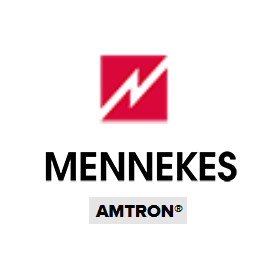

# ioBroker.amtronwallbox

 

**This adapter uses Sentry libraries to automatically report exceptions and code errors to the developers.** 
For more details and for information how to disable the error reporting see [Sentry-Plugin Documentation](https://github.com/ioBroker/plugin-sentry#plugin-sentry)! Sentry reporting is used starting with js-controller 3.0.

**If you like it, please consider a donation:**
                                                                          
 

The adapter serves as an interface to various [Amtron wallboxes](https://www.mennekes.de/emobility/produkte/amtron-wallboxen/). The data provided by the box is read out and made available as a data point in the adapter. 
The data is only processed locally, a cloud connection is not necessary. For wallboxes that also support write access, the adapter can write data (e.g. charging current).
The following Amtron wallboxes are supported:
* Amtron Xtra
* Amtron ChargeControl
* Amtron Compact

The adapter can manage multiple boxes.

## Configuration
Only the type of box, its IP address and, if necessary, an API key need to be configured.

Note: Since the boxes have different interfaces, it may be that not all interfaces work directly. In this case please contact the developer. 

## known issues
* please create issues at [github](https://github.com/rg-engineering/ioBroker.amtronwallbox/issues) if you find bugs or whish new features.
   
## Changelog

<!--
  Placeholder for the next version (at the beginning of the line):
  ### **WORK IN PROGRESS**
-->
### 0.3.5 (2025-10-26)
* (René) bug fix sentry

### 0.3.4 (2025-10-21)
* (René) update dependencies + changes based on adapter checker

### 0.3.3 (2025-10-04)
* (René) update dependencies + changes based on adapter checker

### 0.3.2 (2025-06-28)
* (René) update dependencies
* (René) new testing

### 0.3.1 (2025-02-27)
* (René) changes requested by adapter checker
* (René) dependencies updated

### 0.3.0 (2024-12-17)
* (René) see issue #284: test with nodejs@22
* (René) update dependencies
* (René) migration to jsonConfig

### 0.2.16 (2024-08-24)
* (René) update dependencies
* (René) bug fixes based on adapter checker recommendation

### 0.2.15 (2024-05-28)
* (René) change of dependencies
* (René) show cron job in log after creation

### 0.2.14 (2024-01-12)
* (René) dependencies updated

### 0.2.13 (2023-12-23)
* (René) just a sentry test

### 0.2.12 (2023-12-23)
* (René) see issue #162: ignore unused data from wallbox

### 0.2.11 (2023-12-16)
* (René) type of adapter changed back to "energy"

### 0.2.9 (2023-12-16)
* (René) dependencies updated

### 0.2.8 (2023-11-26)
* (René) role of states overworked

### 0.2.7 (2023-11-19)
* (René) dependencies updated

### 0.2.6 (2023-09-23)
* (René) bug fix for reported exceptions by sentry

### 0.2.5 (2023-08-27)
* (René) smaller bug fixes, see issue #59

### 0.2.4 (2023-07-30)
* (René) dependencies updated

### 0.2.3 (2023-06-01)
* (René) some changes to fullfill requirements to bring the adapter to latest

### 0.2.2 (2023-04-07)
* (René) dependencies updated

### 0.2.0 (2023-01-31)
* (René) see issue #1: write data to XTRA wallbox (experimentel)

### 0.1.0 (2022-12-18)
* (René) see issue #1: support of XTRA

### 0.0.3 (2022-08-18)
* (René) some bug fixes
* (René) change to cron
* (René) update of dependencies

### 0.0.1 (2022-05-19)
* (René) initial release

## License
MIT License

Copyright (c) 2022-2025 René G. <info@rg-engineering.eu>

Permission is hereby granted, free of charge, to any person obtaining a copy
of this software and associated documentation files (the "Software"), to deal
in the Software without restriction, including without limitation the rights
to use, copy, modify, merge, publish, distribute, sublicense, and/or sell
copies of the Software, and to permit persons to whom the Software is
furnished to do so, subject to the following conditions:

The above copyright notice and this permission notice shall be included in all
copies or substantial portions of the Software.

THE SOFTWARE IS PROVIDED "AS IS", WITHOUT WARRANTY OF ANY KIND, EXPRESS OR
IMPLIED, INCLUDING BUT NOT LIMITED TO THE WARRANTIES OF MERCHANTABILITY,
FITNESS FOR A PARTICULAR PURPOSE AND NONINFRINGEMENT. IN NO EVENT SHALL THE
AUTHORS OR COPYRIGHT HOLDERS BE LIABLE FOR ANY CLAIM, DAMAGES OR OTHER
LIABILITY, WHETHER IN AN ACTION OF CONTRACT, TORT OR OTHERWISE, ARISING FROM,
OUT OF OR IN CONNECTION WITH THE SOFTWARE OR THE USE OR OTHER DEALINGS IN THE
SOFTWARE.
