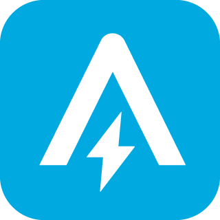

# ioBroker.ankersolix2

**Tests:** 

## ankersolix2 adapter for ioBroker

Integrate Anker Solix 2

## Description

This project is derived from https://github.com/tomquist/solix2mqtt and brings information from the anker api directly into ioBroker.

## Supported Devices

I don't have every [Anker hardware](https://www.ankersolix.com/) available for testing. I can only list the hardware, i have tested. It is possible that all other [Anker hardware](https://www.ankersolix.com/) is also compatible

| Device       | Description                                                                                                                                   |
| ------------ | --------------------------------------------------------------------------------------------------------------------------------------------- |
| `Solarbank`  | - A17C0: Solarbank E1600 (Gen 1) - A17C1: Solarbank 2 E1600 Pro - A17C3: Solarbank 2 E1600 Plus  - A17C5: Solarbank 3 E2700 Plus  |
| `Smartmeter` | - A17X7: Anker 3 Phase Wifi Smart Meter - SHEM3: Shelly 3EM Smart Meter - SHEMP3: Shelly 3EM Pro Smart Meter                            |

## Important Change

If your updating from v1.x to 2.x, you have to reinsert your password again! If you dont do this, you will lock your account!!!

## Config

1. ~~Create a familie-account in anker app and add it to your main-account~~ Since end of july 2025, you can use the same account in app and adapter.
2. install the adapter
3. go to adapter setting and set your credentials
4. at first time, pleas use a high poll time (180sec), so you have enought time to stop the adapter if everything goes wrong.
   Normally you can see in logfile that you have an site_id and you got the message: Published.

## Control with Adapter

1. You need to login in your admin account
2. go to adapter settings, tab control and activet the control
3. select you site id witch you want control.
4. Control Opitons
   4.1. select a datapoint witch you want use to control. It can be a manuel data point witch set by a script or you a smartmeter data point. (Important: it must be a numerical value)
   4.2. you can set a custom powerplan, if you to trigger the powerplan again, you can control is the datapoint ankersolix2.x.control.SetPowerplan (set true and ack)
   4.3. you can enable ac loading. If its enabled, you can control it with the datapoint ankersolix2.x.control.ACLoading\ (set true and ack = activ (time now + 12h), set false and ack = inactiv, userdefine powerplan will select)
5. click save and restart adapter

Note: The adapter overwrites the settings in the app. If you want to use the app again, you must deactivate the adapter or the control function.

## Helps

If you have errors like 401, than please check you credentials.
If you have erros again and cant login, stop the adapter and delete the session.data under the iobroker-data/ankersolix2.0 (e.g. /opt/iobroker/iobroker-data/ankersolix2/), after this start adapter again.

## Doku

- de: [zur Dokumentation](docs/de/README.md)
- en: [for documentation](docs/en/README.md)

## You want to support me?

## Changelog

<!--
    Placeholder for the next version (at the beginning of the line):
    ### **WORK IN PROGRESS**
-->
### 2.4.0 (2025-09-20)

- (ronny130286) add timeplan (schedule) and userdefine energyplan
- (ronny130286) add Powerplan and AC Loading (for AC devices)

### 2.3.0 (2025-08-16)

- (ronny130286) you can use now same account in app and adapter
- (ronny130286) now you can control the solarbank with adapter (if you use adminaccount)

### 2.2.0 (2025-06-30)

- (ronny130286) battery types and number are adjustable in the instance

### 2.1.2 (2025-05-28)

- (ronny130286) fix for Solix 3

### 2.1.1 (2025-05-15)

- (ronny130286) bugfix

### 2.1.0 (2025-04-17)

- (ronny130286) reorganized analysis option (now selectable in adminconsole)
- (ronny130286) add battery energy to solix devices
- (ronny130286) update packages

### 2.0.0 (2025-03-09)

- (ronny130286) update packages
- (ronny130286) decrypt password in adminui
- (ronny130286) add more language codes
- (ronny130286) reorganized some DP

### 1.1.0 (2025-02-08)

- (ronny130286) add analysis data for week/day
- (ronny130286) update packages

### 1.0.3 (2024-12-06)

- (ronny130286) edit refreshtimer
- (ronny130286) add to repo

### 1.0.2 (2024-12-04)

- (ronny130286) bugfix

### 1.0.1 (2024-12-01)

- (ronny130286) ESLint 9.x

### 1.0.0 (2024-11-29)

- (ronny130286) stable release
- (ronny130286) fixed backup_info object

### 0.1.0-beta.0 (2024-10-02)

- (ronny130286) beta release

### 0.0.3-alpha.0 (2024-09-25)

- (ronny130286) fix session.data
- (ronny130286) npm release

### 0.0.2-alpha.0 (2024-09-20)

- (ronny130286) initial release

## License

MIT License

Copyright (c) 2025 ronny130286 <ronnymatthei@gmx.de>

Permission is hereby granted, free of charge, to any person obtaining a copy
of this software and associated documentation files (the "Software"), to deal
in the Software without restriction, including without limitation the rights
to use, copy, modify, merge, publish, distribute, sublicense, and/or sell
copies of the Software, and to permit persons to whom the Software is
furnished to do so, subject to the following conditions:

The above copyright notice and this permission notice shall be included in all
copies or substantial portions of the Software.

THE SOFTWARE IS PROVIDED "AS IS", WITHOUT WARRANTY OF ANY KIND, EXPRESS OR
IMPLIED, INCLUDING BUT NOT LIMITED TO THE WARRANTIES OF MERCHANTABILITY,
FITNESS FOR A PARTICULAR PURPOSE AND NONINFRINGEMENT. IN NO EVENT SHALL THE
AUTHORS OR COPYRIGHT HOLDERS BE LIABLE FOR ANY CLAIM, DAMAGES OR OTHER
LIABILITY, WHETHER IN AN ACTION OF CONTRACT, TORT OR OTHERWISE, ARISING FROM,
OUT OF OR IN CONNECTION WITH THE SOFTWARE OR THE USE OR OTHER DEALINGS IN THE
SOFTWARE.

## Acknowledgements
