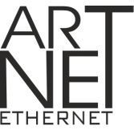

# ioBroker.artnet-recorder

## artnet-recorder adapter for ioBroker

Record Art-Net data to a file for later playback

## Purpose

Simple adapter to record Art-Net data which is sent by broadcast to a json file located in user data.
Record only the change in the DMX values.
Playback sends the data as is with the timing stored in the json file.
When merge-mode is LTP or HTP the server listens to all ArtDMX packets sent through the network
and tries to have a actual DMX data image to add the stored values.
The interval or the stepping to send the data ist set by the configuartion.

## Changelog

<!--
    Placeholder for the next version (at the beginning of the line):
    ### **WORK IN PROGRESS**
-->
### 0.0.5 (2023-12-25)
* (Bannsaenger) added releaseconfig

### 0.0.4 (2023-12-21)
* (Bannsaenger) updated dependencies
* (Bannsaenger) switched to release script
* (Bannsaenger) switched to json-config

### 0.0.3
* (Bannsaenger) fixed comments from code review

### 0.0.2
* (Bannsaenger) added engine and prepared for review

### 0.0.1
* (Bannsaenger) initial release

## License
MIT License

Copyright (c) 2021-2023 Bannsaenger <bannsaenger@gmx.de>

Permission is hereby granted, free of charge, to any person obtaining a copy
of this software and associated documentation files (the "Software"), to deal
in the Software without restriction, including without limitation the rights
to use, copy, modify, merge, publish, distribute, sublicense, and/or sell
copies of the Software, and to permit persons to whom the Software is
furnished to do so, subject to the following conditions:

The above copyright notice and this permission notice shall be included in all
copies or substantial portions of the Software.

THE SOFTWARE IS PROVIDED "AS IS", WITHOUT WARRANTY OF ANY KIND, EXPRESS OR
IMPLIED, INCLUDING BUT NOT LIMITED TO THE WARRANTIES OF MERCHANTABILITY,
FITNESS FOR A PARTICULAR PURPOSE AND NONINFRINGEMENT. IN NO EVENT SHALL THE
AUTHORS OR COPYRIGHT HOLDERS BE LIABLE FOR ANY CLAIM, DAMAGES OR OTHER
LIABILITY, WHETHER IN AN ACTION OF CONTRACT, TORT OR OTHERWISE, ARISING FROM,
OUT OF OR IN CONNECTION WITH THE SOFTWARE OR THE USE OR OTHER DEALINGS IN THE
SOFTWARE.

Credit:
 [Art-Net™ Designed by and Copyright Artistic Licence Holdings Ltd](https://art-net.org.uk)