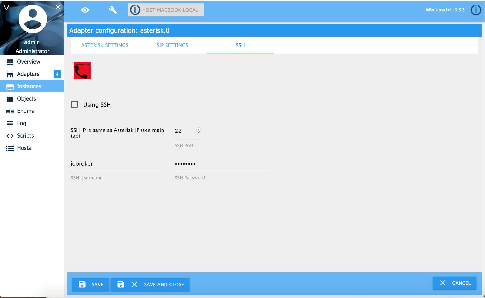
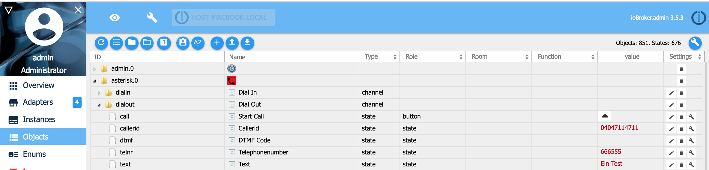
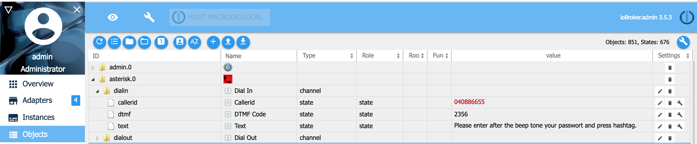

# ioBroker Asterisk VoIP Adapter

[](https://travis-ci.org/schmupu/ioBroker.asterisk)
[](https://ci.appveyor.com/project/schmupu/ioBroker-asterisk/)
  [](https://www.npmjs.com/package/iobroker.asterisk)
[](https://www.npmjs.com/package/iobroker.asterisk)

[](https://nodei.co/npm/iobroker.asterisk/)

[German manual / Deutsche Anleitung](README_DE.md)

The Asterisk adapter converts text messages to audio files and calls then over Asterisk by VoIP any telephone number you want and plays the audio message.

## Install / Configurations

Asterisk has to connect for outgoing calls with your voip provider like Telekom or Vodfone or with your FritzBox! Please follow one
of these installation guides.

### Linux Packages / ioBroker & asterisk running on same server with ffmpeg

```sh
sudo apt-get install ffmpeg
# if asterisk package is missing, follow the instructions "Install asterisk manual"
sudo apt-get install asterisk
```

### Linux Packages / ioBroker & asterisk running on same server with sox

If you have problems with transcoding with ffmpeg you can choose sox as transcoder. For that, you have to install following packages and choose sox in the adapter configuration.

```sh
sudo apt-get install lame
sudo apt-get install sox
sudo apt-get install libsox-fmt-mp3
# if asterisk package is missing, follow the instructions "Install asterisk manual"
sudo apt-get install asterisk
```

### Linux Packages / ioBroker & asterisk running on different server with ffmpeg

```sh
# ioBroker server
sudo apt-get install ffmpeg
sudo apt install openssh-client
```

```sh
# asterisk server
# if asterisk package is missing, follow the instructions "Install asterisk manual"
sudo apt-get install asterisk
sudo apt-get install openssh-server
```

### Linux Packages / ioBroker & asterisk running on different server with sox

If you have problems with transcoding with ffmpeg you can choose sox as transcoder. For that, you have to install following packages and choose sox in the adapter configuration.

```sh
sudo apt-get install lame
sudo apt-get install sox
sudo apt-get install libsox-fmt-mp3
```

```sh
# asterisk server
# if asterisk package is missing, follow the instructions "Install asterisk manual"
sudo apt-get install asterisk
sudo apt-get install openssh-server
```

### Install asterix manual

if the apt package asterisk is missing, you can install asterisk manual:

```sh
sudo apt install git vim curl wget libnewt-dev libssl-dev libncurses5-dev subversion libsqlite3-dev build-essential libjansson-dev libxml2-dev uuid-dev

cd /usr/src/
sudo wget https://downloads.asterisk.org/pub/telephony/asterisk/old-releases/asterisk-16.30.1.tar.gz
sudo tar xvf asterisk-16*.tar.gz
cd asterisk-16*/
sudo contrib/scripts/get_mp3_source.sh
sudo contrib/scripts/install_prereq install
sudo ./configure
sudo make menuselect

# Choose following packages in the menu:
## Add-ons: chan_ooh323 & format_mp3
## Core Sound Packages: Audio packets CORE-SOUNDS-EN-*
## Music On Hold: MOH-OPSOUND-WAV bis MOH-G729
## Extra Sound: EXTRA-SOUNDS-EN-WAV bis EXTRA-SOUNDS-EN-G729
## Applications: app_macro
## Exit with "Save&Exit".

sudo make
sudo make install
sudo make progdocs # (optional documentation)
sudo make samples
sudo make config
sudo ldconfig

sudo groupadd asterisk
sudo useradd -r -d /var/lib/asterisk -g asterisk asterisk
sudo usermod -aG audio,dialout asterisk
sudo chown -R asterisk:asterisk /etc/asterisk
sudo chown -R asterisk:asterisk /var/{lib,log,spool}/asterisk
sudo chown -R asterisk:asterisk /usr/lib/asterisk

# asterisk as default user for asterisk
sudo nano /etc/default/asterisk
AST_USER="asterisk"
AST_GROUP="asterisk"

# Insert/ replae follwoing in the config file /etc/asterisk/asterisk.conf
sudo nano /etc/asterisk/asterisk.conf
runuser = asterisk ; The user to run as.
rungroup = asterisk ; The group to run as

sudo ufw allow proto tcp from any to any port 5060,5061 # (optional open Firewall, if activ)

sudo systemctl restart asterisk
sudo systemctl enable asterisk

# Check state of asterisk
sudo systemctl status asterisk
sudo asterisk -rvv
```

### Configuration of asterisk

The following documents describe detailed how to configure asterisk.

- Configuration [Asterisk via SIP with the FritzBox](docs/SIP_FRITZBOX.md) (the easiest way)
- Configuration [Asterisk via PJSIP with the FriztBox](docs/PJSIP_FRITZBOX.md) (pjsip is more modern as sip)
- Configuration [Asterisk via PJSIP with Telekom as provider](docs/PJSIP_TELEKOM.md)
- Configuration [Asterisk via PJSIP with Sipgate as provider](docs/PJSIP_SIPGATE.md)

### Configuration using SSH

If iobroker and asterisk is installed on differnet user, you need on the asterisk server an user with access from the iobroker server to login by ssh.
The user must have the unix user rights to write files which can read by asterisk.
You create on the asterisk server the directory with the name you configured in the iobroker asterisk adapter configuration under the name _'Path for temporary audio files'_. The path must be accessible and authorized for asterisk and ssh, because iobroker sends the generated audiofile (your text message), by scp to the asterisk server and save it in the 'Path for temporary audio files'.
After that ioBroker will send by the AMI api a message to asterisk to dial an play the generated audiofile saved in the given path.



## Using Asterisk

### Using Asterisk with objects / states for dialing out

The easiest way to use asterisk is through the ioBroker objects page. There, fill the following values under dialout parameter:

- call: push button to initiate a call
- callerid: telephonenumber which will be shown the callee
- dtmf: the callee pressed numbers on the keypad
- telnr: the number to be dialed
- text: the text that will be played to the callee
- language: text will be converted to audio in this language



### Using Asterisk with objects / states for dialing in

If you configured your SIP Provider (for example Fritzbox, Sipgate, ...) and the Asterisk Configuration to allow dialin calls you can set following parameter

- callerid: telephonenumber which called asteriks
- dtmf: callers pressed numbers on the keypad
- text: the text that will be played to the caller
- language: text will be converted to audio in this language



### Using Asterisk with javascript or blocky for dialing out

Now you can use the adapter in your javascript or blocky programms.

```sh
const number   = '040 666-7766';
const callerid = '040 123 999'; // optional, if not set anonymous call
const msg      = 'Hello, this textmessage will be converted to audio';

// call telephone nummber 040 666-7766 and play text message as audio
sendTo('asterisk.0', 'dial', { telnr: number, callerid: callerid, text:  msg},  (res) => {
      console.log(`Result: ${JSON.stringify(res)}`);
});

// call telephone nummber 040 666-7766 and play mp3 audio file
// mp3 file has to exist on asterix server
sendTo('asterisk.0', 'dial', { telnr: number, callerid: callerid, aufiofile: '/tmp/audio.mp3'},  (res) => {
      console.log(`Result: ${JSON.stringify(res)}`);
});

// call telephone nummber 040 666-7766 and play gsm audio file
// gsm file has to exist on asterix server
sendTo('asterisk.0', 'dial', { telnr: number, callerid: callerid, aufiofile: '/tmp/audio.gsm'},  (res) => {
      console.log(`Result: ${JSON.stringify(res)}`);
});

// create dial in message
sendTo('asterisk.0', 'dial', { text:  'Please enter PIN after hashtag.' },  (res) => {
      console.log(`Result: ${JSON.stringify(res)}`);
});

// Show entered DTMF code
on({ id: 'asterisk.0.dialin.dtmf'/*DTMF Code*/ },  (obj) => {
    const dtmf = obj.state.val;
    console.log(`DTMF: ${dtmf}`);
});

// Show entered DTMF code
on({ id: 'asterisk.0.dialout.dtmf'/*DTMF Code*/ },  (obj) => {
    const dtmf = obj.state.val;
    console.log(`DTMF: ${dtmf}`);
});

```

> You can use following parameter in the sendTo dial statement:
>
> - **language:** language take for text to speech (tts) function. (allowed values: 'DE', 'EN', ... Default is the ioBroker system language)
> - **repeat:** how many times shall the audio message repeated (allowed values 1 to n, default 5)
> - **priority:** if you send parallel many sendTo dial statements, the messages with a smallest priority will be send first (allowed values 1 to n, default 1)
> - **text:** text message that will be send as audio
> - **timeout:** Timeout in milliseconds waiting for connection to be happen (defaults to 60000 ms)
> - **async:** Allows multiple calls to be generated without waiting for a response (allowed values: false/true, default false)
> - **audiofile:** if you using the text parameter. The converted text to audio will be saved in audiofile. If the audiofile exist, it will be overwritten. If you do not use the parameter text, the audiofile will be played.
> - **callerid:** Defines the identifier (your sender telephone number) . If callerid is missing the transferred telephone number will be anonymous
> - **telnr:** telephone number to dial.

## Resolving problems

If you have problems with asterisk, you can try to find something in the logfiles under /var/log/asterisk. After you started asterisk you can call asterisk with asterisk -rvvvvvv on the comand shell for debugging. After you started asterisk -rvvvvvv you can initialize a call by iobroker and see what happens.

## Changelog

### **WORK IN PROGRESS**

- (Stübi) Bugfixing in sendto function
- (Stübi) Add Object repeat
- (Stübi) Fixing @iobroker/adapter-dev 1.0.1 specified. 1.3.0 is required as minimum, 1.3.0 is recommended (Issue #57)
- (Stübi) Fixing dependency (Issue #58)

### 2.0.2 (2025-02-01)

- (Stübi) Add Create Directory
- (Stübi) Add translation for configuration
- (Stübi) Bugfixing

### 2.0.1 (2025-01-24)

- (Stübi) Fix error by using asterisk and iobroker on the same server
- (Stübi) Add action command for send messages
- (Stübi) Add dial in command for send messages
- (Stübi) Add create butteon for create dial in file

### 2.0.0 (2025-01-24)

- (Stübi) Redesign of Asterisk
- (Stübi) Switching from Javascript to Typescript
- (Stübi) Nodes 20 and 22 are now supported
- (Stübi) js controllers in versions 6 and 7 are supported
- (Stübi) Attention: Passwords must be re-entered from this version!
- (Stübi) Language object added
- (Stübi) Revision of the reconnect if Asterisk is restarted once
- (Stübi) Fixing errors from repository checker (Issue #51)
- (Stübi) Add documentation how to install asterisk manual (Issue #33)

### 1.0.6 ((2019-02-27)

- (Stübi) Update documentation and templates
- (Stübi) Asterisk adapter can create now asterisk configuration files. You have to rename and move them afterwards to the /etc/asterisk directory
- (Stübi) a new documentation for using Sipgate as provide.
- (Stübi) Now you can call internal fritzbox numbers. You must change your extensions.ael if you install the version 1.0.4! (replace **10 => { ... }** with **\_. => { ... }**)
- (Stübi) You can install asterisk on a different server and use scp to transfer audio files from ioBroker to asterisk.
- (Stübi) You can use the service PJSIP instead of SIP now.
- (Stübi) Support js-controller compact mode
- (Stübi) Calling without extension, if you do not use the fritzbox for example (leave sip.conf username in adapter config empty)
- (Stübi) Instead of ffmpeg you can use now sox too
- (Stübi) Update with languages
- (Stübi) Add Callerid to dialin states
- (Stübi) A lot of new features. Now you can call ioBroker / Asterisk by telephone number and enter a DTMF Code.
- (Stübi) You can enter a DTMF Code if you get called by ioBroker / Asterisk
- (Stübi) Bugfixing and password will be saved encrypted and text message size can be unlimited
- (Stübi) First Version

## License

The MIT License (MIT)

Copyright (c) 2025 Thorsten Stueben <thorsten@stueben.de> / <https://github.com/schmupu>

Permission is hereby granted, free of charge, to any person obtaining a copy
of this software and associated documentation files (the "Software"), to deal
in the Software without restriction, including without limitation the rights
to use, copy, modify, merge, publish, distribute, sublicense, and/or sell
copies of the Software, and to permit persons to whom the Software is
furnished to do so, subject to the following conditions:

The above copyright notice and this permission notice shall be included in
all copies or substantial portions of the Software.

THE SOFTWARE IS PROVIDED "AS IS", WITHOUT WARRANTY OF ANY KIND, EXPRESS OR
IMPLIED, INCLUDING BUT NOT LIMITED TO THE WARRANTIES OF MERCHANTABILITY,
FITNESS FOR A PARTICULAR PURPOSE AND NONINFRINGEMENT. IN NO EVENT SHALL THE
AUTHORS OR COPYRIGHT HOLDERS BE LIABLE FOR ANY CLAIM, DAMAGES OR OTHER
LIABILITY, WHETHER IN AN ACTION OF CONTRACT, TORT OR OTHERWISE, ARISING FROM,
OUT OF OR IN CONNECTION WITH THE SOFTWARE OR THE USE OR OTHER DEALINGS IN
THE SOFTWARE.
