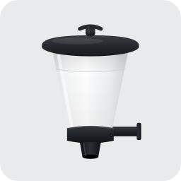

# ioBroker.automatic-feeder

**Tests:** 

---

  

---

> ### 🔌 Matching hardware — the **Feeder-Relais** timer board
>
> Building a feeder and would rather drop in a ready-made timer board than wire up your own relay? Take a look at the **[Feeder-Relais (Timer-Ersatzplatine)](https://github.com/ssbingo/timer-ersatzplatine)** — a self-build ESP32 timer board that pairs perfectly with this adapter ([online overview](https://ssbingo.github.io/timer-ersatzplatine/)).
>
> **It is a separate, standalone project — independent of the adapter.** The board and this adapter correspond with each other, but the two are completely independent of one another: the adapter works fully without the board, and the board works without the adapter.

---

## automatic-feeder adapter for ioBroker

This adapter turns any existing ioBroker switch (a smart plug, a relay, a GPIO output …) into a
scheduled **automatic feeder**. It switches the output on for a defined number of seconds at the
times you configure, and can take temperature and the day/night cycle into account so it never
feeds at the wrong moment.

This document is a complete manual. If you have never used the adapter before, read it from top
to bottom – the **Quick start** gets you to your first feeding in a few minutes, the rest
explains every option in detail.

> 🇩🇪 Deutsche Anleitung: [doc/de/README.md](doc/de/README.md) · other languages: see
> [Documentation](#documentation) at the bottom.

---

## Table of contents

1. [What the adapter does](#1-what-the-adapter-does)
2. [Requirements](#2-requirements)
3. [Installation](#3-installation)
4. [Quick start](#4-quick-start--your-first-feeding)
5. [The settings page in detail](#5-the-settings-page-in-detail)
6. [Objects / data points](#6-objects--data-points)
7. [Examples / recipes](#7-examples--recipes)
8. [Telegram notifications](#8-telegram-notifications)
9. [Troubleshooting & FAQ](#9-troubleshooting--faq)
10. [Logging & debugging](#10-logging--debugging)
11. [Dynamic feeding — background & sources](#11-dynamic-feeding--background--sources)

---

## 1. What the adapter does

A "feeding" is simply: **switch an output ON → wait a configurable number of seconds → switch it
OFF again**. For a converted feeder the running motor during those seconds dispenses the food.

The adapter can manage **up to 5 switches**, each completely independent and each with its own
configuration tab named after the switch. Per switch you decide:

* **when** it feeds – either at **fixed times** (e.g. 08:00 and 18:00) or in an **interval**
  inside a time window (e.g. every 60 minutes between 08:00 and 18:00);
* **how long** the output stays on (feeding duration in seconds);
* **whether to block** feeding when the water or air temperature is too low/high;
* **whether to restrict** feeding to the astronomical day window (sunrise/sunset with per-switch
  offsets, from a system, shared or per-switch location);
* **whether to supervise** the switch (check that it really turned on and off) and optionally
  send a **Telegram** message about the result;
* **whether to reduce or pause** feeding during a recurring **winter** season – optionally with
  Telegram reminders before it starts and ends;
* **whether to adapt** the interval and the portion to the water/air temperature automatically
  (**dynamic feeding**, Q10 model);
* **whether to block** feeding when the dissolved **oxygen** (O₂) is too low;
* **up to 3 one-off feeding pauses** (absolute date-time periods, e.g. a quarantine after
  restocking) with a **Telegram** message at the start and end of each;
* a **master pause switch** (*Suspend feeding now*) that instantly suspends **all** feeding
  for a switch until you turn it off again, with a **Telegram** message on each toggle.

You can also trigger a feeding **manually** at any time – from the adapter's settings page
(button with a freely selectable duration) or from a data point (e.g. a button in a VIS view).

Optionally, the adapter integrates the **Automatic-Feeder relay board** (an ESP32 with three
timer buttons and its own web interface). You decide **per switch** whether it uses such a board;
when you enable it for a switch in the general settings, that switch gains a **Relay** tab where
you set the board's network address, test the connection and configure its three button feeding
times (S1–S3) directly from the adapter.

> Important: the adapter never creates the switch itself. It **controls an object that already
> exists** in your ioBroker system. You select that object in the configuration.

---

## 2. Requirements

| You need | Details |
|----------|---------|
| **ioBroker** with **admin ≥ 7.8.23**, **js-controller ≥ 6.0.11** and **Node.js ≥ 22** | Required minimum versions. The configuration page is built with React 19. |
| **A switch object** | Any writable ioBroker state that turns your feeder on/off – e.g. a smart plug (`shelly.0.…`, `sonoff.0.…`, `zigbee.0.…`), a relay, a script variable. |
| *(optional)* **Geo-coordinates** | Used to calculate sunrise/sunset for the per-switch **astronomical window**. Only needed if a switch uses that window; taken from the ioBroker system settings, one shared position, or configured per switch. |
| *(optional)* Temperature objects | Existing states with air and/or water temperature, for temperature blocking or dynamic feeding. Assigned **per switch** on the switch tab. |
| *(optional)* **Oxygen (O₂)** objects | Existing states with the dissolved oxygen, to block feeding when it drops too low. Assigned **per switch**. |
| *(optional)* A **Telegram** instance | The official `telegram` adapter, configured and running, if you want push notifications. |
| Internet access on the ioBroker host | Only for the address search / map in the configuration. Normal operation works offline. |

---

## 3. Installation

1. In the ioBroker **admin**, open the **Adapters** tab.
2. Find **automatic-feeder** in the list and click **Install**.
3. Create an **instance** of the adapter.
4. Open the instance settings (the gear icon) – you should see the configuration page with the
   **General settings** tab. If it stays blank, see [Troubleshooting](#9-troubleshooting--faq).

---

## 4. Quick start – your first feeding

The goal: make one switch feed for 5 seconds, right now, to prove everything works.

1. **Open the settings** of the automatic-feeder instance.
2. On the **General settings** tab:
   * Under **Location**, leave *Use system settings for all switches* selected (only relevant if
     you later enable the astronomical window). You can also pick a shared location or configure
     it per switch.
   * Scroll down to **Switches** and click **Add switch**.
   * Give it a **Name** (e.g. `Koi pond`). This name becomes the title of its own tab.
   * Click the list icon next to **Switch object** and choose the state that switches your
     feeder (e.g. your smart plug). Make sure the switch is **Active** (checkbox on the left).
3. **Save** (the disk/checkmark at the bottom). A new tab named after your switch appears.
4. Open that **switch tab**. At the top under **Manual feeding**, set a duration (e.g. `5`
   seconds) and click **Feed now**. The output should turn on for 5 seconds and off again.
5. Still on the switch tab, set up the real schedule under **Feeding schedule** (e.g. fixed
   times 08:00 and 18:00) and the **Feeding duration** under **Feeding action**, then **Save**.

That's it – the adapter will now feed automatically. Everything below explains the options in
depth.

---

## 5. The settings page in detail

The configuration has a **General settings** tab plus **one tab per switch** (created
automatically once a switch has a name). If a page does not scroll, drag the window larger or
use the scrollbar on the right – all sections are reachable.

### 5.1 General settings tab

#### Location (for the astronomical window)

The location is used to calculate sunrise/sunset for the **astronomical feeding window** that can
be enabled per switch (see *Restrictions* on the switch tab). It is only needed if at least one
switch uses that window. Three options:

* **Use system settings for all switches** – takes latitude/longitude from the ioBroker system
  configuration (recommended if those are already set). The current values are shown.
* **One shared location for all switches** – set a single position that all switches use:
  * Type an **address** and press **Search**. The adapter resolves it (via OpenStreetMap /
    Nominatim) and places a marker.
  * Or **click on the map** / **drag the marker** to the exact spot.
  * Latitude/longitude can also be typed directly; the map follows.
* **Configure the location individually per switch** – each switch defines its own location on
  its own tab (useful when feeding stations, e.g. ponds, are at different places).

> The address search runs in the adapter backend, so the **instance must be running** for it.
> The map tiles and the search need internet access.

The **sunrise/sunset offsets are configured per switch** (under *Restrictions*), and the
calculated times are published per switch as `status.sunrise` / `status.sunset`, recalculated
automatically every night.

#### Switches

The list of feeders (up to 5). For each entry:

* **Active** (checkbox) – only active switches are scheduled.
* **Name** – free text; becomes the switch's tab title and the channel name in the object tree.
* **Switch object** – the existing ioBroker state to control. Use the list icon to browse, or
  the cross to clear.

Use **Add switch** to create another (max. 5) and the trash icon to remove one. Removing a
switch also deletes its data points.

* **This switch uses the Automatic-Feeder relay board** (per-switch toggle) – turn this on only
  for a switch whose feeding station uses the optional Automatic-Feeder relay board (ESP32). When
  on, that switch gets an additional **Relay** tab (see [5.3](#53-relay-board-tab-optional)).

### 5.2 Switch tabs

Each configured switch gets its own tab, titled with its name. It contains the following
sections.

#### Manual feeding

* **Manual feeding duration (seconds)** – the duration used by the button.
* **Feed now** – triggers a feeding immediately with that duration. Useful for testing or an
  extra portion. (Whether it ignores blocks depends on *Manual trigger ignores all blocks* in
  *Restrictions*.)
* The instance must be running and the configuration **saved** for the button to work.

#### Feeding schedule

Choose **one** mode:

* **Fixed times** – a list of clock times (`HH:mm`). Add as many as you like; the feeder runs
  at each of them every day. Example: `08:00` and `18:00`.
* **Interval within a time window** – feed repeatedly inside a window:
  * **Window start** / **Window end** – e.g. 08:00 to 18:00.
  * **Interval (minutes)** – e.g. 60 → feed at 08:00, 09:00, …, up to the end of the window,
    every day.

If the **astronomical window** is enabled (see *Restrictions*), the fixed window start/end are
replaced by the sunrise/sunset window and are hidden; the interval then runs between sunrise and
sunset. The next planned time is always visible in the `status.nextFeeding` data point.

#### Feeding action

* **Feeding duration (seconds)** – how long the output stays ON during a scheduled feeding.
* **On value** / **Off value** – the values written to the switch object. Defaults are `true`
  and `false`, which fit most smart plugs/relays. If your device expects numbers or text, enter
  e.g. `1` / `0` or `ON` / `OFF` here.

#### Temperature & oxygen sources

Each switch (feeding station) has **its own** sensors – different ponds/tanks can use different
objects:

* **Air temperature** – tick the box and pick the state that holds this station's air temperature.
* **Water temperature** – tick the box and pick the state that holds this station's water temperature.
  This is the primary **feeding-zone** sensor (place it where the fish actually feed, not at the surface).
* **Water temperature (deep)** – *optional second* water sensor (e.g. near the bottom). Only shown once
  the primary water sensor is enabled. With two sensors you choose a **combine mode** for dynamic feeding:
  *Feeding zone (shallow only)* [default], *Average of both*, *Coldest layer*, or *Seasonal* (uses the
  shallow sensor while it is at or above a threshold, otherwise the deep sensor). The temperature **block**
  always uses the **coldest** of the two layers. A second sensor only helps in **deep, unmixed ponds**
  (a running pump mixes the water and removes any stratification) — see *Dynamic feeding — background & sources*.
* **Oxygen (O₂)** – tick the box and pick the state that holds the dissolved oxygen.

Only number states make sense. The current values are mirrored to this switch's `status.airTemperature`,
`status.waterTemperature`, `status.waterTemperatureDeep`, `status.oxygen` (and `status.waterStratification`
= shallow − deep) data points. The thresholds are set below (*Temperature blocking*), and the temperatures
also drive *Dynamic feeding*.

#### Temperature blocking

Only shown for the temperature sources you enabled above (*Temperature & oxygen sources*). Per switch you can:

* **Block by water temperature** – set *Block if below* and/or *Block if above* (°C).
* **Block by air temperature** – same, for air.

If the current temperature is outside the allowed range, the feeding is skipped and the reason
is written to `status.blockReason`. (If a temperature value is unknown, that source does not block.)

#### Restrictions

* **Restrict feeding to the astronomical day window (sunrise/sunset + offsets)** – when on,
  feeding is limited to the daytime window computed from this switch's location. For *Interval*
  and *Dynamic feeding* this window replaces the fixed window start/end; for *Fixed times* it
  acts as a day/night guard (times outside the window are skipped). When enabled you can set:
  * **Minutes after sunrise** – start this many minutes *after* sunrise (default 0).
  * **Minutes before sunset** – stop this many minutes *before* sunset (default 0).
  * **Location for this switch** – only shown when the general *Location* is set to *individual*:
    pick *Use system settings* or *Define specific location* (address search + map) for this
    switch. The computed times appear in `status.sunrise` / `status.sunset`.
* **Manual trigger ignores all blocks** – when on, the manual button and the `feedNow` /
  `feedFor` data points feed even if a temperature/window block is active.

#### Dynamic feeding

Optional: adapt the feeding **interval and duration to temperature** using the Q10 model (metabolism roughly doubles per +10 °C). Requires an active temperature source; fixed times are then replaced by an interval within the window.

* **Enable / source** – turn it on and pick water or air temperature. When a second (deep) water sensor is configured, the water temperature used here is combined from both layers per the chosen combine mode (see *Temperature & oxygen sources*).
* **Reference / Q10** – the base interval and duration apply at the reference temperature (e.g. 20 °C); Q10 is typically 2–2.5 (metabolism roughly doubles per +10 °C — see *Dynamic feeding — background & sources*).
* **Interval / duration (base, min, max)** – bounds for the computed interval (minutes) and duration (seconds). The **base interval and the max interval must be greater than 0**, otherwise no feeding can be planned.
* **Averaging window / hysteresis** – a moving average (e.g. 24 h) smooths spikes; hysteresis avoids re-planning on tiny changes.

The current values are exposed in `status.dynamicAvgTemperature`, `status.dynamicRate`, `status.dynamicIntervalMin` and `status.dynamicDurationSec`. An optional **oxygen (O₂)** source can block feeding when the dissolved oxygen drops below a threshold. The winter pause takes precedence over dynamic feeding.

> If dynamic feeding is enabled but no valid interval can be computed (base or max interval is 0, or an invalid time window), nothing is scheduled: `status.nextFeeding` stays empty and `status.blockReason` shows a hint. Set a base interval and a max interval greater than 0.

#### Winter pause

Per switch you can define a recurring **winter pause** (seasonal, given as `MM-DD` dates that repeat every year and may wrap around New Year).

* **Enable winter pause** – turn the pause on.
* **Winter start / Winter end** – pick the day and month from a calendar (shown as dd.mm), e.g. 01.11 to 15.03.
* **Mode** – during the pause either **suspend feeding**, feed with a **reduced** own interval, or **once daily** at a set time; a separate **winter feeding duration** applies.
* **Reminders (Telegram)** – a daily reminder is sent in the days before the start and before the end (last on the day itself), at the configured hour. Needs a Telegram instance (see below).

The current state is shown in the `status.winterActive` data point. Feeding resumes automatically when the pause ends.

#### Feeding pauses

**Suspend feeding now (master switch).** At the top of this section a single **on/off switch** lets you suspend **all** feeding for the switch **immediately and indefinitely** — it overrides the time-based pauses below **and** every feeding mode (fixed times, interval, dynamic feeding, winter pause). Turn it **off** again and feeding resumes exactly as configured before; nothing else has to be changed. Toggling it sends a **Telegram** message (*on* / *off*). Typical use: a spontaneous interruption (medication, maintenance, water treatment) without touching any schedule. It is editable from the settings page **and from VIS/scripts** via `settings.pauseNow`, and its live state is shown in `status.pauseManual`.

Below the master switch, up to **3 one-off feeding pauses** per switch let you plan absolute date-time periods in which feeding is **completely suspended** (higher priority than every feeding mode). Typical use: a **quarantine after restocking**, when new fish should not be fed for a while.

* **Pause 1 / 2 / 3** – tick to enable, then pick a **Start** and **End** (date + time, shown as `DD.MM.YYYY HH:mm`), e.g. `15.07.2026 08:00` to `22.07.2026 18:00`.
* Feeding stops while *now* is within an enabled pause and resumes automatically at its end.
* A **Telegram** message is sent exactly at the **start** and **end** of each pause (needs a Telegram instance, see below). If the adapter starts while a pause is already active, only the *end* message is sent.
* Editable from the settings page **and from VIS/scripts** via the `settings.*` states (e.g. `settings.pause1Start`).

The current state is shown in `status.pauseActive` and `status.pauseActiveUntil` (the master switch also drives `status.pauseActive`).

#### Switching supervision

After switching, the adapter can verify that the switch **actually** reached the on and off
state, and report one of three results per feeding:

| Result | Meaning | Message |
|--------|---------|---------|
| ✅ success | switch turned on and off as expected | "Feeding triggered for x s." |
| ❌ on failed | the switch never confirmed the ON state | "Feeding could not be performed. Check the switch!" |
| ❌ off failed | it turned on, but did not turn off again | "Fault: the feeder did not switch off!" |

> The message is sent in the configured ioBroker system language (English by default).

* **Verify that the switch actually turns on and off** – enables the supervision.
* **Verification timeout (seconds)** – how long to wait for the confirmation.
* **Verification attempts** – how many staggered re-checks to perform before reporting a fault (default 3). Each attempt also reads the current state back, so delayed status feedback (e.g. Homematic radio) no longer triggers a false fault.

> **Important:** supervision works only if the switch **reports its real state back**, i.e. the
> target object is updated with `ack=true` (typical for smart plugs/relays with status feedback).
> A plain helper boolean that nobody acknowledges would always report a fault – in that case
> turn supervision off for this switch.

The result is also stored in the `status.lastResult` (text) and `status.error` (boolean) data points, so you
can react to it (e.g. trigger a notification of your own).

#### Telegram notifications

Send the supervision messages to Telegram – configured **per switch**:

* **Message language** – the language of all outgoing texts for this switch (Telegram, Sayit and
  the feeding announcement): *System language* (the ioBroker system language) or a specific
  language. The status data points are not affected.
* **Telegram instance** – pick one of the installed `telegram.*` instances (or *None* to
  disable Telegram for this switch). If none is installed, the field tells you so.
* **Telegram recipient (optional)** – a specific user/chat name as configured in the telegram
  adapter; leave empty to send to all configured recipients.
* **Checkboxes** – choose which messages to send: successful feeding, could-not-feed, and/or
  switch-off fault.

The **winter-pause reminders** (if enabled, see *Winter pause*) are sent to the same Telegram
instance, independently of these supervision checkboxes.

See [Telegram notifications](#8-telegram-notifications) for the full setup.

#### Sayit notifications

Speak the same supervision messages through a **Sayit (text-to-speech)** instance – configured
**per switch**, independently of Telegram (both can be active at the same time):

* **Sayit instance** – pick one of the installed `sayit.*` instances (or *None* to disable Sayit
  for this switch). If none is installed, the field tells you so.
* **Volume (0–100, optional)** – the speaking volume for this switch; leave it empty to use the
  Sayit instance's own default.
* **Test announcement** – next to the instance selection: speaks a short test text through the
  selected instance so you can check the audio output right away, without waiting for a feeding.
* **Checkboxes** – choose which messages to speak: successful feeding, could-not-feed, and/or
  switch-off fault (the same three as Telegram, but selected separately here).

The spoken text uses the **Message language** selected in the Telegram section above.

#### Feeding announcement

Announce an upcoming feeding a configurable time in advance, via Telegram and/or Sayit:

* **Announce feeding in advance** – turns the announcement on.
* **Lead time (minutes)** – how long before the feeding the announcement is sent (e.g. `5`).
* **Announce via Telegram** / **Announce via Sayit** – the channel(s) used for the announcement
  (each needs its instance configured above).

The announcement is planned together with each feeding. If, at the announcement time, the feeding
would be **blocked or paused** (night, temperature, oxygen or a feeding pause), the announcement
is skipped, so it never promises a feeding that will not happen. Manual feedings (the *Feed now*
button / `feedFor`) have no lead time and are not announced.

### 5.3 Relay board tab (optional)

This tab only appears when the switch's **This switch uses the Automatic-Feeder relay board**
toggle is enabled in the general settings (see [5.1](#switches)). One relay board belongs to one
switch (feeding station). The
board is an ESP32 with three timer buttons (S1–S3) and its own web interface, reached over your
network on **port 80**. The adapter only **configures** the board and **shows its status** – it
does not trigger feeding through the board (the buttons are operated on the board itself).

> **Note:** The Automatic-Feeder relay board is developed in parallel as a **separate project**.
> The adapter works fully without it – the board is an optional, convenient add-on. Because it
> evolves independently, some of its details may change independently of the adapter.

* **Board address (IP or mDNS host)** – e.g. `192.168.1.50` or `feeder.local`. A fixed IP is the
  most reliable; mDNS (`.local`) only works if your host system can resolve it. A `:port` suffix
  is allowed but usually not needed (default `80`).
* **Test connection & fetch times** – contacts the board once. A green *Connected* chip and the
  board's host/IP/firmware confirm a working connection; the three button feeding times are then
  read from the board into the fields below. A red *Not connected* chip shows the error.
* **Button feeding times (seconds)** – the feeding time of each button **S1**, **S2** and **S3**
  (1–600 s). Because these are **also editable on the board's own web interface**, always
  *fetch* them first, then adjust them.
* **Save times to board** – writes the three values to the board.
* **Restart board** – restarts the ESP32 via its API (`POST /api/reboot`). After a confirmation
  prompt the board reboots and is offline for a few seconds, then comes back automatically.

At the bottom of the tab, a **System overview** shows the board's live system data after a
successful connection test (the *Test connection & fetch times* button): firmware version and
build, host name, IP address, Wi-Fi network, signal strength (dBm), MAC address, uptime, free
memory and the last reset reason (shown in plain words, e.g. “Software”).

The connection is also mirrored into the object tree and refreshed every 60 s – see the
`relay.*` data points in [section 6](#6-objects--data-points).

---

## 6. Objects / data points

> **Note:** All timestamp data points are shown in the **system's local timezone** (format `DD.MM.YYYY HH:MM:SS`, e.g. `01.07.2026 16:20:00`). For VIS and scripts every timestamp additionally has a **numeric twin** ending in `…Ts` (Unix time in **milliseconds**, `0` = none) — ideal for countdowns and time bars without any string parsing, and independent of the display format.

The adapter creates the following states under its namespace
(`automatic-feeder.<instance>.`).

**Global**

| Data point | Type | Meaning |
|------------|------|---------|
| `info.connection` | boolean (ro) | Adapter is running and the configuration is valid. |

**Per switch, under `switches.<id>.`** (`<id>` is an internal id like `sw-0`)

Directly under the switch there is the manual trigger and two sub-channels:

* **`status`** (`switches.<id>.status.*`) – the read-only status data points listed below.
* **`settings`** (`switches.<id>.settings.*`) – an **editable** mirror of this switch's
  configuration. Writing a new value there (from VIS or a script) changes the configuration and
  restarts the instance so the change takes effect. A few derived fields are read-only
  (e.g. `winterWindow`).
* **`relay`** (`switches.<id>.relay.*`) – present only when this switch uses a relay board; the
  read-only relay-board status data points listed at the end of the table.

| Data point | Type | Meaning |
|------------|------|---------|
| `feedNow` | boolean (rw) | Write `true` to trigger a manual feeding. |
| `feedFor` | number (rw) | Write a duration in **seconds** to trigger **one feeding with exactly that duration** — no configuration change, no restart. Resets to `0` after execution. |
| `status.feedingActive` | boolean (ro) | A feeding is running right now. |
| `status.feedingEndsTs` | number (ro) | End of the **running** feeding as Unix time in ms (`0` = not feeding) — for a live runtime countdown (e.g. 15 → 0 s) in VIS. |
| `status.feedingDurationSec` | number (ro) | Total duration of the **running** feeding in seconds (`0` = not feeding) — lets a VIS widget draw an exact progress ring next to the countdown. |
| `status.lastFeeding` | string (ro) | Timestamp of the last feeding. |
| `status.lastFeedingTs` | number (ro) | Last feeding as Unix time in ms (`0` = none yet). |
| `status.nextFeeding` | string (ro) | Timestamp of the next planned feeding. |
| `status.nextFeedingTs` | number (ro) | Next planned feeding as Unix time in ms (`0` = nothing planned). |
| `status.blocked` | boolean (ro) | The last attempt was blocked. |
| `status.blockReason` | string (ro) | Why it was blocked (night / temperature / oxygen), in the system language. |
| `status.blockReasonCode` | string (ro) | The block reason as a **stable machine-readable code** (e.g. `blockNight`, `blockWaterBelow`, `blockPauseManual`; empty = not blocked) — for icon/colour logic in VIS, independent of the language. |
| `status.lastResult` | string (ro) | Result text of the last feeding attempt. |
| `status.error` | boolean (ro) | The last attempt had a switching fault. |
| `status.winterActive` | boolean (ro) | The winter pause is currently active. |
| `status.winterLastStartReminder` | string (ro) | Date of the last sent "winter starts" reminder. |
| `status.winterLastEndReminder` | string (ro) | Date of the last sent "winter ends" reminder. |
| `status.pauseManual` | boolean (ro) | The manual master pause (*Suspend feeding now* / `settings.pauseNow`) is on. |
| `status.pauseActive` | boolean (ro) | A one-off feeding pause is currently active. |
| `status.pauseActiveUntil` | string (ro) | End of the currently active feeding pause (empty if none). |
| `status.pauseActiveUntilTs` | number (ro) | End of the active feeding pause as Unix time in ms (`0` = none). |
| `status.dynamicAvgTemperature` | number (ro) | Averaged temperature used by dynamic feeding. |
| `status.dynamicRate` | number (ro) | Q10 rate factor currently applied by dynamic feeding. |
| `status.dynamicIntervalMin` | number (ro) | Currently computed dynamic interval (minutes). |
| `status.dynamicDurationSec` | number (ro) | Currently computed dynamic duration (seconds). |
| `status.airTemperature` | number (ro) | This switch's own air-temperature source value. |
| `status.waterTemperature` | number (ro) | This switch's own water-temperature source value (feeding-zone / shallow sensor). |
| `status.waterTemperatureDeep` | number (ro) | This switch's optional deep water-temperature sensor value. |
| `status.waterStratification` | number (ro) | Temperature difference shallow − deep (only with two water sensors). |
| `status.oxygen` | number (ro) | This switch's own dissolved-oxygen source value. |
| `status.sunrise` / `status.sunset` | string (ro) | Calculated sunrise/sunset for this switch's location (astronomical window). |
| `status.sunriseTs` / `status.sunsetTs` | number (ro) | Sunrise/sunset as Unix time in ms — e.g. for a day-progress bar in VIS. |
| `relay.connected` | boolean (ro) | The relay board configured for this switch is reachable (only when this switch uses a relay board). |
| `relay.info` | string (ro) | Relay board identity (host / IP / firmware) from the last successful poll. |
| `relay.active` | boolean (ro) | The relay board's timer is currently running. |
| `relay.remaining` | number (ro) | Seconds remaining on the relay board's running timer. |

You can use these in VIS, scripts or other adapters – for example show `status.nextFeeding` on a
dashboard, or react on `status.error = true` to send your own alarm.

---

## 7. Examples / recipes

**Koi pond, twice a day, only when warm enough**
* Mode *Fixed times* → `08:00`, `18:00`; duration `6` s.
* On the switch tab, under *Temperature & oxygen sources*, enable *Water temperature* and pick
  the sensor; then *Block by water temperature* → *Block if below* `8` °C (no feeding when cold).
* Under *Restrictions*, enable *Restrict feeding to the astronomical day window* so nothing is
  fed after dark.

**Aviary, only during daylight (astronomical window)**
* Mode *Interval within a time window* → interval `90` min; duration `3` s.
* Under *Restrictions*, enable the astronomical window with offsets `30` / `30` min → feeding
  runs from 30 min after sunrise to 30 min before sunset, following the seasons automatically.

**Koi pond, temperature-adaptive (dynamic feeding)**
* On the switch tab, under *Temperature & oxygen sources*, enable *Water temperature* and pick the sensor.
* Then open *Dynamic feeding*, enable it, source *Water temperature*.
* Reference `20` °C, Q10 `2.2`, base interval `60` min (min `30`, max `480`), base duration `5` s
  (min `2`, max `15`). It then feeds more often and a little more when warm, and less when cold.

**Winter break for the pond**
* On the switch tab open *Winter pause*, enable it, set *Winter start* `01.11` and *Winter end*
  `15.03`, mode *Suspend feeding*.
* Optionally tick the reminders so you get a Telegram note a few days before start/end.

**Quarantine after restocking (feeding pause)**
* On the switch tab open *Feeding pauses*, tick *Pause 1* and set *Start* `15.07.2026 08:00`,
  *End* `22.07.2026 18:00` → no feeding at all in that window, then it resumes automatically.
* With a Telegram instance configured you get a message at the start and the end of the pause.

**Suspend feeding right now (master switch)**
* On the switch tab open *Feeding pauses* and turn on *Suspend feeding now* – or write `true` to
  `automatic-feeder.0.switches.sw-0.settings.pauseNow` from a VIS switch.
* All feeding stops immediately (overriding every mode) until you turn it off again; each toggle
  sends a Telegram message. `status.pauseManual` shows the live state.

**Manual extra portion from a VIS button**
* Put a button in VIS that writes `true` to `automatic-feeder.0.switches.sw-0.feedNow`.
* Or use a slider/number field that writes the **seconds** to
  `automatic-feeder.0.switches.sw-0.feedFor` → feeds **once with exactly that duration**
  (no configuration change, no restart; the state resets to `0` afterwards).
* Optionally set *Manual trigger ignores all blocks* so it always feeds.

---

## 8. Telegram notifications

1. Install and configure the **telegram** adapter (create a bot with @BotFather, enter the
   token, start a chat with your bot). Make sure the telegram instance is **running**.
2. In a automatic-feeder **switch tab**, open **Telegram notifications**:
   * Select your **Telegram instance** from the dropdown (e.g. `telegram.0`).
   * Optionally enter a **recipient** (the user/chat name shown in the telegram adapter); leave
     empty to notify everyone.
   * Tick the messages you want: *successful feeding*, *could-not-feed*, *switch-off fault*.
3. Save. From now on the chosen supervision results are pushed to Telegram (prefixed with the
   switch name). This requires *Switching supervision* to be enabled for that switch.
4. The **winter-pause reminders** use the same Telegram instance and recipient. They are
   controlled in the *Winter pause* section (days before start/end and the reminder hour) and do
   **not** require supervision to be enabled.

---

## 9. Troubleshooting & FAQ

**The settings page is blank / white.**
Reload the browser with **Ctrl+Shift+R** (the admin may have cached an old page). If it
persists, restart the instance and reopen the settings.

**The new icon / a change does not show up.**
Browser cache – hard-reload with **Ctrl+Shift+R**.

**Nothing gets fed.**
Check, in order: the switch is **Active**; a **switch object** is selected; the **schedule** is
valid (`status.nextFeeding` shows a time); it is not **blocked** (look at `status.blocked` / `status.blockReason`);
the **astronomical window** is not excluding the time; set the instance **log level** to `debug`
and watch the log.

**It never feeds at night although I want it to.**
Disable *Restrict feeding to the astronomical day window* for that switch, or adjust its sunrise/
sunset offsets. If the astronomical window is enabled but the switch has no valid coordinates,
its window guard stays inactive and a warning is logged.

**Supervision always reports a fault.**
Your switch object probably does not report its real state back (`ack=true`). Either use a
switch with status feedback, or disable *Switching supervision* for that switch.

**Dynamic feeding does not change anything.**
Make sure the selected temperature source (water or air) is enabled on the switch tab
(*Temperature & oxygen sources*) and delivers values. Right after a restart the moving average is still filling up, so it starts from
the base values. Watch `status.dynamicAvgTemperature` and `status.dynamicIntervalMin`.

**Dynamic feeding is enabled but nothing is ever fed (`status.nextFeeding` is empty).**
The **base interval or the max interval is 0** (or the time window is invalid), so no interval can be computed – `status.blockReason` then shows a hint. Set a base interval and a max interval greater than 0 (and a valid window). Note: leaving *both* the min and max interval at 0 also forces the result to 0.

**Nothing is fed although it is not winter (or it feeds although it should pause).**
Check the *Winter pause* dates (`Winter start` / `Winter end`, format dd.mm) and the mode. The
`status.winterActive` data point shows whether the pause is currently active.

**The address search says the instance must be running.**
Start the automatic-feeder instance – the geocoding runs in the backend.

**Telegram messages do not arrive.**
Is a Telegram instance selected on the switch tab? Is the telegram adapter configured and
running? Is at least one message type ticked, and is *Switching supervision* enabled?

---

## 10. Logging & debugging

The adapter logs on the standard ioBroker levels. To see detailed messages, raise the instance
log level (Instances → automatic-feeder.x → log level) to **debug** or **silly**:

* **error** – failures that need attention (e.g. a write to the switch failed).
* **warn** – misconfiguration (no coordinates, invalid schedule …).
* **info** – milestones (startup, a feeding executed or blocked, manual trigger).
* **debug** – detailed flow (scheduling decisions, temperature updates, geocoding, on/off
  values, verification confirmed/timeout).
* **silly** – very verbose tracing (every timer, every block check, every state change).

---

## 11. Dynamic feeding — background & sources

Fish (koi, goldfish, pond carp) are **poikilothermic (ectothermic)**: their metabolism follows the
water temperature. As a rule of thumb the metabolic rate roughly **doubles for every +10 °C**, which
is exactly the **Q10 coefficient** (typically 2–3) this adapter uses — so feeding more often and a
little more when it is warm, and less when it is cold, is physiologically justified.

**Practical temperature guidance (koi/pond fish):**

* **below ~4–5 °C** – do not feed (use the *Winter pause*).
* **~4–10 °C** – barely active; feed rarely if at all, easily digestible (wheat-germ) food.
* **~10–15 °C** – reduced feeding; the immune system is still weak (~12 °C).
* **~15–25 °C** – optimal growth range, full feeding.
* **above ~28 °C** – dissolved **oxygen** becomes the limiting factor → the O₂ block is useful here.

**Where to measure, and why a second sensor:** the temperature that matters is the water the fish
actually occupy (the **feeding zone**), *not* the surface (which can be several degrees off). In a
pond that is mixed by a running pump, or a shallow pond, one well-placed sensor is enough. Only in a
**deep, unmixed pond** does the water stratify: above 4 °C the warm water sits on top (colder below);
below 4 °C it inverts, leaving a ~4 °C refuge near the bottom. There a **second (deep) sensor** adds
value — for safety (feed by the coldest layer), for a seasonal shallow/deep switch, and to make the
stratification visible (`status.waterStratification`). For most ponds it is optional.

**Sources / further reading:**

* Volkoff H. & Rønnestad I. (2020): *Effects of temperature on feeding and digestive processes in fish.* Temperature 7(4):307–320. <https://pubmed.ncbi.nlm.nih.gov/33251280/>
* K.O.I. – *Water Temperature and Koi.* <https://koiorganisationinternational.org/koi-articles/water-temperature-and-koi>
* K.O.I. – *The Science behind Cold Water in Koi Ponds.* <https://koiorganisationinternational.org/koi-articles/science-behind-cold-water-koi-ponds>
* Pond Informer – *Koi feeding guide.* <https://pondinformer.com/koi-feeding-guide/>

> These figures are general guidance for koi/pond fish, not a substitute for observing your own
> animals. Adjust the reference temperature, Q10, limits and thresholds to your species and setup.

## Changelog
<!--
	Placeholder for the next version (at the beginning of the line):
	### **WORK IN PROGRESS**
-->

### 1.10.2 (2026-08-14)
* (ssbingo) Documentation: the READMEs (all 11 languages) and the German PDF handbook now carry a prominent notice **right at the top** pointing to the matching **[Feeder-Relais (Timer-Ersatzplatine)](https://github.com/ssbingo/timer-ersatzplatine)** — a standalone ESP32 timer-board project that pairs with this adapter but is fully independent of it. No functional changes

### 1.10.1 (2026-08-14)
* (ssbingo) Fix: lowered the minimum **admin** requirement to **7.8.23** (the current stable version) so the adapter stays installable from the stable ioBroker repository — this clears repochecker **E4033** (`admin >=8.0.0` is not in the stable repository yet). The admin UI still runs on **React 19**
* (ssbingo) Merged upstream adapter-template updates: Dependabot configuration / auto-merge workflow refresh and the `node:` import prefix in the handbook generator (S5043)

### 1.10.0 (2026-08-05)
* (ssbingo) **Admin UI now runs on React 19** — the configuration page uses the same React version that ioBroker **admin 8** ships; `@iobroker/adapter-react-v5` updated to 8.3.2
* (ssbingo) **Raised the minimum requirements**: **admin ≥ 8.0.0**, **js-controller ≥ 6.0.11** and **Node.js ≥ 22**
* (ssbingo) `@mui/material` and `@mui/icons-material` are now explicit direct dependencies. They stay on **MUI 6** for now because `adapter-react-v5` still requires it (it imports `Grid2`, removed in MUI 7+); the move to **MUI 9** follows automatically once the library supports it
* (ssbingo) No changes to feeding, notifications or data points — this release only modernizes the admin build and baseline versions

### 1.9.9 (2026-07-17)
* (ssbingo) The relay tab's **System overview** now also shows the **firmware release version** (`ver`, e.g. `0.0.15`) in addition to the firmware build date
* (ssbingo) The **last reset reason** is now spelled out in plain, localized words — the board sends a short code (`sw`, `poweron`, `wdt`, `brownout`, `deepsleep`, `panic`, …), which the adapter shows as e.g. “Software”, “Power-on”, “Watchdog”

### 1.9.8 (2026-07-17)
* (ssbingo) Fix (state role): `switches.<id>.relay.connected` now uses the role **`indicator.reachable`** instead of `indicator.connected` — the relay board is a physical LAN device (ESP32), not an adapter instance, and the ioBroker stateroles spec reserves `indicator.connected` for instances. Objects created by older versions are corrected automatically on start

### 1.9.7 (2026-07-15)
* (ssbingo) Maintenance: re-aligns the published version with the current GitHub state (which contained a CI-only change keeping the deploy action on the floating `@v1` major tag, per repochecker S3044). No functional or shipped-code changes

### 1.9.6 (2026-07-15)
* (ssbingo) Maintenance: updated a development dependency (`@types/node` → 22.20.1) and pinned the CI deploy action to a fixed version (`ioBroker/testing-action-deploy@v1.5.1`); Dependabot now keeps `pdfmake` on the 0.2.x line (0.3.x has an incompatible server API). No functional changes

### 1.9.5 (2026-07-15)
* (ssbingo) New comprehensive **German PDF handbook** ([doc/de/Handbuch.pdf](doc/de/Handbuch.pdf)) with a modern, colourful design — generated from `tools/build-handbook.js` (`npm run doc:handbook`) and linked from the German documentation
* (ssbingo) Added a note in the relay-board section (all 11 languages) that the **Automatic-Feeder relay board is developed in parallel as a separate project**

### 1.9.4 (2026-07-15)
* (ssbingo) The feeding announcement now also states the **approximate feeding duration** — e.g. "The next feeding starts in 5 minutes. The feeding will take about 8 seconds." The duration is the effective one (static/winter/dynamic), localized with correct singular/plural in every language
* (ssbingo) The **Sayit volume** is now set shortly before the spoken text (small delay) so it reliably applies to that announcement instead of the previous one

### 1.9.3 (2026-07-15)
* (ssbingo) Fix: the **Sayit volume** is now written to the instance's own `tts.volume` state (only if it exists) instead of a `tts.text` prefix — the volume actually takes effect now, and the announcement **test no longer hangs** when a volume is set. An empty volume keeps the Sayit instance's own volume

---

[Older changelogs can be found there](CHANGELOG_OLD.md)

## Documentation

- 🇩🇪 [Deutsche Dokumentation](doc/de/README.md)
- 🇷🇺 [Документация на русском](doc/ru/README.md)
- 🇳🇱 [Nederlandse documentatie](doc/nl/README.md)
- 🇫🇷 [Documentation française](doc/fr/README.md)
- 🇮🇹 [Documentazione italiana](doc/it/README.md)
- 🇪🇸 [Documentación en español](doc/es/README.md)
- 🇵🇱 [Dokumentacja polska](doc/pl/README.md)
- 🇵🇹 [Documentação portuguesa](doc/pt/README.md)
- 🇺🇦 [Документація українською](doc/uk/README.md)
- 🇨🇳 [简体中文文档](doc/zh-cn/README.md)

## License
MIT License

Copyright (c) 2026 ssbingo <s.sternitzke@online.de>

Permission is hereby granted, free of charge, to any person obtaining a copy
of this software and associated documentation files (the "Software"), to deal
in the Software without restriction, including without limitation the rights
to use, copy, modify, merge, publish, distribute, sublicense, and/or sell
copies of the Software, and to permit persons to whom the Software is
furnished to do so, subject to the following conditions:

The above copyright notice and this permission notice shall be included in all
copies or substantial portions of the Software.

THE SOFTWARE IS PROVIDED "AS IS", WITHOUT WARRANTY OF ANY KIND, EXPRESS OR
IMPLIED, INCLUDING BUT NOT LIMITED TO THE WARRANTIES OF MERCHANTABILITY,
FITNESS FOR A PARTICULAR PURPOSE AND NONINFRINGEMENT. IN NO EVENT SHALL THE
AUTHORS OR COPYRIGHT HOLDERS BE LIABLE FOR ANY CLAIM, DAMAGES OR OTHER
LIABILITY, WHETHER IN AN ACTION OF CONTRACT, TORT OR OTHERWISE, ARISING FROM,
OUT OF OR IN CONNECTION WITH THE SOFTWARE OR THE USE OR OTHER DEALINGS IN THE
SOFTWARE.
