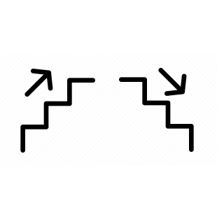

# ioBroker.bidirectional-counter

## bidirectional-counter adapter for ioBroker

Counter to separate consumption (positive changes) and deliverd (negative changes)

With this counter, you can select every state of type number in the custom config.
The adapter will creates 3 states internal. (cunsumed, delivered and total).
consumed will be assigned, if a positive change of the subscribed state will be detected.
delivered will be assigned, if a negative change of the subscribed state will be detected.
total will be assigned in every case.

e.g. this adapte is usefull to emulate an energymeter with a given ergy value from a foreign device.
for instance shelly will set energy of a channel back to zero in case of restart.
The adapter will ignor zero and the counter value is saved for using in other adapters / scripts.
The counter state will increase up from its saved value, when the shelly energy state increases next time.

## Changelog
<!--
	Placeholder for the next version (at the beginning of the line):
	### **WORK IN PROGRESS**
-->
### 2.5.0 (2025-10-19)
* (BenAhrdt) update Authentication NPM
* (BenAhrdt) update lint to 2.1.0
* (BenAhrdt) update testing removeing defDependencies
* (BenAhrdt) update dependencie core
* (BenAhrdt) update dependencie to node >= 20
* (BenAhrdt) update testing to 24.x

### 2.4.0 (2025-02-22)
* (BenAhrdt) update admin and js-controller dependencies

### 2.3.0 (2024-12-05)
* (BenAhrdt) update eslint

### 2.2.1 (2024-11-26)
* (BenAhrdt) changed schema and responsive tags

### 2.2.0 (2024-08-13)
* (BenAhrdt) Update Dependencies: "js-controller": ">=5.0.19"
  Check your System before installing new Version

### 2.1.4 (2024-08-09)
* (BenAhrdt) changes for check and service Bot

### 2.1.3 (2023-11-14)
* (BenAhrdt) debuglogging for changed values added

### 2.1.2 (2023-11-12)
* (BenAhrdt) translation for uk added
* (BenAhrdt) insert check vor node version >= 16

### 2.1.1 (2023-11-02)
* (BenAhrdt) correction in jsonconfig schema

### 2.1.0 (2023-04-06)
* (BenAhrdt) updated to new releasescript

### 2.0.8 (2022-06-17) - Readme updated
* (BenAhrdt) readme updated with paypal link

### 2.0.7 (2022-06-16) - loglevel query deleted
* (BenAhrdt) dont check loglevel before log.debug()

### 2.0.6 (2022-06-13) - adapter type changed
* (BenAhrdt) change adapter type into misc-data

### 2.0.5 (2022-06-08) - rewrite additional state with ack true
* (BenAhrdt) write ack = true in case of additional state is subscribed

### 2.0.4 (2022-06-08) - do not unsubscribe
* (BenAhrdt) unsubscribe fixed

### 2.0.3 (2022-06-06)
* (BenAhrdt) readme fixed

### 2.0.2 (2022-06-04)
* (BenAhrdt) fixed a comment Bug

### 2.0.1 (2022-06-04)
* (BenAhrdt) first try to release and push with Token

### 2.0.0 (2022-06-03)
* (BenAhrdt) release script implemented

### 1.14.9
* (BenAhrdt) fixed some changes in readme

### 1.13.8
* (BenAhrdt) fixed changes for official version
  use seState to write internal adapter states

### 1.8.7
* (BenAhrdt) edit changelog

### 1.8.6
* (BenAhrdt) first official version

## License
MIT License

Copyright (c) 2025 BenAhrdt <bsahrdt@gmail.com>

Permission is hereby granted, free of charge, to any person obtaining a copy
of this software and associated documentation files (the "Software"), to deal
in the Software without restriction, including without limitation the rights
to use, copy, modify, merge, publish, distribute, sublicense, and/or sell
copies of the Software, and to permit persons to whom the Software is
furnished to do so, subject to the following conditions:

The above copyright notice and this permission notice shall be included in all
copies or substantial portions of the Software.

THE SOFTWARE IS PROVIDED "AS IS", WITHOUT WARRANTY OF ANY KIND, EXPRESS OR
IMPLIED, INCLUDING BUT NOT LIMITED TO THE WARRANTIES OF MERCHANTABILITY,
FITNESS FOR A PARTICULAR PURPOSE AND NONINFRINGEMENT. IN NO EVENT SHALL THE
AUTHORS OR COPYRIGHT HOLDERS BE LIABLE FOR ANY CLAIM, DAMAGES OR OTHER
LIABILITY, WHETHER IN AN ACTION OF CONTRACT, TORT OR OTHERWISE, ARISING FROM,
OUT OF OR IN CONNECTION WITH THE SOFTWARE OR THE USE OR OTHER DEALINGS IN THE
SOFTWARE.