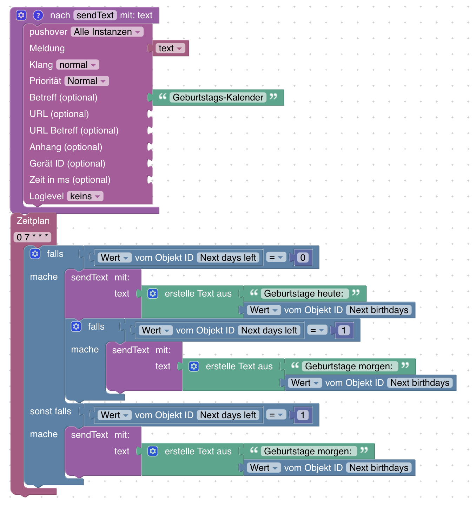

# ioBroker.birthdays

[](https://www.npmjs.com/package/iobroker.birthdays)
[](https://www.npmjs.com/package/iobroker.birthdays)
[](http://iobroker.live/badges/birthdays-stable.svg)
[](http://iobroker.live/badges/birthdays-installed.svg)
[](https://david-dm.org/klein0r/iobroker.birthdays)
[](https://snyk.io/test/github/klein0r/ioBroker.birthdays)


[](https://nodei.co/npm/iobroker.birthdays/)

Use an ical file to import your contacts birthdays or define the birthday dates directly in the adapter settings

## Sponsored by

[](https://haus-automatisierung.com/iobroker-kurs/?refid=iobroker-birthdays)

## Installation

Please use the "adapter list" in ioBroker to install a stable version of this adapter. You can also use the CLI to install this adapter:

```
iobroker add birthdays
```

## Configuration

You can use an ical url to provide access to your birthday calendar. The adapter will search for all events within that file.

Your events

1. must contain the birth year in the description (e.g. 1987)
2. are full day events
3. have to be "repeated yearly"

It is NOT required to use the ical option. You can also define all birthday dates in the settings. *When you use both options, the information will be merged.*


## Example (Blockly)

(requires pushover)



```xml
<xml xmlns="https://developers.google.com/blockly/xml">
  <variables>
    <variable id="p+Z^g1!hvR3!J9i,X(AI">text</variable>
  </variables>
  <block type="procedures_defnoreturn" id="gJY_AOXgo;b#ej2CXe3/" x="87" y="-212">
    <mutation>
      <arg name="text" varid="p+Z^g1!hvR3!J9i,X(AI"></arg>
    </mutation>
    <field name="NAME">sendText</field>
    <comment pinned="false" h="80" w="160">Beschreibe diese Funktion …</comment>
    <statement name="STACK">
      <block type="pushover" id="D7E4hKm%5=|Yi-b-)9(A">
        <field name="INSTANCE"></field>
        <field name="SOUND"></field>
        <field name="PRIORITY">0</field>
        <field name="LOG"></field>
        <value name="MESSAGE">
          <shadow type="text" id="prP3?f.yGgkkp))l]A07">
            <field name="TEXT">text</field>
          </shadow>
          <block type="variables_get" id="iMSl1Pg7ZEvE%hQd6B9{">
            <field name="VAR" id="p+Z^g1!hvR3!J9i,X(AI">text</field>
          </block>
        </value>
        <value name="TITLE">
          <block type="text" id="T96y]A^n-1TV52cw%+Gk">
            <field name="TEXT">Geburtstags-Kalender</field>
          </block>
        </value>
      </block>
    </statement>
  </block>
  <block type="schedule" id="6#((PC;76=!e/P3^ZsKI" x="88" y="113">
    <field name="SCHEDULE">0 7 * * *</field>
    <statement name="STATEMENT">
      <block type="controls_if" id="oZ%5t{r{bO3c{Xhl-|_a">
        <mutation elseif="1"></mutation>
        <value name="IF0">
          <block type="logic_compare" id=",Ui1[S(n}f`O*5_zS=:K">
            <field name="OP">EQ</field>
            <value name="A">
              <block type="get_value" id="L/Vh`N_zLwYK$+90B)l.">
                <field name="ATTR">val</field>
                <field name="OID">birthdays.0.next.daysLeft</field>
              </block>
            </value>
            <value name="B">
              <block type="math_number" id="W87L*`2V7yMC5j};TO0,">
                <field name="NUM">0</field>
              </block>
            </value>
          </block>
        </value>
        <statement name="DO0">
          <block type="procedures_callnoreturn" id="|%0O9GCBWm-9UV_Z~/%^">
            <mutation name="sendText">
              <arg name="text"></arg>
            </mutation>
            <value name="ARG0">
              <block type="text_join" id="rQa(!TVIvOgf/Vnn,nWG">
                <mutation items="2"></mutation>
                <value name="ADD0">
                  <block type="text" id="h770a|!zX%7)X[Vk.2,[">
                    <field name="TEXT">Geburtstage heute: </field>
                  </block>
                </value>
                <value name="ADD1">
                  <block type="get_value" id="U2%GgLhMX(ra$S;y1/_K">
                    <field name="ATTR">val</field>
                    <field name="OID">birthdays.0.next.text</field>
                  </block>
                </value>
              </block>
            </value>
            <next>
              <block type="controls_if" id="$QQRR`a-vzSUU}88$?~`">
                <value name="IF0">
                  <block type="logic_compare" id="eg:?F}+ID`%G1LHM5PAZ">
                    <field name="OP">EQ</field>
                    <value name="A">
                      <block type="get_value" id="Ato::k3GO0QfM_Fs.6s;">
                        <field name="ATTR">val</field>
                        <field name="OID">birthdays.0.nextAfter.daysLeft</field>
                      </block>
                    </value>
                    <value name="B">
                      <block type="math_number" id="n(N#~`eD{7Q,X!c=+/(V">
                        <field name="NUM">1</field>
                      </block>
                    </value>
                  </block>
                </value>
                <statement name="DO0">
                  <block type="procedures_callnoreturn" id="T6*=i:ILlcQ^z%0.w~yK">
                    <mutation name="sendText">
                      <arg name="text"></arg>
                    </mutation>
                    <value name="ARG0">
                      <block type="text_join" id="*ne-l72dQ??5^6Dj2gV$">
                        <mutation items="2"></mutation>
                        <value name="ADD0">
                          <block type="text" id="ba}815_R_35-Y~GG*}/R">
                            <field name="TEXT">Geburtstage morgen: </field>
                          </block>
                        </value>
                        <value name="ADD1">
                          <block type="get_value" id="u?8B|PylEzphdFq{f]QK">
                            <field name="ATTR">val</field>
                            <field name="OID">birthdays.0.nextAfter.text</field>
                          </block>
                        </value>
                      </block>
                    </value>
                  </block>
                </statement>
              </block>
            </next>
          </block>
        </statement>
        <value name="IF1">
          <block type="logic_compare" id="4E5@w,gT+=q(NaaGdT?U">
            <field name="OP">EQ</field>
            <value name="A">
              <block type="get_value" id="~~U^$SjlNI3ns6I5Yz~O">
                <field name="ATTR">val</field>
                <field name="OID">birthdays.0.next.daysLeft</field>
              </block>
            </value>
            <value name="B">
              <block type="math_number" id="T{[v+psC[IzHkn.LkZP4">
                <field name="NUM">1</field>
              </block>
            </value>
          </block>
        </value>
        <statement name="DO1">
          <block type="procedures_callnoreturn" id="I5L?1ZB,[|2x[Nm$8s4Z">
            <mutation name="sendText">
              <arg name="text"></arg>
            </mutation>
            <value name="ARG0">
              <block type="text_join" id="!EFb@yB_*Hm!QU{gcA]I">
                <mutation items="2"></mutation>
                <value name="ADD0">
                  <block type="text" id="{ofc`NkX8NjN`:`DEIH*">
                    <field name="TEXT">Geburtstage morgen: </field>
                  </block>
                </value>
                <value name="ADD1">
                  <block type="get_value" id=",%aRO_hL*tODl=By@eru">
                    <field name="ATTR">val</field>
                    <field name="OID">birthdays.0.next.text</field>
                  </block>
                </value>
              </block>
            </value>
          </block>
        </statement>
      </block>
    </statement>
  </block>
</xml>
```

## Changelog

<!--
  Placeholder for the next version (at the beginning of the line):
  ### **WORK IN PROGRESS**
-->
### 0.2.0 (2022-01-06)

* (klein0r) Added option to ignore certificate errors

### 0.1.8 (2022-01-03)

* (klein0r) Birthdays on 29th of February create NaN objects
* (klein0r) Added check for empty names
* (klein0r) Added date checks

### 0.1.7 (2021-12-23)

* (klein0r) Added defaults for birthdays table

### 0.1.6 (2021-11-18)

* (klein0r) Require new version for translated instance objects
* (klein0r) Fixed timeout handling

### 0.1.5 (2021-11-15)

* (klein0r) Updated internal state handling

### 0.1.4 (2021-11-14)

* (klein0r) Translated all objects

### 0.1.3 (2021-11-07)

* (klein0r) Format dates using ioBrokers configured formats

### 0.1.2 (2021-11-06)

* (klein0r) Fixed missing translations

### 0.1.1 (2021-11-05)

* (klein0r) Added custom date format
* (klein0r) Added custom next separator

### 0.1.0 (2021-11-05)

* (klein0r) Admin 5 Support

### 0.0.3 (2021-03-23)

* (klein0r) Added next and nextAfter birthdays

### 0.0.2 (2021-03-23)

* (klein0r) Added more objects and states

### 0.0.1 (2020-12-28)

* (klein0r) initial release

## Credits

[Logo by herbanu](https://pixabay.com/de/vectors/geburtstag-karte-cele-feier-design-3148707/)

## License

The MIT License (MIT)

Copyright (c) 2022 Matthias Kleine <info@haus-automatisierung.com>

Permission is hereby granted, free of charge, to any person obtaining a copy
of this software and associated documentation files (the "Software"), to deal
in the Software without restriction, including without limitation the rights
to use, copy, modify, merge, publish, distribute, sublicense, and/or sell
copies of the Software, and to permit persons to whom the Software is
furnished to do so, subject to the following conditions:

The above copyright notice and this permission notice shall be included in
all copies or substantial portions of the Software.

THE SOFTWARE IS PROVIDED "AS IS", WITHOUT WARRANTY OF ANY KIND, EXPRESS OR
IMPLIED, INCLUDING BUT NOT LIMITED TO THE WARRANTIES OF MERCHANTABILITY,
FITNESS FOR A PARTICULAR PURPOSE AND NONINFRINGEMENT. IN NO EVENT SHALL THE
AUTHORS OR COPYRIGHT HOLDERS BE LIABLE FOR ANY CLAIM, DAMAGES OR OTHER
LIABILITY, WHETHER IN AN ACTION OF CONTRACT, TORT OR OTHERWISE, ARISING FROM,
OUT OF OR IN CONNECTION WITH THE SOFTWARE OR THE USE OR OTHER DEALINGS IN
THE SOFTWARE.
