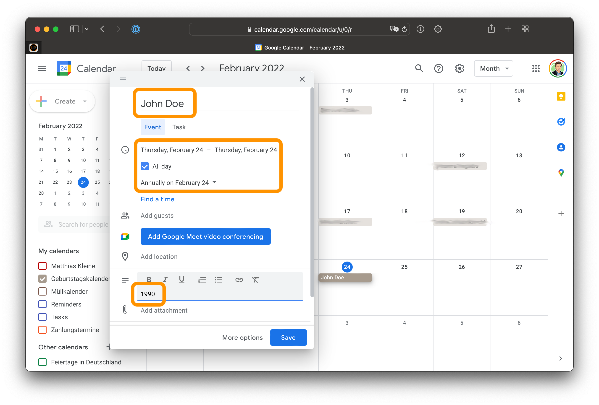
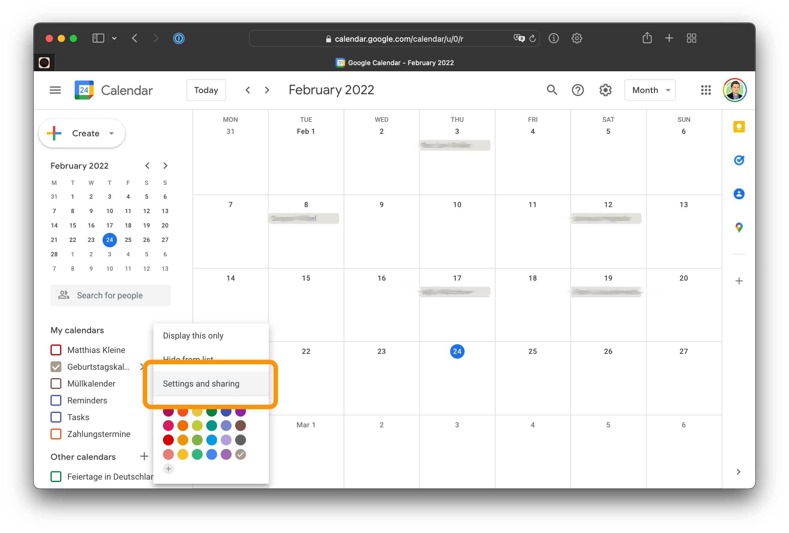
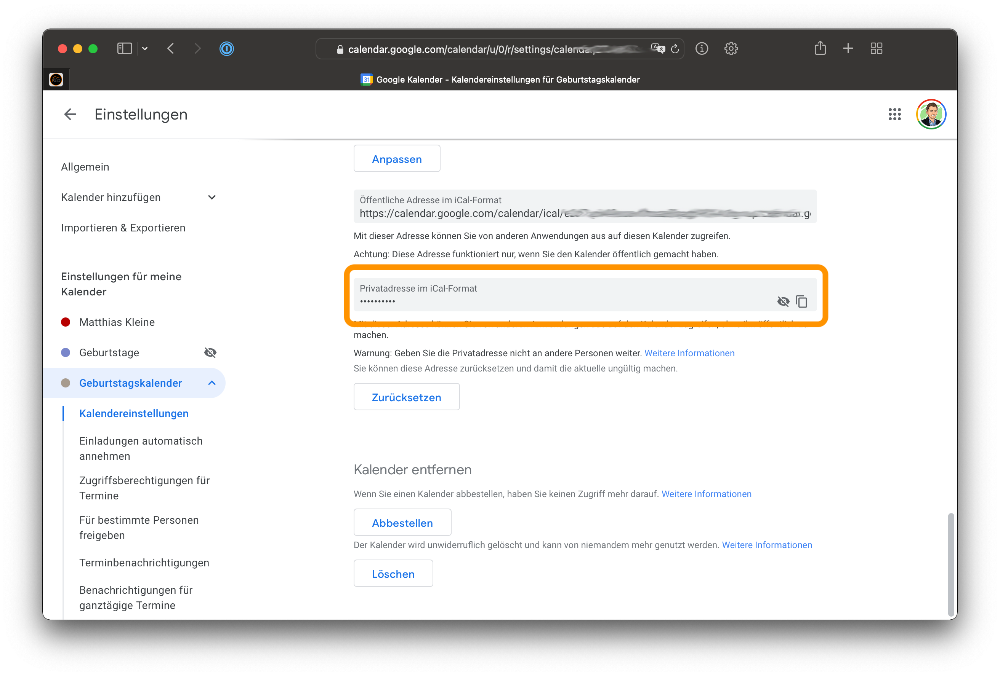
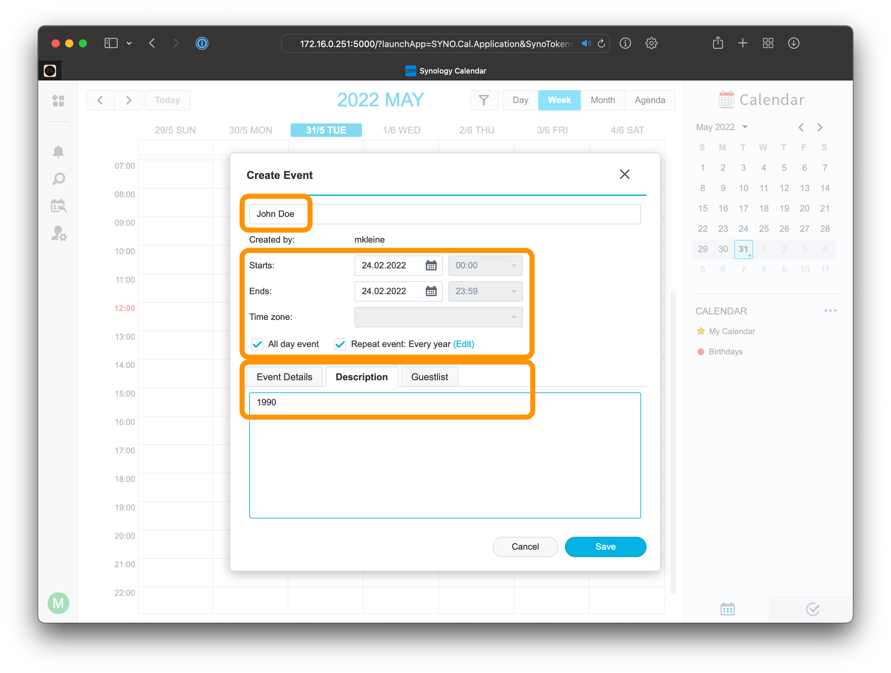
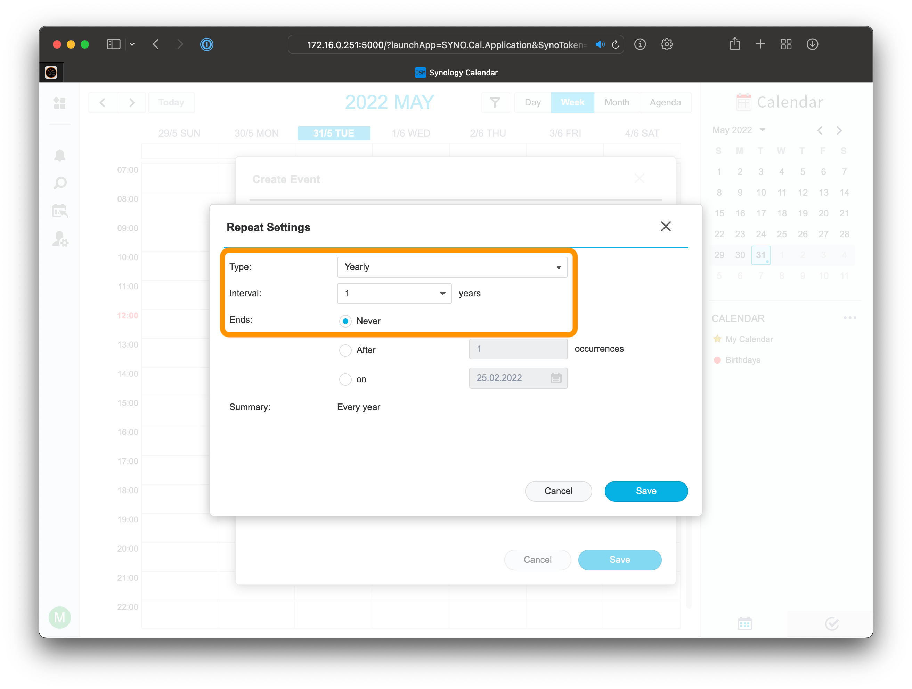
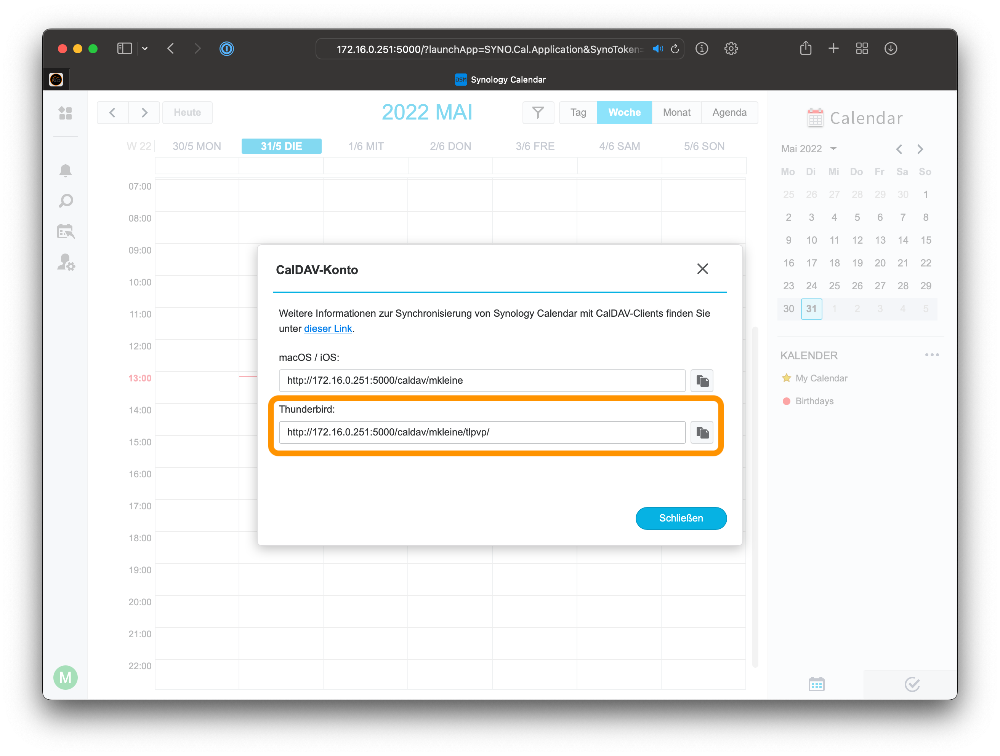
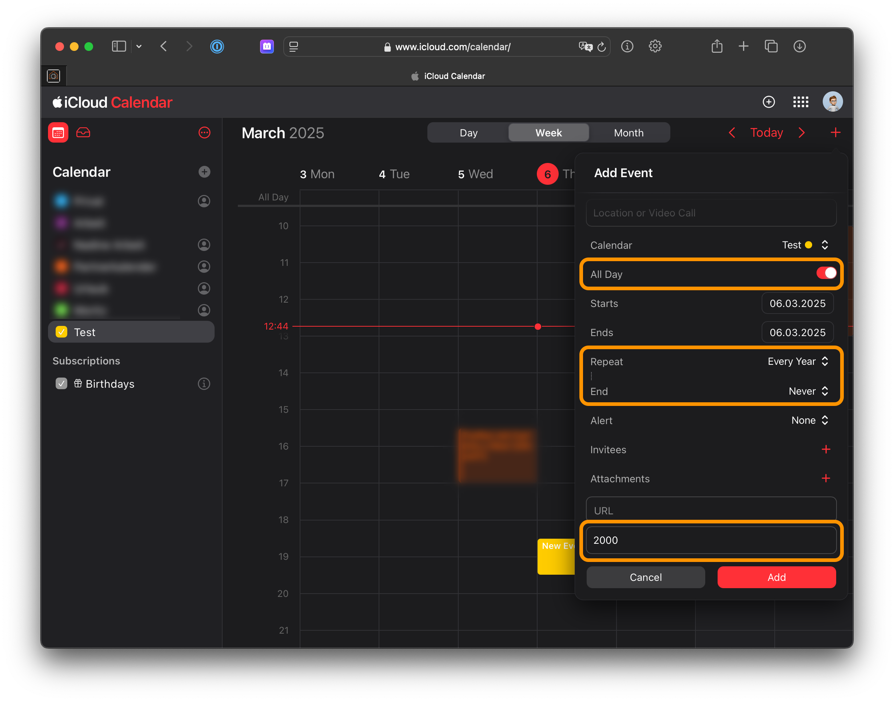

# ioBroker.birthdays

## iCal

You can use an ical file (http url or local path to file) to provide access to your birthday calendar. The adapter will search for all events within that file.

_Local files are supported since adapter version 2.0.0_

Your events

1. must contain the birth year in the description (e.g. 1987)
2. are full day events
3. have to be "repeated yearly"

It is NOT required to use the iCal option. You can also define other birthday sources in the settings. _When you use multiple options, the information will be merged._

### Google Calendar

Go to [Google Calendar](http://calendar.google.com/) and create a new calendar. Add new birthday events to that calendar, which match the required criteria (see above). After that, you have to copy the private calendar url to use this calendar in the adapter.

### Synology Calendar

### Apple iCloud Clendar

