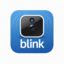

# ioBroker.blink

[](https://www.npmjs.com/package/iobroker.blink)
[](https://www.npmjs.com/package/iobroker.blink)


## blink adapter for ioBroker

ioBroker adapter for Blink cameras.

## Supported devices

This adapter is intended for Blink home security cameras and related Blink account devices.

Manufacturer website: [Blink](https://blinkforhome.com/)  
Device overview: [Blink products](https://blinkforhome.com/products)  
Support / device documentation: [Blink Support](https://support.blinkforhome.com/)

This adapter is not affiliated with, maintained by, or endorsed by Blink or Amazon.

## Getting started

Install via the ioBroker Admin interface
-----------------------------------------------------------------------------------------
Fill out your credentials:

-----------------------------------------------------------------------------------------

-----------------------------------------------------------------------------------------


## Features

- Connects to the Blink Cloud
- Polls camera and sync module status
- Supports manual snapshots
- Stores live snapshots
- Downloads the latest available cloud video
- Allows enabling or disabling motion detection
- Supports battery warning states and notifications
- Supports Smart Detection states for classified motion events (works only on paid cloud services)
- Supports cloud stored videos and local stored videos on sd-card (SyncModule 2 and XR) via local server on port 8085 - JavaScript needed, see below !
- The script requires ffmpeg installed and a lot resources if you have a lot cameras and is then only partially suitable for Raspberry Pis (min. 4GB — more is better)
- initial release for live view with javascript for each camera - required javascript is installed automatically - except for the old XT2, because it uses a different video stream
- Experimental native LiveView session (no JavaScript helper / ffmpeg required) via `commands.start_live` / `commands.stop_live`, see "Real LiveView session" below


## Blink Adapter: Datapoints

Overview of all datapoints provided by the customized ioBroker adapter `blink.0`.
Status: after refactoring for cloud history + local-storage fallback, plus the experimental native LiveView session added in v0.0.37/0.0.38.

## Conventions

- `<CamID>` — numeric camera ID (e.g. `1754227`). Also used in the MP4 filename.
- `<NetID>` — Network ID of the sync module / home network (e.g. `174553`).
- `<N>` — slot index of the video history, **0 = newest** clip, **9 = oldest**.

All MP4 and snapshot files are stored in the configured snapshot directory (default: `/opt/iobroker/iobroker-data/blink/`).

---

## Adapter globals

| Datapoint | Type | Description |
|---|---|---|
| `blink.0.info.connection` | boolean | `true` if the adapter has a valid session to the Blink cloud. |
| `blink.0.info.account_id` | string | Blink account ID, used internally so the optional LiveView helper script can find the right account. |

---

## Camera datapoints

Each camera gets its own channel `blink.0.cameras.<CamID>` with the following sub-structures.

### `info` – Master data

| Datapoint | Type | Description |
|---|---|---|
| `info.name` | string | Display name from the Blink app (e.g. "Driveway", "Patio"). |
| `info.network_id` | number | Network ID the camera belongs to. |
| `info.serial` | string | Camera serial number. |
| `info.type` | string | Camera model / Blink API type (`camera`, `owl`, `mini`, `doorbell`). |
| `info.account_id` | string | Blink account ID, mirrored per camera for the LiveView helper script. |

### `status` – Current sensor state

| Datapoint | Type | Description |
|---|---|---|
| `status.armed` | boolean | Camera armed (follows the network mode). |
| `status.battery` | number | Battery voltage in Volts (unit `V`). `null` on models without a battery. |
| `status.battery_raw` | number | Raw sensor value before conversion. |
| `status.battery_text` | string | Human-readable note, e.g. `not available` on models without a battery. |
| `status.battery_volt` | number | Battery voltage in Volts (unit `V`). |
| `status.temperature` | number | Temperature at the camera sensor in °C (unit `°C`). |
| `status.temperature_f` | number | Temperature in °F (unit `°F`). |
| `status.temperature_text` | string | Temperature as formatted text, e.g. `not available` on models without a sensor. |
| `status.wifi_strength` | number | Wi-Fi signal strength in dBm (unit `dBm`). |
| `status.motion_detect_enabled` | boolean | Motion detection on the camera enabled/disabled (read-only reflection; use `commands.motion_detect` to change it). |
| `status.last_update` | string | Timestamp of the last status refresh (ISO format). |

#### Smart detection (only with active Blink subscription)

Extracted from the **newest cloud clip** of the camera:

| Datapoint | Type | Description |
|---|---|---|
| `status.smart_detection` | boolean | At least one smart-detect hit present in the last clip. |
| `status.smart_detection_raw` | string | Raw smart-detection payload (JSON, truncated). |
| `status.detection_type` | string | Comma-separated list of detected types. |
| `status.motion_source` | string | Trigger for the clip: `pir`, `cv_motion`, etc. |
| `status.person_detected` | boolean | Person detected. |
| `status.vehicle_detected` | boolean | Vehicle detected. |
| `status.animal_detected` | boolean | Animal detected. |
| `status.package_detected` | boolean | Package detected. |

### `battery` – Extended battery status

Used to avoid repeated notifications.

| Datapoint | Type | Description |
|---|---|---|
| `battery.low` | boolean | Battery is critically low. |
| `battery.warningSent` | boolean | A low-battery warning has already been issued for the current low-battery period (deduplication). |
| `battery.lastMessage` | string | Text of the last low-battery warning message sent (e.g. via Pushover/Telegram). |
| `battery.lastWarning` | string | Timestamp of the last low-battery warning (ISO). |

### `live` – Snapshot and live stream

| Datapoint | Type | Description |
|---|---|---|
| `live.file` | string | Absolute path of the latest snapshot on disk. |
| `live.image_base64` | string | Snapshot as Base64 string (for direct embedding in VIS without file access). |
| `live.mime_type` | string | MIME type of the snapshot (e.g. `image/jpeg`). |
| `live.timestamp` | string | Snapshot timestamp (ISO). |
| `live.stream_active` | boolean | MJPEG live stream (web-grid helper) currently polled. |
| `live.stream_url` | string | URL of the active MJPEG live stream (web-grid helper, TTL limited). |
| `live.mode` | string | Mode of the experimental native LiveView session (e.g. `idle`, active mode name). |
| `live.active` | boolean | `true` while a native LiveView session (`commands.start_live`) is running. |
| `live.url` | string | Playback URL of the current native LiveView session. |
| `live.expires_at` | string | Expiry timestamp of the current native LiveView session (ISO). |
| `live.last_error` | string | Last error from the native LiveView session, if any. |
| `live.session_id` | string | ID of the current native LiveView session. |
| `live.backend` | string | Backend used to serve the native LiveView session. |
| `live.unsupported` | boolean | `true` if this camera model does not support the native LiveView session (e.g. older XT/XT2). In that case, `commands.start_live` has no effect. |

### `video` – Current video

The newest video for the camera. Cloud is preferred automatically; falls back to local storage (Sync Module 2 USB stick) if needed.

| Datapoint | Type | Description |
|---|---|---|
| `video.file` | string | Absolute path of the MP4 (`<CamID>_latest.mp4`). |
| `video.timestamp` | string | Timestamp of the video content (ISO). |
| `video.id` | string | Unique clip ID from the Blink API. |
| `video.size` | number | File size in bytes. |
| `video.ready` | boolean | File was downloaded successfully and is playable. |
| `video.lastError` | string | Last download error. `""` = ok, otherwise message such as `no video available`. |

### `video.history.0` … `video.history.9` – Ring gallery

Each camera has **10 slots** containing the 10 most recent clips.
**Slot 0 = newest clip**, slot 9 = oldest. On each new clip the slots rotate automatically (oldest drops out).

| Datapoint | Type | Description |
|---|---|---|
| `video.history.<N>.file` | string | Absolute path of the MP4 (`<CamID>_history_<N>.mp4`). Constant filename per slot ⇒ stable URLs in VIS. |
| `video.history.<N>.id` | string | Unique clip ID from the Blink API. |
| `video.history.<N>.timestamp` | string | Timestamp of the clip content (ISO). |
| `video.history.<N>.source` | string | Source of the clip: `cloud` or `local_storage`. Empty if slot unused. |

### `commands` – Trigger datapoints

Set to `true` → action is executed, adapter automatically resets to `false`. (`commands.motion_detect` is the one exception — it is a persistent on/off switch, not a self-resetting trigger.)

| Datapoint | Type | Action |
|---|---|---|
| `commands.snapshot` | boolean | Request a new snapshot (stored as Base64 state). |
| `commands.snapshot_file` | string | Read-only: absolute path of the last saved snapshot file, set automatically after each snapshot. |
| `commands.fetch_video` | boolean | Download the latest video. Smart logic: cloud first, then local-storage fallback. |
| `commands.live_request` | boolean | Open the MJPEG live stream (web-grid helper, TTL ~60 s). |
| `commands.start_live` | boolean | Start an experimental native LiveView session (no JavaScript helper / ffmpeg required). Result appears under `live.url` / `live.mode` / `live.session_id`. |
| `commands.stop_live` | boolean | Stop the native LiveView session started via `commands.start_live`. |
| `commands.motion_detect` | boolean | Toggle motion detection on the camera (persistent switch, not self-resetting). |
| `commands.clear_session` | boolean | Clear the auth session (in case of login problems). |

---

## Sync module / network

Each sync module gets its own channel `blink.0.sync.<NetID>`. **Note:** The state path uses the `network_id`, not the actual sync-module device ID.

### `info` – Master data

| Datapoint | Type | Description |
|---|---|---|
| `info.name` | string | Network name (e.g. "Home"). |
| `info.serial` | string | Sync module serial number. |

### `status` – State

| Datapoint | Type | Description |
|---|---|---|
| `status.armed` | boolean | Network armed (enables motion detection on all cameras). |
| `status.last_update` | string | Timestamp of the last refresh (ISO). |

### `commands` – Trigger

| Datapoint | Type | Action |
|---|---|---|
| `commands.armed` | boolean | Sets the entire network armed (`true`) or disarmed (`false`). Affects all cameras in this network. |

---

## File layout in the snapshot directory

Default path: `/opt/iobroker/iobroker-data/blink/`

| File | Description |
|---|---|
| `<CamID>_latest.mp4` | Most recent video of the camera (see `video.file`). |
| `<CamID>_history_<N>.mp4` | History slot `N` of the camera (`video.history.<N>.file`). |
| `<CamID>_snapshot.jpg` | Last snapshot, if saved via `commands.snapshot_file`. |

Filenames are **constant per slot**, contents change on rotation. For web embedding use a cache-buster in the query string (`?t={timestamp}`) so the browser actually reloads the new file.

---
### Optional video archive

The adapter can copy downloaded MP4 clips to a separate archive directory, for example a mounted NAS path. The archive is optional and disabled by default.

Archive settings are configured in the adapter admin UI:

* `Enable video archive`: enables copying downloaded MP4 clips to the archive directory.
* `Archive directory`: absolute path for archived MP4 files, for example `/opt/iobroker/iobroker-data/blink-archive`.
* `Create camera subfolders`: creates one archive subfolder per camera.
* `Maximum archive clips per camera in grid`: limits how many archived clips are shown per camera in the web grid.

When the archive is enabled, the adapter also backfills existing local MP4 files from the current video state and video history into the archive. The camera grid shows archived clips under the `Archive` navigation button, sorted by clip timestamp and deduplicated by clip ID.

The following archive status states are created under `blink.0.archive`:

| State | Type | Description |
| --- | --- | --- |
| `archive.enabled` | boolean | Shows whether the archive is enabled in the adapter configuration. |
| `archive.available` | boolean | Shows whether the archive directory is currently writable. |
| `archive.directory` | string | Shows the configured archive directory. |
| `archive.lastFile` | string | Source MP4 file that was last processed for archiving. |
| `archive.lastTarget` | string | Archive target path of the last successfully copied MP4 file. |
| `archive.lastSuccess` | string | Timestamp of the last successful archive copy. |
| `archive.lastError` | string | Last archive error message, if any. |

The archive status states are read-only status indicators. Change archive settings in the adapter configuration instead of writing to these states.
---

## Tips for VIS integration

For a **live preview** in VIS:
```
{cameras.1754227.video.file}      → absolute path
{cameras.1754227.video.timestamp} → use for cache-busting
{cameras.1754227.video.ready}     → if false, show a "no video" hint
{cameras.1754227.video.lastError} → if non-empty, show as error status
```

For the **history gallery** query slots 0–9 individually:
```
{cameras.1754227.video.history.0.file}
{cameras.1754227.video.history.0.timestamp}
{cameras.1754227.video.history.0.source}
... through slot 9
```

`source = "cloud"` means the clip came directly from the Blink cloud (fast, no stick upload).
`source = "local_storage"` means the clip was uploaded from the Sync Module 2 USB stick through the cloud.

## Notes

- Battery-powered warnings are handled via the `battery.*` states.
- Devices without a built-in battery, such as Mini/Owl/PanTilt-like devices, are excluded from battery warnings.
- In that case, `battery.lastMessage` is set to `no built in battery`.
- Live image states are updated when a snapshot is fetched or when live snapshots are enabled.
- MJPEG stream states are only relevant if streaming is enabled in the adapter configuration.
- The native LiveView session states (`live.mode`, `live.active`, `live.url`, …) are independent of the MJPEG web-grid helper; check `live.unsupported` before calling `commands.start_live` on older camera models.
- Smart Detection states are updated when classified motion metadata is available from Blink Cloud.
  

## Optional LiveView Web Grid

The adapter can optionally install and update a helper script for the LiveView web grid.

This helper script is created in the ioBroker JavaScript adapter namespace as:

```text
script.js.common.blink-video-url-server
```

This is intentional and only used for the optional web grid / LiveView helper functionality. Existing user scripts with the same object ID may be overwritten. If you maintain a customized version of this script, please create a backup before enabling or updating this feature.

> **Note:** This web-grid helper is a separate feature from the native LiveView session described above (`commands.start_live` / `live.url`). The native session does not require the JavaScript adapter or `ffmpeg` and is the recommended starting point if you only need a single camera's live URL in VIS or another integration.

### Requirements

The LiveView web grid requires:

* the ioBroker JavaScript adapter
* `ffmpeg` installed on the host system and available in `PATH`
* supported Blink cameras using the current IMMI/MCLV LiveView flow
* network access from the ioBroker host to the Blink cloud services

On Debian/Ubuntu systems, `ffmpeg` can usually be installed with:

```bash
sudo apt update
sudo apt install ffmpeg
```

### Camera compatibility

Not all Blink camera generations expose the same LiveView flow.

Cameras using the current IMMI/MCLV LiveView flow can be converted to an HLS stream for the web grid. Older XT/XT2/LFR based cameras may not provide a usable stream through this method. In that case the adapter detects the unsupported LiveView state and disables the LiveView button for that camera instead of starting a broken stream. The same `live.unsupported` flag also applies to the native LiveView session (`commands.start_live`).

### Notes

The LiveView web grid is a convenience feature. The core adapter functions such as login, device discovery, motion states, battery states, thumbnails and video downloads do not require the JavaScript helper script or `ffmpeg`.
The LiveView web grid helper is supported on Linux-based ioBroker installations only. It uses Linux paths and process commands such as `/opt/iobroker`, `/tmp`, `/usr/bin/node`, `nohup`, and `pkill`. The core adapter functionality remains platform-independent, but LiveView web grid features require a Linux host.


## DISCLAIMER

All product and company names or logos are trademarks™ or registered® trademarks of their respective holders. Use of them does not imply any affiliation with or endorsement by them or any associated subsidiaries! This personal project is maintained in spare time and has no business goal. Blink is a trademark of Amazon Technologies, Inc..

## Changelog

Older entries are available in [CHANGELOG_OLD.md](CHANGELOG_OLD.md).

<!--
    Placeholder for the next version (at the beginning of the line):
    ### **WORK IN PROGRESS**
-->
### 0.0.39 (2026-08-08)
* Automatically clears the cached Blink session once after HTTP 401/code 101 and retries the connection.
* Allows the clear session command even when the adapter is not connected.

### 0.0.38 (2026-07-13)
* Added units for temperature and battery voltage states.
* Removed duplicate detail roles for Fahrenheit temperature and secondary live URL states.

### 0.0.37 (2026-07-13)
* Fixed button command states to use `read: false` as required for `role: button`.
* Fixed object hierarchy by creating `cameras`, `sync`, `video.history` and video history slots as folders where they contain child objects.
* Fixed remaining English object names for smart detection and live URL states.
* Fixed device information roles for name, serial number and camera model states.
* Added dBm unit metadata for Wi-Fi signal strength states.

### 0.0.36 (2026-07-12)
* Fixed remaining admin checker warnings for archive translations.
* Normalized admin UI translation keys for streaming settings.
* Normalized English runtime labels and debug messages.
* Documented that the LiveView web grid helper requires Linux.

### 0.0.35 (2026-07-12)
* Fixed remaining admin checker warnings for archive translations.

## License

MIT License

Copyright (c) 2026 Pischleuder1 <pischleuder@gmx.de>

Permission is hereby granted, free of charge, to any person obtaining a copy
of this software and associated documentation files (the "Software"), to deal
in the Software without restriction, including without limitation the rights
to use, copy, modify, merge, publish, distribute, sublicense, and/or sell
copies of the Software, and to permit persons to whom the Software is
furnished to do so, subject to the following conditions:

The above copyright notice and this permission notice shall be included in all
copies or substantial portions of the Software.

THE SOFTWARE IS PROVIDED "AS IS", WITHOUT WARRANTY OF ANY KIND, EXPRESS OR
IMPLIED, INCLUDING BUT NOT LIMITED TO THE WARRANTIES OF MERCHANTABILITY,
FITNESS FOR A PARTICULAR PURPOSE AND NONINFRINGEMENT. IN NO EVENT SHALL THE
AUTHORS OR COPYRIGHT HOLDERS BE LIABLE FOR ANY CLAIM, DAMAGES OR OTHER
LIABILITY, WHETHER IN AN ACTION OF CONTRACT, TORT OR OTHERWISE, ARISING FROM,
OUT OF OR IN CONNECTION WITH THE SOFTWARE OR THE USE OR OTHER DEALINGS IN THE
SOFTWARE.
