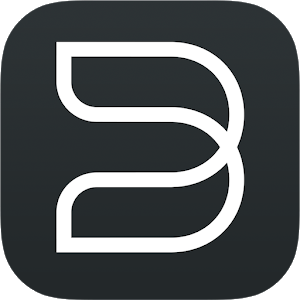

# ioBroker.bluesound

[](https://www.npmjs.com/package/iobroker.bluesound)
[](https://www.npmjs.com/package/iobroker.bluesound)


[](https://nodei.co/npm/iobroker.bluesound/)
[](https://weblate.iobroker.net/engage/adapters/?utm_source=widget)

**Tests:** 

## bluesound adapter for ioBroker

Adapter to control Bluesound devices

## Functions included

The adapter uses API calls in the format: http://--playerIP--:11000/xxx

At startup the presets are read from the player and added to the 'presets' channel.
Player model and name are stored in the 'info' channel.
When player is playing the titles are set in the 'info' channel.

The player status is polled in the interval set by 'config.pollingtime' and the result is stored in 'control.state' as well as in 'info.\*'.

PollingTime values up to 120 secs are reasonable. The adapter cannot be startet with values larger than 300 secs. Default value is 30 secs.

A timeout parameter is set by optional parameter 'config.TimeOut' as timeout for the API call. Default value is 2 secs.

The following functions are implemented:

- Player Stop (triggered by setting 'control.stop' to true)
- Player Start (triggered by setting 'control.start' to true)
- Player Pause (triggered by setting 'control.pause' to true)
- Play Presetxxx (triggered by setting '.presets.preset(x).start' to true)
- Change Volume (triggered by changing 'control.volume')
- Shuffle Playlist (triggered by setting 'control.shuffle' to true, toggle mode)
- Playlist forward (triggered by setting 'control.forward' to true)
- Playlist backward (triggered by setting 'control.backward' to true)

Library browsing for LocalMusic is added. A dynamic menu list is available in 'info.list'. This object should be set as the 'Object ID' for a json-table to visualize the current menu. The object 'control.command' is used to pass the next command to the player. It is updated by defining it as the 'Selected ID' of that table. The table header itself is updated by using 'info.listheader' via object binding for the first headers' name. For better visualization only the first header should be shown and its width should be set to 100%.

All contents is drilled down up to the album level (with the exception of the Songs menu, in which songs are directly listed). When an album is selected its content is immediately played, replacing the contents of the current playlist or added to the current playlist. This behaviour is dependent on the value of info.playliststate. If the value is true the playlist is replaced, in the other case the new content is added. This object can be changed by control.playlist (Button with Toggle mode). Each time this button is pressed, the value of info.playliststate is inverted.

Library search is added. If a search string is entered in 'control.search' (via an input filed in the browser) the result of the search is shown in 'info.list' and can be further drilled down like in library browsing.

The contents of the current playlist is available in the object info.playlist (JSON) and can be visualized this way. It is also available as an html- table in info.playlisthtml and can be directly visualized in a html widget. The format of the resulting table can be modified using CSS

```javascript
.playlist table {
    background-color: #514d4d;
    width: 100%;
    border-collapse: collapse;
    display: block;
    overflow-y: auto;
    max-height: 100%;
}
.playlist img {
    margin: 10px;
    height: 50px;
    width:  50px;
}

.playlist .title {
    color: #ffffff;
    font-size: 18px;
    padding-top: 10px;
    font-weight: bold;
    overflow: hidden;
    white-space: nowrap;
    text-overflow: ellipsis;
}

.playlist .artist {
    color: #888888;
    padding-bottom: 10px;
}

.playlist .current {
    color: #2f9bde;
    font-size: 18px;
    padding-top: 10px;
    font-weight: bold;
    overflow: hidden;
    white-space: nowrap;
    text-overflow: ellipsis;
}

.playlist div {
    height: 800px;
}
```

## Changelog
### 1.3.0 (2025-12-03)

- (Uwe Nagel) Library search added
- (Uwe Nagel) Add control.search
- (Uwe Nagel) Add info.playlisthtml
- (Uwe Nagel) Add info.playliststate
- (Uwe Nagel) Function setPlaylistToggle added
- (Uwe Nagel) Add control.playlist
- (Uwe Nagel) Function readPlaylist added
- (Uwe Nagel) Add info.playlist
- (Uwe Nagel) Library browsing added

### 1.2.1 (2025-10-18)

- (Uwe Nagel) Add info.list and control.command
- (Uwe Nagel) Changes according to ioBroker Check
- (Uwe Nagel) Bump @types/node from 24.5.2 to 24.6.1
- (Uwe Nagel) Bump chai from 6.0.1 to 6.2.0
- (Uwe Nagel) Bump typescript from 5.9.2 to 5.9.3
- (Uwe Nagel) Bump mocha from 11.7.2 to 11.7.3
- (Uwe Nagel) Correct error in main.js, update package-lock.json
- (Uwe Nagel) Update io-package.json and package.json
- (Uwe Nagel) Update .vscode/jsonConfig.json and .gitignore
- (Uwe Nagel) Resolve dependency errors
- (Uwe Nagel) Bump mocha from 11.1.0 to 11.7.1
- (Uwe Nagel) Bump globals from 16.2.0 to 16.3.0
- (Uwe Nagel) Bump @types/node from 24.0.8 to 24.1.0
- (Uwe Nagel) Bump typescript from 5.7.3 to 5.9.2
- (Uwe Nagel) Bump chai from 5.2.0 to 5.2.1
- (Uwe Nagel) Further code cleaning (apiclient, getStateAsync)
- (Uwe Nagel) @types/xml2js added
- (Uwe Nagel) Move to eslint 9 and fix subsequent issues

### 1.2.0 (2025-07-24)

- (Uwe Nagel) Logic added to shift playlist forward/backward
- (Uwe Nagel) State roles updated
- (Uwe Nagel) Logic added to shuffle playlist
- (Uwe Nagel) Translated using Weblate (Dutch)
- (Uwe Nagel) Update test-and.release.yml to node 24.x
- (Uwe Nagel) Update testing to minimum node.js version 20

### 1.1.5 (2025-03-10)

- (Uwe Nagel) Create version 1.1.5
- (Uwe Nagel) Update info.connection regularly
- (Uwe Nagel) Update admin dependency to >=7.4.10
- (Uwe Nagel) Update @iobroker/adapter-dev to 1.3.0
- (Uwe Nagel) Fixing test action problems
- (Uwe Nagel) Bump mocha from 11.0.1 to 11.1.0
- (Uwe Nagel) Bump eslint-config-prettier from 9.1.0 to 10.0.1
- (Uwe Nagel) Bump chai and @types/chai
- (Uwe Nagel) Bump eslint from 9.16.0 to 9.19.0
- (Uwe Nagel) Corrected translations (de,pl)
- (Uwe Nagel) Update @iobroker/adapter-core to 3.2.3
- (Uwe Nagel) Update @iobroker/testing to 5.0.0

### 1.1.4 (2025-01-03)

- (Uwe Nagel) Correct common.news

### 1.1.3 (2025-01-03)

- (Uwe Nagel) Changed year in README
- (Uwe Nagel) Bump prettier from 3.4.1 to 3.4.2
- (Uwe Nagel) Bump mocha from 10.8.2 to 11.0.1
- (Uwe Nagel) Bump chai-as-promised and @types/chai-as-promised
- (Uwe Nagel) Bump sinon from 18.0.0 to 19.0.2
- (Uwe Nagel) Bump globals from 15.9.0 to 15.14.0

### 1.1.1 (2024-12-01)

- (Uwe Nagel) README.md cosmetics
- (Uwe Nagel) Added Weblate translation badge
- (Uwe Nagel) Bump cross-spawn from 7.0.3 to 7.0.6
- (Uwe Nagel) Switch to adapter-core3.2.2
- (Uwe Nagel) Corrected logic for remote volume changes

### 1.1.0 (2024-10-19)

- (Uwe Nagel) Potentially invalid characters are replaced before creating an object
- (Uwe Nagel) setTimeout used instead of setInterval, clearTimeout added
- (Uwe Nagel) Check values for PollingTime and TimeOut
- (Uwe Nagel) Missing sizes added
- (Uwe Nagel) State roles reevaluated
- (Uwe Nagel) subscribeState calls eliminated
- (Uwe Nagel) Instance prefixes in ObjectIds are omitted when calling setState()
- (Uwe Nagel) State change now honors ack flag
- (Uwe Nagel) PollingTime and TimeOUT changed to type number
- (Uwe Nagel) onReady() stopped when no IP is set
- (Uwe Nagel) Testing extended to node 22.x
- (Uwe Nagel) Example code removed

### 1.0.3 (2024-09-26)

- (Uwe Nagel) Parsing of /State corrected

### 1.0.2 (2024-09-19)

- (Uwe Nagel) Modified due to adapter checks

### 1.0.1 (2024-05-24)

- (Uwe Nagel) Added config descriptions
- (Uwe Nagel) Added translations for object descriptions
- (Uwe Nagel) Added role definition for all objects
- (Uwe Nagel) Added Timeout config Parameter

### 1.0.0 (2024-05-17)

- (Uwe Nagel) initial release

## License

MIT License

Copyright (c) 2025-2026 Uwe Nagel <uwenagel@kabelmail.de>

Permission is hereby granted, free of charge, to any person obtaining a copy
of this software and associated documentation files (the "Software"), to deal
in the Software without restriction, including without limitation the rights
to use, copy, modify, merge, publish, distribute, sublicense, and/or sell
copies of the Software, and to permit persons to whom the Software is
furnished to do so, subject to the following conditions:

The above copyright notice and this permission notice shall be included in all
copies or substantial portions of the Software.

THE SOFTWARE IS PROVIDED "AS IS", WITHOUT WARRANTY OF ANY KIND, EXPRESS OR
IMPLIED, INCLUDING BUT NOT LIMITED TO THE WARRANTIES OF MERCHANTABILITY,
FITNESS FOR A PARTICULAR PURPOSE AND NONINFRINGEMENT. IN NO EVENT SHALL THE
AUTHORS OR COPYRIGHT HOLDERS BE LIABLE FOR ANY CLAIM, DAMAGES OR OTHER
LIABILITY, WHETHER IN AN ACTION OF CONTRACT, TORT OR OTHERWISE, ARISING FROM,
OUT OF OR IN CONNECTION WITH THE SOFTWARE OR THE USE OR OTHER DEALINGS IN THE
SOFTWARE.
