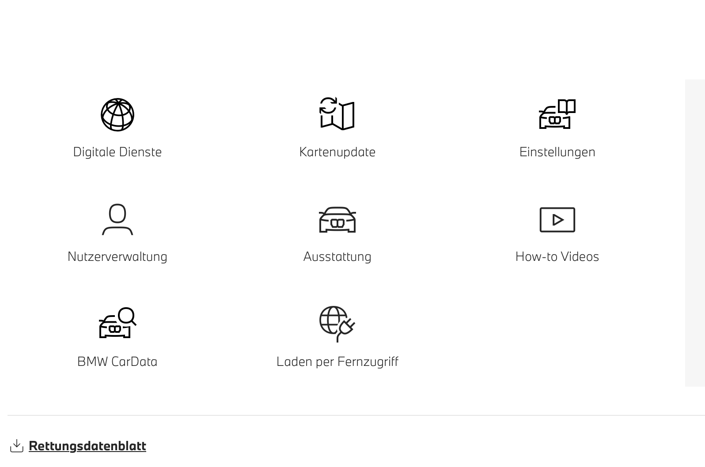
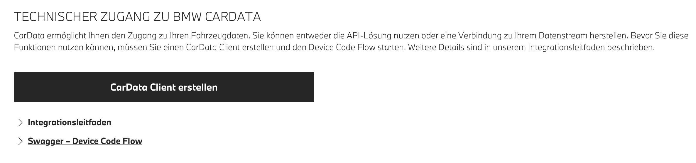
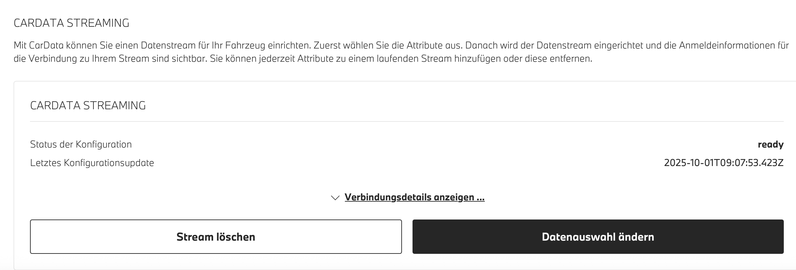

# ioBroker.bmw

## Versions

# BMW Adapter for ioBroker

This adapter integrates BMW vehicles into ioBroker using the new BMW CarData API with OAuth2 authentication and real-time MQTT streaming. It provides comprehensive vehicle data monitoring for all BMW models linked to your BMW account.

## Data Updata while charging

While charging it can happens that the battery level is not updated via stream because the car is sleeping/standby when turn on the car the data will be updated. You can trigger an update via API `bmw.0.vin.remote.fetchViaAPI`

## Datapoint Description

A detailed datapoint description you can find here [telematic.json](telematic.json)

## Setup Instructions

### 1. BMW ConnectedDrive Portal Setup

1. Visit the BMW ConnectedDrive portal: **https://www.bmw.de/de-de/mybmw/vehicle-overview**
2. Navigate to the **BMW CarData** section (you'll see various service categories)

3. Click on **"CarData Client erstellen"** (Create CarData Client) button
4. Copy the client_id
5. Wait 30 seconds
6. Click on CarData API
7. Wait 30 seconds
8. Click CarData Streaming

# **CRITICAL**: Click one service and wait 30 seconds if you see an error message, then click again. Don't press on "Gerät Authentifizieren/Devict authentication" Enter the client_id in iobroker settings.

### 2. CarData Streaming Configuration

**YOU MUST CONFIGURE CARDATA STREAMING AND SELECT ALL 244 DATA POINTS**

After creating your Client ID, configure streaming:

1. In the CarData section, look for **"CARDATA STREAMING"**
2. You should see the configuration status as **"ready"**
3. Note the **"Letztes Konfigurationsupdate"** (Last Configuration Update) timestamp

4. Click **"Datenauswahl ändern"** (Change Data Selection) button
5. **Select ALL categories** (Vehicle Status, Charging, Trip Data, etc.)
6. **Manually check ALL 244 individual data points**
7. Or enter this in Google Developer Console press F12 `document.querySelectorAll('label.chakra-checkbox:not([data-checked])').forEach(l => l.click());`
8. Save your configuration by clicking **"Stream löschen"** if needed to reset, then reconfigure

**Without selecting all data points, MQTT streaming will not provide complete data!**

### 3. Adapter Configuration

1. Enter your **Client ID** in the adapter settings
2. Enter your **CarData Streaming Username** (found in BMW portal under CarData > Streaming section)
3. Select your vehicle **brand** (BMW, Mini, Toyota Supra)
4. Set **update interval** (minimum 10 minutes due to API quota)
5. Configure **VIN ignore list** if needed

### 4. Authentication Process

1. Start the adapter
2. Check the logs for the OAuth2 authorization URL
3. Visit the URL and login with your BMW account
4. Authorize the application
5. The adapter will automatically continue after authorization

## Data Structure

Vehicle data is organized under `bmw.0.VIN.*` where `VIN` represents your Vehicle Identification Number:

### Main Folder Structure

- **`bmw.0.VIN.api.*`** - API Data (Periodic Updates)
  - Data fetched via BMW CarData REST API via .remote.
  - Uses API quota (50 calls per 24 hours)

- **`bmw.0.VIN.stream.*`** - Stream Data (Real-time MQTT)
  - Data received via real-time MQTT streaming or remote.fetchViaAPI
  - Instant updates when vehicle data changes
  - Includes all 244 configured data points

### Available API Endpoints (Configurable)

You can enable/disable these endpoints in adapter settings (BMW CarData API v1):

- `bmw.0.VIN.api.basicData.*` - Vehicle information, model, brand, series ✅ **(Default: Enabled)**
- `bmw.0.VIN.api.chargingHistory.*` - Charging sessions and history ✅ **(Default: Enabled)**
- `bmw.0.VIN.api.image.*` - Vehicle image for display purposes
- `bmw.0.VIN.api.locationBasedChargingSettings.*` - Location-specific charging preferences and settings
- `bmw.0.VIN.api.smartMaintenanceTyreDiagnosis.*` - Smart maintenance system tyre condition and diagnosis

### Metadata

- `bmw.0.VIN.lastStreamViaAPIUpdate` - Timestamp of last data update (API)
- `bmw.0.VIN.lastStreamUpdate` - Timestamp of last MQTT stream update

## Real-time Updates

The adapter receives real-time updates via MQTT streaming when:

- The car is not in sleep/standby
- Vehicle status changes (doors, windows, lights)
- Charging status updates
- Location changes during driving
- Climate control activation
- Service notifications

## Remote Commands

**Available Remote Controls:**

The BMW CarData API is read-only, so this adapter does not provide vehicle command functionality. For remote control capabilities, use:

**Official BMW Solutions:**

- **MyBMW Mobile App** - Full remote control functionality
- **BMW ConnectedDrive Portal** - Web-based vehicle management
- **BMW Alexa Skill** - Voice control integration with Amazon Alexa for commands like:
  - "Alexa, ask BMW to lock my car"
  - "Alexa, ask BMW to start climate control"
  - "Alexa, ask BMW to flash my lights"

**Remote Controls Available in This Adapter:**

- `fetchViaAPI` - Fetch latest telematic data via container API
- `basicData` - Refresh vehicle basic information (model, brand, series)
- `chargingHistory` - Fetch charging sessions from last 30 days
- `image` - Retrieve current vehicle image
- `locationBasedChargingSettings` - Get location-based charging preferences
- `smartMaintenanceTyreDiagnosis` - Fetch tyre diagnosis data

_Note: These are data retrieval commands only - no vehicle control commands are supported by the BMW CarData API._

## Troubleshooting

### Authentication Issues (400 Bad Request)

If you encounter authentication errors:

1. Verify CarData API is activated for your Client ID
2. Ensure CarData Streaming is enabled
3. Check that all 244 data points are selected
4. Consider regenerating your Client ID

### No MQTT Data

If you're not receiving real-time updates:

1. Verify CarData Streaming is subscribed and active
2. Ensure all data descriptors (244 points) are selected
3. Check that your vehicle supports CarData streaming
4. Restart the adapter after descriptor configuration changes

### API Quota Exceeded

The adapter manages the 50 API calls per 24-hour limit automatically:

- **Disable unnecessary API endpoints** in adapter settings to reduce quota usage
- Increase update interval if you hit quota limits frequently
- MQTT streaming doesn't count against API quota and provides real-time data
- Each enabled API endpoint uses one quota call per update interval

### Missing Data in API Folder

If you're not seeing expected data in `VIN.api.*`:

1. Check if the corresponding endpoint is enabled in adapter settings
2. Verify you haven't exceeded API quota (check adapter logs)
3. Some endpoints may not be available for all vehicle types
4. Check adapter logs for specific endpoint errors (404, 403, etc.)

### Understanding Data Sources

- **`VIN.api.*`** - Updated periodically based on interval and enabled endpoints
- **`VIN.stream.*`** - Updated in real-time via MQTT when vehicle data changes
- **`VIN.lastUpdate`** - Timestamp of most recent data update (API or MQTT)
- **`VIN.lastStreamUpdate`** - Timestamp of most recent MQTT stream update

## Source

This adapter is available at: [https://github.com/TA2k/ioBroker.bmw](https://github.com/TA2k/ioBroker.bmw)

## Changelog
### 4.3.1 (2025-10-11)

- fix gps coordinate parsing

### 4.3.0 (2025-10-09)

- improve logs
- add autocast
- add descriptions

### 4.2.0 (2025-10-04)

- improve token refresh
- fix image fetching

### 4.1.1 (2025-10-03)

- Add API fetching via Container and move other apis to manually fetching

### 4.0.5 (2025-10-01)

- **BREAKING:** Complete migration to BMW CarData API with OAuth2 Device Flow authentication
- **BREAKING:** Removed username/password authentication (deprecated by BMW)
- **BREAKING:** Removed all remote control functionality (CarData API is read-only)
- **BREAKING:** Removed second user support and CAPTCHA requirements
- **NEW:** Real-time MQTT streaming for instant vehicle data updates
- **NEW:** OAuth2 Device Code Flow authentication with PKCE
- **NEW:** API quota management system (50 calls per 24 hours)
- **NEW:** Configurable API endpoint selection to manage quota usage
- **NEW:** Organized folder structure: api/ for periodic updates, stream/ for real-time data
- **NEW:** Enhanced state management with proper object creation
- **NEW:** Modern JSON-based configuration interface (jsonConfig.json)
- **NEW:** Comprehensive setup documentation with BMW portal integration
- **FIXED:** MQTT message processing logic for correct data validation
- **FIXED:** State creation issues preventing "no existing object" errors
- **IMPROVED:** Removed unused dependencies (cookie handling, legacy auth)
- **IMPROVED:** Enhanced error handling with specific guidance for common issues

### 3.0.1 (2025-09-27)

- (hombach) change to recommended stable admin 7.6.17 (#159)
- (hombach) migrate to iobroker/eslint-config (#146)
- (hombach) fix form-data vulnerability
- (hombach) code cleanups
- (hombach) update axios
- (hombach) bump adapter-core
- (hombach) fix issues detected by repository checker (#170)
- (hombach) bump dependencies

### 3.0.0 (2025-06-10)

- BREAKING: Dropped support for Node.js 18 (#88)
- (hombach) BREAKING: Dropped support for js-controller 5 (#111)
- (hombach) BREAKING: change to admin 7.4.10 as recommended by ioBroker (#111)
- (hombach) encrypt and protect second user password - has to be reentered (#111)
- (hombach) bump dependencies

### 2.9.5 (2025-05-18)

- (hombach) update axios
- (hombach) fixing issues detected by repository checker (#88)
- (hombach) some small code cleanups/modernisations
- (hombach) add/translate description
- (hombach) update logo

### 2.9.4 (2025-02-26)

- fix for Mitbenutzer Feature

### 2.9.3 (2025-01-29)

- fix remote controls
- add Mitbenutzer Login for remote controls

### 2.9.0 (2024-11-28)

- added new remotes as switch and updated values
- added retry logic for remotes

### 2.8.4 (2024-11-21)

- improved charging session parsing
- added remote to fetch charging session from a specific month
- added raw JSON of charging session for export

### 2.8.3 (2024-11-18)

- login fixed

### 2.8.2 (2024-10-05)

- fix error getvehicles v2 failed

### 2.8.1 (2024-09-30)

- fix remote commands

### 2.7.1

- Bugfixes

### 2.5.5

- Fix login

### 2.5.0

- Fix login

### 2.4.1

- Add support for MINI and force refresh remote

### 2.3.0

- Disable v1 Endpoints

### 2.1.1

- Upgrade to statusV2 and remoteV2

### 2.0.0

- (TA2k) initial release

## License

MIT License

Copyright (c) 2021-2025 TA2k <tombox2020@gmail.com>

Permission is hereby granted, free of charge, to any person obtaining a copy
of this software and associated documentation files (the "Software"), to deal
in the Software without restriction, including without limitation the rights
to use, copy, modify, merge, publish, distribute, sublicense, and/or sell
copies of the Software, and to permit persons to whom the Software is
furnished to do so, subject to the following conditions:

The above copyright notice and this permission notice shall be included in all
copies or substantial portions of the Software.

THE SOFTWARE IS PROVIDED "AS IS", WITHOUT WARRANTY OF ANY KIND, EXPRESS OR
IMPLIED, INCLUDING BUT NOT LIMITED TO THE WARRANTIES OF MERCHANTABILITY,
FITNESS FOR A PARTICULAR PURPOSE AND NONINFRINGEMENT. IN NO EVENT SHALL THE
AUTHORS OR COPYRIGHT HOLDERS BE LIABLE FOR ANY CLAIM, DAMAGES OR OTHER
LIABILITY, WHETHER IN AN ACTION OF CONTRACT, TORT OR OTHERWISE, ARISING FROM,
OUT OF OR IN CONNECTION WITH THE SOFTWARE OR THE USE OR OTHER DEALINGS IN THE
SOFTWARE.
