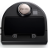

# ioBroker.botvac
  
## Installation
- Install the adapter
- fill in your Botvac user credentials
- if needed change the poll interval (60 is minimum)

## Usage
- use the states in the commands channel to control your Botvac
- use the can* states in the status channel to see which commands are valid
- all states in the status channel are read-only

## Examples
### clean in eco mode
- check if status.canStart is ```true```
- set commands.eco to ```true```
- set commands.clean to ```true```

### clean a 150cm * 150cm spot
- place the Botvac in front of the desired location
- check if status.canStart is ```true```
- set commands.spotHeight and commands.spotWidth to ```150``` 
- set commands.cleanSpot to ```true```

### return to base
- status.dockHasBeenSeen has to be ```true```
- Botvac has to be in paused or stopped state (commands.stop / commands.pause)
- set commands.goToBase to ```true```

## Changelog
<!--
    Placeholder for the next version (at the beginning of the line):
    ### **WORK IN PROGRESS**
-->
### 2.0.2 (2023-12-23)
- (ar7bd) SpotWidth and spotHeight are now allowed to be zero. [#29]
- (mcm1957) Dependencies have been updated.

### 2.0.1 (2023-09-20)
- (PeterVoronov) A problem causing crashes if some devices are unreachable has been fixed [#46]

### 2.0.0 (2023-09-18)
- (mcm1957) Migration to iobroker-community-adapters has been finalized.

### 2.0.0-alpha.1 (2023-09-15)
- (mcm1957) Adapter requires node 16 or newer now.
- (mcm1957) The adapter has been moved to iobroker-community-adapters.
- (mcm1957) This release is a consolidated version containing current github content.
- (mcm1957) Adapter should be compatible to js-controller 5 now.
- (mcm1957) Dependencies have been updated.

### 0.5.0
- (Pmant) add readme
- (Pmant) change pollInterval to seconds
- (Pmant) change pollInterval min to 60 seconds

### 0.4.0
- (Pmant) reduce update calls (/dashboard)

### 0.3.0
- (Pmant) fix bug where Botvac is not connected to wifi

### 0.2.0
- (Pmant) update status after command
- (Pmant) update commands

### 0.1.0
- (Pmant) inital commit

## License

MIT License

Copyright (c) 2023 iobroker-community-adapters <mcm57@gmx.at>

Permission is hereby granted, free of charge, to any person obtaining a copy
of this software and associated documentation files (the "Software"), to deal
in the Software without restriction, including without limitation the rights
to use, copy, modify, merge, publish, distribute, sublicense, and/or sell
copies of the Software, and to permit persons to whom the Software is
furnished to do so, subject to the following conditions:

The above copyright notice and this permission notice shall be included in all
copies or substantial portions of the Software.

THE SOFTWARE IS PROVIDED "AS IS", WITHOUT WARRANTY OF ANY KIND, EXPRESS OR
IMPLIED, INCLUDING BUT NOT LIMITED TO THE WARRANTIES OF MERCHANTABILITY,
FITNESS FOR A PARTICULAR PURPOSE AND NONINFRINGEMENT. IN NO EVENT SHALL THE
AUTHORS OR COPYRIGHT HOLDERS BE LIABLE FOR ANY CLAIM, DAMAGES OR OTHER
LIABILITY, WHETHER IN AN ACTION OF CONTRACT, TORT OR OTHERWISE, ARISING FROM,
OUT OF OR IN CONNECTION WITH THE SOFTWARE OR THE USE OR OTHER DEALINGS IN THE
SOFTWARE.
