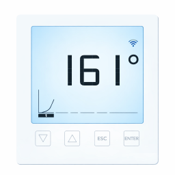

# ioBroker.brunner-eas3

**Tests:** 

## brunner-eas3 adapter for ioBroker

Adapter for reading data from Brunner combustion control system EAS 3. The data is published via WLAN broadcast messages.

If the connection to EAS 3 is lost, the combustion temperature is set to -99.

Burning states:
* -1 - status not available, connection lost
*  0 - door open
*  1 - fire start
*  2 - fire step 2
*  5 - end of fire
*  6 - Error/Timeout, fire start not detected
*  7 - fire done. 

### DISCLAIMER

This adapter is NOT an official product from Urlich Brunner GmbH. It was developed and maintained by members of the open source community.

## Changelog
<!--
	Placeholder for the next version (at the beginning of the line):
	### **WORK IN PROGRESS**
-->
### 1.1.4 (2026-04-14)
* (JR-HOME) release - some non-functional changes to be compliant to all IOBroker bot checks

### 1.1.1 (2026-03-26)
* (JR-HOME) release - updating roles of IOBroker objects, corrected add more wood status

### 1.0.7 (2026-03-06)
* (JR-HOME) release - correction for publishing adapter on IOBroker dev portal

### 1.0.6 (2026-03-01)
* (JR-HOME) release

## License
MIT License

Copyright (c) 2026 JR-Home 

Permission is hereby granted, free of charge, to any person obtaining a copy
of this software and associated documentation files (the "Software"), to deal
in the Software without restriction, including without limitation the rights
to use, copy, modify, merge, publish, distribute, sublicense, and/or sell
copies of the Software, and to permit persons to whom the Software is
furnished to do so, subject to the following conditions:

The above copyright notice and this permission notice shall be included in all
copies or substantial portions of the Software.

THE SOFTWARE IS PROVIDED "AS IS", WITHOUT WARRANTY OF ANY KIND, EXPRESS OR
IMPLIED, INCLUDING BUT NOT LIMITED TO THE WARRANTIES OF MERCHANTABILITY,
FITNESS FOR A PARTICULAR PURPOSE AND NONINFRINGEMENT. IN NO EVENT SHALL THE
AUTHORS OR COPYRIGHT HOLDERS BE LIABLE FOR ANY CLAIM, DAMAGES OR OTHER
LIABILITY, WHETHER IN AN ACTION OF CONTRACT, TORT OR OTHERWISE, ARISING FROM,
OUT OF OR IN CONNECTION WITH THE SOFTWARE OR THE USE OR OTHER DEALINGS IN THE
SOFTWARE.