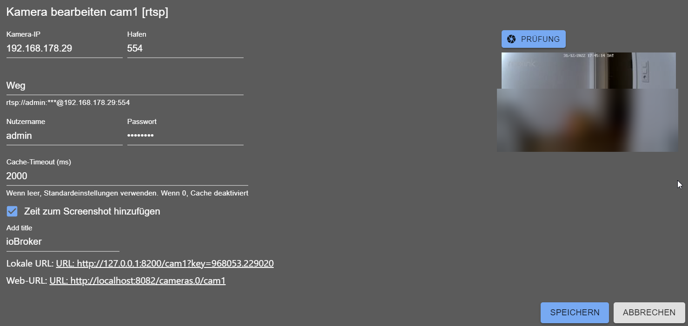

# ioBroker.cameras

[](https://www.npmjs.com/package/iobroker.cameras)
[](https://www.npmjs.com/package/iobroker.cameras)
[](https://david-dm.org/ioBroker/iobroker.cameras)
[](https://snyk.io/test/github/ioBroker/ioBroker.cameras)

[](https://nodei.co/npm/iobroker.cameras/)

**Tests:**: [](https://travis-ci.org/ioBroker/ioBroker.cameras)

## IP-Cameras adapter for ioBroker
You can integrate your web/ip cameras into vis and other visualizations.
If you configure a camera with name `cam1` it will be available on 
web server under `http(s)://iobroker-IP:8082/cameras.0/cam1`.

**Use exactly that URL - without a file extension.** Every request to it grabs a new frame from the
camera, so a periodic reload gives you a live picture.

The adapter additionally stores the last frame as a file under `cameras.0/cam1.jpg`, which the web
server also happens to serve under `http(s)://iobroker-IP:8082/cameras.0/cam1.jpg`. That file is only
rewritten when the adapter starts and whenever an `image` message is processed - it is **not** updated
by requesting it. Pointing a widget at the `.jpg` therefore shows a picture that never refreshes, no
matter which refresh interval is configured.

Additionally, the image could be requested via a message:
```js
sendTo('cameras.0', 'image', {
    name: 'cam1', 
    width: 100, // optional 
    height: 50, // optional
    angle: 90,   // optional
    noCache: true // optional, if you want to get the image not from cache
}, result => {
    const img = 'data:' + result.contentType + ';base64,' + result.data;
    console.log('Show image: ' + img);    
}); 
```

The result is always in `jpg` format.

Supported cameras:
- `Reolink E1 Pro` via RTSP (important, without `Pro` it will not work)
- `Eufy` via eusec adapter
- [HiKam](https://support.hikam.de/support/solutions/articles/16000070656-zugriff-auf-kameras-der-2-generation-via-onvif-f%C3%BCr-s6-q8-a7-2-generation-) of second and third generation via ONVIF (für S6, Q8, A7 2. Generation), A7 Pro, A9
- [WIWICam M1 via HiKam adapter](https://www.wiwacam.com/de/mw1-minikamera-kurzanleitung-und-faq/)
- RTSP Native - if your camera supports RTSP protocol
- Screenshots via HTTP URL - if you can get the snapshot from your camera via URL

### URL image
This is a normal URL request, where all parameters are in URL. Like `http://mycam/snapshot.jpg`  

### URL image with basic authentication
This is URL request for image, where all parameters are in URL, but you can provide the credentials for basic authentication. Like `http://mycam/snapshot.jpg`  

### FFmpeg
If you want to access snapshots on RTSP cameras, you can use ffmpeg. You need to install ffmpeg on your system:
- Windows has precompiled ffmpeg and there is no need to download anything. (Windows version is taken from here: https://www.gyan.dev/ffmpeg/builds/ffmpeg-git-full.7z)
- Linux: `sudo apt-get install ffmpeg -y`

How to update the windows version of `ffmpeg`:
- Download file https://www.gyan.dev/ffmpeg/builds/ffmpeg-git-full.7z
- Extract `bin/ffmpeg.exe`
- Rename `ffmpeg.exe` to `win-ffmpeg.exe`
- Zip `win-ffmpeg.exe` to `win-ffmpeg.zip`
- Place `win-ffmpeg.zip` in the root of this repository
- Execute `win-ffmpeg.exe --version` to get the version and save it into `main.ts` `WIN_FFMPEG_VERSION` constant (like `2025-02-02-git-957eb2323a-full_build-www.gyan.dev`)

Here is an example of how to add Reolink E1:



### Ezviz - How to re-enable RTSP for EZVIZ cameras
For some reason, EZVIZ decided to disable RTSP for their cameras:
- Open EZVIZ App and go to: Profile / Settings / Lan Live View
- Start scanning and then Select Camera:
- Login with your camera password (the default password is on the camera sticker)
- Press the Settings icon and select Local Service Settings
- Enable RTSP

## How to add a new camera (For developers)

### The easy way: a new manufacturer for the universal type
Most cameras do not need any code. The `universal` type is driven by the data files in
`src-admin/public/data/`, which are generated from ispyconnect.com:

1. Add the manufacturer to the `MANUFACTURERS` map at the top of `tools/parser.js`
2. Run `node tools/parser.js <manufacturer>` — this writes `src-admin/public/data/<manufacturer>.json`
   and updates `manufacturers.json`
3. Run `node tools/logos.js` to add a logo. It uses the brand mark from `simple-icons` when that
   collection carries the manufacturer, otherwise it generates a monogram. To use the real logo
   instead, simply place `<manufacturer>.svg`, `.png` or `.jpg` in `src-admin/public/data/` —
   existing files are never overwritten (unless `--force` is given)

The new manufacturer then appears in the dropdown of the "By manufacturer" camera type.

### A dedicated camera type
Only needed when the camera requires its own logic. Create a Pull Request with:
- `src/types.d.ts` — add the key to the `CameraType` union, add a `CameraConfigMyCam extends CameraConfig`
  interface and add it to the `CameraConfigAny` union
- `src/cameras/MyCamCamera.ts` — extend `GenericCamera` for a plain HTTP snapshot, or `GenericRtspCamera`
  for RTSP (fill `this.settings` and `this.decodedPassword` in `init()` before calling `super.init()`)
- `src/cameras/Factory.ts` — add the `case` for the new type
- `src-admin/src/Types/MyCam.tsx` — the configuration dialog, extending `ConfigGeneric`
- `src-admin/src/Tabs/Cameras.tsx` — import the dialog and add it to the `TYPES` structure, e.g.
  `mycam: { Config: MyCamConfig as unknown as IConfigGeneric, name: 'MyCam' },`. The key must be
  identical to the `type` used in the backend.
- Add the new labels to all files in `src-admin/src/i18n/`

### go2rtc (optional)
If `go2rtc` is enabled in the settings, a local [go2rtc](https://github.com/AlexxIT/go2rtc) process
replaces the `ffmpeg` processes: one per snapshot in the adapter, and one per camera in the web
extension. go2rtc holds a single connection per camera and serves all consumers from it.

go2rtc binds its API to `127.0.0.1` and is never reachable by the browser directly. All access goes
through the `web` adapter, so it uses the same authentication and the same http/https scheme as the
rest of ioBroker — no additional port has to be opened. Besides the existing web socket, each camera
also offers `/<instance>/<camera>/stream.mjpeg`, which can be used in a plain ``.

If the binary cannot be found or does not start, the adapter transparently falls back to `ffmpeg`.

## Todo
- [ ] Send new subscribe requests for RTSP cameras if the dialog is opened or closed 
<!--
	Placeholder for the next version (at the beginning of the line):
	### **WORK IN PROGRESS**
-->

## Changelog
### 3.0.2 (2026-08-17)
* (@GermanBluefox) The web extension can now request snapshots via messages instead of the private HTTP server, which is used automatically when the cameras adapter runs on a different host than the web instance
* (@GermanBluefox) Fixed: a failed snapshot request answered with an empty `{}` instead of the error message

### 3.0.1 (2026-08-16)
* (@GermanBluefox) Completely rewritten in TypeScript
* (@GermanBluefox) Added Ezviz cameras
* (@GermanBluefox) Snapshot requests are answered with `Cache-Control: no-store` so browsers cannot show a stale frame
* (@GermanBluefox) Fixed: a list of allowed IPs was never split correctly, so any list with more than one address rejected every request
* (@GermanBluefox) Fixed: connections from the IPv6 loopback address were not recognized as local
* (@GermanBluefox) Fixed: a failed image request could terminate the adapter with `ERR_HTTP_HEADERS_SENT`
* (@GermanBluefox) The cameras are reachable immediately after start instead of only after the first frame of every camera was grabbed
* (@GermanBluefox) The web extension picks up a changed key by itself, without restarting ioBroker.web
* (@paul179) Added Steinel cameras (as manufacturer of the universal camera type)
* (@GermanBluefox) The universal camera type now offers ~50 manufacturers with ~13000 models, each with a logo
* (ioBroker-Bot) Removed the deprecated `common.materialize` from io-package.json
* (ioBroker-Bot) Adapter requires js-controller >= 6.0.11 now
* (ioBroker-Bot) Adapter requires node.js >= 22 now
* (@GermanBluefox) Added Instar cameras
* (@GermanBluefox) Added optional go2rtc support for snapshots and live streams, proxied via the web adapter
* (@GermanBluefox) Fixed: the second viewer of the same camera did not receive any picture
* (@GermanBluefox) Added two widgets for ioBroker.devices: RTSP camera and snapshot camera
* (@GermanBluefox) Fixed: the `.running` state did not start or stop the stream
* (@GermanBluefox) Fixed: width/height/angle of the `image` message were ignored
* (@GermanBluefox) Fixed: a camera in the dialog of the snapshot widget was never used

### 2.1.2 (2024-07-15)
* (bluefox) Updated packages

### 2.1.1 (2024-07-07)
* (bluefox) Removed withStyles package

### 2.0.8 (2024-06-09)
* (bluefox) Packages updated
* (bluefox) Allowed selecting another source (with bigger resolution) for URL cameras

[Older changelogs can be found there](CHANGELOG_OLD.md)

## License
MIT License

Copyright (c) 2020-2026 bluefox <dogafox@gmail.com>

Permission is hereby granted, free of charge, to any person obtaining a copy
of this software and associated documentation files (the "Software"), to deal
in the Software without restriction, including without limitation the rights
to use, copy, modify, merge, publish, distribute, sublicense, and/or sell
copies of the Software, and to permit persons to whom the Software is
furnished to do so, subject to the following conditions:

The above copyright notice and this permission notice shall be included in all
copies or substantial portions of the Software.

THE SOFTWARE IS PROVIDED "AS IS", WITHOUT WARRANTY OF ANY KIND, EXPRESS OR
IMPLIED, INCLUDING BUT NOT LIMITED TO THE WARRANTIES OF MERCHANTABILITY,
FITNESS FOR A PARTICULAR PURPOSE AND NONINFRINGEMENT. IN NO EVENT SHALL THE
AUTHORS OR COPYRIGHT HOLDERS BE LIABLE FOR ANY CLAIM, DAMAGES OR OTHER
LIABILITY, WHETHER IN AN ACTION OF CONTRACT, TORT OR OTHERWISE, ARISING FROM,
OUT OF OR IN CONNECTION WITH THE SOFTWARE OR THE USE OR OTHER DEALINGS IN THE
SOFTWARE.
