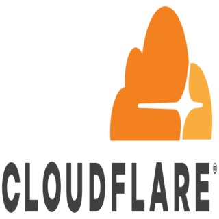

# ioBroker.cloudflare

**Tests:** 

## Cloudflare Adapter for ioBroker
Automatically updates the registered domain name at Cloudflare with your public IP address for your ioBroker. Dynamic DNS

## Changelog
<!--
	Placeholder for the next version (at the beginning of the line):
	### **WORK IN PROGRESS**
-->
### 1.2.9 (2025-12-31)
* Fixed #33
* Fixed #34

### 1.2.8 (2025-12-31)
* Fixed #27
* Fixed #28

### 1.2.7 (2025-05-29)
* Fixed #23
* Fixed #24

### 1.2.6 (2025-03-31)
* Fixed Axios High Vulnerability Issue detected by Dependabot

### 1.2.5 (2025-03-31)
* Fixed #20

### 1.2.4 (2025-02-13)
* Fixed #17

### 1.2.3 (2024-12-15)
* Fixes Issues by RepoChecker

### 1.2.2 (2024-10-20)
* Added NodeJS v22 to Workflows
* Updated README
* Fixes #14

### 1.2.1 (2024-08-16)
* Fixed Axios High Vulnerability Issue detected by Dependabot

### 1.2.0 (2024-08-12)
* Version Bump

### 1.1.6 (2024-08-09)
* Fixed E204 from Checker
* Fixed E162 from Checker

### 1.1.5 (2024-08-09)
* Updated Workflows

### 1.1.4 (2024-08-09)
* Updated LicenseInformation

### 1.1.3 (2024-08-09)
* Fixes some issues from checker

### 1.1.2 (2024-08-09)
* Updating to newest versions

### 1.1.1 (2022-11-16)
* Updated Translations

### 1.1.0 (2022-11-16)
* Fixed some Axios
* Fixed Error Handling
* Removed Discord and Slack Logs
* Updated Adapter Type
* Updated Minimum Node to 14.x
* Updated Workflows

### 1.0.11 (2022-10-22)
* Updated Adapter Description
* Updated Workflow

### 1.0.10 (2022-10-22)
* (Marco15453) Code Improvements and backup ip getter

### 1.0.9 (2022-10-17)
* (Marco15453) Updated Workflows

### 1.0.8 (2022-10-17)
* (Marco15453) Updated Workflows

### 1.0.7 (2022-10-17)
* (Marco15453) Changed Log Output from error to warn

### 1.0.6 (2022-10-17)
* (Marco15453) Removed this.disable() to prevent unexpected errors

### 1.0.5 (2022-10-17)
* (Marco15453) Updated Workflows

### 1.0.4 (2022-10-17)
* (Marco15453) Updated LICENSE and Adapter Configs

### 1.0.3 (2022-10-17)
* (Marco15453) Updated ReadMe

### 1.0.2 (2022-10-17)
* (Marco15453) Updated .eslintrc.json

### 1.0.1 (2022-10-17)
* (Marco15453) Updated cloudflare.png

### 1.0.0 (2022-10-17)
* (Marco15453) initial release

## License
MIT License

Copyright (c) 2025-2026 Marco15453 <support@marco15453.dev>

Permission is hereby granted, free of charge, to any person obtaining a copy
of this software and associated documentation files (the "Software"), to deal
in the Software without restriction, including without limitation the rights
to use, copy, modify, merge, publish, distribute, sublicense, and/or sell
copies of the Software, and to permit persons to whom the Software is
furnished to do so, subject to the following conditions:

The above copyright notice and this permission notice shall be included in all
copies or substantial portions of the Software.

THE SOFTWARE IS PROVIDED "AS IS", WITHOUT WARRANTY OF ANY KIND, EXPRESS OR
IMPLIED, INCLUDING BUT NOT LIMITED TO THE WARRANTIES OF MERCHANTABILITY,
FITNESS FOR A PARTICULAR PURPOSE AND NONINFRINGEMENT. IN NO EVENT SHALL THE
AUTHORS OR COPYRIGHT HOLDERS BE LIABLE FOR ANY CLAIM, DAMAGES OR OTHER
LIABILITY, WHETHER IN AN ACTION OF CONTRACT, TORT OR OTHERWISE, ARISING FROM,
OUT OF OR IN CONNECTION WITH THE SOFTWARE OR THE USE OR OTHER DEALINGS IN THE
SOFTWARE.