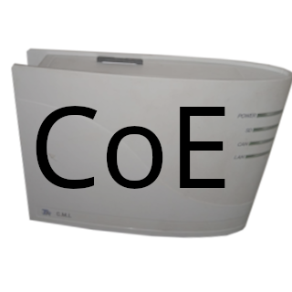

# ioBroker.cmicoe

**Tests:** 

## cmicoe adapter for ioBroker

Adapter to communicate with the [CMI by Technische Alternative via CoE](https://www.ta.co.at/x2-bedienung-schnittstellen/cmi)

### DISCLAIMER

This application is an independent product and is not affiliated with, endorsed by, or sponsored by Technische Alternative. All trademarks, logos, and brand names are the property of their respective owners.
This application is designed to work with the C.M.I. but is not an official product of Technische Alternative. Compatibility with all versions of the device cannot be guaranteed.

## Setup C.M.I.
### Enable CoE V2
On the C.M.I. web interface, go to Settings > CAN and choose `CoE V2 (4byte)` as CoE-Version

### Configure Output
On the C.M.I. web interface, go to Settings > Outputs > CoE and add an analog or digital output with following settings:

#### IP
Enter the iobroker server ip

#### Node number / Network Output
Enter the same number you specified in the inputs setting of the adapter

## Setup adapter

### Settings
#### Local IP
The IP-address, iobroker listens for CoE-Packages by the C.M.I.

#### Local Port
The port, iobroker listens for CoE-Packages by the C.M.I.  
By default, the C.M.I. sends all CoEv2-Packages via port 5442  
**This adapter only supports CoE V2!**

#### C.M.I. ip address
The IP-address, iobroker sends the CoE-Packages to

#### C.M.I. port
The port, iobroker sends the CoE-Packages to

#### send interval
The interval in seconds, in which all outputs are sent to the C.M.I.

#### send on change
If checked, the adapter also sends an output once it changes. 

## Changelog
### 1.3.1 (2026-07-06)
* update dependencies

### 1.3.0 (2026-05-14)
* update dependencies
* (copilot) Adapter requires node.js >= 22 now

### 1.2.5 (2026-04-01)
* update dependencies

### 1.2.4 (2025-12-13)
* bump @types/node to 25.0.1
* bump @tsconfig/node20 to 20.0.8
* bump glob
* bump actions/checkout to 6
* more dependency updates

### 1.2.3 (2025-10-25)
* migrate to npm trusted publishing

[Older changelogs can be found there](CHANGELOG_OLD.md)

## License
MIT License

Copyright (c) 2025-2026 FreDeko <freddegenkolb@gmail.com>

Permission is hereby granted, free of charge, to any person obtaining a copy
of this software and associated documentation files (the "Software"), to deal
in the Software without restriction, including without limitation the rights
to use, copy, modify, merge, publish, distribute, sublicense, and/or sell
copies of the Software, and to permit persons to whom the Software is
furnished to do so, subject to the following conditions:

The above copyright notice and this permission notice shall be included in all
copies or substantial portions of the Software.

THE SOFTWARE IS PROVIDED "AS IS", WITHOUT WARRANTY OF ANY KIND, EXPRESS OR
IMPLIED, INCLUDING BUT NOT LIMITED TO THE WARRANTIES OF MERCHANTABILITY,
FITNESS FOR A PARTICULAR PURPOSE AND NONINFRINGEMENT. IN NO EVENT SHALL THE
AUTHORS OR COPYRIGHT HOLDERS BE LIABLE FOR ANY CLAIM, DAMAGES OR OTHER
LIABILITY, WHETHER IN AN ACTION OF CONTRACT, TORT OR OTHERWISE, ARISING FROM,
OUT OF OR IN CONNECTION WITH THE SOFTWARE OR THE USE OR OTHER DEALINGS IN THE
SOFTWARE.
