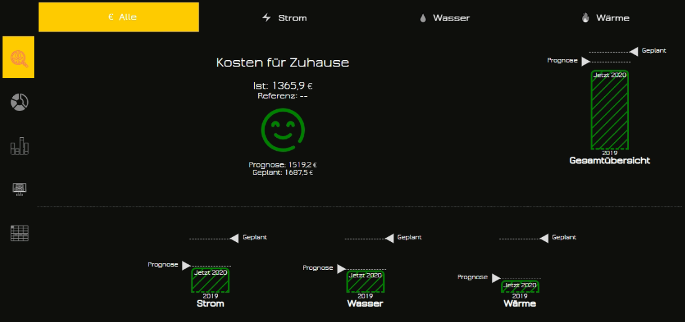
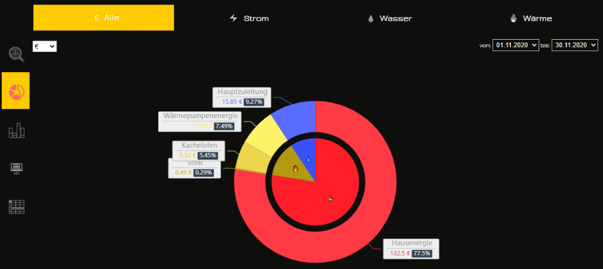
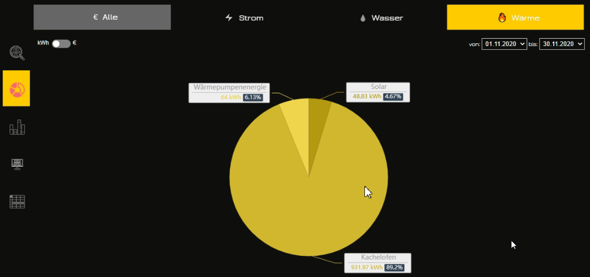
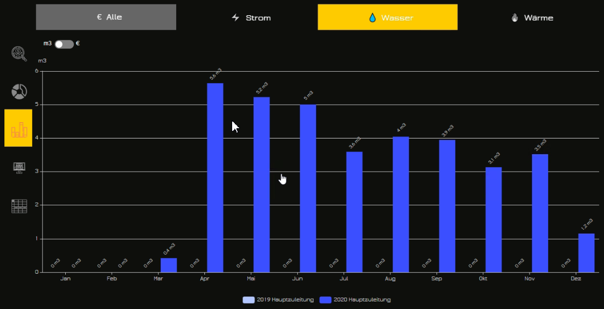
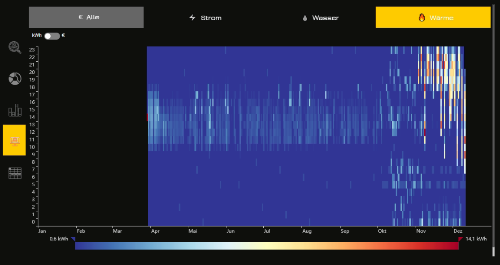
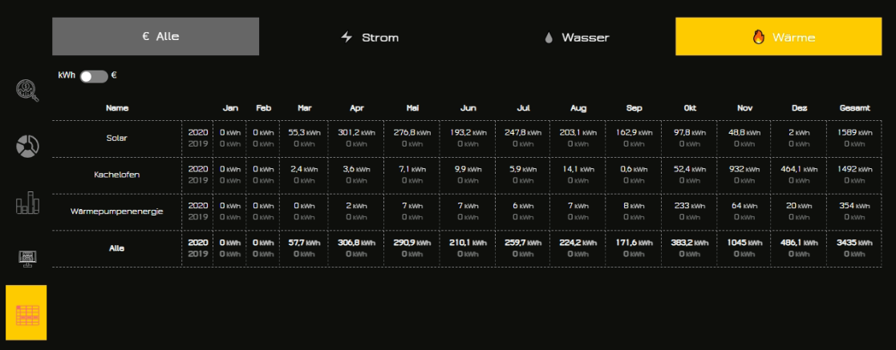

# ioBroker.consumption

## Consumption adapter for ioBroker
Calculates consumption for defined sensors and resources.

You can define different resources, like water, heating, electricity and make an analysis in vis with it.

4 different analysis types are implemented:
- Plan - Actual consumption in €/$ in this year compared with planned values and compared with previous year.
- Donut - Comparison between sensors or resources in form of pie/donut diagram
- Stack - Monthly consumption of every sensor and resource compared with data from the previous year in form of stack bar diagram.
- Heat map - Hourly consumption in this year for resources 
- Table - Monthly consumption of every sensor and resource compared with previous year in form of table  

## Requirements
Adapter requires the my-SQL or postgres SQL DB and ioBroker.sql adapter to be installed (It will be automatically installed)
It should work with SQLite too, but it is not recommended because of performance.
 
MS-SQL is not yet supported, but could be easily implemented if required. 

**Adapter is still beta.**
    
**Free edition supports only 4 sensors and only one station.** 
To support more sensors or stations you need a valid license. Request it under info@iobroker.com.   

## Usage
You have resources (like water, energy, heating, gas, etc), stations (like house, dacha, village villa, etc) and sensors.

Sensor is a counter, that always increases its value like electricity meter that always growing.

You must spread all these sensors first into defined resources and then into stations.

**Actually is only one station is supported!**

After that you can analyse your consumption in time and resources over years.

You can compare the actual year with the previous one and build some prognose about consumption.

Plan over all costs for the current year.

Distribution of costs by resources.

Distribution of consumption by sensors of one resource.

Distribution of consumption by sensors and months of one resource.

Heatmap of consumption of one resource for the current year.

Table of consumption of one resource for the current year for every month.

### Covert function
The sensor data can be converted, but the formula must be linear.
You can write the formula in javascript, but take care that the result must be a number(float).
Examples:
- Wh => kWh: `val / 1000`
- kWh => Wh: `val * 1000`
- °F => °C: `(val - 32) / 1.8`
- °C => °F: `val * 1.8 + 32`

## Update echarts (only for the developers)
Go to https://echarts.apache.org/en/builder.html
Select:
- Chart: bar, line, pie, heat-map, 
- Coordinate Systems: grid
- Component: title, legend, tooltip, MarkPoint, MarkArea, VisualMap, Toolbox
- Others: SVG Renderer, Utilities, Code Compression

## ToDo
- Price for every sensor possible
- Change prices: 
  - remove all prices by resources, 
  - add check box by every sensor: own price
  - hide station=>resource price if every sensor has own price
  - write directly into states and do not save the price in the object  
  
- Heatmap
  - Show by year   
- Charts

- Export data as PDF
- More than one station.
- Style selects according to theme (unit, start, end)

<!--
	Placeholder for the next version (at the beginning of the line):
	### **WORK IN PROGRESS**
-->

## Changelog
### 0.7.0 (2023-02-08)
* (bluefox) Added offset and factor to sensors

### 0.6.7 (2023-02-06)
* (bluefox) Added new features to table

### 0.6.0 (2023-01-30)
* (bluefox) Activated ignoring of null values by SQL

### 0.5.0 (2022-11-15)
* (bluefox) Charts were corrected

### 0.4.20 (2022-09-30)
* (bluefox) GUI was improved

### 0.4.18 (2021-07-09)
* (bluefox) The warnings were corrected

### 0.4.17 (2021-01-16)
* (bluefox) Corrected the conversion of values

### 0.4.15 (2021-01-06)
* (bluefox) Corrected forecast calculation based on current second of the month
* (bluefox) Added convert function

### 0.4.14 (2021-01-05)
* (bluefox) Corrected price calculation

### 0.4.13 (2020-12-13)
* (bluefox) Updated the select ID dialog

### 0.4.12 (2020-12-12)
* (bluefox) Added stations editor

### 0.4.11 (2020-12-10)
* (bluefox) Corrected the widget errors

### 0.4.9 (2020-12-06)
* (bluefox) Corrected error with the pie chart

### 0.4.7 (2020-11-16)
* (bluefox) Implemented the combine by unit

### 0.4.3 (2020-09-11)
* (bluefox) Fixed the layout in firefox

### 0.4.1 (2020-06-13)
* (bluefox) Ignore nulls and zeros

### 0.3.4 (2020-06-05)
* (bluefox) Added possibility to define the station

### 0.3.2 (2020-05-29)
* (bluefox) Fixed the units for heat-map

### 0.3.0 (2020-05-18)
* (bluefox) Calculate plan only in euro

### 0.2.7 (2020-05-16)
* (bluefox) Set index for every sensor

### 0.1.6 (2020-05-03)
* (bluefox) Implement planning start from

### 0.1.4 (2020-05-03)
* (bluefox) Make widget compatible with older devices
* (bluefox) Added price for every sensor

### 0.1.2
* (bluefox) finished

### 0.0.2
* (bluefox) initial release

## License

Commercial license.

(c) Copyright 2020-2023 Bluefox <dogafox@gmail.com>, all rights reserved.

This license is a legal agreement between you and ioBroker GmbH (“ioBroker”) for the use of `ioBroker.consumption` adapter (the “Software”).
By downloading of `ioBroker.consumption` adapter you agree to be bound by the terms and conditions of this license.
ioBroker GmbH reserves the right to alter this agreement at any time, for any reason, without notice.

## Permitted Use
One license grants the right to perform one installation of the Software.
Each additional installation of the Software requires an additional purchased license.