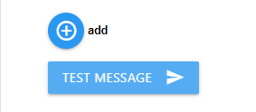
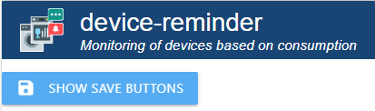
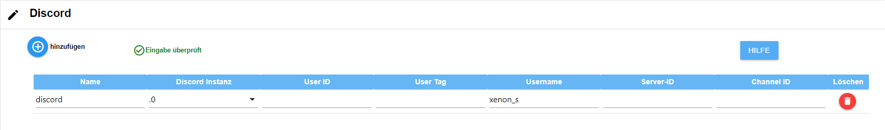

# ioBroker.device-reminder

## german readme needed?  [german readme](https://github.com/Xenon-s/ioBroker.device-reminder/blob/master/README_GER.md)

 

# Adapter for monitoring device states Version

This adapter can detect by means of measurement sockets whether a device is switched on, in operation or has been switched off and react to it. Messages can then be issued automatically via Telegram, whatsapp, alexa, sayit, pushover and email (multiple selection per device possible). It is also possible to automatically turn off the outlet after the process is completed (also time delayed). With given runtime it is possible to output an alarm per datapoint (with external script, the datapoint delivers only true/false or as display in the vis). For this it is sufficient to enter the pre-gating time simply in minutes into the datapoint 'device-reminder.X.XXX.config.runtime max'.

# What should be considered?

The refresh interval of the "live consumption value (is called **"\_energy "**)" for most devices should not be more than 10 seconds, otherwise it can lead to very delayed messages. The adapter itself polls the values every 10 seconds and uses new values event-based. This saves the system
 
Command in the Tasmota console : TelePeriod 10

# What is possible per device?

- Notification at device start
- Notification at the end of the operation of the respective device
- Telegram notification (multiple IDs are possible)
- Alexa notification (multiple IDs are possible)
- WhatsApp notification (multiple IDs are possible)
- Pushover notification (multiple IDs are possible)
- Email notification (multiple IDs are possible)
- Signal notification (multiple IDs are possible)
- Matrix notification (multiple IDs are possible)
- Notifications can be created freely or can be specified by an external script
- Data points with current status, live consumption and last sent status message to use values from this adapter in other scripts
- Devices can be switched off on demand (also time delayed), if process was detected finished
- Voice assistants can be temporarily disabled per datapoint
- Runtime monitoring in minutes: If the time is exceeded, an alarm is sent to all selected messengers

# Instruction

## Basic things in advance

For each group of devices, alexa etc. there is a button "Check input". If this button is clicked, the existing entries are checked for plausibility and you immediately get an answer whether all entries are correct. If you have made changes, this button must always be clicked! The button must always be clicked when it appears!
 

 

## Create device

- **Device name**: Freely selectable name
- **Device type**: here you have to select which device it is, so that the calculations in the adapter can be executed correctly
- **Consumption**: By clicking on the button with the three white dots your object management opens. You have to select the data point which shows the **current live consumption**.
- **Switch ON/OFF**: Click on the button with the three white dots to open your object management. You have to select the datapoint which switches your **socket on/off** (not mandatory). If this is not selected, no automatic switch off can take place.
- **Start text**: Notification that should be sent when the device is started (also special characters are possible)
- End text\*\*: Notification to be sent when the device has finished its operation (special characters are also possible)

At **Starttext** and **Endtext** you can also get a message from an external datapoint. This message is read with 1 second delay from the datapoint after the status of the device has changed. So you can get a message from an external script. The adapter automatically detects if a message comes from a datapoint or if it was simply entered manually. To select a datapoint, simply click on the button with the three white dots and then select the corresponding datapoint. **Please note**: only either a data point **or** a manually entered message can be used!
 

# Configure Devices

- **active**: Is activated by default. Here you can temporarily deactivate a device so that it no longer sends notifications.
- Device\*\*: will be created automatically
- **Alexa**: all previously created Alexas are listed here and can be added by click
- **sayit**: all previously created sayit devices are listed here and can be added by click
- **telegram**: all previously created telegram users are listed here and can be added by click
- **whatsapp**: all previously created whatsapp users will be listed here and can be added by clicking on them
- **pushover**: all previously created pushover users are listed here and can be added by click
- **email**: all previously created email users will be listed here and can be added by clicking on them
- **signal**: all previously created signal users are listed here and can be added by clicking on them
- **matrix**: all previously created matrix users are listed here and can be added by clicking on them
- **Switch off delay**: Here you can optionally enter a timeout in **minutes**. After the timeout has expired, the socket is switched off _if auto off is activated_. The end notification of the device remains unaffected by a timeout! Can only be used, if under "Devices" also a switch-off data point was deposited.
- **Cancel detection**: If activated, the adapter tries to detect if a device has already been switched off manually before the notification and then does not notify anymore.

After clicking on "**Save and close**", a folder is now created under _Objects -> device-reminder_ for each newly created device, in which

- do not disturb (if activated, no messages will be sent via **voice-reminder**)
- runtime max
- the current state of the device
- runtime alarm
- averageConsumption (can be used as an aid to determine your own thresholds)
- the last runs in JSON format
- the last runtime in hh:mm:ss
- the current live consumption
- the message to the messengers
- the current runtime in hh:mm:ss
- the current runtime in milliseconds

is displayed.
 

## Testbutton

There is a test button in every messenger. If this is clicked, a test message is sent to the respective messenger. If no message is received, please check the configuration. The adapter itself does not check whether the message has arrived!

## Show the save buttons if they are not displayed automatically

As the save buttons are occasionally not displayed, a button has been added to force this. If you press it, the save buttons appear. However, you save at your own risk, as the adapter does not check the input! The adapter may crash or the configuration data may be lost

## Create Alexa

- **Name**: Freely selectable name, special characters are also possible.
- alexa2/../announcement'/'speak'\*\*: Here you have to select the datapoint that lets your Alexa speak. To select the data point, simply click on the button with the three small white dots.
- **volume 0-100**: Volume at which your Alexa should speak (from 0 - 100%).
  The last 2 fields can be used to create a time period in which your Alexa is allowed to do voice output. By default, the period is active from 00:00 - 23:59.
- **active from**: Start time of the notification period
- **active until**: End time of the notification period

## Create SayIt device

- **Name**: Freely selectable name, special characters are also possible.
- **'sayit/../text'**: select the data point "text" in the respective sayIt device folder. Here the text output is sent.
- **volume 0-100**: volume with which your sayit device should speak (from 0 - 100%)
- **active from**: Start time of the notification period
- **inactive from**: End time of the notification period

## Create pushover user

- **Name**: Freely selectable name, special characters are also possible.
- **Pushover instance**: the instance to which the message is to be sent
- **Subject**: optional subject of the message
- **Device ID**: optional device ID to which the message should be sent
- **Priority**: The priority with which to send
- **Sound**: The sound to play when Pushover receives the message
- **TTL**: Duration after which a message is to be deleted (seconds)

## Create email user

- **name**: Freely selectable name, special characters are also possible.
- **sender address**: Email address from which the email is sent
- **receiver address**: Email address that is to receive the message

## Create signal user

- **Name**: Freely selectable name, special characters are also possible.
- **Signal instance**: The installed instance to send to

## create telegram user

- **Name**: Freely selectable name, special characters are also possible.
- **Telegram instance**: The installed instance to send to
- **select username/firstname/chatID**: Select whether to send to the username, firstname or the ChatID (recommended). The data is stored in the Telegram instance. If a negative ChatID is entered, the message is sent to a group
- **enter username or firstname or chatID**: Enter the username, firstname or the ChatID, depending on what was selected

## create whatsapp user

- **Name**: Freely selectable name, special characters are also possible.
- **'whatsapp-cmb/../sendMessage'**: The datapoint of the Whatsapp adapter to which the message should be sent.

## create discord user

- **Name**: Freely selectable name, special characters are also possible.
- **Discord instance**: The installed instance to send to.
- **User ID**: The Discord User Id
- **Chat Tag**: The Discord user tag
- **Chat Name**: The Discord user name (**Mandatory field**)
- **Server ID**: The Discord Server ID
- **Channel ID**: The Discord Channel ID

# Default devices

These values were determined over a period of several months and with the help of numerous testers. Changes to the values can lead to devices no longer being recorded correctly, resulting in false reports.

# Custom-devices

These values can be customised by the user and then used. The following is the explanation:

- **Threshold 'Start' (Watt)**: Start value in watts that must be exceeded for the device to be recognized as started.
- **Threshold value 'End' (Watt)**: End value in watts that must be undershot for the device to be recognized as terminated.
- **Threshold 'Standby' (Watt)**: Threshold value to indicate device as "OFF" or "IN STANDBY". If the currently calculated value is below the **Standy** threshold, the device is recognized as switched off.
- **Number of start values**: This specifies how often the "start value" must be exceeded **in succession**. Falling below this value once will result in a start abort. The average of these values must be above the start value for the device to be recognized as started.  
  _Example: The value should be 10W and exceeded 3 times in a row. 1. 15W, 2. 1W, 15W => start phase was aborted because the second value was below 10._.
- **Number of final values**: This specifies how many values are to be recorded before calculating whether the device is ready. The fewer values here, the less accurate the result and the risk of false alarms increases. The higher the value, the more accurate the recording. The disadvantage, however, is that the finished message is sent with a strong delay. End is only detected when "Number of end values" is reached and the average consumption is below the "Threshold value 'End' (Watt)".

_Short example calculation:_
Consumption values come in every 10 seconds. **Threshold 'end' (Watt)** is set to 50, **Number of end values** is set to 100. After the device has been recognized as started, 100 values (_takes 100values x 10 seconds = 1000 seconds_) are recorded and only then the average value is formed. If this is below 50, after approx. 16.5 minutes (we remember **number of end values** = 100 values) **finished** is recognized and a message (if configured) goes out. If the value is above 50, nothing happens, because the device is still in operation. Each additional value now replaces the oldest and a new average is calculated after each new value.
 

# Support

**If you like my work :**  

 
 

## Changelog

<!--
	Placeholder for the next version (at the beginning of the line):
    ### __WORK IN PROGRESS__
-->

### 4.x

- (xenon-s) new Admin UI in jsonConfig

### 3.1.2 (2024-01-22)

- (xenon-s) bugfix: [issue #381](https://github.com/Xenon-s/ioBroker.device-reminder/issues/381)
- (xenon-s) bugfix: [issue #382](https://github.com/Xenon-s/ioBroker.device-reminder/issues/382)

### 3.1.1 (2024-01-20)

- (xenon-s) bugfix: [issue #380](https://github.com/Xenon-s/ioBroker.device-reminder/issues/380)

### 3.1.0 (2024-01-19)

**Attention! Check the Telegram settings after the update! You must now enter either the username, firstname or the ChatID!**

- (xenon-s) enhancement "Add comment field "Default / Custom values": [issue #337](https://github.com/Xenon-s/ioBroker.device-reminder/issues/337)
- (xenon-s) enhancement "Integrate Discord": [issue #341](https://github.com/Xenon-s/ioBroker.device-reminder/issues/341)
- (xenon-s) enhancement "Integrate Pushover TTL": [issue #342](https://github.com/Xenon-s/ioBroker.device-reminder/issues/342)
- (xenon-s) enhancement "Button to check the messenger configuration": [issue #379](https://github.com/Xenon-s/ioBroker.device-reminder/issues/379)
- (xenon-s) bugfix: [issue #344](https://github.com/Xenon-s/ioBroker.device-reminder/issues/344)
- (xenon-s) bugfix: [issue #345](https://github.com/Xenon-s/ioBroker.device-reminder/issues/345)
- (xenon-s) bugfix: [issue #346](https://github.com/Xenon-s/ioBroker.device-reminder/issues/346)
- (xenon-s) bugfix: [issue #363](https://github.com/Xenon-s/ioBroker.device-reminder/issues/363)
- (xenon-s) Optimization : MessageHandler revised

### 3.0.1 (2023-10-18)

- (xenon-s) Update testing: [issue #325](https://github.com/Xenon-s/ioBroker.device-reminder/issues/325)
- (xenon-s) bugfix: [issue #327](https://github.com/Xenon-s/ioBroker.device-reminder/issues/327)
- (xenon-s) bugfix: [issue #328](https://github.com/Xenon-s/ioBroker.device-reminder/issues/328)
- (xenon-s) bugfix: [issue #329](https://github.com/Xenon-s/ioBroker.device-reminder/issues/329)
- (xenon-s) bugfix: [issue #344](https://github.com/Xenon-s/ioBroker.device-reminder/issues/344)
- (xenon-s) bugfix: [issue #346](https://github.com/Xenon-s/ioBroker.device-reminder/issues/346)

### 3.0.0 (2023-10-18)

**Breaking Changes**

- Made basic changes to the adapter structure, because there were numerous problems with the new "js-Controller 5.x". It is mandatory to reinstall the adapter!
- Numerous bug fixes
- New messengers added
- Admin GUI fundamentally reworked
- Whatsapp and Telegram must now be created manually
- (xenon-s) Fixes for js-controller 5.\*
- (xenon-s) bugfix: [issue #278](https://github.com/Xenon-s/ioBroker.device-reminder/issues/278)
- (xenon-s) bugfix: [issue #273](https://github.com/Xenon-s/ioBroker.device-reminder/issues/273)
- (xenon-s) bugfix: [issue #267](https://github.com/Xenon-s/ioBroker.device-reminder/issues/267)
- (xenon-s) bugfix: [issue #218](https://github.com/Xenon-s/ioBroker.device-reminder/issues/218)
- (xenon-s) bugfix: [issue #207](https://github.com/Xenon-s/ioBroker.device-reminder/issues/207)
- (xenon-s) GUI Fixes "devices" : switch may be empty, but then no longer selectable
- (xenon-s) add: [issue #258: Signal Messenger added](https://github.com/Xenon-s/ioBroker.device-reminder/issues/258)
- (xenon-s) add: [issue #245: Matrix added](https://github.com/Xenon-s/ioBroker.device-reminder/issues/245)
- (xenon-s) add: [issue #185: pushover device id added](https://github.com/Xenon-s/ioBroker.device-reminder/issues/185)
- (xenon-s) bugfix [issue #210](https://github.com/Xenon-s/ioBroker.device-reminder/issues/210)
- (xenon-s) bugfix [issue #169](https://github.com/Xenon-s/ioBroker.device-reminder/issues/169)
- (xenon-s) bugfix [issue #297](https://github.com/Xenon-s/ioBroker.device-reminder/issues/297)

### 1.2.9 (2021-06-22)

- (xenon-s) bugfix: error catching JSON last operations doesn't work

### 1.2.4 (2021-06-13)

- (xenon-s) bugfix: incorrect JSON format

### 1.2.3 (2021-06-13)

- (xenon-s) bugfix: [issue #76](https://github.com/Xenon-s/ioBroker.device-reminder/issues/76) messages from datapoint were not displayed
- (xenon-s) bugfix: [issue #75](https://github.com/Xenon-s/ioBroker.device-reminder/issues/75) "undefined is not a valid state"

### 1.2.1 (2021-05-01)

- (xenon-s) Adapter structure redesigned to classes
- (xenon-s) Admin UI design and inputs made more user friendly
- (xenon-s) Telegram bug fixed
- (xenon-s) Fix for js-controller 3.3.\*
- (xenon-s) new datapoints added (runtime max, last runs as JSON, last runtime, runtime max, runtime alert)
- (xenon-s) add: runtime-alert

### 1.0.0 (2021-01-05)

- (xenon-s) initial commit version 1.0

## License

MIT License

Copyright (c) 2024 xenon-s <ente_s@hotmail.de>

Permission is hereby granted, free of charge, to any person obtaining a copy
of this software and associated documentation files (the "Software"), to deal
in the Software without restriction, including without limitation the rights
to use, copy, modify, merge, publish, distribute, sublicense, and/or sell
copies of the Software, and to permit persons to whom the Software is
furnished to do so, subject to the following conditions:

The above copyright notice and this permission notice shall be included in all
copies or substantial portions of the Software.

THE SOFTWARE IS PROVIDED "AS IS", WITHOUT WARRANTY OF ANY KIND, EXPRESS OR
IMPLIED, INCLUDING BUT NOT LIMITED TO THE WARRANTIES OF MERCHANTABILITY,
FITNESS FOR A PARTICULAR PURPOSE AND NONINFRINGEMENT. IN NO EVENT SHALL THE
AUTHORS OR COPYRIGHT HOLDERS BE LIABLE FOR ANY CLAIM, DAMAGES OR OTHER
LIABILITY, WHETHER IN AN ACTION OF CONTRACT, TORT OR OTHERWISE, ARISING FROM,
OUT OF OR IN CONNECTION WITH THE SOFTWARE OR THE USE OR OTHER DEALINGS IN THE
SOFTWARE.
