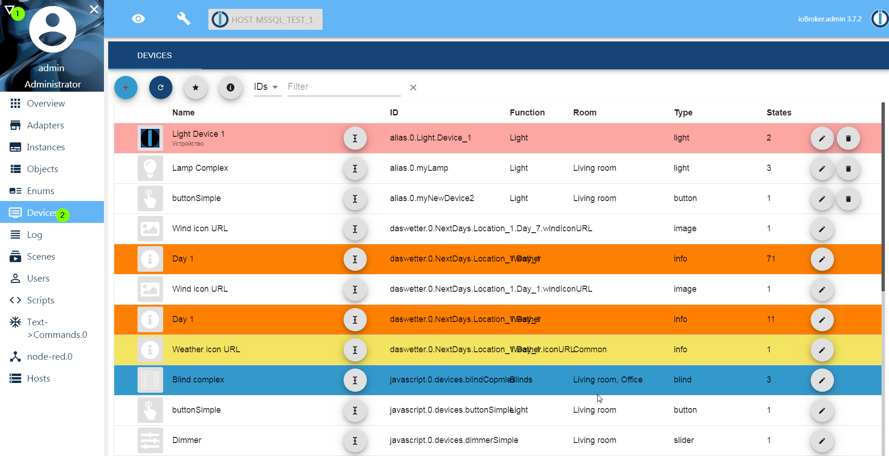

# ioBroker.devices

## Device adapter for ioBroker

Manage and create devices for using it in other adapters like material, iot, matter...

**Important: enable tab in admin, like log and scripts**

**This adapter uses Sentry libraries to automatically report exceptions and code errors to the developers.** For more details and for information on how to disable the error reporting, see [Sentry-Plugin Documentation](https://github.com/ioBroker/plugin-sentry#plugin-sentry)! Sentry reporting is used starting with js-controller 3.0.

## ioBroker.devices Adapter User Manual

### Overview

The `ioBroker.devices` adapter is a component of the ioBroker smart home platform designed to simplify device management by creating and managing virtual devices.

These virtual devices provide a standardized interface for physical devices, making it easier to integrate, script, visualize, and control devices across different manufacturers and protocols.

The adapter ensures consistency in data point naming and structure, reducing the need to modify scripts or visualizations when hardware changes.

It wraps any collection of states in ioBroker (physical **or** virtual) into well‑formed **devices** with rich information:
* `type`, `role`, `smartName`, `color`, `room`, `function`, `icon`, `unit` and more

The result is consumed by dashboards (Material UI, VIS‑2), voice assistants (Alexa/Google), matter adapter, the **iot/cloud** adapter and scripts, giving you a clean, future‑proof object tree.

**Note:** The adapter does **not** poll hardware. It runs as a tab‑only “web” instance → zero CPU/RAM footprint.

### Purpose

The `ioBroker.devices` adapter serves the following purposes:
- Standardization: Creates virtual devices with consistent data point structures, regardless of the underlying hardware or protocol from different data points.
- Simplified Maintenance: Allows users to swap physical devices without updating scripts or visualizations by remapping data points in the adapter. 
- Enhanced Compatibility: Integrates seamlessly with visualization adapters (e.g., Material UI, VIS), IoT adapters (e.g., Alexa, Google Home).
- User-Friendly: Simplifies device management for beginners while offering flexibility for advanced users.

#### Standardization
Many adapters like mqtt, knx or similarly deliver data points with different names and structures. This adapter creates a virtual device with a consistent structure, making it easier to manage and visualize devices.
It adds automatic roles, units and names to the states.

#### Simplified Maintenance
The `ioBroker.devices` adapter allows users to create virtual devices that can be easily remapped to different physical devices.
This means that if you change a physical device, you don't need to update your scripts, visualizations or history settings; you just need to remap the data points in the adapter.

#### Enhanced Compatibility
The adapter knows what the devices should look like and how to use them. It creates a virtual device with the same structure as the physical device, making it easier to integrate with other adapters.

#### User-Friendly
The `ioBroker.devices` adapter is designed to be user-friendly, making it accessible for beginners while still offering advanced features for experienced users. The intuitive interface allows users to create and manage virtual devices without needing extensive technical knowledge.

## Configuration

Once installed, configure the adapter via the Devices tab in the ioBroker admin interface.

### Creating a Virtual Device

Open Devices Tab in admin.

#### Add Device

- Click the "+" button to create a new virtual device.
- Enter a Name for the device (e.g., "LivingRoomLight").
- Select a Device Type (e.g., Light, Switch, Thermostat) from the predefined list.
- Optionally, assign a Category (e.g., Lighting, Heating) for the organization.

Map Data Points:

For each function (e.g., on/off, brightness), map the virtual device’s data point to the corresponding state of the physical device (e.g., `hm-rpc.0.12345.1.STATE` for a Homematic switch).

Use the interface to browse and select states from other adapters.

Save: Click "Save" to create the virtual device. It will appear under alias.0.<DeviceName> in the Objects tab.

#### Types of Devices

The `ioBroker.devices` adapter supports three main approaches to device creation:

1. Automatically Detected Devices

Some adapters (e.g., ioBroker.zigbee, ioBroker.hm-rpc) already provide a valid structure for the devices, and they will be detected automatically **if some category (function or room) is assigned**.
Without the assigned category, the automatically detected device will not be processed.

2. Linked Devices

Linked devices are virtual devices manually created to mirror a specific physical device’s data points with `ioBroker.linkeddevices`.

It is suggested to use `ioBroker.devices` and `alias.0` branch instead of `linkeddevices`.

3. Aliases

Aliases are lightweight virtual devices that act as shortcuts or simplified references to existing states without creating a full device structure.

You can create a new virtual device in a `alias.0` branch. By selecting the device type, you should fill all required states (marked with *). Optionally, you can add not required states (e.g., humidity by temperature sensor).
For every required state and filled optional state, the adapter creates a structure of aliases.
If you created e.g. a temperature device named `Temperature` and provided both states (temperature and humidity) you will find the following states and channel in `alias.0` branch:
- `alias.0.Temperature` - channel
- `alias.0.Temperature.temperature` - state with unit '°C'. It should have a virtual link to some real state with temperature. If you remove the alias in `ioBroker.devices` adapter, this state will stay without a link.
- `alias.0.Temperature.humidity` - state with unit '%'. This will have a virtual link to real state (e.g., to `hm-rpc.0.JHAGHGJJJ.1.HUMIDITY`). If you remove alias in `ioBroker.devices` adapter, this state will be deleted.

Almost every device type could have additional states (indicators) for battery, connectivity, error and some more else. They are optional, but some adapters (e.g., `material` or `matter`) could interpret it.

For every state, you can provide all settings that aliases support:
- Different states for read and write
- Convert formula for read and write

#### Managing Devices
Edit Device: In the Devices tab, click the pencil icon next to a device to modify its name, type, category, color, name, icon or data point mappings.

Delete Device: Click the trash can icon to remove a virtual device. This does not affect the physical device or its adapter.

Organize Devices: Use categories to group devices (e.g., "Lighting", "Heating") for easier management in visualizations.

## Type of devices
This adapter is built with the help of `type-detector`. All possible devices could be found [here](https://github.com/ioBroker/ioBroker.type-detector/blob/master/DEVICES.md) 

## Video

## Changelog
<!--
	Placeholder for the next version (at the beginning of the line):
	### **WORK IN PROGRESS**
-->
### 4.1.1 (2026-08-17)
* (@GermanBluefox) Fixed states being written without `common.read` and `common.write`, which every state object must carry: the "add state" dialog left both out for the deprecated `file` type, and dropped them from any state it edited that did not have them yet (#535, #533, #463)
* (@GermanBluefox) States written by earlier versions have the two attributes added once when the device list is loaded. What is missing is taken from the device type and from the aliased source, so a state the device really can write does not turn read-only

### 4.1.0 (2026-08-16)
* (@Apollon77) Added support of new device types
* (@GermanBluefox) Datapoints added to an alias device by hand now reach the widget GUI, so a tank can show the litres it has left next to its fill level
* (@GermanBluefox) The tank tile shows that second reading where it used to print its fill level a second time
* (@GermanBluefox) Fixed the settings button of a 2x0.5 tank tile sitting in the middle of the tile instead of in its top-right corner

### 4.0.2 (2026-08-10)
* (@SimonFischer04) Added WindowTilt support in the widgets GUI (#609)
* (@GermanBluefox) Added min/max values (last 24 hours or today) for widgets with history (#610)
* (@GermanBluefox) Reworked the "Blue dark" theme into a deep navy look and gave the category icons a coloured round badge
* (@GermanBluefox) Added role icons for UV index, knots, rpm, operating hours and W/kW/Wh
* (@GermanBluefox) The device list now shows the icon configured for a widget, and falls back to the role icon instead of the generic type icon
* (@GermanBluefox) Info devices are no longer hidden by default; the "i" button in the toolbar now shows whether the filter is active
* (@GermanBluefox) Fixed widgets vanishing from the GUI when they were assigned to a category that no longer exists
* (@GermanBluefox) Fixed categories being dropped as empty although widgets had been moved into them
* (@GermanBluefox) Fixed the "record history" switch: it now follows the alias to the recorded source and is highlighted while recording
* (@GermanBluefox) Fixed clipped values in the wind widget
* (@GermanBluefox) Fixed emoji icons sitting off-centre in the category badges and header
* (@GermanBluefox) Fixed an alias assignment being dropped silently when saving a device whose state was not cached yet
* (@GermanBluefox) Implemented user-specific views
* (@Apollon77) Added widgets for button, buttonSensor, camera and vacuumCleaner, which were shown as "Widget type not supported" before
* (@Apollon77) Added mute and the separate volume feedback state (`VOLUME_ACTUAL`) to the media player widget
* (@Apollon77) Added the missing tilt controls to the blind widgets: tilt now works for button blinds too, has a stop button, and uses the min/max of the state instead of assuming percent
* (@Apollon77) Added an active icon for windowTilt
* (@Apollon77) The light widget now shows the real state from `ON_ACTUAL` instead of echoing the commanded value
* (@Apollon77) Fixed image widgets: the configured defaults were ignored until the settings dialog was opened once, and the refresh button was answered from the cache
* (@Apollon77) Fixed newer device types (windowTilt, camera, percentage, fillLevel, …) landing in the "other" group when auto-grouping is switched on
* (@Apollon77) Fixed the type of created alias states: `defaultType` is now honoured, so the ERROR state is no longer created as boolean
* (@Apollon77) Fixed the air conditioner editor showing the swing state twice and writing it twice on save
* (@Apollon77) Fixed the enum assignment of created devices: it ran once per state and not at all for devices with only optional states
* (@Apollon77) Fixed the build and the CI (unresolvable react-input-color dependency, out-of-sync lock files, node versions)

### 4.0.0 (2026-08-03)
* (@GermanBluefox) Added min/max values (last 24 hours or today) for widgets with history
* (@GermanBluefox) Fixed the history options (chart, trend, min/max) not being offered in the widget settings
* (@GermanBluefox) Recreate all missing instance monitoring objects, not only alive/connected
* (@GermanBluefox) Migrated to react 19 and MUI 9

### 3.0.2 (2026-06-30)
* (@GermanBluefox) Added support for widget icons

[Older changelogs can be found there](CHANGELOG_OLD.md)

## License
MIT License

Copyright (c) 2019-2026 bluefox <dogafox@gmail.com>

Permission is hereby granted, free of charge, to any person obtaining a copy
of this software and associated documentation files (the "Software"), to deal
in the Software without restriction, including without limitation the rights
to use, copy, modify, merge, publish, distribute, sublicense, and/or sell
copies of the Software, and to permit persons to whom the Software is
furnished to do so, subject to the following conditions:

The above copyright notice and this permission notice shall be included in all
copies or substantial portions of the Software.

THE SOFTWARE IS PROVIDED "AS IS", WITHOUT WARRANTY OF ANY KIND, EXPRESS OR
IMPLIED, INCLUDING BUT NOT LIMITED TO THE WARRANTIES OF MERCHANTABILITY,
FITNESS FOR A PARTICULAR PURPOSE AND NONINFRINGEMENT. IN NO EVENT SHALL THE
AUTHORS OR COPYRIGHT HOLDERS BE LIABLE FOR ANY CLAIM, DAMAGES OR OTHER
LIABILITY, WHETHER IN AN ACTION OF CONTRACT, TORT OR OTHERWISE, ARISING FROM,
OUT OF OR IN CONNECTION WITH THE SOFTWARE OR THE USE OR OTHER DEALINGS IN THE
SOFTWARE.
