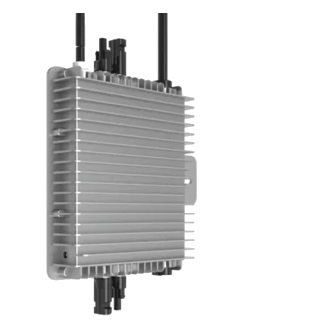

# ioBroker.deyeidc

**Tests:** 

## deyeidc adapter for ioBroker

Data Collector vor Deye-compatible Inverter

### Getting started

This adapter makes it possible to read data from an inverter in the local network. For this, only the IP of the inverter and the serial number of the logger must be entered. If the port differs from the default value, this can also be adjusted. 60 seconds is preset as a practicable value for the sampling rate.

The data itself is retrieved via known Modbus registers and stored in the data points. This was developed and tested on a "Deye-compatible" inverter. The registers to be queried may therefore differ for other models.

## Usage

To commission the adapter, the register areas and coils must also be entered in the GUI on the following pages. In the meantime, there are already example entries for various types on github (e.g. https://github.com/raschy/ioBroker.deyeidc/blob/main/deyeidc.MI600.json).
Basically, the registers must be determined from the respective documentation. Depending on the type of content, decoding is done via the "rules".

The following applies here:
| Rules | Descriptions |
| ----- | ------------ |
| 0 | raw_signed |
| 1 | for 16-bit-unsigned Values |
| 2 | for 16-bit-signed Values |
| 3 | for 32-bit-unsigned Values |
| 4 | for 32-bit-signed Values |
| 5 | for Serial Number |
| 6 | for Temperature |
| 7 | for Version Number |
| 8 | for SingleBytes (MSB) |
| 9 | for SingleBytes (LSB) |

The documentation also shows whether the decimal point must be shifted by one or two digits. The entry "Factor" serves this purpose. Herewith no further meaningful calculations can be made.

Certain values are not supplied by the inverter and must be calculated independently. For this purpose, two values per line can be entered in the table 'compute', which are then calculated.
A typical example is "DV1 \* DC1", where the result is then stored in "Key" with the corresponding unit in the data tree. Please note that only one basic calculation type can be processed per line. Bracket rules are therefore not possible and are not supported.

### DISCLAIMER

All product and company names or logos are trademarks™ or registered® trademarks of their respective holders. Use of them does not imply any affiliation with or endorsement by them or any associated subsidiaries! This personal project is maintained in spare time and has no business goal. DEYE is a trademark of Copyright © 2023 Ningbo Deye Technology Co., Ltd., No.26 South Yongjiang Road, Beilun, Ningbo, Zhejiang, 315806 VR China.

## Changelog

<!--
	Placeholder for the next version (at the beginning of the line):
	### **WORK IN PROGRESS**
-->
### 0.0.14 (2023-10-20)

-   (raschy) Heartbeat also filtered

### 0.0.13 (2023-10-16)

-   (raschy) Dialogue to relay filtered

### 0.0.12 (2023-10-09)

-   (raschy) Changes in the connection setup
-   (raschy) RangeError fixed

### 0.0.11 (2023-08-26)

-   (raschy) wrong implementation msb/lsb of 32-bit values recorrected

### 0.0.10 (2023-08-25)

-   (raschy) Calculation of 32-bit values corrected
-   (raschy) Ready for launch into the stable repository

### 0.0.9 (2023-07-10)

-   (raschy) minor bugs fixed

### 0.0.8 (2023-07-10)

-   (raschy) Day reset for offline operation

### 0.0.7 (2023-05-27)

-   (raschy) release for npm and ioBroker latest

### 0.0.6 (2023-05-27)

-   (raschy) Some processes optimized

### 0.0.5 (2023-04-27)

-   (raschy) Calculations modified with formulas
-   (raschy) Error messages in English

### 0.0.4 (2023-03-21)

-   (raschy) release for npm

### 0.0.3 (2023-03-21)

-   (raschy) release

### 0.0.2 (2023-03-21)

-   (raschy) initial release

## License

MIT License

Copyright (c) 2023 raschy <raschy@gmx.de>

Permission is hereby granted, free of charge, to any person obtaining a copy
of this software and associated documentation files (the "Software"), to deal
in the Software without restriction, including without limitation the rights
to use, copy, modify, merge, publish, distribute, sublicense, and/or sell
copies of the Software, and to permit persons to whom the Software is
furnished to do so, subject to the following conditions:

The above copyright notice and this permission notice shall be included in all
copies or substantial portions of the Software.

THE SOFTWARE IS PROVIDED "AS IS", WITHOUT WARRANTY OF ANY KIND, EXPRESS OR
IMPLIED, INCLUDING BUT NOT LIMITED TO THE WARRANTIES OF MERCHANTABILITY,
FITNESS FOR A PARTICULAR PURPOSE AND NONINFRINGEMENT. IN NO EVENT SHALL THE
AUTHORS OR COPYRIGHT HOLDERS BE LIABLE FOR ANY CLAIM, DAMAGES OR OTHER
LIABILITY, WHETHER IN AN ACTION OF CONTRACT, TORT OR OTHERWISE, ARISING FROM,
OUT OF OR IN CONNECTION WITH THE SOFTWARE OR THE USE OR OTHER DEALINGS IN THE
SOFTWARE.
