# ioBroker.discord


This [ioBroker] adapter integrates a [Discord] bot into ioBroker.

The adapter will create an object tree including objects and states for server and channel where the bot is on.
Also an object tree with all users seen by the bot will be created.  
Using this states, it's possible to receive and send messages and files on Discord.

Additionally, the adapter can register Discord slash commands to get and set ioBroker state values.

- [ioBroker.discord](#iobrokerdiscord)
  - [Features](#features)
  - [Creating a Discord bot](#creating-a-discord-bot)
  - [Adding the bot to a server](#adding-the-bot-to-a-server)
    - [Remove the bot from a server](#remove-the-bot-from-a-server)
  - [States](#states)
    - [discord.0.bot.\*](#discord0bot)
    - [discord.0.servers.\<server-id\>.\*](#discord0serversserver-id)
    - [discord.0.servers.\<server-id\>.channels.\<channel-id\>.\*](#discord0serversserver-idchannelschannel-id)
    - [discord.0.servers.\<server-id\>.members.\<user-id\>.\*](#discord0serversserver-idmembersuser-id)
    - [discord.0.users.\<user-id\>.\*](#discord0usersuser-id)
    - [discord.0.slashCommands.\<command-name\>.\*](#discord0slashcommandscommand-name)
    - [discord.0.raw.\*](#discord0raw)
  - [Authorization](#authorization)
  - [Messages](#messages)
    - [Receiving messages](#receiving-messages)
      - [Using text2command](#using-text2command)
    - [Sending messages](#sending-messages)
      - [Sending simple texts](#sending-simple-texts)
      - [Sending files](#sending-files)
      - [Sending reactions](#sending-reactions)
      - [Sending replies](#sending-replies)
      - [Sending special custom messages](#sending-special-custom-messages)
  - [Slash commands](#slash-commands)
    - [Configure states for slash commands](#configure-states-for-slash-commands)
    - [Get states](#get-states)
    - [Set states](#set-states)
    - [Get an overview about states configured for slash commands](#get-an-overview-about-states-configured-for-slash-commands)
    - [Custom slash commands](#custom-slash-commands)
      - [Structure of a custom slash command json state](#structure-of-a-custom-slash-command-json-state)
  - [Blockly](#blockly)
    - [Blockly example: Send a message to a user and edit it after three seconds](#blockly-example-send-a-message-to-a-user-and-edit-it-after-three-seconds)
    - [Blockly example: Send a composed message with an embed and two file attachments](#blockly-example-send-a-composed-message-with-an-embed-and-two-file-attachments)
    - [Blockly example: Listen to custom slash command executes and send an image of the requested IP cam](#blockly-example-listen-to-custom-slash-command-executes-and-send-an-image-of-the-requested-ip-cam)
  - [Usage in scripts](#usage-in-scripts)
    - [Send a message from a script](#send-a-message-from-a-script)
    - [Edit a message from a script](#edit-a-message-from-a-script)
    - [Delete a message from a script](#delete-a-message-from-a-script)
    - [Add a reaction emoji to a message from a script](#add-a-reaction-emoji-to-a-message-from-a-script)
    - [Await reactions to a message in a script](#await-reactions-to-a-message-in-a-script)
    - [Reply to a custom slash command from a script](#reply-to-a-custom-slash-command-from-a-script)
    - [Get information about a server in a script](#get-information-about-a-server-in-a-script)
    - [Get information about a server channel in a script](#get-information-about-a-server-channel-in-a-script)
    - [Get information about a user in a script](#get-information-about-a-user-in-a-script)
    - [Get information about a server member in a script](#get-information-about-a-server-member-in-a-script)
    - [Get information about a previous message in a script](#get-information-about-a-previous-message-in-a-script)

## Features

* ioBroker states for all servers of the bot to receive and send messages
* ioBroker states for all users seen by the bot to receive and send direct messages
* Simplified Discord server join and leave for the bot
* Set the bot status including actions
* Optional observe user presence status
* Optional observe server member voice status
* Server member voice actions (mute, deafen, disconnect)
* Handle all messages or only messages with bot mentions on server channels
* Handle direct messages
* Optional automatic react with a emoji on mentions
* `.json` states for channel, user and message data
* Send messages, files, reactions (emojis), reply messages, or custom json-formated message contents
* List server and channel members including member roles
* Support for Discord slash commands to get and set state values
* Support for user defined Discord slash commands to be handled by custom scripts
* Support for [text2command] (has to be enabled for each `.message` state where it should be used)
* Send, edit and delete messages, add and await message reactions using Scripts
* Optional raw states to allow more flexibility in custom scripts
* Support for Blockly with custom blocks to send and edit messages and to handle custom slash commands

What's *not* supported and *not* intended:

* Messages in threads
* Send and receive voice messages

Missing some feature? Feel free to submit a feature request on [GitHub][GitHub New Issue].

## Creating a Discord bot

To use this adapter, you need to create a Discord bot application.

1. Got to the [Discord Developer Portal] and login with your Discord account if not already logged in.
2. In the _Applications_ view, click the button _New Application_ in the top right.  
[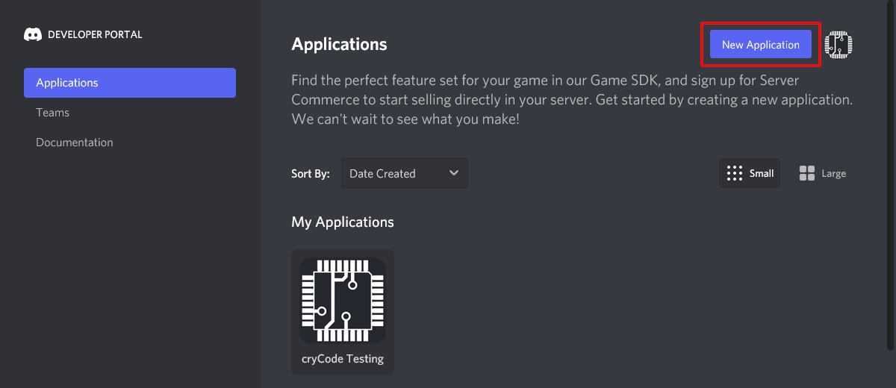](./media/bot-creation-1.png)
3. Choose a name for your application (this will be the name of your bot) and click _Create_.  
[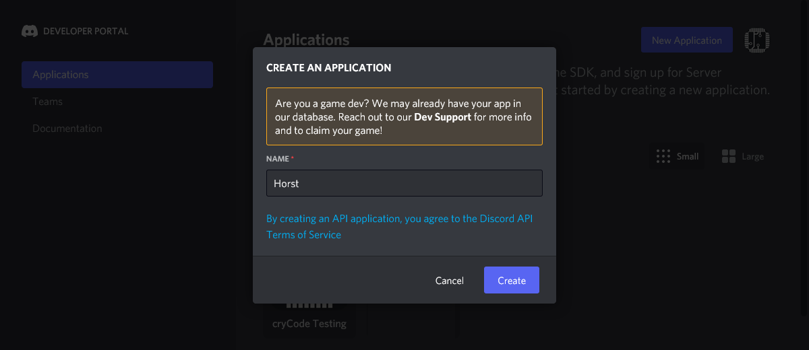](./media/bot-creation-2.png)
4. (Optional) Upload an _App Icon_, edit the _Name_, edit the _Description_, add some _Tags_ and _Save Changes_.  
[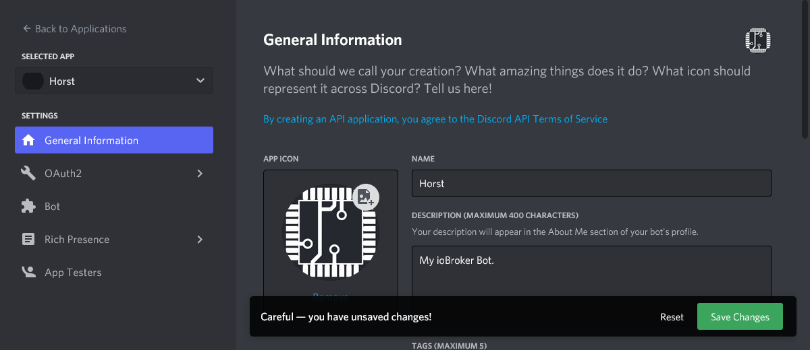](./media/bot-creation-3.png)
5. Navigate to _Bot_ in the left menu and click the _Add Bot_ button.  
[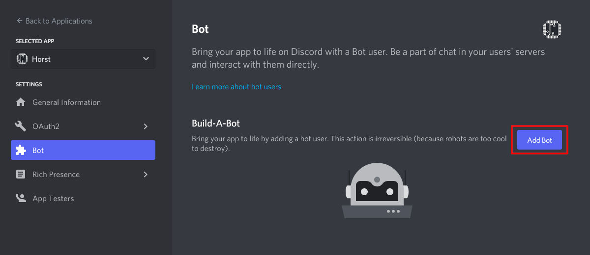](./media/bot-creation-4.png)  
In the following dialog click _Yes, do it!_ to confirm the bot creation.
6. When the bot is created, you need to click the _Reset Token_ button once to get you bot token.  
[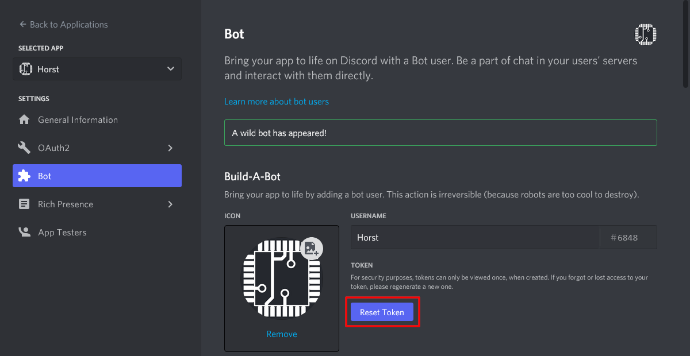](./media/bot-creation-5.png)  
Since this will invalidate any former token, you need to confirm this by clicking the _Yes, do it!_ button in the dialog popping up.  
After this, your token is displayed **once** and you should copy it to a secure place (e.g. the adapter instance configuration).
7. Scroll down a bit at the _Bot_ page to the _Privileged Gateway Intents_ and enable _Presence Intent_, _Server Members Intent_ and _Message Content Intent_. Don't forget to click _Save Changes_.  
[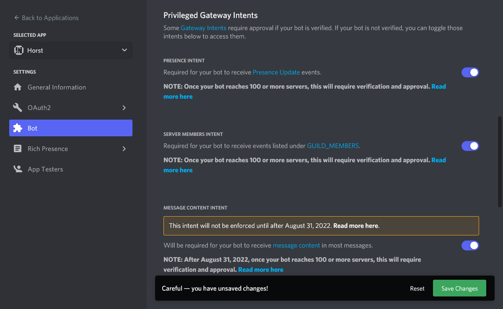](./media/bot-creation-6.png)  
Note: Once your bot reaches 100 or more servers, the intents will require verification and approval.
8. Now you are ready to start the adapter instance and add the bot to a Discord server.

## Adding the bot to a server

To add the bot to a server, you need to go to the adapter instance configuration
to the tab _Add bot to server_.
There you get a link which you can use to add the bot to a server, while setting
the correct scopes and permissions.

[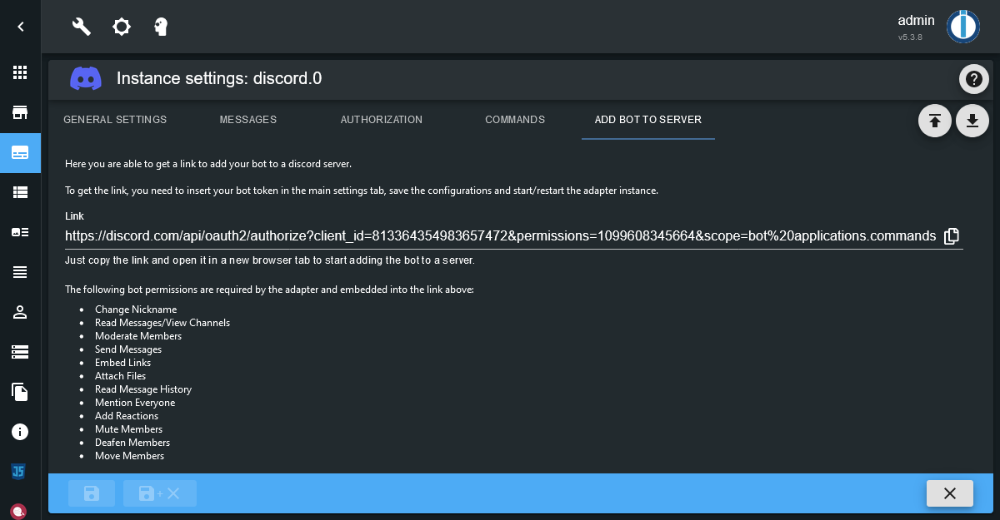](./media/add-bot-to-server.png)

The following bot permissions are required:

* Change Nickname
* Read Messages/View Channels
* Moderate Members
* Send Messages
* Embed Links
* Attach Files
* Read Message History
* Mention Everyone
* Add Reactions
* Mute Members
* Deafen Members
* Move Members

Also the following scopes are required:

* bot
* applications.commands

If some of the above permissions or scopes are missing, some features of the
adapter might not work.

### Remove the bot from a server

To remove the bot from a server, you may use the server select field on the same
adapter instance configuration page.
Just select the server and click the button to instruct the bot to leave the server.

## States

Each server, channel and user is identified by its unique numeric ID.  
Because names may change, the object tree created by the adapter uses these IDs
to create a reliable structure.

The whole object tree is built from what bot can see. So it is possible,
for example, that a server has more channels as displayed.

### discord.0.bot.*

| Name | Description |
|---|---|
| `activityType` | The type of the bot activity. One of `Playing`, `Streaming`, `Listening`, `Watching`, `Competing` or an empty string. |
| `activityName` | The name of the bot activity. Only used if a type is set. |
| `status` | The presence status of the bot. One of `online`, `idle`, `dnd` and `invisible`. |

This is used to set the presence status and activity of the bot which should be displayed to users.

### discord.0.servers.\<server-id\>.*

| Name | Description |
|---|---|
| `channels.*` | Channels of the server. |
| `members.*` | Members of the server. |

### discord.0.servers.\<server-id\>.channels.\<channel-id\>.*

| Name | Description |
|---|---|
| `channels.*` | Only present if the channel is a category. Structure is the same as in server channels. |
| `memberCount` | Number of members in the channel. |
| `members` | Comma separated list of members (display names) in the channel. |
| `message` | Last received message in the channel. |
| `messageId` | The ID of the last received message. |
| `messageAuthor` | The author (unique username or tag) of the last received message. |
| `messageTimestamp` | Timestamp of the last received message. |
| `messageJson` | JSON data for the last received message. |
| `send` | Send some text or JSON formated message. |
| `sendFile` | Send a File. |
| `sendReply` | Send a reply to a message. |
| `sendReaction` | Send a reaction (emoji) to a message. |
| `json` | JSON data of the channel information. |

For all `message*` and `send*` states see _Messages_ section below.

### discord.0.servers.\<server-id\>.members.\<user-id\>.*

| Name | Description |
|---|---|
| `tag` | The unique tag of the user in discord. |
| `name` | The name of the user in discord. (unique if the `tag` ends with `#0`) |
| `displayName` | The display name of the user on the server. |
| `roles` | Comma separated list of roles of this member on the server. |
| `joinedAt` | Time when the user joined the server. |
| `voiceChannel` | Currently connected voice channel of the user. Empty string if not connected. |
| `voiceDisconnect` | Button to disconnet the user from voice. |
| `voiceSelfDeaf` | Indicator if the users voice is deafened by the user. |
| `voiceSelfMute` | Indicator if the users voice is muted by the user. |
| `voiceServerDeaf` | Indicator if the users voice is deafened by the server. Can also be used to set the server deafen state. |
| `voiceServerMute` | Indicator if the users voice is muted by the server. Can also be used to set the server mute state. |
| `json` | JSON data of the member information. |

For the `voice*` states to be up to date, the option _Observe user voice state_ in the instance configuration must be enabled.  
To use the `voiceDisconnect`, `voiceServerDeaf` and `voiceServerMute` actions, the bot needs to have the related permissions on the server.

### discord.0.users.\<user-id\>.*

| Name | Description |
|---|---|
| `tag` | The unique tag of the user in discord. |
| `name` | The name of the user in discord. (unique if the `tag` ends with `#0`) |
| `status` | The presence status of the user. One of `online`, `offline`, `idle`, `dnd` |
| `activityType` | The type of the current user activity. One of `Playing`, `Streaming`, `Listening`, `Watching`, `Competing`, `Custom` or an empty string. |
| `activityName` | The name of the current user activity. E.g. the name of a game while `Playing`. |
| `avatarUrl` | URL to the avatar of the user. |
| `bot` | Indicator if the user is a bot. |
| `message` | Last received direct message from the user. |
| `messageId` | The ID of the last received direct message from the user. |
| `messageTimestamp` | Timestamp of the last received direct message from the user. |
| `messageJson` | JSON data for the last received direct message from the user. |
| `send` | Send some text or JSON formated message. |
| `sendFile` | Send a File. |
| `sendReply` | Send a reply to a received message. |
| `sendReaction` | Send a reaction (emoji) to a received message. |
| `json` | JSON data of the user information. |

For the `status` and `activity*` states to be up to date, the option _Observe user presence_ in the instance configuration must be enabled.

For all `message*` and `send*` states see messages section below.

### discord.0.slashCommands.\<command-name\>.*

If custom commands are enabled in the adapter instance configuration, the
following states will be present.

All this states will be updated on each call of the custom command.

| Name | Description |
|---|---|
| `json` | JSON data of the last use of the command. This contains some additional information which are not present in the single states. |
| `interactionId` | ID of the last use of the command. |
| `userId` | ID of the user, who called the command. |
| `userTag` | Tag of the user, who called the command. |
| `userName` | The name of the user, who called the command. (unique if the `userTag` ends with `#0`) |
| `channelId` | ID of the channel, where the command is called. |
| `serverId` | ID of the server, where the command is called or `null` if the command is used in a direct message. |
| `timestamp` | Timestamp of the last use of the command. |
| `option-*` | Options which are configured for the command. |
| `option-*.value` | The last value provided to this option on command call. If an option is not provided, this state will be set to `null`. |
| `option-*.choices` | JSON array containing predefined choices for this option. Only present on options of type string. Example: `["Value 1", "Value 2", { "name": "Value 3", "value": "val3" }]` |
| `sendReply` | Send a reply to a called command. Like in `.send` states of a channel or user, this may be sting or stringified JSON object. See _Messages_ section below. |

**Note:** It's recommended to use the `json` state in custom scripts to prevent
overlaps.
Example: A custom script reads the single `option-*` states while
some user called the command again and the options from the first and the
second command get mixed up.

### discord.0.raw.*

If raw states are enabled in the adapter instance configuration, the following
states will be present.

**Note:** These states contain raw data without any checks, filters or
modifications by the adapter.
A server will be named guild.

| Name | Description |
|---|---|
| `messageJson` | Raw JSON data of the last received message. (Channel messages and direct messages) |
| `interactionJson` | Raw JSON data of the last received interaction. (e.g. slash commands) |

## Authorization

By default, authorization is enabled and only authorized users are able to
interact with the adapter.

The authorized users and server roles can be configured in the adapter instance
configuration including some per user/role permissions.  
For server roles, the permissions only apply to the specific
server and not to other servers or direct messages.  
If permissions are given per user and server role, they will be
merged for the corresponding server.

The users and roles are identified by their internal ID, so changes of the
user tag, user name or role name don't affect the authorized users/roles lists.

It's possible to disable the authorization, but this should be done only if any
user on any server of the bot can be trusted!

## Messages

The adapter is able to receive and send messages from/to discord text channels and users.

By default, in channels only messages with mentions of the bot are processed.
To process messages without mentions too, the option
_Process all messages in server channels_ needs to be enabled in the instance configuration.

When a messages with a bot mention is received, the adapter will react to the message with an emoji.
This can be customized in the adapter instance configuration.  
If authorization is enabled, the bot will only react on mentions of authorized users.

### Receiving messages

Received messages will be stored in the `.message*` states of the channel object
for server channel messages or of the user object for direct messages.

If authorization is enabled, by default only messages from authorized users will be stored.
This can be configured using the option _Process messages from unauthorized users_
in the adapter instance configuration, so that all received messages, even from
unauthorized users, will be stored.

The last received message per channel/user is always stored in the `.message` state.
The timestamp, author and ID of the last received message is stored in the appropriate states.  
Additionally all these information are stored in json format in the `.messageJson` state.

#### Using text2command

To use text2command, a text2command instance must be selected in the adapter instance configuration.

For each `.message` state the custom option _Enable text2command for this state_ can be activated.  
When activated, each received message will be send to the selected text2command instance.

The response from text2command is send as a reply, send as a normal message or
not send, depending on the adapter instance configuration.

### Sending messages

To send a message, you can write contents to the `.send*` states of a channel or a user.

#### Sending simple texts

To send a simple text, just write the text into the `.send` state of your target.  
You may use [Discord Markdown] for text formatting like in your Discord client.

To mention a user, you can use the user ID in the form `<@user-id>`.  
For group mentions use `<@&group-id>` and for channel mentions use `<#channel-id>`.

Examples: `This is my message.`, `This is _my_ **formatted** message.`, `Hey <@490222742801481728>!`

#### Sending files

To send a file as an attachment, you can write the file location into the `.sendFile` state of your target.

The file location may be a …

* Absolute or relative path to a local file.  
  Relative paths are relative to the adapter directory of your ioBroker installation.  
  The path may optionally be prepended by `file://`.
  Examples: `/home/user/image.png`, `../../iobroker-data/files/myfile.txt`, `file:///tmp/image.jpg`

* URL to a remote file.  
  Example: `https://www.iobroker.dev/images/iobroker.png`

* Base64 encoded file content.  
  Example: `data:image/png;base64,iVBORw0KGgoAAAANSUhEUgAAABAAAAAQCAYAAAAf8/9hAAACzklEQVQ4y3WTy2tcdRTHP+d3753HncncmbaJiYvEhZrU+ii2urJgFCyCLnykpbQrsbR/gRQaXPUPUHBlH4ogUsRSqq7qLtlZrQpKg6Uu1OCkSWZ65859zfzucTExsYLf3Tl8zznf85JHZ5+cVuGcMebg0YXXHN/3UVVAqfk1VJV+HCMiAKRpyuXPr1hrixsCZ10VzgEnXMeRF+afJwgaFIUC0Go1UYVOp4OYUYIoivjiyjWszecUMMaYAyXPk7m5R8jznCjqk2YpjuMQhj1AcT2XLM3oR30GgyFB0KDkeWKMOeAeP7ZgDh16jizNeO/9Dwh7PR7ft5ejRxa49tXXvPnG6yRJzNWrX/LDjz8xMTHOu4tnKJXLLC0tG1OtViVoNKhWK9wLQ9pr6yRJwtTUJC/Oz3P9+jckccrk5APcXd+g3V6jUqkwiqmKKwKIMBrbCKpw585vvHNmkT17dvHQzAylUhkjZocnggi4I0+BAML9sEXBX+27XLj0MXGSMLR2h6cFKLh+zSdoNlHYXtW/oaq019a3bRGhPlYnaDbxaz5GVflHV7lcYlcrYJRH+V9s8VUVN4r6bG5ugginT52k2+ny/c2bADjGMDG+m073HlmWbyvq9XoURUEU9TGO4+C4DsPBgI31DZIkwVqLAs8+8zQnjh/j1Vdevq84Iriei+M4GABByLKMTz+7zMWPPuHBqSkGgwGdbpeZ6WmiXu+/g9nu0E2SRMMwJMty6rUa+596gsOHX+L8hUvEcUyp5PH7H38yMb4bgMbYGFmWE4YhSZKozO3b/7PruI/Nzj7MybffotVqYYwhjmPq9TpBo8Hq6iqFjkpmWcaH5y+ysnKboR3+4lpbfGdtvvfWrV+lUi5T8jyKoqBeq9FqBqiC7/sYM7qAnggrK7fJ8lyBG67AWQWstQeXlpd33lmhVt96535/60aENE0YWmuBbwUW/wZQx0cNXLu4ygAAAABJRU5ErkJggg==`

Additionally, you may add a text message to the file. To do so, just write the file
location, followed by a pipe character `|` and your message into the `.sendFile` state.  
Examples: `/tmp/image.png|This is my file`, `https://www.iobroker.dev/images/iobroker.png|The ioBroker logo`

#### Sending reactions

Using the `.sendReaction` state you can react to a previous message with an emoji.
To do so, just write the emoji into the state.

By default, the reaction will be send for the message which is currently in the
corresponding `.messageId` state.

If you want to react to a specific message, you can write the message ID, followed
by pipe character `|` and the emoji into the `.sendReaction` state.

Examples: `👍`, `971032590515568660|👍`

#### Sending replies

Using the `.sendReply` state you can send a reply to a previous message.
To do so, just write the reply message into the state.

By default, the reply will be send for the message which is currently in the
corresponding `.messageId` state.

If you want to reply to a specific message, you can write the message ID, followed
by pipe character `|` and the reply message into the `.sendReply` state.

Examples: `This is a reply.`, `971032590515568660|This is a reply.`

#### Sending special custom messages

You can send special custom messages writing a stringified JSON message object
into the `.send` or `.sendReply` states.

The JSON object must of type `MessageOptions`.
For more information read the [discord.js MessageOptions documentation][MessageOptions].

Examples:

Send an image:

```json
{
  "files": [
    {
      "attachment": "/tmp/image.jpg",
      "name": "image.jpg",
      "description": "My super image"
    }
  ]
}
```

Send embedded content:

```json
{
  "content": "Use this:",
  "embeds": [
    {
      "title": "ioBorker.discord",
      "description": "Discord adapter for ioBroker",
      "color": "#5865f2",
      "url": "https://github.com/crycode-de/ioBroker.discord",
      "author": {
        "name": "Peter Müller",
        "url": "https://github.com/crycode-de"
      },
      "image": {
        "url": "https://github.com/crycode-de/ioBroker.discord/raw/main/admin/discord.png"
      },
      "footer": {
        "text": "❤👍"
      }
    }
  ]
}
```

Send embedded image from local source:

```json
{
  "embeds": [
    {
      "title": "IP-Cam Alert",
      "description": "Look at this:",
      "color": "#ff0000",
      "image": {
        "url": "attachment://cam.jpg"
      }
    }
  ],
  "files": [
    {
      "attachment": "http://192.168.1.50:8080/ip-cam.jpg",
      "name": "cam.jpg"
    }
  ]
}
```

## Slash commands

If enabled in the adapter instance configuration, the adapter is able to handle
Discord slash commands. These commands can be used to get or set ioBroker states.

**Note:** You need to configure the states individually, which you want to be
available for Discord slash commands. See below.

Discord slash commands can be registered as server commands (default) or as
global commands by the adapter. This can be configured in the adapter
instance configuration.  
Using server commands has the benefit, that changes to the commands (e.g. added states)
are applied instant without any delay. But server commands can't be used in
direct messages between a user and the bot.  
Global commands can be used in direct messages too, but any change to the commands
may take up to one hour to apply. This is a limitation from Discord and not the adapter.

The default used slash commands are `/iob-get` and `/iob-set`. The command names
and descriptions can be configured in the adapter configuration.

### Configure states for slash commands

For each state which should be available for Discord slash commands, you need to
enable this in the custom settings of the state.
To do so, just click the _Custom settings_ gear icon in the _Objects_ view in
admin, enable the settings for your adapter instance and activate
_Enable discord commands for this state_.

[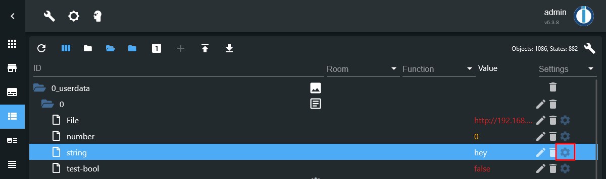](./media/slash-commands-config-1.png)

[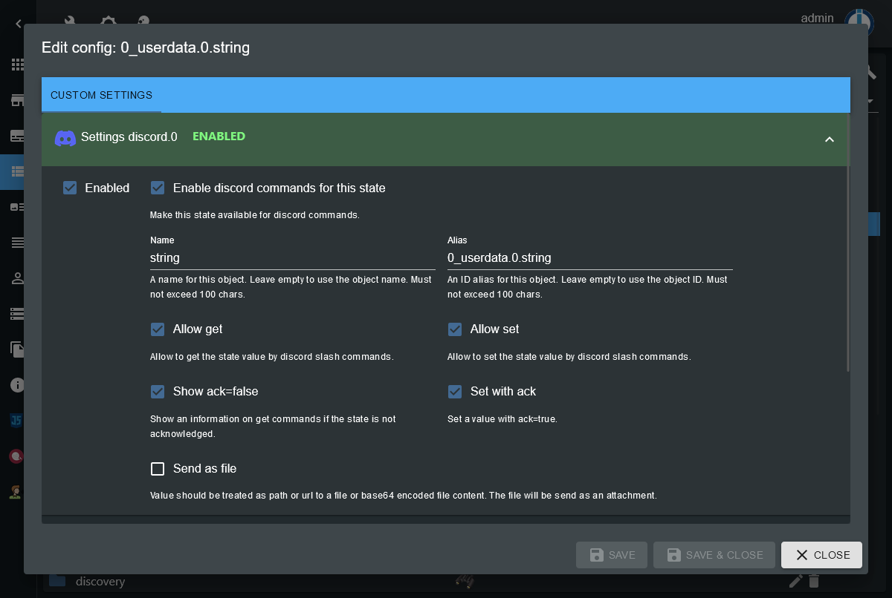](./media/slash-commands-config-2.png)

You can define a _Name_ and an _Alias_ for each state to be used in Discord.
The _Name_ will be shown in autocomplete options for the commands and the
_Alias_ is used as an internal identifier. Both must not exceed 100 characters.

For each state you can define individually if it should be available for set
and/or get commands.  
Also you can enable to show an information on get commands if the state is not
acknowledged and to set a state with ack flag.

For `string` type state objects you may choose to treat the value as a file (file location).  
If this is enabled, the state value will be send like in the `.sendFile` states.  
Using this you can request images via get commands, for example.

For `number` type state objects you can define the number of decimals to round a value to on get commands.

For `boolean` type state objects you can define custom values for `true` and `false` values to show on get commands.

### Get states

To get a state just call `/iob-get state-alias` in your Discord client.  
For the `state-alias` an autocomplete will be shown while entering the command.

Any value will be formated as configured in the state object and the custom
state settings. Optionally an information about a missing ack flag can be added.

### Set states

To set a state just call `/iob-set state-alias new-value` in your Discord client.  
For the `state-alias` an autocomplete will be shown while entering the command.  
The `new-value` will be parsed by the adapter, if the state type is `boolean` or
`number`.

You may configure per state, if the value should be set with or without ack flag.

For `boolean` type states, the values `true`, `on`, `yes`, `1` and their corresponding
translations of your language, as well as your per state configured _True value_
will be treated as `true`.
Any other value would be treated as `false`.

For `number` type states, the provided value will be parsed as float number.  
If your ioBroker is configured to use a comma in float numbers, you may provide
the number with a comma or dot as float separator. Otherwise only a dot is allowed.  
If `min` and `max` values are defined in the state object, they are also checked.

### Get an overview about states configured for slash commands

To get an overview about all states where slash commands are enabled, you can
simply click the button _Log state objects configured for commands_ in the adapter
instance configuration and see the log output.

### Custom slash commands

In the adapter instance configuration, custom slash commands can be enabled
and configured.
The configured custom commands will be registered on Discord together with the
default get and set commands.

For each custom command some options may be added, which will be shown in the
Discord client when calling the command.  
If an option is not provided on command call, the option value will be `null`.  
For options of type _string_ you may dynamically set predefined choices in the
corresponding `option-*.choices` state as JSON array.

When a custom command gets called, the data will be written into re corresponding
states. See the description of the states in the _States_ section above.

All information including the option values will be stored in the `.json` state
of the command.
This state should mainly be used to get the command data in scripts since all
needed information are stored in a single place and can't get mixed up on
multiple command calls within a short time.
For options of type _user_, _role_, _channel_ or _mentionable_ additional
properties of the option object will be filled.

**Note:** It's up to you to handle the command data and send a reply to the
command, i.e. using a custom script.
You have up to 15 minutes to send a reply using the `.sendReply` state or the
corresponding `sendTo(...)` action.
If you don't send a reply in time, the Discord client will show the error
message _The application did not respond_.

**Hint:** You may send a reply to one command call multiple times. This will
edit the reply and set it to the new content.

#### Structure of a custom slash command json state

```js
{
  interactionId: string,
  commandName: string,
  user: {
    id: string,
    tag: string,
    name: string,
    displayName: string,
  },
  channelId: string,
  serverId: string | null,
  timestamp: number,
  options: {
    [string]: {
      value: string | number | boolean | null,
      type: 'String' | 'Number' | 'Boolean' | 'User' | 'Role' | 'Channel' | 'Mentionable' | null,
      user?: { // if type is USER or MENIONABLE
        id: string,
        tag: string,
        name: string,
        bot: boolean,
      },
      member?: { // if type is USER or MENIONABLE and command is called on a server
        id: string,
        tag: string,
        name: string,
        displayName: string,
        roles: { id: string, name: string }[],
      },
      role?: { // if type is ROLE or MENTIONABLE
        id: string,
        name: string,
      },
      channel?: { // if type is CHANNEL
        id: string,
        name: string,
        type: 'GuildCategory' | 'GuildNews' | 'GuildStageVoice' | 'GuildStore' | 'GuildText' | 'GuildVoice',
        lastMessageId: string | null,
      },
    },
    // ...
  }
}
```

## Blockly

The adapter ships with it's own Blockly blocks for ...

* Sending messages to users or server channels
* Edit messages in direct messages or server channels
* Add a reaction emoji to messages
* Compose message contents with optional embeds, attachments and reply reference
* Compose message embeds
* Compose message attachments
* Listen to custom slash commands
* Reply to custom slash commands

### Blockly example: Send a message to a user and edit it after three seconds

[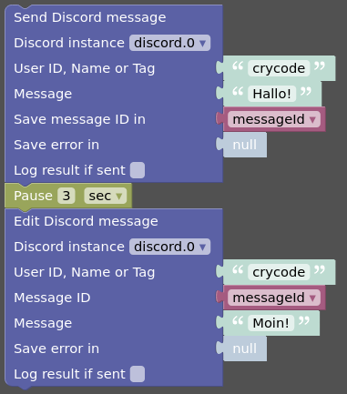](./media/blockly-1.png)

<details>
<summary>Blockly Code</summary>

```xml
<xml xmlns="https://developers.google.com/blockly/xml">
  <variables>
    <variable id="KIILW$,(eB?pT`;GDuMF">messageId</variable>
  </variables>
  <block type="discord_send_message_user" id="?xkCV};-Lk_-|Q`]%(Gt" x="163" y="38">
    <field name="instance">.0</field>
    <field name="logResultOk">FALSE</field>
    <value name="user">
      <shadow type="text" id="jXN@CluUy_M/ig@4[(Uk">
        <field name="TEXT">crycode</field>
      </shadow>
    </value>
    <value name="content">
      <shadow type="text" id="uLWu1CJ$;k}|VTyw1-8}">
        <field name="TEXT">Hallo!</field>
      </shadow>
    </value>
    <value name="varMessageId">
      <shadow type="logic_null" id="bJ2lJW0qOa@Zjv%(]mFU"></shadow>
      <block type="variables_get" id="xkJ(vH/;@7%)cDo0HU/~">
        <field name="VAR" id="KIILW$,(eB?pT`;GDuMF">messageId</field>
      </block>
    </value>
    <value name="varError">
      <shadow type="logic_null" id="H:f+1-:p9-YkmpehJoco"></shadow>
    </value>
    <next>
      <block type="timeouts_wait" id="OM8gv}Pl#_mHQ|)([mUe">
        <field name="DELAY">3</field>
        <field name="UNIT">sec</field>
        <next>
          <block type="discord_edit_message_user" id="|L3A+9{s_H8j`AF@,*VF">
            <field name="instance">.0</field>
            <field name="logResultOk">FALSE</field>
            <value name="user">
              <shadow type="text" id="voJ:{uuYtbBZ!Xe,rtV|">
                <field name="TEXT">crycode</field>
              </shadow>
            </value>
            <value name="messageId">
              <shadow type="text" id="64L=tOKvKwoqGHadRgDm">
                <field name="TEXT"></field>
              </shadow>
              <block type="variables_get" id="(M^6xk74LUEsPdH=LagL">
                <field name="VAR" id="KIILW$,(eB?pT`;GDuMF">messageId</field>
              </block>
            </value>
            <value name="content">
              <shadow type="text" id="rvnV^RF,g$M/3+(npHNC">
                <field name="TEXT">Moin!</field>
              </shadow>
            </value>
            <value name="varError">
              <shadow type="logic_null" id="{H4Q^vl400kxRKrffDz)"></shadow>
            </value>
          </block>
        </next>
      </block>
    </next>
  </block>
</xml>
```
</details>

### Blockly example: Send a composed message with an embed and two file attachments

[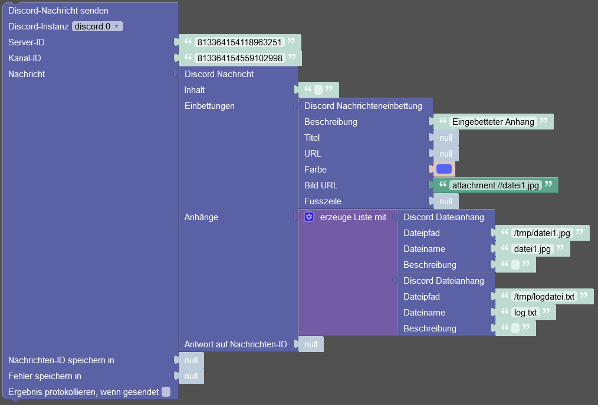](./media/blockly-2.png)

<details>
<summary>Blockly Code</summary>

```xml
<xml xmlns="https://developers.google.com/blockly/xml">
  <block type="discord_send_message_server_channel" id="Mnc=pB-8%Dr/nsen|SC`" x="63" y="38">
    <field name="instance">.0</field>
    <field name="logResultOk">FALSE</field>
    <value name="serverId">
      <shadow type="text" id="PA4]t;7CuDrKtwa|oB?L">
        <field name="TEXT">813364154118963251</field>
      </shadow>
    </value>
    <value name="channelId">
      <shadow type="text" id="x^vm,CRT`z2AhDT#ZcUC">
        <field name="TEXT">813364154559102998</field>
      </shadow>
    </value>
    <value name="content">
      <shadow type="text" id="ebdEp~G?:_gInjN47g@f">
        <field name="TEXT"></field>
      </shadow>
      <block type="discord_create_content" id="kY,/zwmwkjo:U;cT?eN*">
        <value name="content">
          <shadow type="text" id="D|y(g`oE@H#gu+deGbv2">
            <field name="TEXT"></field>
          </shadow>
        </value>
        <value name="embeds">
          <shadow type="logic_null" id="Qt[pG25wLoI8+3/jN66C"></shadow>
          <block type="discord_create_embed" id="cXAWtP-36uYlAxLhIBhN">
            <value name="description">
              <shadow type="text" id="^D%m:ic9]AcUUQP8~U#6">
                <field name="TEXT">Embedded attachment</field>
              </shadow>
            </value>
            <value name="title">
              <shadow type="logic_null" id="_Wm.(^Ff6^u%K+gVz$^Z"></shadow>
            </value>
            <value name="url">
              <shadow type="logic_null" id="0,08A!7[kJ-nJPnPH$L5"></shadow>
            </value>
            <value name="color">
              <shadow type="colour_picker" id="V0}MlQJvN._LHFhG2K%@">
                <field name="COLOUR">#5865f2</field>
              </shadow>
            </value>
            <value name="imageUrl">
              <shadow type="logic_null" id="xXr:E++u0;@2#e]r;_`]"></shadow>
              <block type="text" id="76;;p-5{pls%KmrI!ar{">
                <field name="TEXT">attachment://file1.jpg</field>
              </block>
            </value>
            <value name="footerText">
              <shadow type="logic_null" id="#BS`MgkNWbrQ@*m/kNdw"></shadow>
            </value>
          </block>
        </value>
        <value name="files">
          <shadow type="logic_null" id="4u@7^DXCI~J$r{Qx}1Ql"></shadow>
          <block type="lists_create_with" id="42g8r-+[xWw`|^.qOF!*">
            <mutation items="2"></mutation>
            <value name="ADD0">
              <block type="discord_create_file" id="EzK4NA^+bu4vChH/vj-b">
                <value name="attachment">
                  <shadow type="text" id="=OEkBZ:LFXvT2$S++21(">
                    <field name="TEXT">/tmp/file1.jpg</field>
                  </shadow>
                </value>
                <value name="name">
                  <shadow type="text" id="zum#q*|`aD%A2s/N@/Ow">
                    <field name="TEXT">file1.jpg</field>
                  </shadow>
                </value>
                <value name="description">
                  <shadow type="text" id="#ZZOq%3EHO/_GC+w.,-^">
                    <field name="TEXT"></field>
                  </shadow>
                </value>
              </block>
            </value>
            <value name="ADD1">
              <block type="discord_create_file" id="wIKo-2??SX@WcYc7e/5s">
                <value name="attachment">
                  <shadow type="text" id=")4lvYv.)IhU/p+~KUDym">
                    <field name="TEXT">/tmp/logfile.txt</field>
                  </shadow>
                </value>
                <value name="name">
                  <shadow type="text" id="#)t#lK6{$RuZt34O;@Ag">
                    <field name="TEXT">log.txt</field>
                  </shadow>
                </value>
                <value name="description">
                  <shadow type="text" id="^UKzs+$TQ!tiE:`(=%}}">
                    <field name="TEXT"></field>
                  </shadow>
                </value>
              </block>
            </value>
          </block>
        </value>
        <value name="replyToId">
          <shadow type="logic_null" id="#1:[?d^x=)ZH.!uyxRI:"></shadow>
        </value>
      </block>
    </value>
    <value name="varMessageId">
      <shadow type="logic_null" id="@D^#9^84UknOfV|c$NK~"></shadow>
    </value>
    <value name="varError">
      <shadow type="logic_null" id="mJu{Fa9+]+Ml,{_OqIOh"></shadow>
    </value>
  </block>
</xml>
```

</details>

### Blockly example: Listen to custom slash command executes and send an image of the requested IP cam

[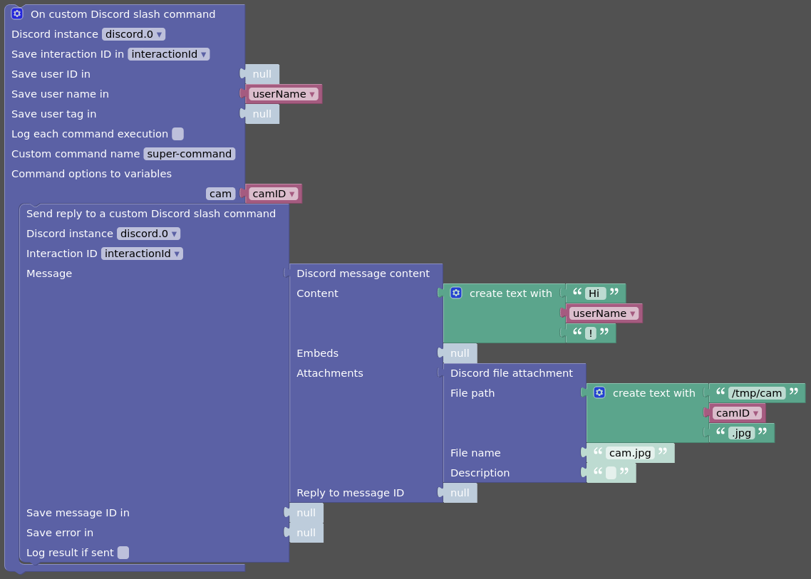](./media/blockly-3.png)

<details>
<summary>Blockly Code</summary>

```xml
<xml xmlns="https://developers.google.com/blockly/xml">
  <variables>
    <variable id="Wcj[Gmy,vX]b,)s,O)`U">interactionId</variable>
    <variable id="{sXn[Mn@ZN#fWtTV6O^;">userName</variable>
    <variable id="ULmVI=-QcXLnD!e60KTV">camID</variable>
  </variables>
  <block type="discord_on_custom_cmd" id="GE,i32wKhz%KGlBhV$j=" x="63" y="13">
    <mutation xmlns="http://www.w3.org/1999/xhtml" options="cam"></mutation>
    <field name="instance">.0</field>
    <field name="varInteractionId" id="Wcj[Gmy,vX]b,)s,O)`U">interactionId</field>
    <field name="log">FALSE</field>
    <field name="commandName">super-command</field>
    <value name="varUserId">
      <shadow type="logic_null" id="/}0,E!Gq=C2U]C^.8m1@"></shadow>
    </value>
    <value name="varUserName">
      <block type="variables_get" id="Q=v?u?yU}Tw*@FH*|x7.">
        <field name="VAR" id="{sXn[Mn@ZN#fWtTV6O^;">userName</field>
      </block>
    </value>
    <value name="varUserTag">
      <shadow type="logic_null" id="+r2I4SpfhuW%9DE21,[c"></shadow>
    </value>
    <value name="option0">
      <shadow type="logic_null" id="hL^g}gJg-b.+SOH0s9m1"></shadow>
      <block type="variables_get" id="z/Lf|chD)~Ge0N~@EWG%">
        <field name="VAR" id="ULmVI=-QcXLnD!e60KTV">camID</field>
      </block>
    </value>
    <statement name="STATEMENT">
      <block type="discord_send_custom_command_reply" id="zJXF!F=|Xt4.kG/6ctl(">
        <field name="instance">.0</field>
        <field name="interactionId" id="Wcj[Gmy,vX]b,)s,O)`U">interactionId</field>
        <field name="logResultOk">FALSE</field>
        <value name="content">
          <shadow type="text" id="bdVm59S9_U*GFB(IBO6x">
            <field name="TEXT"></field>
          </shadow>
          <block type="discord_create_content" id="6m8gBtp;K@t8}{`9gPd1">
            <value name="content">
              <shadow type="text" id=".c}Z71nQ8LlQ@h}_Z?qR">
                <field name="TEXT"></field>
              </shadow>
              <block type="text_join" id="Z{wQ$[1g7z?KPMSHB],Y">
                <mutation items="3"></mutation>
                <value name="ADD0">
                  <block type="text" id="cuzUE7GB$#gC*;nOQ|Ke">
                    <field name="TEXT">Hi </field>
                  </block>
                </value>
                <value name="ADD1">
                  <block type="variables_get" id="|[[T@|n1Ro{EU56/jJ@P">
                    <field name="VAR" id="{sXn[Mn@ZN#fWtTV6O^;">userName</field>
                  </block>
                </value>
                <value name="ADD2">
                  <block type="text" id="LV$kS:Gzv#cJ#gXe/{4a">
                    <field name="TEXT">!</field>
                  </block>
                </value>
              </block>
            </value>
            <value name="embeds">
              <shadow type="logic_null" id="p8S?*FLv4a6aIJogCKU;"></shadow>
            </value>
            <value name="files">
              <shadow type="logic_null" id="y#a8q/mr^)Ymt*j)S:H/"></shadow>
              <block type="discord_create_file" id="vN%eoP74=*)f63CQiJ__">
                <value name="attachment">
                  <shadow type="text" id="2$9y5yj3.GHx.ms*:Ce2">
                    <field name="TEXT"></field>
                  </shadow>
                  <block type="text_join" id="K9zuKTz?-b8VT$8XUVQ8">
                    <mutation items="3"></mutation>
                    <value name="ADD0">
                      <block type="text" id="p3f^[{6t+UuDJN=49+#Z">
                        <field name="TEXT">/tmp/cam</field>
                      </block>
                    </value>
                    <value name="ADD1">
                      <block type="variables_get" id="oVmVHEX[iT(-X#]m=[U@">
                        <field name="VAR" id="ULmVI=-QcXLnD!e60KTV">camID</field>
                      </block>
                    </value>
                    <value name="ADD2">
                      <block type="text" id="wUXx)@u6*2,+9!q{W`n`">
                        <field name="TEXT">.jpg</field>
                      </block>
                    </value>
                  </block>
                </value>
                <value name="name">
                  <shadow type="text" id="L5fO_+by.^Z:se~6|xCj">
                    <field name="TEXT">cam.jpg</field>
                  </shadow>
                </value>
                <value name="description">
                  <shadow type="text" id="ku}h+v)9oY;1`[9Rr)w%">
                    <field name="TEXT"></field>
                  </shadow>
                </value>
              </block>
            </value>
            <value name="replyToId">
              <shadow type="logic_null" id="Ou%Gd6C*+2OaIPUxPp}t"></shadow>
            </value>
          </block>
        </value>
        <value name="varMessageId">
          <shadow type="logic_null" id="RUb!i][5`[t0*mzLwBvN"></shadow>
        </value>
        <value name="varError">
          <shadow type="logic_null" id="SLsj^+8=[Bp%/X8n]$?Z"></shadow>
        </value>
      </block>
    </statement>
  </block>
</xml>
```

</details>

## Usage in scripts

You may use the `sendTo(...)` function in scripts to interact with the adapter instance.

_Note:_ All used IDs are strings.

### Send a message from a script

To send a message you can use the `send` or `sendMessage` command. They are the same.

The `message` part of `sendTo(...)` needs to be an object with the `content` to
send and one of the following parameters to identify the target:

* `userId`
* `userTag`
* `userName`
* `serverId` and `channelId`

The `content` may be a simple string, or a [MessageOptions] object.

The return value in the `sendTo(...)` callback is an object containing your message parameters and a `result` string and the `messageId` of the sent discord message on success or an `error` message if there was an error.

Examples:

```js
// send to user using the unique user name
sendTo('discord.0', 'sendMessage', {
  userName: 'crycode',
  content: 'Hi!',
}, (ret) => {
  log(ret);
  // {'result':'Message sent to user crycode','userName':'crycode','content':'Hi!','messageId':'971779972052155891'}

  if (ret.error) {
    log(ret.error, 'error');
    return;
  }
  log(`Message sent with ID ${ret.messageId}`);
});

// send to user using the user tag (for bots or users not migrated to unique user name)
sendTo('discord.0', 'sendMessage', {
  userTag: 'cryCode#9911',
  content: 'Hi!',
}, (ret) => {
  log(ret);
  // {'result':'Message sent to user cryCode#9911','userTag':'cryCode#9911','content':'Hi!','messageId':'971779972052160552'}

  if (ret.error) {
    log(ret.error, 'error');
    return;
  }
  log(`Message sent with ID ${ret.messageId}`);
});

// send a reply message to a user
sendTo('discord.0', 'sendMessage', {
  userId: '490222742801481728',
  content: {
    content: 'Ok!',
    reply: {
      messageReference: '971779972052160552', // ID of the message you want to reply to
    },
  },
}, (ret) => {
  log(ret);
  // {'result':'Message sent to user crycode','userId':'490222742801481728','content':{'content':'Ok!','reply':{'messageReference':'971779972052160552'}},'messageId':'971786369401761832'}
});

// send a file to a server channel
sendTo('discord.0', 'sendMessage', {
  serverId: '813364154118963251',
  channelId: '813364154559102998',
  content: {
    content: 'Look at this:',
    files: [
      {
        attachment: "/tmp/image.jpg",
        name: "image.jpg",
        description: "My super image"
      },
    ],
  },
}, (ret) => {
  log(ret);
  // {'result':'Message sent to channel Allgemein','serverId':'813364154118963251','channelId':'813364154559102998','content':{'content':'Look at this:','files':[{'attachment':'/tmp/image.jpg','name':'image.jpg','description':'My super image'}]},'messageId':'971780152759558234'}
});
```

### Edit a message from a script

Using the `editMessage` command, you are able to edit a previous message.  
Of course, you can only edit messages send by the bot.

The `message` part of `sendTo(...)` is the same as for `sendMessage` (see above)
with the `messageId` of the message you want to edit as additional parameter.

The return value is the same as for `sendMessage`.

Examples:

```js
// edit a message
sendTo('discord.0', 'editMessage', {
  userName: 'crycode',
  content: 'Hello!',
  messageId: '971495175367049276',
}, (ret) => {
  log(ret);
  // {'result':'Message edited','userName':'crycode','content':'Hello!','messageId':'971495175367049276'}
});

// send a message and edit it after five seconds
sendTo('discord.0', 'sendMessage', {
    userName: 'crycode',
    content: 'Now: ' + new Date().toLocaleString(),
}, (ret) => {
  if (ret.error) {
    log(ret.error, 'error');
    return;
  }
  setTimeout(() => {
    sendTo('discord.0', 'editMessage', {
      userName: 'crycode',
      content:  'Now: ' + new Date().toLocaleString(),
      messageId: ret.messageId,
    }, (ret2) => {
      log(ret2);
      // {'result':'Message edited','userName':'crycode','content':'Now: 5.5.2022, 16:25:38','messageId':'971779692166266920'}
    });
  }, 5000);
});
```

### Delete a message from a script

Using the `delteMessage` command, you are able to delete a previous message.  
Of course, you can only delete messages send by the bot.

The `message` part of `sendTo(...)` is the same as for `sendMessage` (see above)
without the `content` but with the `messageId` of the message you want to delete
as additional parameter.

The return value is the same as for `sendMessage`.

Example:

```js
// delete a message
sendTo('discord.0', 'deleteMessage', {
  userName: 'crycode',
  messageId: '971495175367049276',
}, (ret) => {
  log(ret);
  // {'result':'Message deleted','userName':'crycode','messageId':'971495175367049276'}
});
```

### Add a reaction emoji to a message from a script

Using the `addReaction` command, you are able to add a reaction emoji to a
previous message.

The `message` part of `sendTo(...)` is the same as for `sendMessage` (see above)
without the `content` but with the `messageId` of the message you want react to
and the `emoji` as additional parameters.

The return value is the same as for `sendMessage`.

Example:

```js
// add a reaction to a message
sendTo('discord.0', 'addReaction', {
  userName: 'crycode',
  messageId: '971786369401761832',
  emoji: '😎',
}, (ret) => {
  log(ret);
  // {'result':'Reaction added to message','userName':'crycode','messageId':'971786369401761832','emoji':'😎'}
});
```

### Await reactions to a message in a script

You are able to await reactions (emojis) to a previous message using the
`awaitMessageReaction` command.

The `message` part of `sendTo(...)` is the same as for `editMessage` (see above)
without the `content` parameter but with `timeout` and `max` number as
additional parameters.

The `timeout` is the maximum wait time to collect the reactions in a range from 100 to 60000 ms.

The `max` parameter defines the maximum number of reactions to collect.
Default is 1 if not provided.

The callback of `sendTo(...)` will be called if either the timeout is reached or
the specified number of reactions is collected.  
The return value is an object containing your message parameters and a
`reactions` array. Each reaction is an object of `emoji`, `emojiId` and `users`,
where `users` is an array of objects with `id` and `tag`.  
If a reaction is simple emoji, the `emojiId` will be `null`. For custom emojis,
`emoji` will be the emoji name and `emojiId` will be set.

```js
sendTo('discord.0', 'awaitMessageReaction', {
  serverId: '813364154118963251',
  channelId: '813364154559102998',
  messageId: '970754574879162458',
  timeout: 10000,
  max: 3,
}, (ret) => {
  log(ret);
  // {'reactions':[{'emoji':'👍','emojiId':null,'users':[{'id':'490222742801481728', 'name': 'crycode','tag':'crycode#0'}]}],'serverId':'813364154118963251','channelId':'813364154559102998','messageId':'970754574879162458','timeout':10000,'max':3}
});
```

### Reply to a custom slash command from a script

Using the `sendCustomCommandReply` command, you can send a reply to a custom
slash command call.

The `message` part of `sendTo(...)` needs to be an object with the `content` to
send and the `interactionId` of the command call:

The `content` may be a simple string, or a [MessageOptions] object
(like in `sendMessage`).

```js
on({ id: 'discord.0.slashCommands.iob-test.json', change: 'any', ack: true }, (obj) => {
  log(`Got custom slash command ${obj.state.val}`);
  // Got custom slash command {"interactionId":"977265764136517725","commandName":"iob-test","channelId":"813364154559102998","serverId":"813364154118963251","user":{"id":"490222742801481728","tag":"crycode#0", "name": "crycode","displayName":"Peter"},"timestamp":1653068714890,"options":{"myopt":{"value":"test","type":"String"}}}

  const data = JSON.parse(obj.state.val);

  let reply;
  if (data.options.myopt.value) {
    reply = {
      content: `You gave me "${data.options.myopt.value}".`,
      embeds: [
        {
          title: 'This is awesome!',
          color: '#00AA00',
        },
      ],
    };
  } else {
    reply = `You gave me nothing. 🤨`;
  }

  sendTo('discord.0', 'sendCustomCommandReply', {
    interactionId: data.interactionId,
    content: reply,
  }, (ret) => {
    log(ret);
    // {'result':'Reply sent','interactionId':'977265764136517725','content':{'content':'You gave me \'test\'.','embeds':[{'title':'This is awesome!','color':'#00AA00'}]},'messageId':'977265765122183248'}
  });
});
```

### Get information about a server in a script

```js
sendTo('discord.0', 'getServerInfo', {
  serverId: '813364154118963251',
}, (ret) => {
  log(ret);
});
```

### Get information about a server channel in a script

```js
sendTo('discord.0', 'getChannelInfo', {
  serverId: '813364154118963251',
  channelId: '813364154559102998',
}, (ret) => {
  log(ret);
});
```

### Get information about a user in a script

```js
sendTo('discord.0', 'getUserInfo', {
  userId: '490222742801481728',
}, (ret) => {
  log(ret);
});
```

```js
sendTo('discord.0', 'getUserInfo', {
  userTag: 'cryCode#9911',
}, (ret) => {
  log(ret);
});
```

### Get information about a server member in a script

```js
sendTo('discord.0', 'getServerMemberInfo', {
  serverId: '813364154118963251',
  userId: '490222742801481728',
}, (ret) => {
  log(ret);
});
```

```js
sendTo('discord.0', 'getServerMemberInfo', {
  serverId: '813364154118963251',
  userTag: 'cryCode#9911',
}, (ret) => {
  log(ret);
});
```

### Get information about a previous message in a script

```js
sendTo('discord.0', 'getMessageInfo', {
  serverId: '813364154118963251',
  channelId: '813364154559102998',
  messageId: '978252795763359794',
}, (ret) => {
  log(ret);
});
```

```js
sendTo('discord.0', 'getMessageInfo', {
  userId: '490222742801481728',
  messageId: '976090572760694814',
}, (ret) => {
  log(ret);
});
```

```js
sendTo('discord.0', 'getMessageInfo', {
  userTag: 'cryCode#9911',
  messageId: '976090572760694814',
}, (ret) => {
  log(ret);
});
```

[ioBroker]: https://www.iobroker.net
[Discord]: https://discord.com
[text2command]: https://github.com/ioBroker/ioBroker.text2command
[GitHub New Issue]: https://github.com/crycode-de/ioBroker.discord/issues/new/choose
[Discord Developer Portal]: https://discord.com/developers/applications
[Discord Markdown]: https://support.discord.com/hc/en-us/articles/210298617-Markdown-Text-101-Chat-Formatting-Bold-Italic-Underline-
[MessageOptions]: https://discord.js.org/#/docs/discord.js/stable/typedef/MessageOptions

## Changelog

<!--
    Placeholder for the next version (at the beginning of the line):
    ### **WORK IN PROGRESS**
-->
### 2.2.0 (2023-11-07)

* (crycode-de) Optimized error handling - Network related errors should now be handled completely without adapter restarts and better logging
* (crycode-de) Fixed small issues in config UI
* (crycode-de) Updated dependencies

### 2.1.2 (2023-09-04)

* (crycode-de) Fixed response to notification-manager adapter

### 2.1.1 (2023-08-27)

* (crycode-de) Updated dependencies
* Updated translations

### 2.1.0 (2023-07-12)

* (crycode-de) Added support for unique user names
* (crycode-de) Detect possible DNS errors during login to prevent restart loops
* (crycode-de) Better handling for login errors, first 4 errors are now logged just as info

### 2.0.0 (2023-06-11)

* (crycode-de) Updated discord.js to v14
* (crycode-de) 💥 **Breaking:** Activity types and channel types are now in title case. Example: `PLAYING` is now `Playing`, `GUILD_TEXT` is now `GuildText`.
* (crycode-de) 💥 **Breaking:** In raw states all `type` field values are now numbers representing the internal enum values of the types.
* (crycode-de) Add support for messages from the notification-manager adapter
* (crycode-de) Updated dependencies
* (crycode-de) Added Ukrainian translations
* Updated translations

### 1.1.6 (2022-07-28)

* (crycode-de) Fixed voice channel member count/list

### 1.1.5 (2022-07-27)

* (crycode-de) Made token validation less strict

### 1.1.4 (2022-07-14)

* (crycode-de) Fixed crash if custom command choices name was empty

### 1.1.3 (2022-07-01)

* (crycode-de) Dependency updates

### 1.1.2 (2022-06-23)

* (crycode-de) Fixed adapter termination on discord errors to let the js-controller restart the adapter

### 1.1.1 (2022-06-08)

* (crycode-de) Added support for text messages in voice channels
* (crycode-de) Added support for custom slash commands
* (crycode-de) Added Blockly support with special custom blocks
* (crycode-de) Send error replies on slash commands as ephemeral
* (crycode-de) Added config option to send all slash command replies as ephemeral
* (crycode-de) Register get/set commands only if states are configured for this
* (crycode-de) Choices for commands are now handled as autocomplete which allows more choices, is more dynamic and shows the choices only to authorized users
* (crycode-de) Added command options to `raw.interactionJson` json content
* (crycode-de) Fixed command name checks
* (crycode-de) Fixed some crashes / stuck conditions when network is not available
* (crycode-de) Fixed several small bugs

### 1.0.2 (2022-05-16)

* (crycode-de) Fixed some small issues found on adapter review

### 1.0.1 (2022-05-15)

* (crycode-de) Added possibility to let the bot leave a Discord server
* (crycode-de) Fixed crash on server updates

### 1.0.0 (2022-05-13)

* (crycode-de) First release

## License

MIT License

Copyright (c) 2022-2023 Peter Müller <peter@crycode.de>

Permission is hereby granted, free of charge, to any person obtaining a copy
of this software and associated documentation files (the "Software"), to deal
in the Software without restriction, including without limitation the rights
to use, copy, modify, merge, publish, distribute, sublicense, and/or sell
copies of the Software, and to permit persons to whom the Software is
furnished to do so, subject to the following conditions:

The above copyright notice and this permission notice shall be included in all
copies or substantial portions of the Software.

THE SOFTWARE IS PROVIDED "AS IS", WITHOUT WARRANTY OF ANY KIND, EXPRESS OR
IMPLIED, INCLUDING BUT NOT LIMITED TO THE WARRANTIES OF MERCHANTABILITY,
FITNESS FOR A PARTICULAR PURPOSE AND NONINFRINGEMENT. IN NO EVENT SHALL THE
AUTHORS OR COPYRIGHT HOLDERS BE LIABLE FOR ANY CLAIM, DAMAGES OR OTHER
LIABILITY, WHETHER IN AN ACTION OF CONTRACT, TORT OR OTHERWISE, ARISING FROM,
OUT OF OR IN CONNECTION WITH THE SOFTWARE OR THE USE OR OTHER DEALINGS IN THE
SOFTWARE.