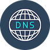

# ioBroker.dnscope

This adapter uses the service `Sentry.io` to automatically report exceptions and code errors and new device schemas to me as the developer. More details see below!

---

## Support adapter development

**If you like DNScope, please consider making a donation:**

---

## Description

DNScope allows you to update your dynamic DNS account directly in ioBroker.
It is possible to update your DNS account with the current IP address of your environment without any detours or additional hardware.

You can determine the interval at which the check and update should take place. 
The default interval is 10 minutes.

The following DynDNS providers are currently supported:

* IPv64
* DuckDNS
* NoIP
* Dynv6
* Custom

When selecting `Custom`, it is possible to specify a direct update URL in order to integrate any provider that supports this.

---

## Adapter configuration

Your access data to the DynDNS service is required for the adapter configuration.
Depending on the provider, this can be a token or a user name/password.

You must also enter the domain that is to be updated. 

If you have several domains that are to be updated, you need one instance per domain

---
<!-- ### **WORK IN PROGRESS** -->
## Changelog
### **WORK IN PROGRESS**
* (simatec) dependencies updated

### 0.2.5 (2025-08-31)
* (simatec) Dependencies updated

### 0.2.4 (2025-06-25)
* (simatec) dependencies updated
* (simatec) Ready for NodeJS 24.x

### 0.2.3 (2025-05-04)
* (simatec) Fix Config
* (foxriver76) Fix Instance terminate

### 0.2.2 (2025-05-02)
* (simatec) dependencies updated

### 0.2.1 (2025-04-06)
* (simatec) small fix
* (simatec) dependencies updated

### 0.2.0 (2025-03-23)
* (simatec) Fix Delay
* (simatec) Fix States
* (simatec) dependencies updated

### 0.1.0 (2025-03-16)
* (simatec) First Beta

---

## License
MIT License

Copyright (c) 2025 simatec

Permission is hereby granted, free of charge, to any person obtaining a copy
of this software and associated documentation files (the "Software"), to deal
in the Software without restriction, including without limitation the rights
to use, copy, modify, merge, publish, distribute, sublicense, and/or sell
copies of the Software, and to permit persons to whom the Software is
furnished to do so, subject to the following conditions:

The above copyright notice and this permission notice shall be included in all
copies or substantial portions of the Software.

THE SOFTWARE IS PROVIDED "AS IS", WITHOUT WARRANTY OF ANY KIND, EXPRESS OR
IMPLIED, INCLUDING BUT NOT LIMITED TO THE WARRANTIES OF MERCHANTABILITY,
FITNESS FOR A PARTICULAR PURPOSE AND NONINFRINGEMENT. IN NO EVENT SHALL THE
AUTHORS OR COPYRIGHT HOLDERS BE LIABLE FOR ANY CLAIM, DAMAGES OR OTHER
LIABILITY, WHETHER IN AN ACTION OF CONTRACT, TORT OR OTHERWISE, ARISING FROM,
OUT OF OR IN CONNECTION WITH THE SOFTWARE OR THE USE OR OTHER DEALINGS IN THE
SOFTWARE.