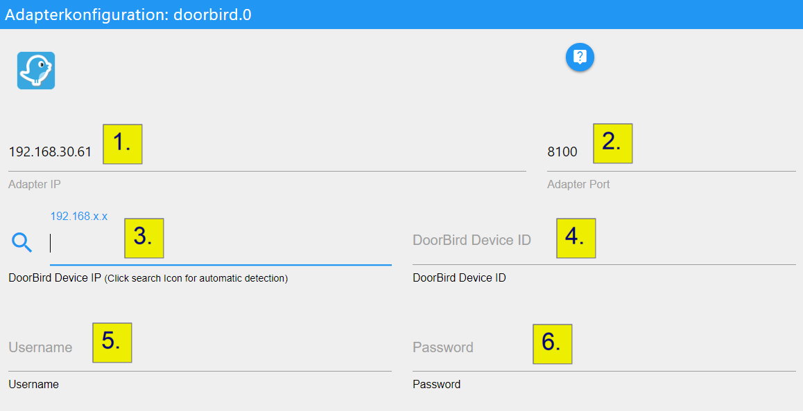

# ioBroker.doorbird

[](https://www.npmjs.com/package/iobroker.doorbird)
[](https://www.npmjs.com/package/iobroker.doorbird)


[](https://nodei.co/npm/iobroker.doorbird/)

## Versions


## What is Doorbird?

DoorBird is a door intercom that functions both as a doorbell and security system. The product goes on the outside of a house, where a doorbell would typically be, and features a doorbell push button with a camera above.

## Configuration

1. Enter the IP on which the Adapter should listen to Events from the Doorbird Device.
   (This is normally the IP of your ioBroker Host).
   The adapter tries to prefill the field with the correct IP for you. If the prefilled IP is not the IP of your ioBroker Host please change it to the correct IP.
2. The Port is predefined to `8100`. You can change it if the Port is already used by another service.
   Just try to run the Adapter with this Port. If the Port is not available you will get an error while starting the adapter. Then just get back here and change the port.
3. Enter the IP of your Doorbird device. You can click on the "search icon" left to the input field. After you clicked the icon a message at the top of the config screen will appear. Now you have 60 Seconds to press the ring button on your Doorbird device. The Adapter tries to detect the IP and fill all fields for you.
4. The Device ID (NOT IP!) of your Doorbird.
5. The Username which needs to have the **API-Operator** and **Watch always** permissions on the Doorbird device.
6. The password for the Username entered in field 5.



After you entered all required information to the config dialog click "Save & Close".
The Adapter should now restart, and you are ready to go!

## Access to the Snapshots of Motion and DoorBell

Use the following URL to get the current snapshot:

```
http://<ioBroker-IP>:<Port>/files/doorbird.<instance>.Doorbell<number>_1.jpg
http://<ioBroker-IP>:<Port>/files/doorbird.<instance>.Motion_1.jpg
```

or

```
/opt/iobroker/iobroker-data/files/doorbird.<instance>/Doorbell<number>_1.jpg'
```

#### Example:

```
http://192.168.0.2:8081/files/doorbird.0/Doorbell1_1.jpg
```

### Send Snapshot per Telegram

#### Example

js-controller 5 necessary

```
setState('doorbird.0.TakeSnapshot', true);
onFile("doorbird.0", "TakeSnapshot_1.jpg", true, function (id, fileName, size, fileData, mimeType) {
    sendTo('telegram.0', {
        text: fileData,
        type: 'photo'
    });
});
```

## Compatible Devices

| Device                           | Hardware version | Firmware version |
| -------------------------------- | ---------------- | ---------------- |
| DoorBird Video Door Station D10x | 1.00 and above   | 000099 and above |
| DoorBird Video Door Station D20x | 1.00 and above   | 000099 and above |
| DoorBird Video Door Station D21x | 1.00 and above   | 000108 and above |
| BirdGuard B10x                   | 1.00 and above   | 000099 and above |
| DoorBird Video Door Station D11x | 1.00 and above   | 000130 and above |

## Changelog

<!--
    Placeholder for the next version (at the beginning of the line):
    ### **WORK IN PROGRESS**
-->
### 2.0.0 (2024-09-02)

-   (Schmakus) update dependencies

### 1.7.0 (2024-08-23)

-   (Schmakus) Dependencies have been updated

### 1.6.0 (2024-07-02)

-   (mcm1957) Adapter requires node.js >= 18 and Admin >=6 now
-   (mcm1957) Dependencies have been updated

### 1.5.0 (2024-03-01)

-   (Schmakus) update dependencies

### 1.4.1 (2024-02-22)

-   (Schmakus) Creation of favorites and schedules only once after starting the adapter and successfully connecting to DoorBird. (Another step to solve "Maximum call stack size exceeded" problem.)

## License

The MIT License (MIT)

Copyright (c) 2024 iobroker-community-adapters <>

Permission is hereby granted, free of charge, to any person obtaining a copy
of this software and associated documentation files (the "Software"), to deal
in the Software without restriction, including without limitation the rights
to use, copy, modify, merge, publish, distribute, sublicense, and/or sell
copies of the Software, and to permit persons to whom the Software is
furnished to do so, subject to the following conditions:

The above copyright notice and this permission notice shall be included in
all copies or substantial portions of the Software.

THE SOFTWARE IS PROVIDED "AS IS", WITHOUT WARRANTY OF ANY KIND, EXPRESS OR
IMPLIED, INCLUDING BUT NOT LIMITED TO THE WARRANTIES OF MERCHANTABILITY,
FITNESS FOR A PARTICULAR PURPOSE AND NONINFRINGEMENT. IN NO EVENT SHALL THE
AUTHORS OR COPYRIGHT HOLDERS BE LIABLE FOR ANY CLAIM, DAMAGES OR OTHER
LIABILITY, WHETHER IN AN ACTION OF CONTRACT, TORT OR OTHERWISE, ARISING FROM,
OUT OF OR IN CONNECTION WITH THE SOFTWARE OR THE USE OR OTHER DEALINGS IN
THE SOFTWARE.
