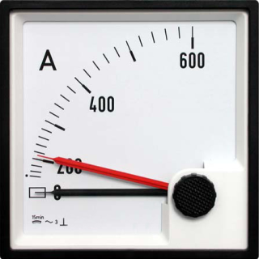

# ioBroker.drag-indicator

## drag-indicator adapter for ioBroker

Shows the min and max of a selected value (of type number)
So you can catch the extreme values of an state in a desired timerange.
e.g. you can use it for power or temperature values.

## Changelog
<!--
	Placeholder for the next version (at the beginning of the line):
	### **WORK IN PROGRESS**
-->
### 2.1.1 (2023-11-02)
* (BenAhrdt) correction in jsonconfig schema

### 2.1.0 (2023-04-06)
* (BenAhrdt) depencies updated

### 2.0.9 (2022-08-27) - release script installed
* (BenAhrdt) updated to release script V3

### 2.0.8 (2022-08-28) - update new release script
* (BenAhrdt) updated to release script V3

### 2.0.7 (2022-08-28) - cronjob updated to complex mode
* (BenAhrdt) cronjob wizard removed and complex mode enabled

### 2.0.6 (2022-06-23) - comments added
* (BenAhrdt) comment some lines for better undestanding

### 2.0.5 (2022-06-17) - paypal implemented
* (BenAhrdt) implemented paypal and sort readme

### 2.0.4 (2022-06-16) - loglevel check deleted
* (BenAhrdt) dont check loglevel before log.debug()

### 2.0.3 (2022-06-13) - adapter type changed
* (BenAhrdt) adapter type changed to misc-data

### 2.0.2 (2022-06-08) - rewrite additional state with ack true
* (BenAhrdt) write ack = true in case of additional state is subscribed

### 2.0.1 (2022-06-08) - Bugfix unsubscribe additional value
* (BenAhrdt) Do not unsubscribe additional values with deactivate object

### 2.0.0 (2022-06-04)
* (BenAhrdt) deploy implemented

### 1.14.9
* (BenAhrdt) fixed some changes in readme

### 1.14.8
* (BenAhrdt) change setForeignState to setState to write internal States

### 1.14.7
* (BenAhrdt) first official version

## License
MIT License

Copyright (c) 2023 BenAhrdt <bsahrdt@gmail.com>

Permission is hereby granted, free of charge, to any person obtaining a copy
of this software and associated documentation files (the "Software"), to deal
in the Software without restriction, including without limitation the rights
to use, copy, modify, merge, publish, distribute, sublicense, and/or sell
copies of the Software, and to permit persons to whom the Software is
furnished to do so, subject to the following conditions:

The above copyright notice and this permission notice shall be included in all
copies or substantial portions of the Software.

THE SOFTWARE IS PROVIDED "AS IS", WITHOUT WARRANTY OF ANY KIND, EXPRESS OR
IMPLIED, INCLUDING BUT NOT LIMITED TO THE WARRANTIES OF MERCHANTABILITY,
FITNESS FOR A PARTICULAR PURPOSE AND NONINFRINGEMENT. IN NO EVENT SHALL THE
AUTHORS OR COPYRIGHT HOLDERS BE LIABLE FOR ANY CLAIM, DAMAGES OR OTHER
LIABILITY, WHETHER IN AN ACTION OF CONTRACT, TORT OR OTHERWISE, ARISING FROM,
OUT OF OR IN CONNECTION WITH THE SOFTWARE OR THE USE OR OTHER DEALINGS IN THE
SOFTWARE.