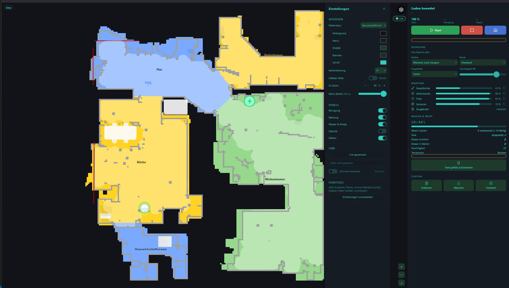
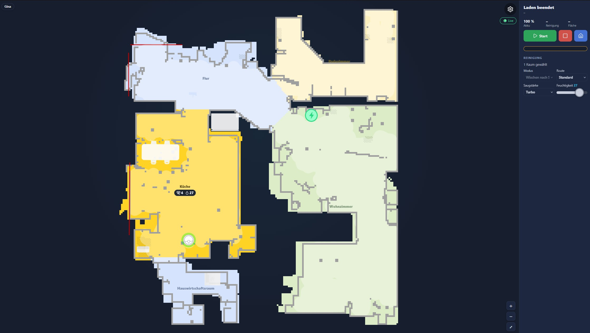
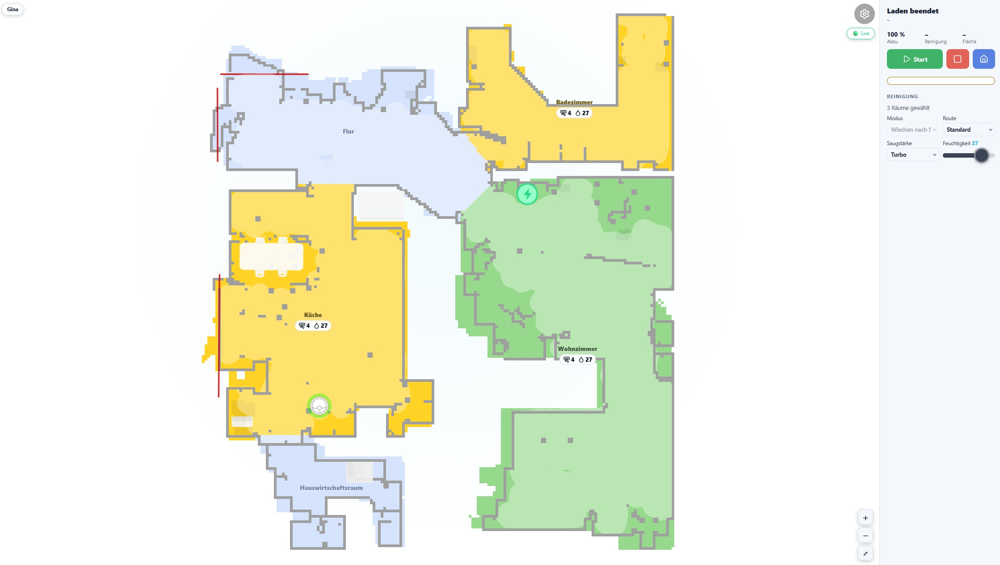

# ioBroker.dreame

[](https://www.npmjs.com/package/iobroker.dreame)
[](https://www.npmjs.com/package/iobroker.dreame)


[](https://nodei.co/npm/iobroker.dreame/)

**Tests:** 

**This adapter uses Sentry libraries to automatically report exceptions and code errors to the developers.** For more details and for information how to disable the error reporting see [Sentry-Plugin Documentation](https://github.com/ioBroker/plugin-sentry#plugin-sentry)! Sentry reporting is used starting with js-controller 3.0.



## dreame adapter for ioBroker

Adapter for Dreame and MOVA robot vacuums and robot mowers.

**Supported brands:** Dreame, MOVA (select in adapter settings)

**Tested with:** L10, L20, X40, A2 1200 (Mower), MOVA 600, MOVA 1000

---

## Installation

### Via ioBroker Admin (recommended)

1. Make sure the "Latest" repository is active under
   Admin → Settings → Repositories
2. Go to the "Adapters" tab and search for "dreame"
3. Click install

The adapter is currently available in the **Latest** repository. Stable
repository inclusion has been requested (see status at
https://github.com/ioBroker/ioBroker.repositories/pull/6200).

### Via CLI

```
iobroker install dreame@latest
```

### For adapter development

If you want to contribute to the adapter code itself (not just use it):

```
git clone https://github.com/TA2k/ioBroker.dreame.git
cd ioBroker.dreame
npm install
npm link
```

---

## Configuration

| Setting         | Description                                         |
| --------------- | --------------------------------------------------- |
| Cloud Service   | Select **Dreame** or **MOVA** depending on your app |
| App Email       | Your Dreame/MOVA app login email                    |
| App Password    | Your Dreame/MOVA app password                       |
| Get Map         | Fetches the map from the cloud on adapter start and every *Update interval* minutes; also maintains room names and the stored map images. Required for the map widget below. |
| Update interval | Cycle (minutes) in which the adapter actively polls the cloud — map fetch **and** general device status (battery, cleaning status, etc.). Higher values reduce cloud requests but delay both. |

> MOVA devices (600, 1000) use the same cloud backend as Dreame but with different domains. Select **MOVA** if you use the MOVA app.

---

## Vacuum (L10, L20, X40, ...)

The adapter creates states for vacuum robots lazily — only properties actually reported by your device appear in the object tree. States fill in gradually after adapter start and after the first polling cycle. The tables below show all known possible states; your device may only report a subset.

### Vacuum Status

| State                 | Description                                                                                                       |
| --------------------- | ----------------------------------------------------------------------------------------------------------------- |
| state                 | Robot state (1=Cleaning, 2=Standby, 3=Paused, 5=Returning, 6=Charging, 7=Mopping, 8=Drying, 9=Washing, ...)       |
| error                 | Error code                                                                                                        |
| battery-level         | Battery percentage                                                                                                |
| charging-status       | 1=Charging, 2=Not charging, 3=Completed, 5=Return to charge                                                       |
| status                | Cleaning status (0=Idle, 1=Paused, 2=Cleaning, 3=Back home, 6=Charging, 18=Segment, 19=Zone, 20=Spot, 21=Mapping) |
| cleaning-time         | Current cleaning time (min)                                                                                       |
| cleaned-area          | Current cleaned area (m²)                                                                                         |
| cleaning-progress     | Cleaning progress (%)                                                                                             |
| drying-progress       | Drying progress (%)                                                                                               |
| task-status           | Task (0=Completed, 1=Auto, 2=Zone, 3=Segment, 4=Spot, 5=Mapping)                                                  |
| task-type             | Task type                                                                                                         |
| serial-number         | Serial number                                                                                                     |
| faults                | Fault details                                                                                                     |
| warn-status           | Warning status                                                                                                    |
| water-tank            | 0=Not installed, 1=Installed, 10=Mop installed                                                                    |
| self-wash-base-status | Self-wash base status                                                                                             |
| mop-in-station        | Mop in station                                                                                                    |
| mop-pad-installed     | Mop pad installed                                                                                                 |
| drainage-status       | Drainage status                                                                                                   |
| device-capability     | Device capability flags                                                                                           |

#### Consumables

| State                  | Description              |
| ---------------------- | ------------------------ |
| main-brush-left        | Main brush life (%)      |
| main-brush-time-left   | Main brush time left (h) |
| side-brush-left        | Side brush life (%)      |
| side-brush-time-left   | Side brush time left (h) |
| filter-left            | Filter life (%)          |
| filter-time-left       | Filter time left (h)     |
| sensor-dirty-left      | Sensor life (%)          |
| sensor-dirty-time-left | Sensor time left (h)     |
| wheel-dirty-left       | Wheel life (%)           |

#### Station Status

| State                   | Description                               |
| ----------------------- | ----------------------------------------- |
| clean-water-tank-status | 0=Installed, 1=Not installed, 2=Low water |
| dirty-water-tank-status | 0=Installed, 1=Not installed or full      |
| dust-bag-status         | 0=Installed, 1=Not installed, 2=Check     |
| detergent-status        | Detergent status                          |
| hot-water-status        | Hot water status                          |

#### Statistics

| State               | Description                          |
| ------------------- | ------------------------------------ |
| first-cleaning-date | First cleaning date (unix timestamp) |
| total-cleaning-time | Total cleaning time (min)            |
| cleaning-count      | Total cleaning count                 |
| total-cleaned-area  | Total cleaned area (m²)              |

#### AutoSwitch Parsed Values

These are parsed from the `auto-switch-settings` JSON and available as individual states:

| State               | Description                                    |
| ------------------- | ---------------------------------------------- |
| auto-drying         | Auto drying: 0=off, 1=on                       |
| collision-avoidance | Collision avoidance: 0=off, 1=on               |
| fill-light          | Fill light in dark: 0=off, 1=on                |
| stain-avoidance     | Stain avoidance: 0=off, 1=on                   |
| mopping-type        | 0=Daily, 1=Accurate, 2=Deep                    |
| clean-genius        | CleanGenius: 0=Off, 1=Routine, 2=Deep          |
| cleaning-route      | 1=Standard, 2=Intensive, 3=Deep, 4=Quick       |
| wider-corner        | Corner coverage: 0=Off, 1=HighFreq, -7=LowFreq |
| floor-direction     | Floor direction cleaning: 0=off, 1=on          |
| pet-focused         | Pet focused cleaning: 0=off, 1=on              |
| max-suction         | Max suction power: 0=off, 1=on                 |
| hot-washing         | Hot washing: 0=off, 1=on                       |
| uv-sterilization    | UV sterilization: 0=off, 1=on                  |
| ultra-clean-mode    | Ultra clean mode: 0=off, 1=on                  |
| mop-extend          | Mop extend: 0=off, 1=on                        |
| smart-charging      | Smart charging: 0=off, 1=on                    |

### Vacuum Remote

| State                  | Description                                           |
| ---------------------- | ----------------------------------------------------- |
| suction-level          | 0=Quiet, 1=Standard, 2=Strong, 3=Turbo                |
| water-volume           | 1=Low, 2=Medium, 3=High                               |
| cleaning-mode          | 0=Sweeping, 1=Mopping, 2=Sweep+Mop, 3=Mop after sweep |
| carpet-boost           | Carpet boost on/off                                   |
| obstacle-avoidance     | Obstacle avoidance on/off                             |
| ai-detection           | AI detection bitfield                                 |
| child-lock             | Child lock on/off                                     |
| carpet-sensitivity     | 1=Low, 2=Medium, 3=High                               |
| carpet-recognition     | Carpet recognition on/off                             |
| carpet-cleaning        | 0=Avoid, 1=Adapt, 2=Ignore                            |
| self-clean             | Self clean on/off                                     |
| drying-time            | 2=2h, 3=3h, 4=4h                                      |
| auto-mount-mop         | Auto mount mop on/off                                 |
| mop-wash-level         | Mop wash level                                        |
| auto-water-refilling   | Auto water refilling on/off                           |
| auto-add-detergent     | Auto add detergent on/off                             |
| dnd-enable             | Do not disturb on/off                                 |
| dnd-start / dnd-end    | DND time range                                        |
| volume                 | Volume level                                          |
| auto-dust-collecting   | Auto dust collecting on/off                           |
| auto-empty-frequency   | Auto empty frequency                                  |
| wetness-level          | Wetness level (1–32)                                  |
| cleangenius-mode       | 0=Off, 1=Routine, 2=Deep                              |
| water-temperature      | 0=Cold, 1=Warm, 2=Hot, 3=Boiling                      |
| silent-drying          | Silent drying on/off                                  |
| hair-compression       | Hair compression on/off                               |
| mopping-with-detergent | Mopping with detergent on/off                         |

#### AutoSwitch Set Commands

These write directly to the device's AutoSwitch settings (property 4-50):

| State                       | Description                                                  |
| --------------------------- | ------------------------------------------------------------ |
| set-auto-drying             | Set auto drying: 0=off, 1=on                                 |
| set-collision-avoidance     | Set collision avoidance: 0=off, 1=on                         |
| set-fill-light              | Set fill light: 0=off, 1=on                                  |
| set-stain-avoidance         | Set stain avoidance: 0=off, 1=on                             |
| set-mopping-type            | Set mopping type: 0=Daily, 1=Accurate, 2=Deep                |
| set-clean-genius            | Set CleanGenius: 0=Off, 1=Routine, 2=Deep                    |
| set-cleaning-route          | Set cleaning route: 1=Standard, 2=Intensive, 3=Deep, 4=Quick |
| set-wider-corner            | Set wider corner: 0=Off, 1=HighFreq, -7=LowFreq              |
| set-floor-direction         | Set floor direction: 0=off, 1=on                             |
| set-pet-focused             | Set pet focused: 0=off, 1=on                                 |
| set-smart-charging          | Set smart charging: 0=off, 1=on                              |
| set-hot-washing             | Set hot washing: 0=off, 1=on                                 |
| set-uv-sterilization        | Set UV sterilization: 0=off, 1=on                            |
| set-max-suction             | Set max suction: 0=off, 1=on                                 |
| set-ultra-clean             | Set ultra clean: 0=off, 1=on                                 |
| set-mop-extend              | Set mop extend: 0=off, 1=on                                  |
| set-smart-drying            | Set smart drying: 0=off, 1=on                                |
| set-self-clean-frequency    | 0=Per room, 1=Standard, 2=High                               |
| set-intensive-carpet        | Set intensive carpet: 0=off, 1=on                            |
| set-gap-cleaning            | Set gap cleaning extension: 0=off, 1=on                      |
| set-mopping-under-furniture | Set mopping under furniture: 0=off, 1=on                     |
| set-custom-mopping          | Set custom mopping mode: 0=off, 1=on                         |

#### Actions

> **Breaking change since 0.3.18:** Action states (`start-clean`, `stop`,
> `pause`, `return-to-dock`, `locate`, `start-washing`, `start-auto-empty`,
> `clear-warning`, and all reset buttons) are now **type boolean / role button**.
> Write `true` to trigger them. Scripts or Vis widgets that previously wrote
> a string value must be updated.

| State              | Description                                            |
| ------------------ | ------------------------------------------------------ |
| start-clean        | Start cleaning (button)                                |
| pause              | Pause cleaning (button)                                |
| stop               | Stop cleaning (button)                                 |
| return-to-dock     | Return to dock (button)                                |
| start-custom-clean | Start custom clean (value: JSON with piid/value pairs) |
| start-washing      | Start mop washing (button)                             |
| start-auto-empty   | Start auto empty (button)                              |
| locate             | Locate robot / play sound (button)                     |
| clear-warning      | Clear warning (button)                                 |
| reset-main-brush   | Reset main brush consumable (button)                   |
| reset-side-brush   | Reset side brush consumable (button)                   |
| reset-filter       | Reset filter consumable (button)                       |
| reset-sensor       | Reset sensor consumable (button)                       |
| fetchMap           | Fetch map from device (button)                         |
| customCommand      | Send custom MIoT command (JSON)                        |

#### Room Cleaning

`dreame.0.XXXX.remote.start-custom-clean`

```json
[
  { "piid": 1, "value": 18 },
  { "piid": 10, "value": "{\"selects\":[[X,1,3,2,1]]}" }
]
```

X = Room ID. Multiple rooms: `{\"selects\":[[X,1,3,2,1],[Y,1,3,2,1]]}`

#### Switch Map

`dreame.0.XXXXXXX.remote.customCommand`:

```json
{ "siid": 6, "aiid": 2, "in": [{ "piid": 4, "value": "{\"sm\":{},\"mapid\":X}" }] }
```

X = mapId (see `dreame.0.XXXX.status.map-list`)

---

### Custom Room Cleaning

The **Custom Room Cleaning** feature lets you select individual rooms and send the robot only to those rooms, instead of cleaning the entire floor. Suction level and water volume apply globally to all selected rooms.

#### Step-by-step guide

**a) Name your map (optional, recommended for multi-floor households)**

When a map is first detected, `map.maps.<id>.mapName` is created with the placeholder value `"Map <id>"` (e.g. `"Map 1"`). This state is directly writable — change the value in the ioBroker object tree to something meaningful, e.g. from `"Map 1"` to `"Ground Floor"`. The channel name of `map.maps.<id>` updates automatically as soon as you save the new value. No adapter restart required.

**b) Set the active map**

Write the map ID (e.g. `1`) to `remote.custom-room-cleaning.active-map`. Only the rooms belonging to that map will be sent to the robot when you trigger start. The named map from step (a) helps you identify which ID corresponds to which floor.

**c) Select rooms**

Under `remote.custom-room-cleaning.map-<id>/`, each recognized room appears as a boolean state. The channel and state names show the translated room name from the map (e.g. `kitchen`, `living-room`, `bathroom`). Set the desired rooms to `true`.

**d) Adjust suction level and water volume (optional)**

`remote.suction-level` and `remote.water-volume` apply to all selected rooms. Set them before triggering start if you want non-default values. These are the same states used for regular cleaning.

**e) Start the cleaning run**

Set `remote.custom-room-cleaning.start` to `true`. The adapter builds the room selection from the active map's checkboxes, sends it to the robot, and resets the `start` state to `false` automatically.

#### Advanced: direct `customCommand` editing

`remote.custom-room-cleaning.customCommand` holds the raw selection as a JSON string. You can write it directly if you prefer:

```json
{"selects":[[roomId, repeats, suctionLevel, waterVolume, index], ...]}
```

Example — kitchen (ID 4) once at strong suction, medium water:

```json
{"selects":[[4, 1, 2, 2, 1]]}
```

The `customCommand` and the room checkboxes are **bidirectionally synchronized**: editing either one updates the other automatically. Writing `customCommand` directly updates the checkboxes for the active map; ticking a checkbox rebuilds `customCommand`. Both paths are equivalent.

#### Known limitations

- **Global suction/water only** — suction level and water volume are set identically for all selected rooms. Per-room settings (as shown in `map.cleanset.*`) are not supported by this feature.
- **Multi-floor tested with one map** — the multi-map structure (one channel group per map) is fully implemented, but only single-map operation has been tested extensively on real hardware. Multi-floor households with two or more maps should work but are not yet verified end-to-end.

---

### Vacuum Shortcuts

Shortcuts (quick commands created in the Dreame app) are parsed from property 4-48 (base64 encoded names). Each shortcut gets its own channel under `deviceId.shortcuts.{id}`:

| State   | Description                                |
| ------- | ------------------------------------------ |
| name    | Decoded shortcut name                      |
| running | Whether the shortcut is currently running  |
| start   | Button to start the shortcut               |

Channels are rebuilt automatically on adapter start (not just on the next app-side change) and removed automatically when a shortcut is deleted in the app.

---

### Schedules

Schedules created in the Dreame app (property 8-2) are parsed into one channel per schedule entry under `deviceId.schedule.{id}`:

| State      | Description                                                                          |
| ---------- | ------------------------------------------------------------------------------------- |
| enabled    | Whether the schedule is active — writable, toggles the schedule directly on the robot |
| time       | Time of day the schedule triggers (`HH:MM`)                                            |
| weekdays   | Weekdays the schedule runs on (currently always in German, e.g. `Mo,Mi,Fr` or `täglich`) |
| type       | Kind of schedule: room cleaning, all-rooms cleaning, or a shortcut                      |
| rooms      | *(room-cleaning schedules only)* JSON array, one entry per room with its own mode/suction/route/cycles/moisture and translated room name |
| parameters | *(all-rooms schedules only)* JSON object with mode/suction/route/cycles/moisture applying to the whole floor |
| shortcutId | *(shortcut schedules only)* the numeric ID of the linked shortcut                      |
| orphan     | *(shortcut schedules only)* `true` if the linked shortcut no longer exists (deleted in the app) — `enabled` should not be relied on in this case |

Schedule channels are rebuilt automatically on adapter start and removed automatically when a schedule is deleted in the app, same as shortcuts above.

---

### Live Map Widget

The adapter includes a browser-based live map widget: robot position, cleaning trail and cleaned rooms, updating in real time while the robot cleans. It is served directly by this adapter — no vis widget or extra adapter needed, and it's ready to embed as an iframe in vis, Grafana or a custom dashboard.

#### Setup

- Requires the ioBroker **web** adapter (any instance) to serve the page.
- Open it at `%web_protocol%://%ip%:%web_port%/dreame/` — e.g. `http://<your-iobroker>:8082/dreame/`. A ready-made link ("Dreame-Map") is on the ioBroker start page and next to this instance in the adapter list.
- **Get Map** must be enabled (see [Configuration](#configuration)) — without it the widget has no data.
- If no map is shown yet, start the adapter once while the robot sits in its dock so the first full map can load.
- Multiple robots on the same instance: the widget shows a device switcher in the header when more than one device is found, or pick one directly with `?did=<did>` in the address.

> **Camera/VSLAM robots are not supported.** Devices that navigate by camera instead of lidar (e.g. Mijia 1C/1T, Dreame F9) are not covered by the map widget — it is built and tested for lidar robots only. The adapter logs a warning and the map stays empty for these devices.

#### Appearance

All appearance settings live in the widget itself — open the gear icon in the top-right corner. Four color modes are available:

| Mode | Description |
| --- | --- |
| Light | Fixed light theme |
| Dark | Fixed dark theme (default) |
| Main color | Pick one base color; sidebar, borders and text are derived from it automatically, with a contrast check so text always stays readable |
| Custom | Five individually chosen colors (background, sidebar, buttons, borders, text) for full control |

<table>
<tr>
<td width="50%"></td>
<td width="50%"></td>
</tr>
</table>

#### Features

- Device switcher in the header for setups with multiple robots
- Customizable layout: sidebar left/right, UI zoom, sidebar width, map rotation
- Panels can be shown or hidden individually (Cleaning, Shortcuts, Station, Maintenance, Water & Mop, Statistics) — some panels additionally let you hide individual rows/tiles inside them (e.g. suction level or moisture on the Cleaning panel)
- Shortcuts panel: one tile per app shortcut, tap to start it directly from the widget
- Schedules button opens a table of all schedules created in the Dreame app (time, weekdays, type, per-room or whole-floor settings) with an on/off switch for each — a schedule pointing at a deleted shortcut shows a locked switch instead of silently doing nothing
- Widget UI is available in German and English, following the ioBroker system language
- Kiosk mode (`?gear=0`) hides the settings gear — for read-only displays (wall tablets, dashboards)
- Current appearance and panel settings can be exported as a compact link (`?cfg=<blob>`), for quickly sharing or reusing a setup across multiple embeds without touching the stored configuration
- Tank and mop consumption counters (Water & Mop panel)
- One-click reset back to default appearance and panel settings, independent of the stored adapter configuration

#### Kiosk / iframe example

Combine `?gear=0` (hide settings) with a `?cfg=` link generated in the settings panel to embed a pre-configured, read-only view:

```
http://<your-iobroker>:8082/dreame/?gear=0&cfg=<blob>
```

The `<blob>` is generated by the "Link" section in the widget's settings panel and only affects that browser tab/embed — it never overwrites the settings stored for the widget itself.

---

## Mower (A2, A2 1200, ...)

The adapter supports Dreame robotic mowers with dedicated states and map rendering. States are created lazily — only properties actually reported by your device appear in the object tree.

### Mower Status

| State                    | Description                                                                                                |
| ------------------------ | ---------------------------------------------------------------------------------------------------------- |
| status                   | Mower status (1=Mowing, 2=Standby, 3=Paused, 5=Returning, 6=Charging, 11=Mapping, 13=Charged, 14=Updating) |
| fault                    | Error code                                                                                                 |
| battery-level            | Battery percentage                                                                                         |
| charging-state           | Charging state                                                                                             |
| work-mode                | Current work mode                                                                                          |
| mowing-time              | Current mowing time (min)                                                                                  |
| mowing-area              | Current mowed area (m²)                                                                                    |
| task-status              | Task status                                                                                                |
| faults                   | Fault details                                                                                              |
| warn-status              | Warning status                                                                                             |
| settings-update          | Settings change via MQTT (2-51). Value: `[en,hours]`=Rain, `0/1`=Frost, `[en,start,end]`=LowSpeed          |
| zone-status              | Zone mowing status per area                                                                                |
| ai-obstacles             | AI detected obstacles                                                                                      |
| self-check               | Self-check diagnostic result                                                                               |
| total-mow-time           | Total mowing time (min)                                                                                    |
| total-mow-count          | Total mow count                                                                                            |
| total-mow-area           | Total mowed area (m²)                                                                                      |
| rain-protection          | Rain protection settings (WRP): `[enabled, wait_hours, sensitivity]`                                       |
| frost-protection         | Frost protection (FDP): 0=off, 1=on                                                                        |
| low-speed                | Low speed night mode (LOW): `[enabled, start_min, end_min]`                                                |
| dnd-settings             | Do not disturb settings (DND): `[enabled, start_min, end_min]`                                             |
| battery-config           | Battery config (BAT): `[return%, max%, charge_en, ?, start, end]`                                          |
| volume                   | Volume (VOL): 0-100                                                                                        |
| child-lock-cfg           | Child lock (CLS): 0=off, 1=on                                                                              |
| ai-obstacle-cfg          | AI obstacle avoidance (AOP): 0=off, 1=on                                                                   |
| anti-theft               | Anti-theft (STUN): 0=off, 1=on                                                                             |
| headlight                | Headlight settings (LIT): `[enabled, start, end, l1, l2, l3, l4]`                                          |
| grass-protection         | Grass protection (PROT): 0=off, 1=on                                                                       |
| blade-hours              | Blade operating hours (max 100h)                                                                           |
| blade-health             | Blade health 0-100%                                                                                        |
| brush-hours              | Brush operating hours (max 500h)                                                                           |
| brush-health             | Brush health 0-100%                                                                                        |
| robot-maintenance-hours  | Robot maintenance hours (max 60h)                                                                          |
| robot-maintenance-health | Robot maintenance health 0-100%                                                                            |
| collision-avoidance      | Collision avoidance (AutoSwitch LessColl): 0=off, 1=on                                                     |
| fill-light               | Fill light (AutoSwitch FillinLight): 0=off, 1=on                                                           |
| clean-genius             | CleanGenius (AutoSwitch SmartHost): 0=Off, 1=Routine, 2=Deep                                               |
| cleaning-route           | Cleaning route (AutoSwitch CleanRoute): 1=Standard, 2=Intensiv, 3=Deep, 4=Quick                            |
| wider-corner             | Wider corner coverage (AutoSwitch MeticulousTwist): 0=Off, 1=HighFreq, 7=LowFreq                           |
| floor-direction          | Floor direction cleaning (AutoSwitch MaterialDirectionClean): 0=off, 1=on                                  |
| pet-focused              | Pet focused cleaning (AutoSwitch PetPartClean): 0=off, 1=on                                                |
| auto-charging            | Auto charging (AutoSwitch SmartCharge): 0=off, 1=on                                                        |
| cutting-height           | Cutting height in mm (PRE)                                                                                 |
| obstacle-distance-cfg    | Obstacle distance in mm (PRE)                                                                              |
| mow-mode                 | Mow mode (PRE): 0=Standard, 1=Efficient                                                                    |
| direction-change         | Direction change (PRE): 0=auto, 1=off                                                                      |
| edge-mowing              | Edge mowing (PRE): 0=off, 1=on                                                                             |
| edge-detection           | Edge detection (PRE): 0=off, 1=on                                                                          |

#### Position and Task Data (binary protocol, live)

These states are populated from MQTT binary messages and created lazily —
they only appear after the mower sends its first binary update.

**From robot position packet (siid 1-5):**

| State                | Description                                                        |
| -------------------- | ------------------------------------------------------------------ |
| robot-position       | Current robot position JSON: `{"x":..., "y":..., "angle":...}`    |
| mowing-progress      | Current task progress (%)                                          |
| mowed-area           | Area completed in current task (m²)                                |
| total-mow-area-task  | Total planned area for current task (m²)                           |
| mowing-task          | Full task data JSON: `{regionId, taskId, percent, total, finish}`  |

**From device telemetry packet (siid 1-1):**

| State              | Description                                                                                      |
| ------------------ | ------------------------------------------------------------------------------------------------ |
| dock-position      | Dock/charger position JSON: `{"x":..., "y":..., "angle":...}` (updated when docking)            |
| docking-state      | IN_STATION / OUT_OF_STATION / PAUSE_DOCKING / FINISH_DOCKING / DOCKING_FAILED / DOCKING_IN_BASE |
| location-state     | Location state (0–3)                                                                             |
| battery-level-live | Live battery level (%) from binary telemetry                                                     |
| charging-live      | Live charging: 0=Not charging, 1=Charging                                                        |
| wifi-rssi          | WiFi signal strength (dBm)                                                                       |
| lte-rssi           | LTE signal strength (dBm)                                                                        |
| ble-rssi           | Bluetooth signal strength (dBm)                                                                  |
| error-code-binary  | Raw error code from binary telemetry                                                             |
| pin-state          | Pin state (0/1)                                                                                  |
| undocking          | Undocking flag (0/1)                                                                             |
| camera-state       | Camera state                                                                                     |

### Mower Remote

| State                   | Description                                                              |
| ----------------------- | ------------------------------------------------------------------------ |
| start-mow               | Start mowing (button)                                                    |
| stop-mow                | Stop mowing (button)                                                     |
| pause-mow               | Pause mowing (button)                                                    |
| start-charge            | Return to dock (button)                                                  |
| start-mow-ext           | Start custom mow (zone/segment cleaning with params)                     |
| clear-warning           | Clear warning/error state (button)                                       |
| obstacle-avoidance      | Obstacle avoidance on/off                                                |
| ai-detection            | AI detection on/off                                                      |
| child-lock              | Child lock on/off                                                        |
| dnd-enable              | Do not disturb on/off                                                    |
| dnd-start / dnd-end     | DND time range                                                           |
| schedule                | Mow schedule                                                             |
| set-rain-protection     | Set rain protection: `{"value":1,"time":8,"sen":0}` or `{"value":0}`     |
| set-frost-protection    | Set frost protection: 0=off, 1=on                                        |
| set-low-speed           | Set low speed night: `{"value":1,"time":[1200,480]}` or `{"value":0}`    |
| set-dnd                 | Set do not disturb: `{"value":1,"time":[1200,480]}` or `{"value":0}`     |
| set-child-lock          | Set child lock: 0=off, 1=on                                              |
| set-volume              | Set volume: 0-100                                                        |
| set-ai-obstacle         | Set AI obstacle avoidance: 0=off, 1=on                                   |
| set-anti-theft          | Set anti-theft: 0=off, 1=on                                              |
| set-headlight           | Set headlight: `{"value":1,"time":[480,1200],"light":[1,1,1,1]}`         |
| set-path-display        | Set path display: 0=off, 1=on                                            |
| set-grass-protection    | Set grass protection: 0=off, 1=on                                        |
| reset-consumables       | Reset consumables: `{"value":[0,brush,robot]}`                           |
| find-robot              | Find robot (play sound, button)                                          |
| lock-robot              | Lock robot (button)                                                      |
| fetchMap                | Fetch map from device (button)                                           |
| generate-3dmap          | Generate 3D LIDAR map (button)                                           |
| customCommand           | Send custom MIoT command                                                 |
| set-collision-avoidance | Set collision avoidance (AutoSwitch): 0=off, 1=on                        |
| set-fill-light          | Set fill light (AutoSwitch): 0=off, 1=on                                 |
| set-clean-genius        | Set CleanGenius (AutoSwitch): 0=Off, 1=Routine, 2=Deep                   |
| set-cleaning-route      | Set cleaning route (AutoSwitch): 1=Standard, 2=Intensiv, 3=Deep, 4=Quick |
| set-auto-charging       | Set auto charging (AutoSwitch): 0=off, 1=on                              |
| set-cutting-height      | Set cutting height in mm (PRE)                                           |
| set-mow-mode            | Set mow mode (PRE): 0=Standard, 1=Efficient                              |
| set-edge-mowing         | Set edge mowing (PRE): 0=off, 1=on                                       |
| set-edge-detection      | Set edge detection (PRE): 0=off, 1=on                                    |
| set-direction-change    | Set direction change (PRE): 0=auto, 1=off                                |
| mow-all                 | Mow all areas (button, o=100)                                            |
| mow-zone                | Mow selected zones — CSV `"1,3"` or JSON `"[1,3]"` (o=102)               |
| mow-plan                | Start mowing per stored plan (button, o=104)                             |
| mow-obstacle-scan       | Obstacle recognition run (button, o=105)                                 |
| mow-edge                | Mow contour: JSON `{"edge":[[x,y],...]}` (o=101)                         |
| mow-spot                | Mow spot area: JSON `{"area":{...}}` (o=103)                             |
| mow-change-map          | Switch active map (number, 0-based index, o=200)                         |

#### Mowing Specific Zones

Every mowing area defined on the map is exposed as its own channel under
`dreame.0.<did>.mower.map.slot<X>.zone<zoneId>`. Open ioBroker's Object
Browser, navigate to your mower, then to `mower.map`, and you will see
one `slot0`, `slot1`, ... per stored map. Each slot contains one
`zone<N>` channel per mowing area — for example `slot0.zone1`,
`slot0.zone3`. Inside each zone you find `name` (as shown in the app),
`area` (m²), `time`, and `path`.

The **numeric part after `zone`** is the zone ID you write into
`remote.mow-zone`. So if the tree looks like this:

```text
dreame.0.<did>.mower.map.slot0.zone1     name = "Front lawn"
dreame.0.<did>.mower.map.slot0.zone3     name = "Back lawn"
dreame.0.<did>.mower.map.slot0.zone5     name = "Side strip"
```

then:

Single zone — mow "Front lawn":

```text
dreame.0.<did>.remote.mow-zone = "1"
```

Multiple zones — mow "Front lawn" + "Back lawn" + "Side strip":

```text
dreame.0.<did>.remote.mow-zone = "1,3,5"
```

JSON form works too — useful from Blockly or JavaScript scripts:

```text
dreame.0.<did>.remote.mow-zone = "[1,3,5]"
```

Blockly / JavaScript-Adapter example:

```js
setState('dreame.0.' + did + '.remote.mow-zone', '1,3', false);
```

The mower parses the list, starts mowing the selected zones, and returns to the dock when done. To stop mid-run, press `stop-mow` (o=2) or `pause-mow` (o=4). Switching maps first (`mow-change-map`) is required if the target zones live on a different map — otherwise the zone IDs will not resolve.

#### Switching the Active Map

If the mower has more than one map, select which map is active before writing zone IDs:

```text
dreame.0.<did>.remote.mow-change-map = 0   // first map
dreame.0.<did>.remote.mow-change-map = 1   // second map
```

### Mower Shortcuts

Shortcuts are parsed from property 4-48 (base64 encoded names). Each shortcut gets its own channel under `deviceId.shortcuts.{id}`:

| State   | Description                               |
| ------- | ----------------------------------------- |
| name    | Decoded shortcut name                     |
| running | Whether the shortcut is currently running |
| start   | Button to start the shortcut              |

### Mower History

Cleaning history is fetched from the cloud API (last 20 mow sessions).

| State              | Description                                 |
| ------------------ | ------------------------------------------- |
| last-mow-date      | Date of the last mowing session             |
| last-mow-duration  | Duration of last session (min)              |
| last-mow-area      | Area mowed in last session (m²)             |
| last-mow-completed | Whether last session completed successfully |
| history-json       | JSON array of last 20 sessions              |

### Mower Map

Map data is fetched via the Dreame iotuserdata API (not MQTT like vacuums).

| State          | Description                            |
| -------------- | -------------------------------------- |
| mapImage       | Rendered map as PNG (base64 data URL)  |
| slot0.zone_X   | Zone data (name, area, mowing time)    |
| mowingPath     | Raw mowing path coordinates            |
| settings       | Mowing settings per zone               |
| schedule       | Mowing schedule                        |
| 3dmap-url      | 3D LIDAR map download URL (pre-signed) |
| 3dmap-progress | 3D map generation progress (0-100%)    |

**Map polling:** The map is fetched on adapter start and via the `fetchMap` button. During active mowing (status 1, 3, 5, 11) the map is automatically polled every 30 seconds to track the mowing path.

**Map rendering:** Requires the optional `canvas` npm package. The map shows zones (green), contours (white outlines), mowing path (yellow), forbidden areas (red), and obstacles (red circles).

**3D LIDAR Map:** Press `generate-3dmap` to trigger the mower to scan and upload a 3D point cloud map. The downloaded file is a PCD (Point Cloud Data) file that can be viewed with tools like CloudCompare or MeshLab. Progress is tracked in `3dmap-progress`. Once complete, the pre-signed download URL is written to `3dmap-url`. The URL is temporary and expires after some hours.

#### Custom Commands for Mower

Via `dreame.0.XXXXXX.remote.customCommand`:

```json
{
  "siid": 5,
  "aiid": 9,
  "in": [{ "order": 4, "region": [1], "type": "order" }]
}
```

## Known Limitations

**Object tree fills in gradually (lazy state creation)**
States only appear once the device has reported the corresponding property at
least once. After a fresh installation or adapter restart, the tree may look
incomplete for a few minutes — this is expected behaviour.

**L40s Pro Ultra and similar: some states appear only after active use**
Properties in the SIID 4 group (`cleaning-mode` 4-23, `suction-level` 4-4,
`water-volume` 4-5) and SIID 28 (`wetness-level` 28-1) may only be pushed
by the device after an active cleaning session, not during idle polling.
These states will not appear until at least one cleaning cycle has completed
after the adapter was installed or restarted.

**`cleaning-mode` raw values on some devices**
Versions before 0.3.18 could report raw compound values (e.g. 5120, 5121,
5122) instead of the documented 0–3 range on some devices, including the
L40s Pro Ultra. This was caused by the adapter not decoding a
compound-encoded value that combines mode, area and humidity in a single
integer. Since 0.3.18 this is decoded correctly. If you still see raw values
above 1000 after updating, please open an issue with your model and the raw
value you observe.

---

## Translations

State names and descriptions are available in 11 languages: English, German,
Russian, Portuguese, Dutch, French, Italian, Spanish, Polish, Ukrainian, and
Chinese (simplified).

`lib/i18n/en.json` is the authoritative source. All other languages are
generated from it via `npm run translate`. Corrections to non-English
translations should be submitted as PRs against the respective
`lib/i18n/<lang>.json` file.

---

## Changelog

### 0.4.6 (2026-08-29)
- Attempted fix for issue #124 layer 4 (missing pixel raster on r2253c/r2253w): map background, walls, and room fills were not rendered even though overlays and metadata came through correctly. Adds a fallback to combined_pixel_type when the base pixel raster is empty (matching Home Assistant's renderer), and introduces permanent [MERGE-DEBUG] info-level logging (dimensions, pixel counts, wall/segment counts) so this failure mode is instantly diagnosable if it returns. Models whose base raster is already populated (e.g. r9419h) are unchanged. Thanks to luckyheiko for the pinpoint analysis.

### 0.4.5 (2026-08-28)
- Fix for issue #124 (Layer 3): map rendering could crash on the frontend when the device reported detected carpets with an invalid polygon field (null or malformed). Adds a filter in lib/mapMerge.js so invalid carpets never reach the frontend, a defensive guard in the carpet drawing routine in www/js/karte/merger.js, and a generic try/catch around overlay drawing so a single bad overlay never breaks the whole map rendering. The unreferenced legacy widget page www/legacy.html, which carried the same bug, is removed. Combined with 0.4.3 (comma-truncation) and 0.4.4 (AES decryption), this closes the full end-to-end map path for r2253c/r2253w. Thanks to luckyheiko for identifying the root cause and proposing the fix approach.

### 0.4.4 (2026-08-28)
- Fix for issue #124 (Layer 2): map payload for r2253c, r2253w and similar newer Dreame models is AES-256-CBC encrypted; the adapter now derives the AES key from the object_name comma suffix (SHA256, first 32 hex chars as UTF-8), uses a model-specific IV, and decrypts the payload before zlib inflation. Combined with the 0.4.3 comma-truncation fix, this closes the full end-to-end map download path for r2253 models. Also fixes a long-standing bug in lib/dreame.js where the persistent MAP_LIST path used an empty IV instead of the model-specific one. Models without a comma suffix in the object_name (e.g. r9419h/L40s) are unchanged. Thanks to luckyheiko and ralfheitz for the diagnostic logs.

### 0.4.3 (2026-08-28)
- Fix for issue #124 (HTTP 404 on map download for r2253c, r2253w and similar newer Dreame models where the Dreame backend returns an object_name with a comma suffix that the OSS storage does not resolve): the adapter now transparently retries with the object_name truncated at the first comma. Models without a comma in the object_name (e.g. r9419h/L40s) are unchanged. Diagnostic [MAP-DIAG] logging from 0.4.2 remains but only fires when the fallback also fails; new [MAP-DIAG-2] captures the retry outcome for future analysis.

### 0.4.2 (2026-08-27)
- Diagnostic release for issue #124 (HTTP 404 on r2253c/L20 Ultra map download): adds temporary [MAP-DIAG] logging on HTTP errors during fresh map downloads (model, did, object_name, download_url, HTTP status, timing, content-type, response body head) to distinguish race, region and object-name-format hypotheses. No functional changes; fallback to persistent MAP_LIST map unchanged. Diagnostic will be reverted in 0.4.3 together with the actual fix.

### 0.4.1 (2026-08-03)
- Added Schedules: schedules created in the Dreame app are now parsed into `schedule.<id>.*` states (time, weekdays, type, enabled toggle, per-room or whole-floor settings with translated room names and enum values, linked shortcut for shortcut-type schedules). See [Schedules](#schedules).
- Widget: added a Schedules panel/button showing all schedules in a table with an on/off switch each; schedules pointing at a deleted shortcut show a locked switch instead of silently failing.
- Widget: added a Shortcuts panel — one tile per app shortcut, tap to start it directly.
- Fixed app shortcuts being unavailable on vacuums (previously mower-only); shortcut channels are now rebuilt on adapter restart and cleaned up when deleted in the app.
- Widget: full German/English translation of every panel (Cleaning, Shortcuts, Schedules, Station, Maintenance, Water & Mop, Statistics, Kopf/Fehler status and error text), following the ioBroker system language.
- Widget: individual rows/tiles within a panel can now be hidden, not just whole panels (e.g. hide suction level or moisture on the Cleaning panel).
- Widget: menu width control changed from a slider (which visibly drifted under the pointer while dragging) to a number field with −/+ buttons, matching the existing UI zoom control.
- Widget: fixed a label/input association bug where clicking the "UI zoom"/"Menu width" caption activated the adjacent minus button instead of focusing the field (#104, thanks RicardoHipp).
- Widget: the cleaning-mode tile is no longer locked as soon as any room is selected — testing showed the robot does honour the globally set mode for room cleaning except for the combined vacuum+mop mode (#103, thanks RicardoHipp).
- Widget: removed the unused, never-wired-up Mopp panel placeholder; `configVersion` bumped 5→6 to clean up any leftover `panels.mopp` config entry.
- Retyped six MIoT settings from `boolean` to `number` (auto-dust-collecting, auto-lds-coverage, clean-carpets-first, silent-drying, hair-compression, mopping-with-detergent) — devices reporting a value outside 0/1 had those silently rejected before. Thanks to krobipd for the analysis.
- Fixed several `map.*` states logging "has no existing object" on first creation (missing `await` before the object was created).
- Named 13 previously raw/unnamed status datapoints (mop pad and dirty water tank consumables, firmware/MCU version, cleaning-related flags, camera light, current city, cleaning mode) after cross-checking them against another adapter on the same hardware. Thanks to krobipd.
- Decoded `status.error` (previously a raw numeric code) into readable, translated text for 98 error codes, cross-checked against two independent sources. Thanks to krobipd.
- Added a fallback so `status.state`/`status.battery-level` still populate on models whose regular status poll omits them (e.g. Aqua10 Ultra / r95475). Thanks to krobipd.
- Added `remote.go-to-point` (x/y/use-current-position/start): send the robot to a stored map coordinate to look around, without cleaning on the way. Thanks to krobipd.
- Added per-device `info.online` reachability state with one log line per online/offline transition, replacing silent timeout logging.
- Bumped `pako` (map data compression) from 2.x to 3.x.

### 0.4.0 (2026-07-31)
- Modular widget rebuild: customizable appearance (light/dark/main-color/custom themes), configurable panels, kiosk mode with URL-based configuration sharing, robot switcher for multi-device setups.

### 0.3.26 (2026-07-20)
- Fixed stream-status (siid 10001 piid 1) type warning: the value is a streaming-session object, not a number - state declaration corrected to type string / role json, matching the convention used for dnd-task, task-info and zone-status (#82). The boolean type mismatch reported by flapman on remote.auto-dust-collecting, mopping-with-detergent, hair-compression, silent-drying, auto-lds-coverage and clean-carpets-first is already covered by the boolean coercion added in 0.3.25 - please update. Thanks to krobipd for reporting the exact device payload and preparing the fix.

### 0.3.25 (2026-07-20)
- Fixed room-specific cleaning settings being written to the wrong room (cleanset used RoomOrder instead of the real room id) (#95). Fixed boolean switches being rejected by the device - values are now sent as 1/0 (#94). Fixed adapter reboot loop on devices without a generated map, e.g. MOVA Z70 (#83). Fixed multi-room cleaning only cleaning the first selected room on 5th gen devices. Fixed swapped cleaning modes (vacuum/vacuum+mop) on devices with liftable mop pads. Fixed stream-status type warning (#82). German translation: renamed dining hall segment from Speisesaal to Esszimmer. Thanks to RicardoHipp for reporting and analyzing several of these issues.

### 0.3.24 (2026-07-01)
- Fixed custom room cleaning bug where switching active-map without touching a checkbox left customCommand holding room IDs from the previously selected map, causing the robot to clean the wrong room (room segment IDs are not unique across maps). customCommand is now rebuilt automatically whenever active-map changes, and is recomputed fresh from the active map's checkboxes immediately before every start as a final safeguard. Start is now aborted with a warning if no room is selected for the active map.

[Older changelogs can be found there](CHANGELOG_OLD.md)

## Credits

- **TA2k** — repository owner and original adapter author
- **RicardoHipp** — original map renderer this widget's map rendering is based on (MIT licensed)
- **Sefina-DS (David)** — co-maintainer, widget rebuild, live testing
- **Community** — krobipd, flapman, volvodani, and everyone else reporting issues and testing devices

## License

MIT License

Copyright (c) 2024-2026 TA2k <tombox2020@gmail.com>

Permission is hereby granted, free of charge, to any person obtaining a copy
of this software and associated documentation files (the "Software"), to deal
in the Software without restriction, including without limitation the rights
to use, copy, modify, merge, publish, distribute, sublicense, and/or sell
copies of the Software, and to permit persons to whom the Software is
furnished to do so, subject to the following conditions:

The above copyright notice and this permission notice shall be included in all
copies or substantial portions of the Software.

THE SOFTWARE IS PROVIDED "AS IS", WITHOUT WARRANTY OF ANY KIND, EXPRESS OR
IMPLIED, INCLUDING BUT NOT LIMITED TO THE WARRANTIES OF MERCHANTABILITY,
FITNESS FOR A PARTICULAR PURPOSE AND NONINFRINGEMENT. IN NO EVENT SHALL THE
AUTHORS OR COPYRIGHT HOLDERS BE LIABLE FOR ANY CLAIM, DAMAGES OR OTHER
LIABILITY, WHETHER IN AN ACTION OF CONTRACT, TORT OR OTHERWISE, ARISING FROM,
OUT OF OR IN CONNECTION WITH THE SOFTWARE OR THE USE OR OTHER DEALINGS IN THE
SOFTWARE.
