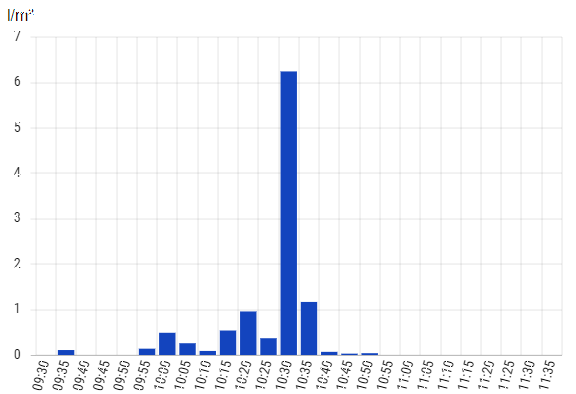
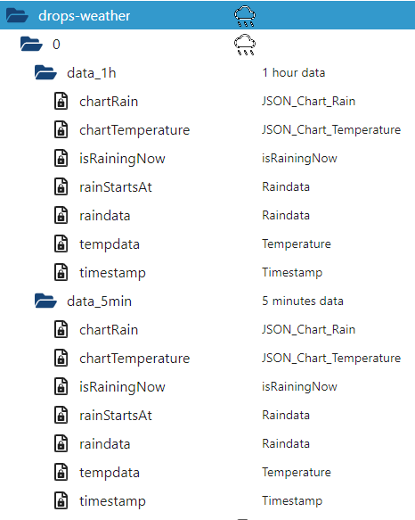
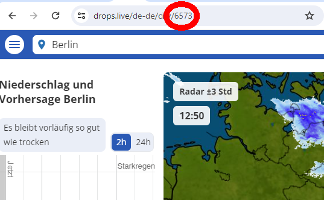

# ioBroker.drops-weather

## drops-weather adapter for ioBroker

This adapter provides rain data from https://www.drops.live

## Features

This adapter reads the rain data at an interval of 5 minutes from the website.
There is a chart datapoint, which can directly be used by the BarChart widget from the Material Designs widgets.

The 5 minutes and 1h data is stored in different states.

## Configuration

GPS position is no longer available on the drops.live website.

You need to know the city code of your location or city. To get this code, just enter your city name (or use your location) at https://www.drops.live .

You will find your city code in the URL:

In this example you will find 6573 for Berlin.

## Note for users of arm architecure (i.e. raspberry pi)

This adapter tries to install the package 'chromium-browser' at linux / arm architecture. This is required as the standard installation of puppeteer does not provide a working headless browser on this architecture. If the installation fails, one might install any compatible browser and specify the path to the browser at the instance configuration.

## Credits

This adapter would not have been possible without the great work of @inbux (https://github.com/inbux), who created pre V1.x.x releases of this adapter.

## Changelog

<!--
	Placeholder for the next version (at the beginning of the line):
	### **WORK IN PROGRESS**
-->
### 1.2.4 (2025-06-04)
- (mcm1957) fix language default.
- (mcm1957) dependencies have been updated

### 1.2.3 (2025-03-29)
- (arteck) Text is now deleted if no text is available

### 1.2.2 (2025-03-29)
- (arteck) Puppeteer-extra and puppeteer-extra-plugin-stealth have been added

### 1.2.1 (2025-03-25)
- (arteck) Language support has been added.
- (mcm1957) Unused dependencies have been removed.

### 1.2.0 (2025-03-24)
- (mcm1957) Timeout has been encreased to 15s.
- (mcm1957) Logging has been reduced.
- (arteck) Adapter has been converted to scheduled operation. 
- (mcm1957) A spelling error blocking chromium-browser manual selection has been corrected.

## License

MIT License

Copyright (c) 2025, iobroker-community-adapters <iobroker-community-adapters@gmx.de>  
Copyright (c) 2024 inbux <inbux.development@gmail.com>

Permission is hereby granted, free of charge, to any person obtaining a copy
of this software and associated documentation files (the "Software"), to deal
in the Software without restriction, including without limitation the rights
to use, copy, modify, merge, publish, distribute, sublicense, and/or sell
copies of the Software, and to permit persons to whom the Software is
furnished to do so, subject to the following conditions:

The above copyright notice and this permission notice shall be included in all
copies or substantial portions of the Software.

THE SOFTWARE IS PROVIDED "AS IS", WITHOUT WARRANTY OF ANY KIND, EXPRESS OR
IMPLIED, INCLUDING BUT NOT LIMITED TO THE WARRANTIES OF MERCHANTABILITY,
FITNESS FOR A PARTICULAR PURPOSE AND NONINFRINGEMENT. IN NO EVENT SHALL THE
AUTHORS OR COPYRIGHT HOLDERS BE LIABLE FOR ANY CLAIM, DAMAGES OR OTHER
LIABILITY, WHETHER IN AN ACTION OF CONTRACT, TORT OR OTHERWISE, ARISING FROM,
OUT OF OR IN CONNECTION WITH THE SOFTWARE OR THE USE OR OTHER DEALINGS IN THE
SOFTWARE.
