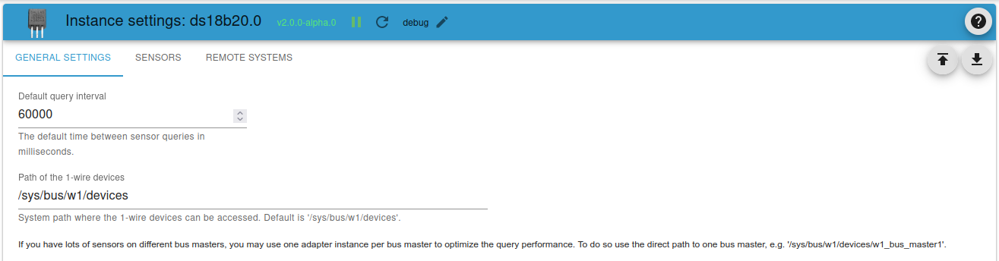
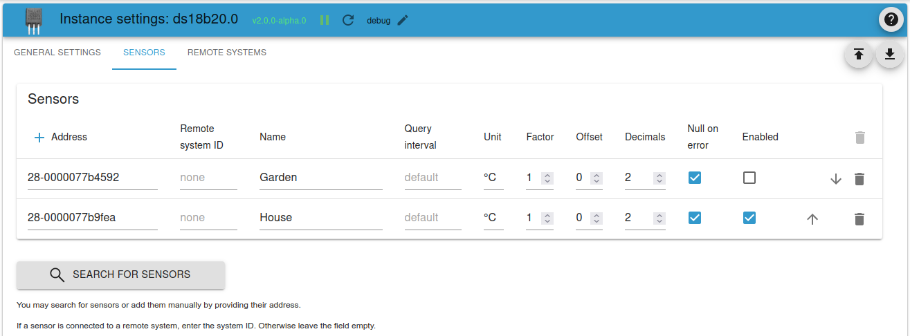
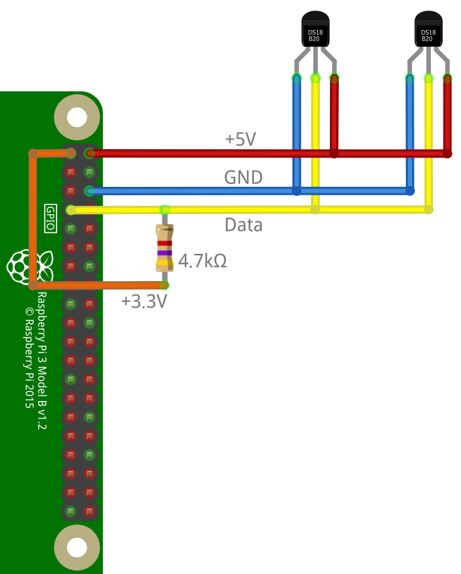

# ioBroker.ds18b20

The adapter `ds18b20` enables the direct integration of 1-wire temperature sensors of the type DS18B20 or similar into ioBroker.

An appropriate hardware with support for the 1-wire bus is required (e.g. Raspberry Pi). Also the 1-wire bus must be properly functional on the system (sensors listed in `/sys/bus/w1/devices/`).

An example of the connection of DS18B20 sensors to a Raspberry Pi can be found below.

## Features

* Read the current temperature value
* Auto detect of the connected sensors
* Detection of errors while reading a sensor (checksum, communication error, device disconnected)
* Query interval customizable per sensor
* Single senors may be disabled
* Rounding and conversion of the measured value customizable per sensor
* Support for sensors at remote systems using the _remote client_

## Installation

The adapter is available in the stable and latest repository.

Alternatively, the latest development version can be installed using the GitHub URL `https://github.com/crycode-de/ioBroker.ds18b20.git`.
This is recommended in only some cases!

## Configuration

In the adapter configuration, a **Default query interval** can be specified in milliseconds for all sensors. Minimum is 500.

In addition, the **Path of the 1-wire devices** can be adjusted if necessary.  
Default is `/sys/bus/w1/devices`, where sensors on all bus masters will be detected.  
Alternatively you may set the direct path ot one bus master, e.g. `/sys/bus/w1/devices/w1_bus_master1`. Then you will get only sensors for this single bus master.



The sensors can be added to a table manually or by **Search for Sensors**.



The **Address** is the 1-wire address/ID of the sensor and determines the object ID.  
As an example, a sensor with the address `28-0000077ba131` gets the object ID `ds18b20.0.sensors.28-0000077ba131`.

The **Name** is used to identity the sensor. It's freely selectable by you.

The **Remote system ID** is empty for directly attached sensors or the ID of the remote system for sensors attached to a remote system.

For each sensor a custom **Query interval** may be specified in milliseconds.  
If this field is left blank, the default query interval will be used. Minimum is 500.

The **Unit** defines the stored unit in the ioBroker object for the value.
Default is `°C`.

Via **Factor** and **Offset** it is possible to adjust the value read by the sensor according to the formula `value = (value * factor) + offset`.

The **Decimals** indicate how many places after the decimal point the value is rounded.
The rounding takes place after the calculation with factor and offset.

**Null on error** defines how sensor read errors are handled.  
If this option is set, a `null` value be written to the sensor state on error.  
If unset, the state will not be updated on errors.

The **Enabled** checkbox allows you disable specific sensors separately.

An integrated server can be activated and configured for the integration of sensors at a remote system.


The Encryption key must be given to all remote systems. Using this key, the communication between the server and the clients is encrypted.

### Conversion from `°C` to `°F`

To get the temperatures from the adapter in `°F` you need to use `1.8` as factor and `32` as offset.

## Actions

It is possible to trigger the instant reading of one or all sensors by writing to the state `ds18b20.0.actions.readNow`.

To trigger the reading of all sensors, write `all` to the state.

To trigger the reading of a single sensor, write the address or ioBroker object ID of the sensor to the state.

## Using in scripts

It is possible to send commands to the adapter to read from the sensors or search for sensors.

### `read` / `readNow`

Via the command `read` or `readNow`, all sensors or a single sensor can be read.

If all sensors are requested, the result will contain an object with the sensor addresses mapped to the current value.

To read a single sensor, the message part must be set to the address or ioBroker object ID of the sensor.
In this case the value is provided directly.

```js
sendTo('ds18b20.0', 'read', null, (ret) => {
    log('ret: ' + JSON.stringify(ret));
    // ret: {"err":null,"value":{"28-0000077b9fea":21.94}}

    if (ret.err) {
        log(ret.err, 'warn');
    }
});

sendTo('ds18b20.0', 'read', '28-0000077ba131', (ret) => {
    log('ret: ' + JSON.stringify(ret));
    // ret: {"err":null,"value":21.94}

    if (ret.err) {
        log(ret.err, 'warn');
    }
});
```

### `search`

The `search` command will run a search for all currently connected 1-wire sensors.
The found addresses of sensors will be provided to a callback function.

```js
sendTo('ds18b20.0', 'search', {}, (ret) => {
    log('ret: ' + JSON.stringify(ret));
    if (ret.err) {
        log(ret.err, 'warn');
    } else {
        for (let s of ret.sensors) {
            if (s.remoteSystemId) {
                log('Sensor: ' + s.address + '@' + s.remoteSystemId);
            } else {
                log('Sensor: ' + s.address);
            }
        }
    }
});
```

### `getRemoteSystems`

With `getRemoteSystems` you are able to get the system IDs of all currently connected remote systems.

```js
sendTo('ds18b20.0', 'getRemoteSystems', {}, (ret) => {
    log('ret: ' + JSON.stringify(ret));
    log('Verbundene Systeme: ' + ret.join(', '));
});
```

## Adapter information

Via the `ds18b20.*.info.connection` State, each adapter instance provides information on whether all configured sensors provide data.  
If the last reading of all sensors was successful, this state is `true`.
As soon as one of the sensors has an error, this state is `false`.  
This state will be `false` too if remote systems are enabled but there is a problem with the remote server.

If remote systems are enabled the state `ds18b20.*.info.remotesConnected` will hold a list of the currently connected remote systems.

## DS18B20 connected to a Raspberry Pi

The connection of DS18B20 temperature sensors to a Raspberry Pi is done as shown in the following figure.
Note that the pullup resistor must be connected to +3.3V instead of +5V, as this would damage the GPIO.
In this example the GPIO.04 (BCM) is used.



To activate the 1-Wire bus on the Raspberry Pi, add the following line in the file `/boot/config.txt` and then restart the Raspberry Pi.

```text
dtoverlay=w1-gpio,gpiopin=4
```

If everything works, the connected sensors will be visible under `/sys/bus/w1/devices/`.

```sh
$ ls -l /sys/bus/w1/devices/
total 0
lrwxrwxrwx 1 root root 0 Nov  2 11:18 28-0000077b4592 -> ../../../devices/w1_bus_master1/28-0000077b4592
lrwxrwxrwx 1 root root 0 Nov  2 11:18 28-0000077b9fea -> ../../../devices/w1_bus_master1/28-0000077b9fea
lrwxrwxrwx 1 root root 0 Nov  2 10:49 w1_bus_master1 -> ../../../devices/w1_bus_master1
```

### Use of many sensors on the Raspberry Pi

The number of sensors that can be operated error-free on a Raspberry Pi on one wire is limited and depends on some technical conditions (e.g. the length ot the wire).  
Usually the first, sometimes random, failures occur from around 10 sensors.

To use more sensors it is possible to split the sensors on multiple wires (GPIOs).
Each wire needs it's own pull-up resistor.

To enable the multiple wires you simply need to add multiple entries in the file `/boot/config.txt`:

```text
dtoverlay=w1-gpio,gpiopin=4
dtoverlay=w1-gpio,gpiopin=17
```

Each entry will create it's own `w1_bus_masterX` in the system.

### Kernel bug at negative temperatures

There was a bug in the 5.10.y kernel of the Raspberry Pi since november 2020 which lead to negative temperatures be read as e.g. 4092 °C. (see [GitHub Issue](https://github.com/raspberrypi/linux/issues/4124))  
This bug was fixed in kernel 5.10.14 at 2021-02-08. (see [GitHub Commit](https://github.com/Hexxeh/rpi-firmware/commit/115e3a5f77488d9ee30a33bcb5ac31eb587f60a8))  
So a `rpi-update` should fix the problem.

Adapter versions until v1.2.2 these obviously wrong values are transferred to the ioBroker State.  
Since v1.2.3 the adapter checks if the read values are plausible (between -80 and +150 °C) and discards unplausible values.

## Integration of sensors from a remote system

Starting in version 1.4.0 of _ioBroker.ds18b20_ it is possible to directly integrate sensors of a remote system using the _ioBroker.ds18b20 remote client_. You only need Node.js installed on the system for this.

In the adapter configuration you have set the checkbox **Enable remote sensors**. Then the adapter will create a TCP server on the given port and accept connections from remote clients.

The server-client connection will be encrypted using an `aes-256-cbc` algorithm.  
Therefore the encryption key from the adapter configuration must be set at each client.

Then the _ioBroker.ds18b20 remote client_ connects to the adapter and will be shown under **Connected remote systems** in the adapter configuration.

### Installation of the ioBroker.ds18b20 remote client

A setup for the _ioBroker.ds18b20 remote client_ is provided via GitHub.

Instructions how to set up the client are includes in the adapter configuration.

## Changelog

<!--
    Placeholder for the next version (at the beginning of the line):
    ### **WORK IN PROGRESS**
-->
### 2.0.4 (2023-08-20)

* (crycode-de) Fix js-controller 5 compatibility

### 2.0.3 (2023-08-20)

* (crycode-de) Dependency updates

### 2.0.2 (2023-07-23)

* (crycode-de) Fixed bug on sensor migration
* (crycode-de) 💥 Need to set a new remote encryption key in admin if remote sensors are used

### 2.0.1 (2023-07-19)

* (crycode-de) Fixed config migration
* (crycode-de) Added warning message for upgrades

### 2.0.0 (2023-07-19)

* (crycode-de) 💥 Node.js 16.4+, js-controller 4+ and admin 6+ are required
* (crycode-de) New Admin UI using JsonConfig
* (crycode-de) 💥 `read` and `readNow` actions are now merged
* (crycode-de) New state `info.remotesConnected` with a list of connected remote systems (if enabled)
* (crycode-de) Added icons for the sensor status to the sensor objects
* (crycode-de) Label objects of disabled sensors
* (crycode-de) Delete objects of unconfigured/deleted sensors
* (crycode-de) Updated translations
* (crycode-de) Code optimizations and upgrades to current standards
* (crycode-de) Updated dependencies

## License

Copyright (c) 2019-2023 Peter Müller <peter@crycode.de>

### MIT License

Permission is hereby granted, free of charge, to any person obtaining
a copy of this software and associated documentation files (the
"Software"), to deal in the Software without restriction, including
without limitation the rights to use, copy, modify, merge, publish,
distribute, sublicense, and/or sell copies of the Software, and to
permit persons to whom the Software is furnished to do so, subject to
the following conditions:

The above copyright notice and this permission notice shall be
included in all copies or substantial portions of the Software.

THE SOFTWARE IS PROVIDED "AS IS", WITHOUT WARRANTY OF ANY KIND,
EXPRESS OR IMPLIED, INCLUDING BUT NOT LIMITED TO THE WARRANTIES OF
MERCHANTABILITY, FITNESS FOR A PARTICULAR PURPOSE AND
NONINFRINGEMENT. IN NO EVENT SHALL THE AUTHORS OR COPYRIGHT HOLDERS BE
LIABLE FOR ANY CLAIM, DAMAGES OR OTHER LIABILITY, WHETHER IN AN ACTION
OF CONTRACT, TORT OR OTHERWISE, ARISING FROM, OUT OF OR IN CONNECTION
WITH THE SOFTWARE OR THE USE OR OTHER DEALINGS IN THE SOFTWARE.