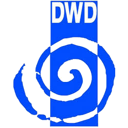

# ioBroker.dwd

Copyright Deutscher Wetterdienst

Dieser Adapter lädt die Wetterwarnungen vom deutschen Wetterdienst über JSON link.

This adapter loads the weather warnings from the German weather service via JSON link.

**This adapter uses Sentry libraries to automatically report exceptions and code errors to the developers.** For more details and for information how to disable the error reporting see [Sentry-Plugin Documentation](https://github.com/ioBroker/plugin-sentry#plugin-sentry)! Sentry reporting is used starting with js-controller 3.0.

<!--
	Placeholder for the next version (at the beginning of the line):
	### **WORK IN PROGRESS**
-->

## Changelog
### 2.8.6 (2026-05-11)
* (arteck) fix invalid JSON
* (arteck) add info.lastUpdate
* (arteck) add eslint
* (arteck) Dependencies have been updated
* (arteck) fix hint dp in widget

### 2.8.5 (2023-06-15)
* (Quarkmax) added the hint for warning instructions

### 2.8.3 (2022-03-23)
* (Apollon77) Do not add unused warning0

### 2.8.2 (2022-03-22)
* (Apollon77) Add instruction text to warning data
* (Apollon77) Check missing objects and add them

### 2.7.7 (2021-07-01)
* (Apollon77) Fix start/end dates

[Older changelogs can be found there](CHANGELOG_OLD.md)## License

The MIT License (MIT)

Copyright (c) 2016-2026 bluefox <dogafox@gmail.com>, hobbyquaker

Permission is hereby granted, free of charge, to any person obtaining a copy
of this software and associated documentation files (the "Software"), to deal
in the Software without restriction, including without limitation the rights
to use, copy, modify, merge, publish, distribute, sublicense, and/or sell
copies of the Software, and to permit persons to whom the Software is
furnished to do so, subject to the following conditions:

The above copyright notice and this permission notice shall be included in all
copies or substantial portions of the Software.

THE SOFTWARE IS PROVIDED "AS IS", WITHOUT WARRANTY OF ANY KIND, EXPRESS OR
IMPLIED, INCLUDING BUT NOT LIMITED TO THE WARRANTIES OF MERCHANTABILITY,
FITNESS FOR A PARTICULAR PURPOSE AND NONINFRINGEMENT. IN NO EVENT SHALL THE
AUTHORS OR COPYRIGHT HOLDERS BE LIABLE FOR ANY CLAIM, DAMAGES OR OTHER
LIABILITY, WHETHER IN AN ACTION OF CONTRACT, TORT OR OTHERWISE, ARISING FROM,
OUT OF OR IN CONNECTION WITH THE SOFTWARE OR THE USE OR OTHER DEALINGS IN THE
SOFTWARE.
