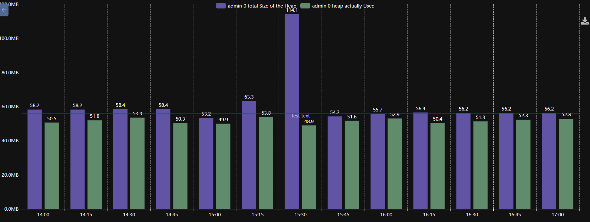

# ioBroker.echarts


[](https://www.npmjs.com/package/iobroker.echarts)


[](https://weblate.iobroker.net/engage/adapters/?utm_source=widget)
[](https://www.npmjs.com/package/iobroker.echarts)

**This adapter uses Sentry libraries to automatically report exceptions and code errors to the developers.** For more details and for information how to disable the error reporting see [Sentry-Plugin Documentation](https://github.com/ioBroker/plugin-sentry#plugin-sentry)!

## echarts adapter for ioBroker
Build useful charts in ioBroker:




## Usage
Add after the restart the tab in the admin:


The created preset can be accessed in web adapter too. URL: `http://IP:8082/echarts/index.html?preset=echarts.0.PRESETID`.

For vis there is a special widget with easy selection of presets.  

### Tooltip
Lower case `i` indicates that the value was interpolated from the 2 neighbour values, and it does not exist at this time stamp.

 

### Data from JSON
You can define the data source from JSON. In this case you can create some custom state of type `json` and store the value like this:
```
[
  {"ts": 1675887847000, "val": 45},
  {"ts": 1675887848000, "val": 77},
  {"ts": 1675887849000, "val": 180}
]
```

You cannot define start and start in echarts settings. The start and end will be calculated automatically from the data.
Aggregation is not possible too. All manipulations must be done by writing of the JSON data.
The chart will be automatically updated every time the value changes.

### Server side rendering
You can render the presets on the server and get it as base64 URL or save it on disk on in ioBroker DB:

```
sendTo('echarts.0', {
    preset:   'echarts.0.myPreset', // the only mandatory attribute

    renderer: 'svg',                // svg | png | jpg | pdf, default: svg

    width: 1024,                    // default 1024
    height: 300,                    // default 300
    background: '#000000',          // Background color
    theme: 'light',                 // Theme type: 'light', 'dark'

    title: 'ioBroker Chart',        // Title of PDF document 
    quality: 0.8,                   // quality of JPG
    compressionLevel: 3,            // Compression level of PNG
    filters: 8,                     // Filters of PNG (Bit combination https://github.com/Automattic/node-canvas/blob/master/types/index.d.ts#L10)

    fileOnDisk: '',                 // Path on disk to save the file. 
    fileName: '',                   // Path in ioBroker DB to save the files on 'echarts.0'. E.g. if your set "chart.svg", so you can access your picture via http(s)://ip:8082/echarts.0/chart.png

    cache:    600,                  // Cache time for this preset in seconds, default: 0 - no cache
}, result => {
    if (result.error) {
        console.error(result.error);
    } else {
        console.log(result.data);
    }
});
```

**Attention: You cannot enable/disable lines in legend on touch devices with enabled zoom**


## Developer manual
**For non-developer this link does not work!**

You can debug view charts locally with: 
- cd iobroker.echarts/src-chart
- npm run start
- Browser: http://localhost:8081/adapter/echarts/tab.html?dev=true

## Todo
- widget for vis (button)
- widget for material
- show enum icons on folders or near it

<!--
	Placeholder for the next version (at the beginning of the line):
	### **WORK IN PROGRESS**
-->
## Changelog
### 1.4.12 (2023-02-26)
* (bluefox) Corrected some issues from GitHub

### 1.4.11 (2023-02-25)
* (bluefox) Booleans were improved

### 1.4.9 (2023-02-22)
* (bluefox) Allowed the disabling of texts for enums and the adding/deletion of own text values

### 1.4.7 (2023-02-22)
* (bluefox) Implemented custom texts for enums

### 1.4.6 (2023-02-16)
* (bluefox) Implemented custom texts for true and false values

### 1.4.5 (2023-02-16)
* (bluefox) Allowed to copy only the web URLs in the preview
* (bluefox) Corrected boolean charts

### 1.4.3 (2023-02-15)
* (bluefox) Implemented charts preview

### 1.4.1 (2023-02-14)
* (bluefox) Corrected some issues from GitHub
* (bluefox) Implemented negative offset of X-Axis
* (bluefox) Show device names for charts

### 1.4.0 (2023-02-13)
* (bluefox) Added possibility to load the history data from JSON state.

### 1.3.4 (2023-02-08)
* (bluefox) added a formula for the values conversion

### 1.3.3 (2023-02-08)
* (bluefox) Implemented bar chart

### 1.2.1 (2023-01-31)
* (bluefox) Changed german translation
* (bluefox) Added new positions for markings: inside, top, bottom

### 1.1.5 (2022-12-31)
* (bluefox) Refactoring and packages update done

### 1.1.3 (2022-12-01)
* (bluefox) Make all buttons smaller

### 1.1.1 (2022-08-23)
* (bluefox) Added preparations for vis2.0

### 1.1.0 (2022-07-05)
* (bluefox) Made it work with ioBroker cloud
* (bluefox) GUI migrated to mui5

### 1.0.10 (2022-06-20)
* (bluefox) Corrected the problem with `socket.io`

### 1.0.9 (2022-06-17)
* (bluefox) Added 2 weeks as relative period

### 1.0.8 (2022-06-01)
* (bluefox) Added option `shift+mouse move` to scale Y axis

### 1.0.7 (2022-05-13)
* (bluefox) Added background to export image
* (bluefox) Added integral and percentile aggregate methods

### 1.0.5 (2022-02-16)
* (bluefox) Added "i" in tooltips by interpolated values

### 1.0.4 (2022-01-31)
* (bluefox) License changed to Apache-2.0 (because of apache/echarts)
* (bluefox) Updated some packages
* (bluefox) Added fast properties editor

### 1.0.3 (2021-07-21)
* (bluefox) Fixed server-side rendering

### 1.0.2 (2021-07-20)
* (bluefox) Fixed the communication with admin4

### 1.0.1 (2021-07-14)
* (bluefox) Fixed the "no background" option

### 1.0.0 (2021-07-02)
* (bluefox) Fixed many bugs

### 0.4.14 (2021-04-29)
* (bluefox) Fixed reorder of presets

### 0.4.13 (2021-03-27)
* (bluefox) Tried to sort the time series before displaying it

### 0.4.12 (2021-03-27)
* (bluefox) Added the support of parameters in URL

### 0.4.11 (2021-02-06)
* (bluefox) Fixed the dashed lines

### 0.4.10 (2020-12-22)
* (bluefox) Allow the hiding of lines at start and show them via legend later
* (bluefox) Use canvas renderer on touch devices to allow zoom and pan

### 0.4.9 (2020-12-21)
* (bluefox) Updated echarts to 5.0
* (bluefox) Implemented copy&paste of lines and markings
* (bluefox) Available vertical legend
* (bluefox) Allowed the hiding the interpolated values in tooltip

### 0.4.7 (2020-12-13)
* (bluefox) Updated the select ID dialog

### 0.4.6 (2020-12-12)
* (bluefox) Allowed the same names in different folders

### 0.4.5 (2020-12-11)
* (bluefox) Some sentry errors were corrected.
* (bluefox) Added the possibility to show actual values in legend.

### 0.4.4 (2020-12-07)
* (bluefox) Some sentry errors were corrected.

### 0.4.2 (2020-11-29)
* (bluefox) Corrected the error with overflow of axis.

### 0.4.1 (2020-11-29)
* (bluefox) Disconnection errors are caught now.

### 0.4.0 (2020-11-28)
* (bluefox) Added new option: no background

### 0.3.9 (2020-11-28)
* (bluefox) Corrected error with the chart.

### 0.3.8 (2020-11-27)
* (bluefox) Implemented the conversion of the flot presets into echarts.

### 0.3.7 (2020-11-17)
* (bluefox) Hide nulls in hover details

### 0.3.6 (2020-11-13)
* (bluefox) The copy of charts is implemented

### 0.3.5 (2020-11-10)
* (bluefox) Corrected SENTRY errors

### 0.3.4 (2020-11-08)
* (bluefox) Corrected server-side rendering of PNG

### 0.3.1 (2020-10-31)
* (bluefox) Added the color of export button 
* (bluefox) The interpolated values are shown now
* (bluefox) Server-side rendering is implemented

### 0.2.1 (2020-10-25)
* (bluefox) GUI fixes

### 0.2.0 (2020-10-22)
* (bluefox) Implemented the grouping by the category.

### 0.1.2 (2020-10-21)
* (bluefox) Added support of multiple charts

### 0.1.1 (2020-10-21)
* (bluefox) initial release

## License
ioBroker.echarts is available under the Apache License V2.

Copyright (c) 2019-2023 bluefox <dogafox@gmail.com>

Apache ECharts
Copyright (c) 2017-2023 The Apache Software Foundation

This product includes software developed at
The Apache Software Foundation (https://www.apache.org/).
