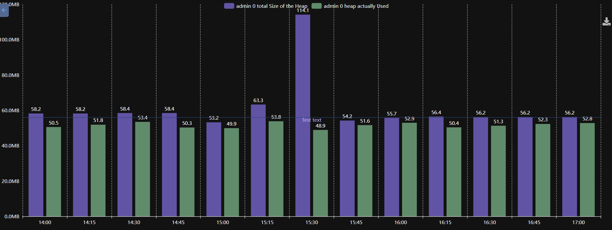
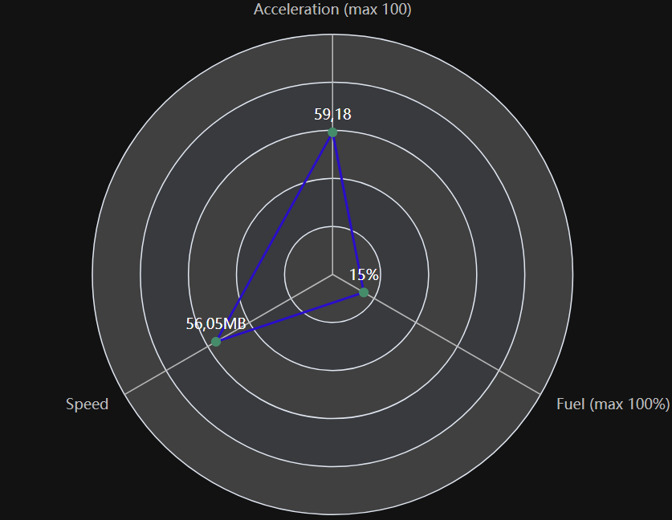

# ioBroker.echarts


[](https://www.npmjs.com/package/iobroker.echarts)


[](https://www.npmjs.com/package/iobroker.echarts)

**This adapter uses Sentry libraries to automatically report exceptions and code errors to the developers.** For more details and for information how to disable the error reporting see [Sentry-Plugin Documentation](https://github.com/ioBroker/plugin-sentry#plugin-sentry)!

## echarts adapter for ioBroker

Build useful charts in ioBroker:





Use "Actual value" aggregation for predicted result.

## Usage

Add after the restart the tab in the admin:


The created preset can be accessed in web adapter too. URL: `http://IP:8082/echarts/index.html?preset=echarts.0.PRESETID`.

For `vis` there is a special widget with easy selection of presets.

### Tooltip

Lower case `i` indicates that the value was interpolated from the 2-neighbour values, and it does not exist at this time stamp.


### Data from JSON

You can define the data source from JSON. In this case you can create some custom state of type `json` and store the value like this:

```json
[
    { "ts": 1675887847000, "val": 45 },
    { "ts": 1675887848000, "val": 77 },
    { "ts": 1675887849000, "val": 180 }
]
```

Alternative following attribute names are supported for `val`: `value`, `v`, `data`, `y`.
And following for `ts`: `time`, `t`, `date`.

You cannot define start and start in echarts settings. The start and end will be calculated automatically from the data.
Aggregation is not possible either. All manipulations must be done by writing of the JSON data.
The chart will be automatically updated every time the value changes.

### Server side rendering

You can render the presets on the server and get it as base64 URL or save it on disk on in ioBroker DB:

```js
sendTo(
    'echarts.0',
    {
        preset: 'echarts.0.myPreset', // the only mandatory attribute

        renderer: 'svg', // svg | png | jpg | pdf, default: svg

        width: 1024, // default 1024
        height: 300, // default 300
        background: '#000000', // Background color
        theme: 'light', // Theme type: 'light', 'dark'

        title: 'ioBroker Chart', // Title of PDF document
        quality: 0.8, // quality of JPG
        compressionLevel: 3, // Compression level of PNG
        filters: 8, // Filters of PNG (Bit combination https://github.com/Automattic/node-canvas/blob/master/types/index.d.ts#L10)

        fileOnDisk: '', // Path on disk to save the file.
        fileName: '', // Path in ioBroker DB to save the files on 'echarts.0'. E.g. if your set "chart.svg", so you can access your picture via http(s)://ip:8082/echarts.0/chart.png

        cache: 600, // Cache time for this preset in seconds, default: 0 - no cache
    },
    result => {
        if (result.error) {
            console.error(result.error);
        } else {
            console.log(result.data);
        }
    },
);
```

**Attention: You cannot enable/disable lines in legend on touch devices with enabled zoom**

## Developer manual

**For non-developers, this link does not work!**

You can debug view charts locally with:

- cd iobroker.echarts/src-chart
- npm run start
- Browser: http://localhost:8081/adapter/echarts/tab.html?dev=true

## Todo

- widget for vis (button)
- show enum icons on folders or near it
  <!--
  	Placeholder for the next version (at the beginning of the line):
  	### **WORK IN PROGRESS**
  -->

## Changelog
### 4.0.0 (2026-06-07)
- (copilot) Adapter requires node.js >= 22 now
- (ioBroker-Bot) Adapter requires js-controller >= 6.0.11 now.

### 3.1.2 (2026-05-28)
- (@GermanBluefox) Corrected the devices widget

### 3.1.1 (2026-05-27)
- (@Brainbug01) Added yAxisOffset to separate multiple Y-axes visually
- (@GermanBluefox) Added the devices widget

### 3.1.0 (2026-03-02)
- (@GermanBluefox) Trying to rebuild the canvas by the start

### 3.0.2 (2026-02-16)
- (@GermanBluefox) Calculate values in the legend
- (@GermanBluefox) Added noLoader option to the widget

## License

ioBroker.echarts is available under the Apache License V2.

Copyright (c) 2019-2026 @GermanBluefox <dogafox@gmail.com>

Apache ECharts
Copyright (c) 2017-2026 The Apache Software Foundation

This product includes software developed at
The Apache Software Foundation (https://www.apache.org/).
