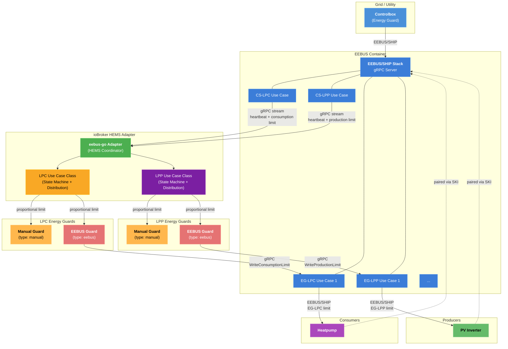

# Architecture Scenario: Controlbox + EEBUS Energy Guards + Manual Energy Guards (LPC & LPP)



## Component Description

| Component               | Role                                                                                                                                                                 |
| ----------------------- | -------------------------------------------------------------------------------------------------------------------------------------------------------------------- |
| **Controlbox**          | Grid operator device that sends consumption and/or production limits via EEBUS/SHIP protocol.                                                                        |
| **EEBUS Container**     | Docker/Podman container running the eebus-go SHIP stack. Handles all EEBUS/SHIP networking, mDNS discovery, and SPINE data model. Exposes a gRPC API to the adapter. |
| **CS-LPC Use Case**     | Controllable System — Limitation of Power Consumption (§14a EnWG). Receives consumption limits from the controlbox.                                                  |
| **CS-LPP Use Case**     | Controllable System — Limitation of Power Production (§9 EEG). Receives production limits from the controlbox.                                                       |
| **EG-LPC Use Case**     | Energy Guard — Limitation of Power Consumption. Sends consumption limits to paired consumer devices.                                                                 |
| **EG-LPP Use Case**     | Energy Guard — Limitation of Power Production. Sends production limits to paired production devices.                                                                 |
| **eebus-go Adapter**    | ioBroker adapter (HEMS Coordinator) that communicates with the container via gRPC and delegates to the LPC and LPP use case classes.                                 |
| **LPC Use Case Class**  | Implements CS-LPC states (init, unlimitedControlled, limited, failsafe, unlimitedAutonomous) and distributes consumption limits to LPC energy guards.                |
| **LPP Use Case Class**  | Implements CS-LPP states (identical state machine) and distributes production limits to LPP energy guards.                                                           |
| **EEBUS Energy Guard**  | Forwards its limit share to a paired device via the container's EG-LPC or EG-LPP gRPC endpoint. Also accepts manual limits from the operator (60 min duration).     |
| **Manual Energy Guard** | No EEBUS connection. Limit is set manually by an operator via ioBroker state objects.                                                                                |
| **Heatpump**            | Consumer device paired with the container via SKI. Receives EG-LPC limits over EEBUS/SHIP.                                                                           |
| **PV Inverter**         | Production device paired with the container via SKI. Receives EG-LPP limits over EEBUS/SHIP.                                                                         |

## Data Flow

### LPC (Consumption Limitation)

1. The **Controlbox** connects to the **EEBUS Container** via EEBUS/SHIP protocol (mDNS discovery, SKI trust).
2. The container's **CS-LPC Use Case** streams heartbeat and consumption limit events to the **Adapter** over gRPC.
3. The **LPC Use Case Class** transitions its state machine based on heartbeat and limit messages.
4. When a consumption limit is active, the LPC class splits it across LPC energy guards by percentage.
5. The **EEBUS Energy Guard** calls `WriteConsumptionLimit` on the container's **EG-LPC** gRPC endpoint.
6. The container forwards the EG-LPC limit to the **Heatpump** over EEBUS/SHIP.
7. The **Manual Energy Guard** applies its limit based on operator input (no EEBUS involved).
8. The operator can also set a **manual limit** on the **EEBUS Energy Guard** (60 min duration, sent to heatpump via container). This is reset when the controlbox limit becomes active.

### LPP (Production Limitation)

1. The **Controlbox** sends production limit obligations to the container's **CS-LPP Use Case** via EEBUS/SHIP.
2. The container's **CS-LPP Use Case** streams heartbeat and production limit events to the **Adapter** over gRPC.
3. The **LPP Use Case Class** transitions its state machine based on heartbeat and limit messages.
4. When a production limit is active, the LPP class splits it across LPP energy guards by percentage.
5. The **EEBUS Energy Guard** calls `WriteProductionLimit` on the container's **EG-LPP** gRPC endpoint.
6. The container forwards the EG-LPP limit to the **PV Inverter** over EEBUS/SHIP.
7. The **Manual Energy Guard** applies its production limit based on operator input.
8. The operator can also set a **manual production limit** on the **EEBUS Energy Guard** (60 min duration). This is reset when the controlbox production limit becomes active.

## ioBroker Object Tree

```
eebus-go.0/
├── info/
│   ├── connection         (boolean)
│   ├── discoveredDevices  (JSON string)
│   └── ski                (string)
├── LPC/
│   ├── state              (string)
│   ├── limit              (number, W)
│   ├── limitDuration      (number, min)
│   ├── limitMinutesToday  (number, min)
│   └── EnergyGuards/
│       └── Guard_{name}/
│           ├── percentage, currentLimit, lastHeartbeat, failsafeLimit
│           ├── eebusConnected, manualLimit, confirmedLimit  (EEBUS only)
│           └── heartbeat, connected                         (manual only)
├── LPP/
│   ├── state              (string)
│   ├── limit              (number, W)
│   ├── limitDuration      (number, min)
│   ├── limitMinutesToday  (number, min)
│   └── EnergyGuards/
│       └── Guard_{name}/
│           ├── percentage, currentLimit, lastHeartbeat, failsafeLimit
│           ├── eebusConnected, manualLimit, confirmedLimit  (EEBUS only)
│           └── heartbeat, connected                         (manual only)
```