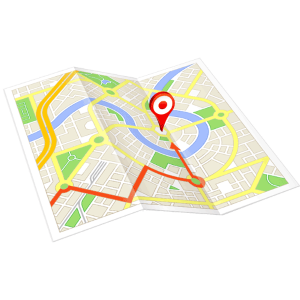

## ioBroker.egigeozone2

**This adapter uses Sentry libraries to automatically report exceptions and code errors to the developers.** For more details and for information how to disable the error reporting see [Sentry-Plugin Documentation](https://github.com/ioBroker/plugin-sentry#plugin-sentry)! Sentry reporting is used starting with js-controller 3.0.

## Description
This is an ioBroker adapter for Android geofencing app "EgiGeoZone" ([website](https://egigeozone.de/)). It is able to receive geofence events as HTTP requests when entering or leaving a defined area with your mobile device.

## Security advice
It is not recommended to expose this adapter to the public internet (e.g. by opening the configured port in your router). This means that any request to this port will be forwarded to the ioBroker instance the adapter is running on. There are multiple options for gaining more security for accessing this adapter:
* Always use a VPN connection for requests or
* integrate a proxy server (e.g. nginx) for filtering incoming requests.

## Configuration

Inside EgiGeoZone the URL should be defined using the following syntax:

protocol://address:port/person

* **protocol** could be **http** or **https**.
* **address** should be the address where the adapter instance is accessible.
* **port** should be the port the adapter is listening on.
* **person** is the person which will be used to list inside the atHome array.

### Examples
* https://my-domain:7654/John or
* http://my-domain:7654/Paul

## Changelog

### 1.0.6
* (obakuhl) Improved object definition
* (obakuhl) New icon

### 1.0.5
* (obakuhl) use `@iobroker/webserver`

### 1.0.4
* (obakuhl) Password encryption active, minor code improvements

### 1.0.3
* (obakuhl) Updating dependencies

### 1.0.2
* (obakuhl) Updating dependencies

### 1.0.1
* (obakuhl) Resolved minor issue when leaving location 
* (obakuhl) Raised minimum version of adapter-core to 3.1.4 and node >= 18

### 1.0.0
* (obakuhl) Refactoring
* (obakuhl) New name (ioBroker.egigeozone -> ioBroker.egigeozone2) necessary due to npm collaborators settings of [previous adapter ioBroker.egigeozone](https://github.com/BasGo/ioBroker.egigeozone)

## License
This adapter is licensed under the [MIT license](../blob/master/LICENSE) which is part of this repository.

Copyright (c) 2024 obakuhl <hello@obakuhl.com>

Permission is hereby granted, free of charge, to any person obtaining a copy
of this software and associated documentation files (the "Software"), to deal
in the Software without restriction, including without limitation the rights
to use, copy, modify, merge, publish, distribute, sublicense, and/or sell
copies of the Software, and to permit persons to whom the Software is
furnished to do so, subject to the following conditions:

The above copyright notice and this permission notice shall be included in all
copies or substantial portions of the Software.

THE SOFTWARE IS PROVIDED "AS IS", WITHOUT WARRANTY OF ANY KIND, EXPRESS OR
IMPLIED, INCLUDING BUT NOT LIMITED TO THE WARRANTIES OF MERCHANTABILITY,
FITNESS FOR A PARTICULAR PURPOSE AND NONINFRINGEMENT. IN NO EVENT SHALL THE
AUTHORS OR COPYRIGHT HOLDERS BE LIABLE FOR ANY CLAIM, DAMAGES OR OTHER
LIABILITY, WHETHER IN AN ACTION OF CONTRACT, TORT OR OTHERWISE, ARISING FROM,
OUT OF OR IN CONNECTION WITH THE SOFTWARE OR THE USE OR OTHER DEALINGS IN THE
SOFTWARE.

## Credits
The implementation is mostly based on dschaedl's [ioBroker.geofency](https://github.com/ioBroker/ioBroker.geofency) & BasGo's [ioBroker.egigeozone](https://github.com/BasGo/ioBroker.egigeozone) adapter. 
