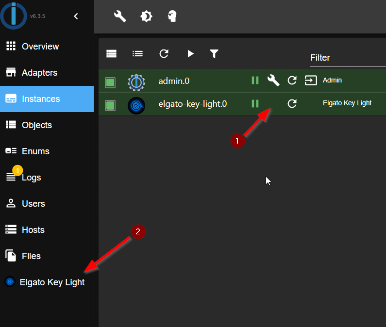

# ioBroker.elgato-key-light

**Tests:** 

## elgato-key-light adapter for ioBroker

### DISCLAIMER

All product and company names or logos are Trademarks™ or Registered® Trademarks of their respective owners. Their use does not imply any
Affiliation or endorsement by them or associated affiliates! This personal project is being pursued on a recreational basis and
Has no business objectives. **Elgato** is a trademark of **Corsair GmbH**.

### Sentry
**This adapter uses Sentry libraries to automatically report exceptions and code errors to the developers.**\
For more details and for information on how to disable error reporting, see.
[Sentry Plugin Documentation](https://github.com/ioBroker/plugin-sentry#plugin-sentry)! Sentry reports are used starting with js-controller 3.0
are used.

### Credits
This adapter would not have been possible without the great work of @xXBJXx (https://github.com/xXBJXx), who created this adapter and will hopefully maintain it again in the future.

### Description
This adapter allows you to control [Elgato Key Lights](https://www.elgato.com/de/key-light) via ioBroker.\
The adapter supports the following functions:
* Power on/off.
* Brightness ⇨ (available on all Key Lights).
* Color temperature ⇨ (only available with [Elgato Key Light](https://www.elgato.com/de/key-light), [Elgato Key Light Air](https://www.elgato.com/de/key-light-air),
  [Elgato Ring Light](https://www.elgato.com/de/ring-light)
  and [Elgato Key Light mini](https://www.elgato.com/de/key-light-mini) available)
* Color ⇨ (only available with [Elgato Light Strip](https://www.elgato.com/de/light-strip))

### Adapter UI
A classic adapter UI under instances does not exist.\

What can be done in the UI?
* No. 1 set the polling interval for the adapter (default: 60 seconds).
  after changing the interval, the adapter must be restarted, this is done using the Save button.
* No. 2 add a new device to the adapter.
* No. 3 set the color temperature for all key lights (2900K to 7000K)
* No. 4 set the brightness for all Key Lights (0% to 100%)
* No. 5 set the color for from the Light Strips\
  
* No. 6 switch the lights on and off

**when changing No. 3, No. 4 and No. 5, the change will be executed after 1.5 seconds.**

### Warning
**Please do not access the data points too often, otherwise the devices will not be accessible for a few seconds.**

### Data points
The data points are created automatically when a new device is found.

#### Data points for all Key Lights / Light Strips
\
The data points are divided into:
* **info** ⇨ Information about the device\.
  
* **light** ⇨ Data points for controlling the device, here there are two different types of data points:
  * for controlling brightness and color temperature.
    
  * for controlling the color
    
* **settings** ⇨ data points for info from the settings of the device
  

### Notes
* The data points for color are only available for the Light Strips.
* The data points for color temperature are only available for the Key Lights.
* The data points for brightness are available for all Key Lights and Light Strips.
* The scenes from the Light Strips are not supported. Since they are not accessible via the API.

## Changelog
<!--
    Placeholder for the next version (at the beginning of the line):
    ### **WORK IN PROGRESS**
-->
### 1.0.1 (2024-01-18)
* (mcm1957) Writing states now requires ack flag to be false.
* (mcm1957) Small adaptions to solve review issues have been applied.

### 1.0.0 (2024-01-18)
* (mcm1957) Adapter requires node.js 18 or newer now
* (mcm1957) Adapter has been moved into iobroker-community-adapters area
* (mcm1957) Dependencies have been updated

### 0.2.0 (2023-02-26)
* (xXBJXx) updated dependencies
* (xXBJXx) Updating the UI to the new functions of the iobroker-react library

### 0.1.0 (2023-02-06)
* (xXBJXx) removed the Bonjour search, because it did not work properly
* (xXBJXx) Adding a delete function for devices
* (xXBJXx) Dependency updates
* (xXBJXx) feature request [#2](https://github.com/xXBJXx/ioBroker.elgato-key-light/issues/2) added

### 0.0.3 (2023-01-22)
* (xXBJXx) changed all images to png

## License
MIT License

Copyright (c) 2024 iobroker-community-adapters <mcm57@gmx.at>
Copyright (c) 2023 xXBJXx <issi.dev.iobroker@gmail.com>

Permission is hereby granted, free of charge, to any person obtaining a copy
of this software and associated documentation files (the "Software"), to deal
in the Software without restriction, including without limitation the rights
to use, copy, modify, merge, publish, distribute, sublicense, and/or sell
copies of the Software, and to permit persons to whom the Software is
furnished to do so, subject to the following conditions:

The above copyright notice and this permission notice shall be included in all
copies or substantial portions of the Software.

THE SOFTWARE IS PROVIDED "AS IS", WITHOUT WARRANTY OF ANY KIND, EXPRESS OR
IMPLIED, INCLUDING BUT NOT LIMITED TO THE WARRANTIES OF MERCHANTABILITY,
FITNESS FOR A PARTICULAR PURPOSE AND NONINFRINGEMENT. IN NO EVENT SHALL THE
AUTHORS OR COPYRIGHT HOLDERS BE LIABLE FOR ANY CLAIM, DAMAGES OR OTHER
LIABILITY, WHETHER IN AN ACTION OF CONTRACT, TORT OR OTHERWISE, ARISING FROM,
OUT OF OR IN CONNECTION WITH THE SOFTWARE OR THE USE OR OTHER DEALINGS IN THE
SOFTWARE.