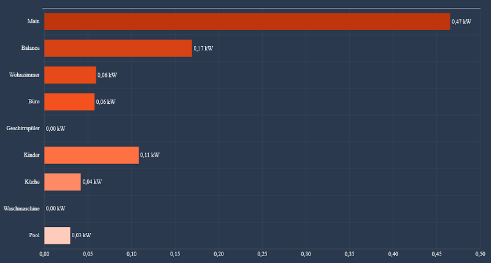
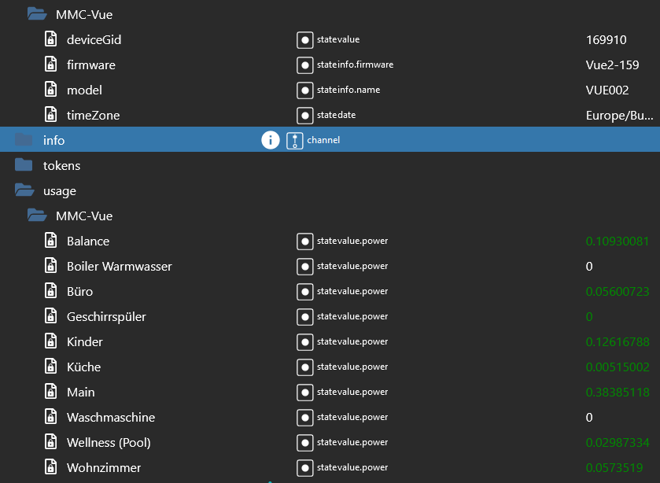

# ioBroker.emporia

This adapter retrieves data from emporia engergy system. At the moment just retrieval of
- live power consumption
- daily values

no outlets and solar at the moment.

Used the API documentation from [here](https://github.com/magico13/PyEmVue/blob/master/api_docs.md)

## Screen Shots

## Changelog

<!--
  Placeholder for the next version (at the beginning of the line):
  ### **WORK IN PROGRESS**
-->
### **WORK IN PROGRESS**

### 0.0.13 (2023-11-06)
- added outlet support

### 0.0.12 (2023-11-01)
- fixed issues with scheduler

### 0.0.11 (2023-10-03)
- fix stop reading usage

### 0.0.10 (2023-03-26)
- Init fixes and licence

### 0.0.9 (2023-02-05)
- code cleaning
- Logging enhanced

### 0.0.8 (2023-02-05)
- changed user credentials

### 0.0.7 (2022-12-15)
- added daily usage for monitoring
- changed state structure

### 0.0.6 (2022-12-07)
- refresh time updated
- possibility to change the output units to kW or Watt
- state for activating or deactivating the retrieval

### 0.0.5 (2022-12-06)
- Updated user credentials and retrieve token if not available
- min or bug fixes

### 0.0.4 (2022-12-05)
- Feat: minor bug fixes

### 0.0.3 (2022-12-05)
 - Maint: Changed User Credentials

### 0.0.2 (2022-12-04)
- initial version

## License
MIT License

"Copyright (c) 2023 Chris <besterquester@live.at>"
Permission is hereby granted, free of charge, to any person obtaining a copy
of this software and associated documentation files (the "Software"), to deal
in the Software without restriction, including without limitation the rights
to use, copy, modify, merge, publish, distribute, sublicense, and/or sell
copies of the Software, and to permit persons to whom the Software is
furnished to do so, subject to the following conditions:

The above copyright notice and this permission notice shall be included in all
copies or substantial portions of the Software.

THE SOFTWARE IS PROVIDED "AS IS", WITHOUT WARRANTY OF ANY KIND, EXPRESS OR
IMPLIED, INCLUDING BUT NOT LIMITED TO THE WARRANTIES OF MERCHANTABILITY,
FITNESS FOR A PARTICULAR PURPOSE AND NONINFRINGEMENT. IN NO EVENT SHALL THE
AUTHORS OR COPYRIGHT HOLDERS BE LIABLE FOR ANY CLAIM, DAMAGES OR OTHER
LIABILITY, WHETHER IN AN ACTION OF CONTRACT, TORT OR OTHERWISE, ARISING FROM,
OUT OF OR IN CONNECTION WITH THE SOFTWARE OR THE USE OR OTHER DEALINGS IN THE
SOFTWARE.