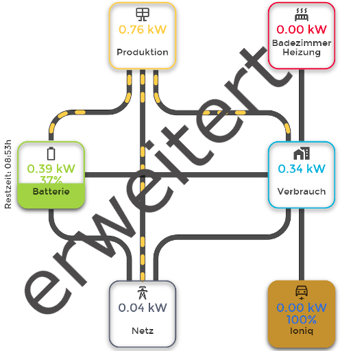

# ioBroker.energiefluss-erweitert

## energiefluss-erweitert adapter for ioBroker
It provides an animated energyflow for all elements, you add. This could be: photovoltaics, battery, house-consumption, grid-feed-in (grid-consumption), car charge etc.

## Documentation

* [Forum thread](https://forum.iobroker.net/topic/64734/test-adapter-energiefluss-erweitert-v0-0-x-github-latest)
* [English description](./docs/en/README.md)
* [Deutsche Beschreibung](./docs/de/README.md)

## Changelog
<!--
	Placeholder for the next version (at the beginning of the line):
	### **WORK IN PROGRESS**
-->
### 0.5.0-alpha.0 (2024-06-24)
**!!! Please note, this currently a Alpha-Version, because many things are changed and needed to be tested!!!**  
The core of the adapter keeps running on the same 0.4.1 version like before, but the configuration page has many improvements. See the list below! 

Note: save content of the state 'configuration' inside the instance as text on your disk to be able, to restore it, it case needed or downgrading to the official version again! 

After downloading the BETA Version of the adapter, please manually proceed with uploading the adapter (this has to be done, after adapters are installed via Github) 
described here: https://www.iobroker.net/#de/documentation/tutorial/adapter.md?#uploadvonadapterdateien

- Added: Support for Websockets is now integrated. Adapter uses the faster Websockets if available. If not, the connection falls back to socket polling 
- Added: Better Darkmode Support (including Log, Overrides and CSS Styles layout)
- Added: New option "Manual value change" for click options of datasources. With this you can directly modify the associated state inside ioBroker. Also predefined value(s) for quick accesses are possible.
- Added: Automatic line-break after x characters for datasources, which provide longer text (e.g. weather forecasts)
- Added: Define one Datasource as display and choose an other one to control (e.g. display the energy of a wallsocket, but switch it on or off with a different state via click-option)
- Added: Language and dependencies are updated
- Added: Better support for iOS devices as the values are not calculated via the objects itself anymore (should work for thickness and alignments)
- Added: Autocomplete when adding or modifying sources inside datasources (if active)
- Added: Import and Exports elements (e.g. for sharing a nice designed element with others)
- Added: Preview elements (circle and rect) with their fill or outline layout
- Added: Image gallery and query via web implementation of ioBroker
- Added: Select datasources which contain image paths for images (e.g. WeatherAdapter)
- Added: Improved workspace (better adding of elements, when scrolled, many design and element improvements etc.)
- FIX: Some bugs or routines where not working as they should
- FIX: Battery-Discharge was wrongly calculated, if the DoD should discharge till 0%
- FIX: Removed kW settings in calculation tab as they are already set as factor inside the datasource area

### 0.4.1 (2024-04-18)
- Hotfix: After uprading the Adapter, it could happen, that the first datasource was not updated properly

### 0.4.0 (2024-04-15)
- Added: The adapter provides 3 new states. charging_grid (battery charged via grid), charging_solar (battery charged via solar) and production (overall production) (#173, #152, #148)
- Added: Datasources for the battery calculation now need to be provided via the datasources tab and selected in the calculation tab (**!!! Important: !!! This is a major change**)
- Added: A Milliseconds Timestamp for Values can be selected (This can be used for custom overrides, to display what ever the user likes)
- Added: Object browser now provides the names of channels and devices and is more responsive
- Added: Better support inside configuration area for smaller devices like mobilephones and tablets
- Added: A new override property (img_url) has been added, to change pictures addresses for picture elements
- Added: Overrides can now contain states from iobroker, to directly read and for example calculate a value with an additional state. Please provide the name in curly braces.
- FIX: Wrong alignment of rectangle with border-fill if height and width are different (#172)
- FIX: The adapter could crash if the data source inside calculation was missing or deleted (#178)

### 0.3.0 (2024-03-12)
- Added: Up to 50% faster performance on saving data to the "data" datapoint due to removing unnecessary stuff
- Added: Support for light and dark theme manual selection with URL parameter "theme=dark" or "theme=light" for overwriting the system darkmode (if applicable)
- Added: Code optimization during start-up and releasing memory cause of not using start-up stuff during runtime anymore
- Added: When duplicating an element, the override properties are also duplicated
- Added: Elements can now be selected while holding ctrl key 
- Added: New override features for all elements added. The override features are explained inside the Wiki of the adapter (#153)
- FIX: Datasource could not be deleted (#145)
- FIX: If there is more power on a line than configured, the maximum amount of dots was ignored (#160)
- FIX: If image URL from datapoint is empty or NULL - remove the displayed image (useful for weather datapoints)
- FIX: If icon or svg was duplicated, the defined color was not adopted

### 0.2.2 (2024-02-15)
- Added: if using datasource as an image URL, in some cases the picture url is empty (for forecasts e.g.) - Chrome displayed a broken image
- Added: current active element receives a dashed border. This helps, to identify a picture element with empty url (if served via datasource)
- Added: Changed the previous added "unit" column for watts and kilowatts inside datasources into "factor" with a description
- Added: A new button inside datsources is able to check which datasources are in use
- Added: New translations and some code optimizations
- FIX: Broken SVG corrected

### 0.2.1 (2024-01-25)
- Added: Support for datasources as image URL's (explanation is given via question mark)
- Added: Background for workspace can now be set in basic settings (CSS still works as well)
- FIX: SVG element was not correctly saved after saving the workspace

### 0.2.0 (2024-01-11)
- Added: Control for not deleting sources, if they are in use as source, addition or subtraction (elements which use this one, will be displayed with additional information)
- Added: IDs for datasources will be displayed inside configuration bar, to better find the ID the element for reason mentioned before
- Added: Control for not adding duplicate datasources from ioBroker as this will lead into crashes cause of duplicate keys
- Added: Form on datasources configuration page will be deactivated during the time a datasource is edited
- Added: A unit for the datasource is selectable - this makes it easier to use those values for addition&subtraction without using Auxiliary data points
- Added: New translations, design modifcations and various code optimizations
- FIX: Crash Handler for missing datasources extended (if datasource from ioBroker was deleted and used as source, addition or subtraction in any element)

### 0.1.0 (2023-11-15)
- FIX: Alignment of texts and group movement was not possible, after changing to new multiline texts
- FIX: Saved default fill and outline colors were not applied if adding new text or datasource to workspace
- Added: Extended the auto calculation to W, kW, MW and GW

### 0.0.2-alpha.24 (2023-11-14)
- Added: Lacy loading for Object-Browser. The Object-Browser will not be loaded on configuration start. It will load necessary objects on request, to not block UI anymore
- Added: Support for line-breaks inside Text or Datasource elements. Line break can be done via   or \n. (#10)
- Added: Overrides can now handle 'text', 'unit', 'append' and 'prepend' values to be replaced
- Added: Check for Datasources - inside Datasources is a button, which is able to check you sources
- Added: Faster loading due to code optimizations
- FIX: Convert Value to positiv was not working. If value is positiv, it was displayed as negative
- FIX: After waking up displaying device (phone/tablet) from standby, datasources were not refreshed anymore (#99)
- FIX: If shadow color was entered in hex instead of rgb(a) it was not saved correctly (#90)
- FIX: Alias values without acknowledge were not updating (#96)
- FIX: Border-Fill on element was not showing, if value has changed the sign and should be displayed in the other direction
- FIX: Removed javascript warnings for some icons

### 0.0.2-alpha.23 (2023-10-25)
- Added: Extended the value calculation 'Calculate Value from W to kW' to: deactivated, Calculate Value from W to kW, Automatic calculation including unit (W, kW)
- Added: Some crash-handler if states were deleted
- FIX: Font face was not applied if changed
- FIX: When a state inside the "alias" environment was deleted and not removed from the workspace, the adapter could crash unexpectedly

### 0.0.2-alpha.22 (2023-10-20)
- Added: Support for boolean states to apply CSS Class, if their value is true/false
- Added: Refresh Button for object browser - if a new state was added through objects, the configuration needed a complete refresh to receive the new state
- Added: Support for own Text inside a datasource element. Useful, if you want to style text depending on the value of the datasource
- FIX: Overrides were not correctly loaded when adapter starts

### 0.0.2-alpha.21 (2023-10-17)
- Added: Using left over space in configbar, to display wider text/number boxes and more text without using more space
- Added: Static navigation in config bar for easier switching between basic and extended settings of the element
- Added: Better handling of boxes in tab menu. Now we use flex views to grow or shrink boxes. Some boxes a re-aligned to use the available space in a more efficient way.
- Added: ACE-Editor with syntax highlighting, autocompletion for properties and error notification while using in CSS tab (more user friendly when applying styles). Style of Log output is also formated with syntax highlighting
- Added: Override function for elements with datasources. Its now possible to add overrides to any element which uses a datasource. With this function, you are able to style the element depending on the value of the datasource
- FIX: Alignment of elements was not working correctly for text append, text prepend and grouped icons
- FIX: When using animation depencies with dots, it could be the case that an icorrect amount of dots was displayed
- FIX: When using subtraction or addition on a datasource, the displayed value was not updated if one of the subtraction or addition values were changed
- FIX: Thresholds were only possible for Integers - now decimal numbers are also possible
- FIX: If values were set to be animated, they stopped being updated after some time
- FIX: Some layout fixes

### 0.0.2-alpha.20 (2023-09-22)
- FIX: states in user environment (userdata and javascript) do not need ACK flags anymore
- FIX: Darkmode cleanups and some layout improvements
- FIX: Changed some CSS styles to be consistent
- Added: Version Checker to check the version on Github and inform the user

### 0.0.2-alpha.19 (2023-09-14)
- FIX: Since number animation, it could occur, that decimal places got cut off on initial values
- FIX: Save & Exit was not working correctly, if an high amount of data should be saved
- Added: Made previously count up/down Animation for numbers configurable for each datasource element
- Added: Low power mode for animations (can be enabled generaly or via URL parameter on each device)
- Added: If Element is filled depending on value, it is now possible, to use the basic color as fill for the remaining space or none as transparent

### 0.0.2-alpha.18 (2023-09-11)
- Added: Count up/down Animation for numbers added. Instead of directly changing numbers, they are animated.

### 0.0.2-alpha.17 (2023-09-07)
- FIX: Object browser did not show all states - especially not the ones in Channel or Folders

### 0.0.2-alpha.16 (2023-08-31)
- FIX: Adapter crashed sometimes, due to accessing invalid ids
- Added: Possibility to addition values to other values
- Added: Directly display animations and values after startup instead of waiting till first value changes
- Added: Adapter depencies and stability
- Added: New Translations for new functions

### 0.0.2-alpha.15 (2023-08-10)
- FIX: Under some circumstances symbols, texts and images could run out off workspace
- FIX: consumption calculation produced high CPU load on some systems (#43)
- FIX: Crash-Handler for animations optimized - if animation is present before value is updated, the adapter could crash
- Added: Better duplication of items
- Added: Actions for Datasources and Icons (on, off, toggle) - State can be display in Datasource as well
- Added: Consumption calculation - Added states if battery charge/discharge and public grid-feed/grid-consumption are not the same
- Added: Backup moved from states to ioBroker folder instead (saving Redis power and states loading)
- Added: Loading information for object browser (if not loaded already)
- Added: Darkmode for Layout

### 0.0.2-alpha.14 (2023-08-04)
- Added: Support for SVG elements. SVG will be an area inside the workspace and allows to paste pure SVG data (#31)
- Added: Support for own images. The user is responsible how to upload the image to ioBroker, as the adapter has no upload possibility
- Added: Support to arrange pictures and elements in levels. They can now be moved to fore- or background
- Added: Consumption calculation - Currently, only single-mode (positive and negative) states are supported. Different states for battery charge/discharge and public grid-feed/grid-consumption will be added in next version
- Added: Some error handling improved

### 0.0.2-alpha.13 (2023-07-26)
- FIX: Icon-Proxy was not showing icons under some circumstances
- FIX: Reverse steps for alignment was in the wrong order (#37)
- Added: Build-in Object Browser for faster loading and saving bandwith (get rid of the default one)
- Added: Autocomplete for Datasources Boxes - Datasource will be fetched during typing
- Added: Language for some boxes were missing
- Added: Disable all other Datasources in list while editing to prevent layout mix
- Added: New states for 'battery_remaining_target', which shows the target time in Unixtime and 'battery_remaining_target_DT', which shows the time in human readable format

### 0.0.2-alpha.12 (2023-07-18)
- Added: Improved Icon - Proxy, to serve icons for all symbols (if enabled)
- Added: Language translations for live-view variables

### 0.0.2-alpha.11 (2023-07-17)
- Added: Configuration Bar can be swapped from right to left (better handling, if elements are behind bar)
- Added: Icon-Proxy-Server (if some of your devices inside the network do not have an internet connection, Energiefluss-erweitert will serve those icons and cache them as well)
- Added: Better Help-Center when hitting the question mark icon
- Added: Language translation into: english, german, espanol, french, italian, netherlands, polish language, portuguese, russian, ukrainian, chinese
- Added: Previous outline fill extended for filling reverse

### 0.0.2-alpha.10 (2023-07-10)
- FIX: Basic icon color was not applied correctly
- FIX: Fill placeholders for elements were created in error in some circumstances
- FIX: Subtract was not calculated correctly, if state value is negative
- FIX: Better handling of positioning elements when entering coordinates
- FIX: Icons sometimes got a faulty format if duplicated
- Added: Circles and Rectangles can now have a fill border depending on the value
- Added: Configuration backup for the last 10 versions

### 0.0.2-alpha.9 (2023-07-04)
- FIX: CSS classes were causing color errors while being applied in config mode
- FIX: Do not Load CSS class when adapter is starting - only when values change
- FIX: Threshold was not calculated correctly, if element was substracted by other values
- FIX: ID list in configbar was loosing event for choosing next element in drop-down
- Added: Subtract values from other values
- Added: Start coordinates can be specified in basic settings to better position new elements 
- Added: Threshold for rectangle and circle
- Added: duplication of one or more element(s)
- Added: Fill element according to value can now have different directions (bottom to top, top to bottom, right to left, left to right)

### 0.0.2-alpha.8 (2023-06-26)
- FIX: Remaining Battery Calculation was not working if source has an ID 0 assigned
- FIX: Animation timing improved. Better time-handling (#20)
- FIX: Line could not be clicked/choosen (#19)
- FIX: Threshold was not working correctly
- Added: All elements can have CSS classes for their current state values. Active positive, Active negative, Inactive positive and Inactive negative
- Added: Battery Remaining Time explanation improved
- Added: Animation can run into opposite direction, if value has changed to positive/negative (#15, #18)
- Added: Datasource text elements can now have a text before and after their value

### 0.0.2-alpha.7 (2023-05-25)
- FIX: Some Icons were not moveable
- FIX: Initial configuration was broken
- Added: Existing Line can be modified as well

### 0.0.2-alpha.6 (2023-05-24)
- FIX: Line could not be restored in some circumstances
- FIX: Line was not editable anymore after modifying start and end

### 0.0.2-alpha.5 (2023-05-24)
- Added: Calculation of battery runtime (charge & discharge) can be calculated and implemented via source
- Added: Basic settings extended to colors of elements
- Added: alignment of text is possible (right, middle, left)
- Added: last change timestamp extended to more formats
- Added: Line can be modified (new start and/or end position). Useful, if many settings applied and line needs to be moved

### 0.0.2-alpha.4 (2023-05-17)
- Added: String Datasource can now be displayed

### 0.0.2-alpha.3 (2023-05-17)
- FIX: Animations not running after adding each of them
- Added: Elements can be chosen inside side-panel (useful, if element is not clickable anymore)

### 0.0.2-alpha.2 (2023-05-15)
- FIX: Source missing after saving - fill of element not possible (fix #11)
- FIX: Offset was not working
- Added: admin menu - link recolored
- Added: admin menu - access key table
- Added: question-mark icon for config-wheel
- Added: New animation-depencies added in advanced menu of animation. Choose dots or duration, to display power-amount on the line
- Added: last change timestamp of the datasource can be displayed as option: relative to now, timestamp US or timestamp DE
- Added: all elements can be moved with arrow keys for smoother alignment. Click icon and press arrow-key on keyboard to move it
- Added: noscroll is added to the workspace, while moving elements. This prevents the page being scrolled up or down
- Added: elements can be selected with the "lasso-function" - select more than one element with cursor
- Added: "lasso-catched" elements can be moved with mouse or keyboard (arrow keys)
- Added: Settings-menu has now basic settings for the elements. All values can be set as default values
- Added: displayed values can be reduced by other values (selectable)

### 0.0.2-alpha.1 (2023-04-28)
- FIX: removed local Test file, which does not belong to the project
- Added: Settings Wheel can be disabled in Live-View
- Added: Last selected Datasource can be "cached", for easier treeview (can be enabled/disabled in settings)
- Added: Alignment functions do now have an undo function for all steps
- Added: socket connection is monitored, shows a waiting screen, if instance is not started or restarted

### 0.0.2-alpha.0 (2023-04-28)
* (SKB) initial release

## License
MIT License

Copyright (c) 2024 SKB <info@skb-web.de>

Permission is hereby granted, free of charge, to any person obtaining a copy
of this software and associated documentation files (the "Software"), to deal
in the Software without restriction, including without limitation the rights
to use, copy, modify, merge, publish, distribute, sublicense, and/or sell
copies of the Software, and to permit persons to whom the Software is
furnished to do so, subject to the following conditions:

The above copyright notice and this permission notice shall be included in all
copies or substantial portions of the Software.

THE SOFTWARE IS PROVIDED "AS IS", WITHOUT WARRANTY OF ANY KIND, EXPRESS OR
IMPLIED, INCLUDING BUT NOT LIMITED TO THE WARRANTIES OF MERCHANTABILITY,
FITNESS FOR A PARTICULAR PURPOSE AND NONINFRINGEMENT. IN NO EVENT SHALL THE
AUTHORS OR COPYRIGHT HOLDERS BE LIABLE FOR ANY CLAIM, DAMAGES OR OTHER
LIABILITY, WHETHER IN AN ACTION OF CONTRACT, TORT OR OTHERWISE, ARISING FROM,
OUT OF OR IN CONNECTION WITH THE SOFTWARE OR THE USE OR OTHER DEALINGS IN THE
SOFTWARE.
