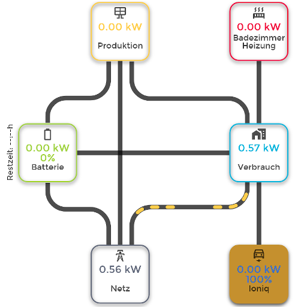

# ioBroker.energiefluss

* [Forum thread](https://forum.iobroker.net/topic/55627/test-adapter-energiefluss-v3-6-x-github-latest)
* [English description](./docs/en/README.md)
* [Deutsche Beschreibung](./docs/de/README.md)

## Energiefluss adapter for ioBroker
It provides an animated energyflow of the current consumption for photovoltaics, battery, house-consumption, grid-feed-in (grid-consumption), car charge and up to 10 possible elements (circle or rectangle).

## Installation
Installation via Github Cat possible. To do this, go to custom and enter the Github address from here.

## Support
If you like my work und you would like to support me, you can do so here:

## Known Issues
- Safari browser or some webkit of Apple Inc. iOS is not fully supported. Doesn't display the animated battery icon and remaining charging/discharging time (no fix available)

## Changelog
<!--
	Placeholder for the next version (at the beginning of the line):
	### **WORK IN PROGRESS**
-->
### 3.6.1 (2024-09-23)
- Dependencies updated

### 3.6.0 (2023-02-24)
- error in calculation for battery charging fixed
- unit for alternate elements can be choosen (default was same unit)
- background color and transparency can be set (#119)
- icons can be modified for all elements - including production (all 3), grid and consumption (except battery) (#125)
- Depth of discharging can be applied to better calculate the remaining time (#137)
- display grid feed-in as negativ (#99)
- Threshold value can also be applied, if consumer type is set to car (#128)

### 3.5.0 (2023-02-10)
- added third production point. If used, the Slim-Design is deactivated (#101)
- All values can be in W or kW. The adapter converts the values appropriately (#102, #126)
- 2 custom elements can now work as a balcony power plant
- production can be configured as "No feed-in" (line will not be drawn) (#105)

### 3.4.0 (2023-02-03)
- updated automatic animation to better handling speed and values
- removed the "MUST" of having an production datapoint set. Adapter can now be used as normal EnergyFlow
- enabled Strings as Datapoint Values (was implemented before, but not activated)
- Possibility added, to remove the icons inside the elements
-

### 3.3.1 (2023-01-27)
- fixed versioning

### 3.3.0 (2023-01-27)
- define shadows for text, value, percent and icon
- hide lines, if no animation is present on the line
- possibility, to add a second value and description for e.g. daily summary (colors can be defined too) to production, additional production, consumption and grid. Swap time can be defined and clicking on an element will change the values and descriptions one time and will return to the timer afterwards
- automatic speed of animation can be used to easily identify the highest consumption within custom elements 1 to 11. Highest consumption will use the speed of the animation, lower consumptions will use the multiplicator of +1000 of the defined animation speed
- added Wiki Link to admin
- updated translations
- some additional background changes for adding adapter to iobroker repository

### 3.2.0 (2023-01-17)
- added second production element
- translation fixes
- basic data updated
- removed some testing waste

### 3.1.0 (2023-01-13)
- fixed   alignment inside element
- added new animation types to line-animation
- cleaned up some files for future handling

### 3.0.3 (2023-01-12)
- fixed custom line 9 coloring, which was not working
- added own state in object browser for remaining accu
- font size increased for some descriptions in admin panel

### 3.0.2 (2022-12-12)
- fixed wrong resizing of layout, if config changed
- changed static car element into custom element
- element width and height can now be bigger than 100
- horizontal distance between circles and rectangles can be definied

### 3.0.1 (2022-12-07)
- added own description in color picker to custom elements to better identify them

### 3.0.0 (2022-12-06)
- implemented new curved line design
- added option for "Slim-Design" - when activated, the bigger space to the battery will be reduced
- Elements with percent values can be filled depending on their percentage (color of font will be selected automatically)
- transparency of elements activated - if no color is set, the element itself is transparent
- Improved responsive design (if displayed in iframe, the graphic should now be displayed accordingly)
- if no battery is configured, the layout was not working correctly - fixed
- Line-break possible with " " in label description of element
- Battery charging from grid now displayed correctly

### 2.1.3 (2022-11-11)
- fixed depencies

### 2.1.2 (2022-11-11)
- fixed language values

### 2.1.1 (2022-11-11)
- fixed default value for opacity

### 2.1.0 (2022-11-11)
- extended opacity from icon, text and line to all elements

### 2.0.2 (2022-11-11)
- small layout fix in admin area

### 2.0.1 (2022-11-10)
- calculation Bug fixed

### 2.0.0 (2022-11-10)
- Added 6 more Elements. Overall 10 are available now
- removed "house netto consumption for all elements"
- added option to subtract each element from house consumption
- added "Position" in Elements. Now its possible, to Realign texts, values, icons, percentages and battery text (higher or lower)
- removed battery animation for (dis-)/charging via Javascript
- added battery animation via CSS
- lower memory usage due to drawing only necessary elements
- fixed Translations Errors
- some code optimizations
- Added opacity for icon, text and line (transparency can be adjusted)

### 1.3.0 (2022-09-23)
- Added possibility, to configure the first custom element as car charge element with same attributes like normal car charge
- fixed a calculation issue

### 1.2.1 (2022-09-16)
- Color and font-size of battery-remaining time changeable
- Color of all icons changeable (one color for all icons)

### 1.2.0 (2022-09-02)
- Added text for Battery Remaining. Shows the remaining charge or discharge time (battery-capacity and datapoint for battery-percent need to be provided)
- corrected Error "Cannot parse JSON: undefined"
- fixed some translations

### 1.1.1 (2022-08-30)
- 2 new Animation Options: Duration of the Animation length and Line-End-Style (round, square, butt) customizeable
- Removed Animation line from Production to Grid, if no production is detected but inductive consumers feed the grid with back-flow

### 1.1.0 (2022-08-25)
- Translations optimized (Grid/Gitter or other waste words removed as not acceptable)
- Animation dots fully customizeable (length, width, amount)

### 1.0.7 (2022-08-24)
- fixed house element not showing up, if calculate consumption is activated and value is not calculated on start-up
- fixed README for Github

### 1.0.6 (2022-08-23)
- If consumption is negative, this was not displayed
- Elements can now be selected (rectangle or circle)
- Threshold for the user-defined elements was not always adopted
- Increased number of animation points to 5
- Data point load reduced by 90%, as the configuration is now only loaded when it starts or changes (previously when the values changed)
- Icons are realigned when resizing the element
- Cleaned up the admin interface

### 1.0.1 (2022-08-19)
- cleaned up Admin-Interface
- possible, to choose objects via Object-Browser
- corrected missing translations

### 1.0.0 (2022-08-18)
- added 3 more circles. Overall 4 are now possible and this will be the current maximum (all circles can be customized as well)
- aligned the complete graphic to the left to save space on the height and right

### 0.8.6 (2022-08-17)
- color of the label inside the circle can be changed
- smoother animation on slower devices
- number of animation dots selectable

### 0.8.5 (2022-08-15)
- if circle radius changed, adjust the new circles to appear correctly
- moved percent element up for better layout

### 0.8.4 (2022-08-12)
- corrected house-consumption-calculation not working under some circumstances
- possibility to change circle radius
- threshold value possible. Below this value no animation or value is displayed.

### 0.8.3 (2022-08-09)
- Correction of House-consumption calculation in combination with house-netto-calculation
- changed battery animation if battery is fully charged or empty and no progress is detected

### 0.8.2 (2022-08-08)
- Correction: some values can have different colors if their value is zero (consumption, production, grid and battery)
- Animations are not displayed if the decimal place is 0 and the value is therefore also zero
- Icon animation of the battery charge (changes every second when charging/discharging)

### 0.8.1 (2022-08-04)
- fixed applying config under some circumstances

### 0.8.0 (2022-08-04)
- Some Values can have different colors, if their value is zero (consumption, production, grid and battery)
- shadows of the circles can be modified
- battery percent fraction selectable
- Labels inside the circle can be modified
- JSON structure for better handling changed
- unnecessary pre-defines removed
- preview icon of the custom circle was not displayed after re-entering config
- reduced memory consumption inside iobroker

### 0.7.2 (2022-08-02)
- multiple instances can be accessed via the link -> http://<IP>/energiefluss/?instance=<Instance>
- Corrected getting the WebPort, if not on standard 8082
- added "WebApp" functionality on Android, iOS, Apple and Microsoft Browsers - If opened via Homescreen, the page shows without address-bar
- added bookmark icons
- changed adapter picture
- fixed some bugs for displaying HTML elements

### 0.7.1 (2022-08-02)
- Added "Consumption negative" option
- Choose Number of places after the decimal point for Values
- Function, to Display the netto house consumption (if car and additional equipment is also used)
- Show or hide shadow around the circles
- Thickness of the circle outline (in px)
- instances link corrected

### 0.6.0 (2022-07-29)
- option, to add a custom circle feeded from the house (free text and icon)
- own fonts can be added through download parameter - must be in the same domain or ip
- Added 3 new Icons for Accu-state (0%, 25%, 75%, >75%)

### 0.5.1 (2022-07-27)
- added posibility, to change battery charging and discharging direction

### 0.5.0 (2022-07-27)
- Fill inside the circle configurable
- line color configurable
- line animation configurable

### 0.4.1 (2022-07-26)
- fixed JSON Object with configuration

### 0.4.0 (2022-07-26)
- Rewrote most of the Code, to add more flexibility
- changed Data-Store to States instead of in memory (faster rendering)
- Line Size can be adjusted
- 'Stucking' while value has changed is removed, as rendering will be done on the fly
- more stable
- some bugs fixed (battery State)

### 0.3.1 (2022-07-22)

- added font-size options in admin
- added font-face options in admin
- addded smoother animation

### 0.2.6 (2022-07-15)
- fixed different states for battery charging

### 0.2.5 (2022-07-14)
- fixed number rounding
- fixed for positive values for consuming and grid-feeding

### 0.2.4 (2022-07-01)
- fixed Tranlastions

### 0.2.3 (2022-07-01)
- fixed a crash, which might occur, if the state got deleted

### 0.2.2 (2022-06-24)
- fixed failed log output

### 0.2.0 (2022-06-24)
- Added new State for car charger connected and color option

### 0.2.0-0 (2022-06-24)
- added possibility for changing the colors (text and circles)

### 0.0.22 (2022-06-21)
- implemented function, to calculate house consumption, if no house-consumption state is available

### 0.0.21 (2022-06-17)
- corrected admin Tab

### 0.0.20 (2022-06-17)
- changed alignment if no battery is present to save space on the left

### 0.0.19 (2022-06-17)
- changed alignment of View (height and width are not dynamically sized)
- support for transparent background, if loaded in iframe
- changed incompatible TAG in HTML

### 0.0.17 (2022-06-16)
- fixed solar and grid line animation

### 0.0.16 (2022-06-15)
- Fixed uncaught Error
- Changed translation for checkbox in admin

### 0.0.13 (2022-06-15)
- Added checkbox for reversing Grid-feed and Grid-consuming

### 0.0.12 (2022-06-15)
- added line animation

### 0.0.11 (2022-06-15)
- fixed some bugs

### 0.0.3 (2022-06-14)
* fixed some bugs

### 0.0.2 (2022-06-14)
* initial release

## License
MIT License

Copyright (c) 2024 SKB <info@skb-web.de>

Permission is hereby granted, free of charge, to any person obtaining a copy
of this software and associated documentation files (the "Software"), to deal
in the Software without restriction, including without limitation the rights
to use, copy, modify, merge, publish, distribute, sublicense, and/or sell
copies of the Software, and to permit persons to whom the Software is
furnished to do so, subject to the following conditions:

The above copyright notice and this permission notice shall be included in all
copies or substantial portions of the Software.

THE SOFTWARE IS PROVIDED "AS IS", WITHOUT WARRANTY OF ANY KIND, EXPRESS OR
IMPLIED, INCLUDING BUT NOT LIMITED TO THE WARRANTIES OF MERCHANTABILITY,
FITNESS FOR A PARTICULAR PURPOSE AND NONINFRINGEMENT. IN NO EVENT SHALL THE
AUTHORS OR COPYRIGHT HOLDERS BE LIABLE FOR ANY CLAIM, DAMAGES OR OTHER
LIABILITY, WHETHER IN AN ACTION OF CONTRACT, TORT OR OTHERWISE, ARISING FROM,
OUT OF OR IN CONNECTION WITH THE SOFTWARE OR THE USE OR OTHER DEALINGS IN THE
SOFTWARE.
